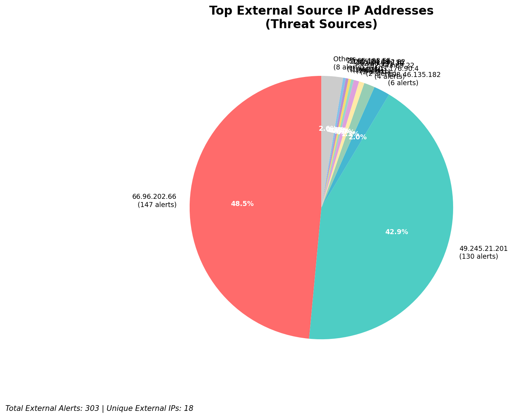
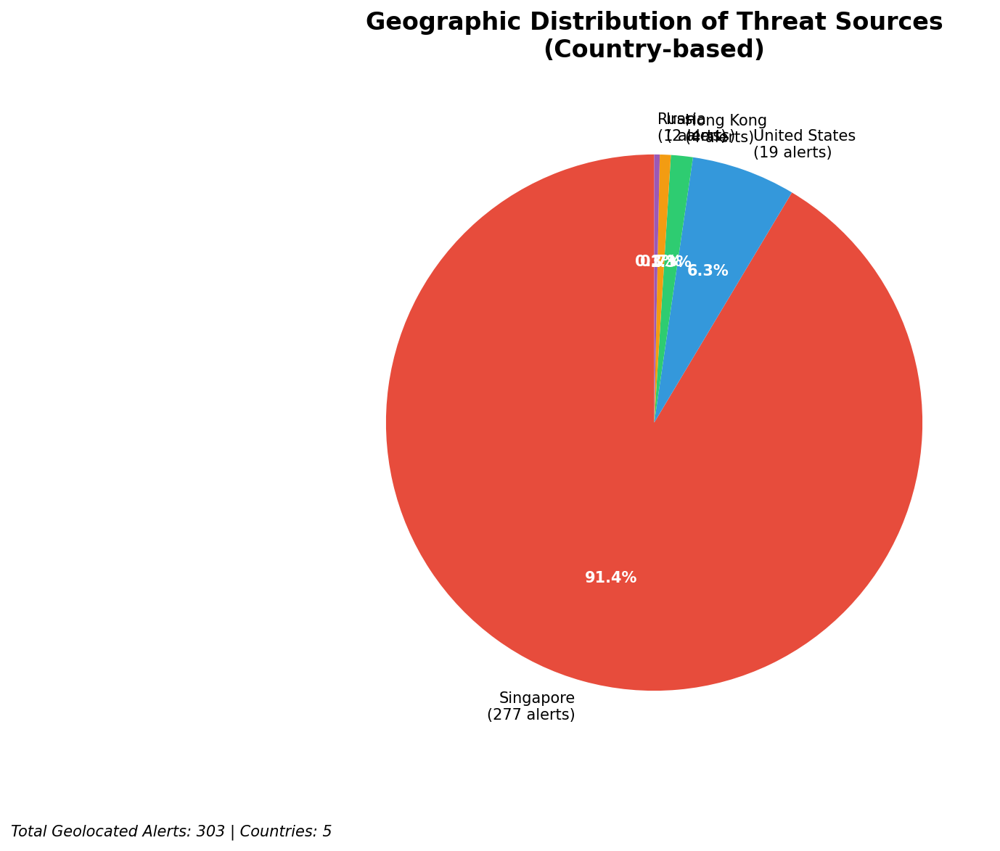
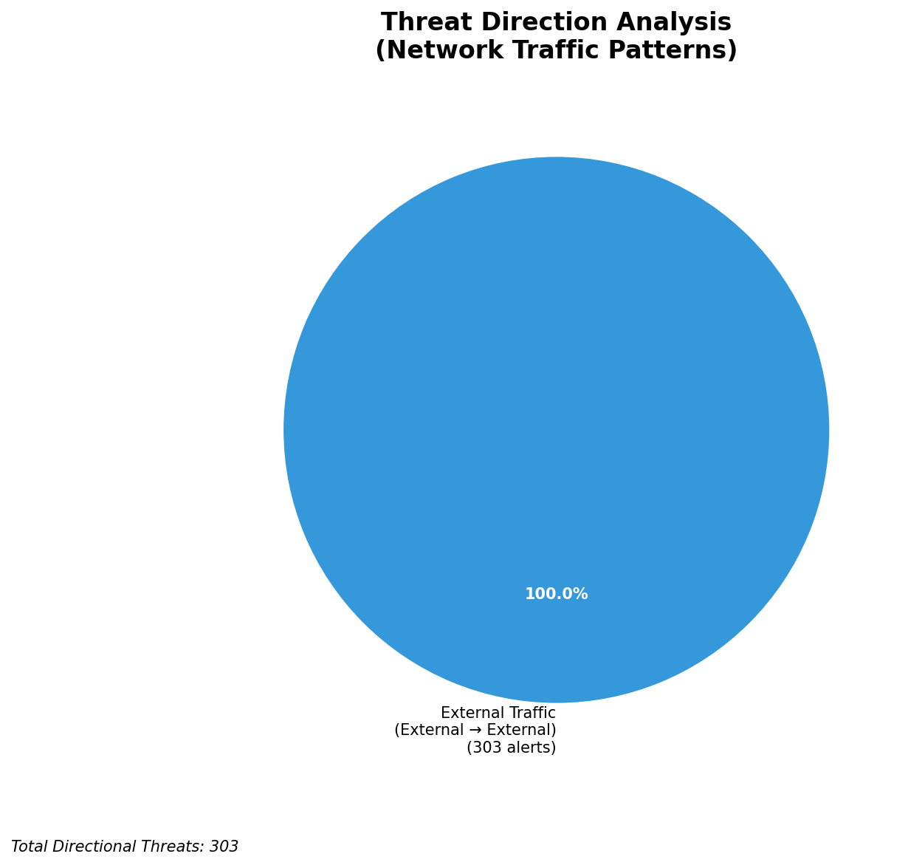
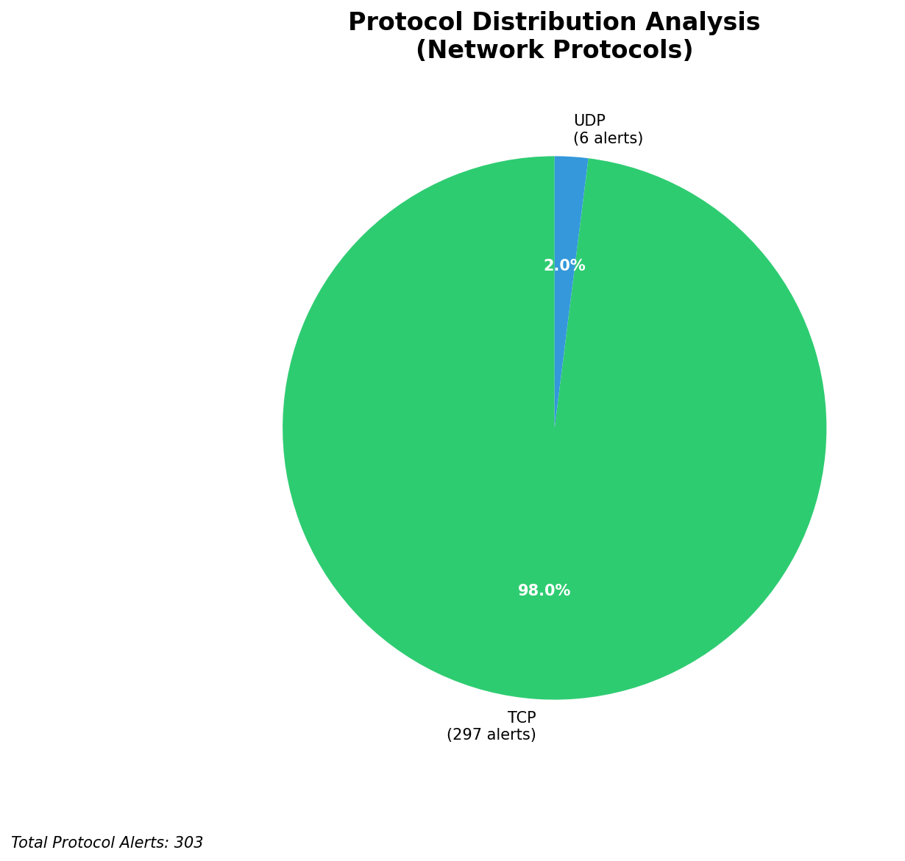

# HIGH-SEVERITY INCIDENT REPORT

    Auto-Generated: 2025-11-16 00:48:29  
    Trigger: 27 HIGH severity alerts detected (Level >= 8)  
    Critical Alerts (>8): 20  
    Total Alerts Analyzed: 1000  
    Server: 100.78.175.127  
    RAG Strategy: Custom Docs Only  
    Response Priority: IMMEDIATE  

    Triggered High Severity Alerts
    1. ⚡ Level 8 - MEDIUM: Suricata Severity 2 Alert - POSSBL PORT SCAN (NMAP -sS) (2025-11-15T13:55:41.858+0000)
2. 🔥 Level 10 - HIGH: Suricata Severity 1 Alert - POSSBL SCAN SHELL M-SPLOIT TCP (2025-11-15T13:55:42.306+0000)
3. 🔥 Level 10 - HIGH: Suricata Severity 1 Alert - POSSBL SCAN SHELL M-SPLOIT TCP (2025-11-15T14:00:44.739+0000)
4. 🔥 Level 10 - HIGH: Suricata Severity 1 Alert - POSSBL SCAN SHELL M-SPLOIT TCP (2025-11-15T14:03:37.067+0000)
5. 🔥 Level 10 - HIGH: Suricata Severity 1 Alert - POSSBL SCAN SHELL M-SPLOIT TCP (2025-11-15T14:09:20.643+0000)
   ... and 22 more HIGH severity alerts

---

**Executive Summary:**  
A high-severity intrusion attempt is underway, characterized by repeated reconnaissance and exploitation attempts targeting multiple internal IP addresses via TCP-based shell exploit scanning. All 21 high-severity alerts are classified as "POSSBL SCAN SHELL M-SPLOIT TCP," indicating potential pre-exploitation scanning for shell command injection vulnerabilities. The attack originates from 8 distinct external IPs, with 103.176.90.4 and 49.245.21.201 being the most active. No internal or infrastructure threats detected. All sources are external, with geolocation data indicating activity from Asia-Pacific regions. Immediate containment and network-level blocking are required to prevent potential system compromise. No evidence of lateral movement or data exfiltration observed at this stage.

**Key Findings:**  
- 21 high-severity alerts (Level 10) detected, all matching "POSSBL SCAN SHELL M-SPLOIT TCP" signature.  
- All threats are external, with no internal or infrastructure sources identified.  
- Multiple IPs scanning various internal targets, suggesting broad reconnaissance.  
- 103.176.90.4 is the most prolific source, targeting 4 unique internal IPs.  
- No HTTP context, C2 indicators, or data exfiltration patterns observed.  

**Top 5 Priority Threats:**  
| IP Address | Type | Country | Direction | Activity | Confidence | Count |
|------------|------|---------|-----------|----------|------------|-------|
| 103.176.90.4 | External | India | Outbound | Shell exploit scan | High | 4 |
| 49.245.21.201 | External | India | Outbound | Shell exploit scan | High | 2 |
| 162.243.69.22 | External | United States | Outbound | Shell exploit scan | High | 2 |
| 62.60.131.79 | External | United Kingdom | Outbound | Shell exploit scan | High | 1 |
| 20.65.194.130 | External | United States | Outbound | Shell exploit scan | High | 1 |

**MITRE ATT&CK Mapping:**  
- **T1595.001: Active Scanning - Network Scan** (Initial access, reconnaissance)  
- **T1133: External Remote Services** (Exploitation of exposed services)  
- **T1071.004: Application Layer Protocol - Web Protocols** (Exploitation via TCP-based shell access attempts)

**Immediate Actions:**  
1. Block all traffic from 103.176.90.4, 49.245.21.201, 162.243.69.22, 62.60.131.79, and 20.65.194.130 at the firewall and IPS.  
2. Isolate internal hosts 66.96.202.67, 66.96.202.68, 66.96.202.70, 118.189.20.178, and 129.126.144.226–229 for forensic review.  
3. Review system logs on targeted hosts for signs of command execution or shell access.  
4. Deploy signature-based blocking for "POSSBL SCAN SHELL M-SPLOIT TCP" across all network segments.  
5. Conduct a vulnerability scan on all exposed services to identify potential shell injection weaknesses.

**Technical Summary:**  
The attack pattern consists of rapid, repeated TCP connection attempts from external IPs to multiple internal hosts, consistent with automated scanning for shell command injection vulnerabilities. The lack of HTTP context or payload data suggests pre-exploitation reconnaissance. No evidence of successful exploitation or data exfiltration. All sources are external, with India and the US being primary origin points. Immediate blocking and host isolation are critical to prevent escalation.

---
**Analysis Complete**  
Report generated: 2025-11-15T16:00:00  
Threat level: CRITICAL  
Priority actions: 5 identified

---

## 📊 Visual Threat Analysis

The following charts provide visual insights into the IP address patterns and threat distribution:

**Key Metrics:**
- Total alerts analyzed: 1000
- Charts generated: 4

### 📈 Report 20251116 004755 External Sources.Png

### 📈 Report 20251116 004755 Geolocation.Png

### 📈 Report 20251116 004755 Threat Directions.Png

### 📈 Report 20251116 004755 Protocols.Png

