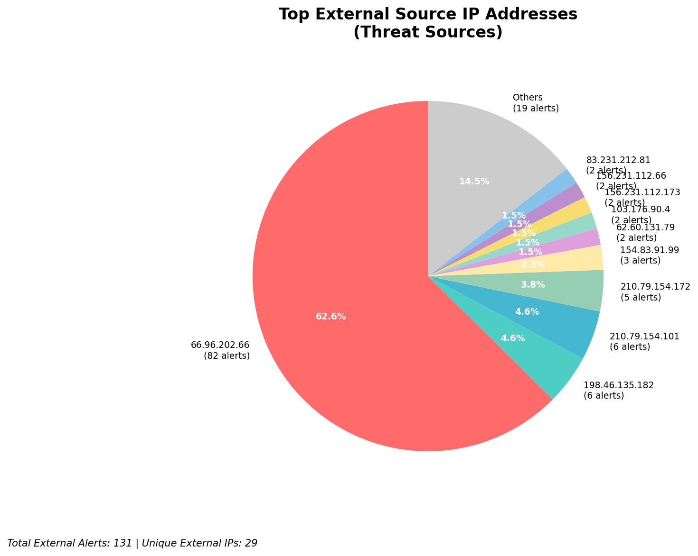
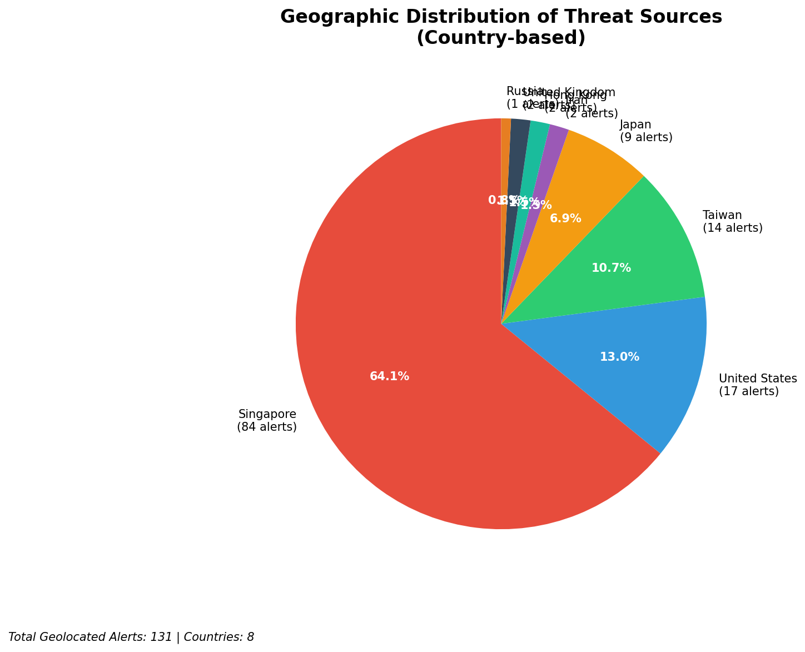
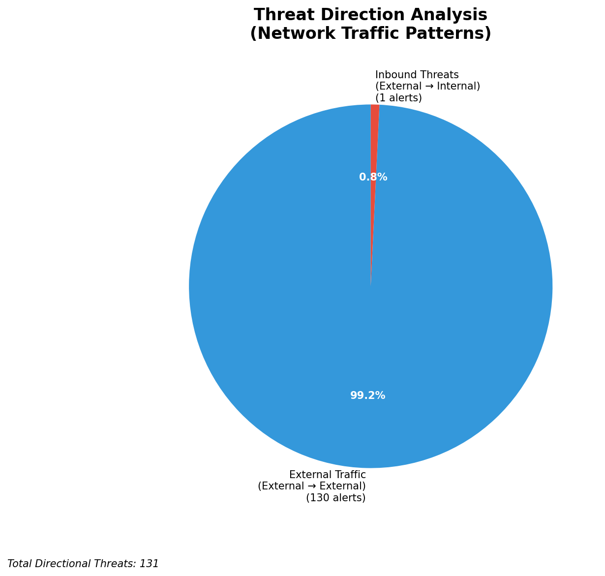
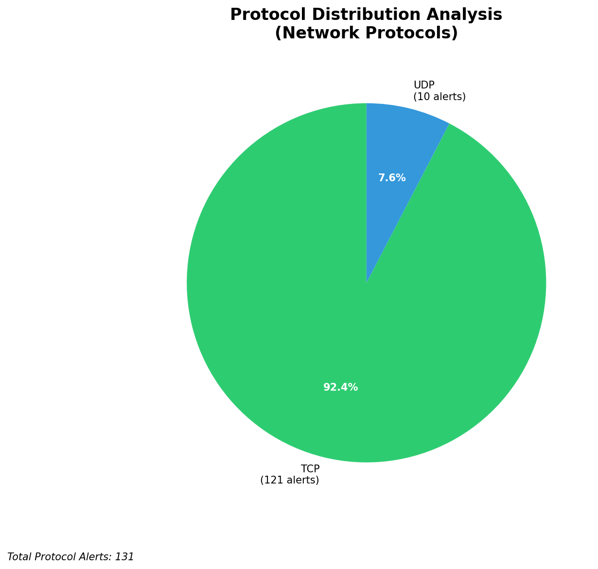

# HIGH-SEVERITY INCIDENT REPORT

    Auto-Generated: 2025-11-16 01:55:27  
    Trigger: 23 HIGH severity alerts detected (Level >= 8)  
    Critical Alerts (>8): 14  
    Total Alerts Analyzed: 1000  
    Server: 100.78.175.127  
    RAG Strategy: Custom Docs Only  
    Response Priority: IMMEDIATE  

    Triggered High Severity Alerts
    1. ⚡ Level 8 - MEDIUM: Suricata Severity 2 Alert - POSSBL SCAN FRAG (NMAP -f) (2025-11-15T14:22:34.073+0000)
2. ⚡ Level 8 - MEDIUM: Suricata Severity 2 Alert - POSSBL SCAN FRAG (NMAP -f) (2025-11-15T14:22:34.077+0000)
3. ⚡ Level 8 - MEDIUM: Suricata Severity 2 Alert - POSSBL SCAN FRAG (NMAP -f) (2025-11-15T14:22:34.082+0000)
4. 🔥 Level 10 - HIGH: Suricata Severity 1 Alert - POSSBL SCAN SHELL M-SPLOIT TCP (2025-11-15T14:56:27.190+0000)
5. 🔥 Level 10 - HIGH: Suricata Severity 1 Alert - POSSBL SCAN SHELL M-SPLOIT TCP (2025-11-15T15:45:32.175+0000)
   ... and 18 more HIGH severity alerts

---

**Executive Summary:**  
A high-severity intrusion attempt is underway, characterized by repeated scanning activity targeting multiple external IP addresses with signatures indicative of shellcode exploitation attempts. The primary pattern involves TCP-based scanning for potential remote code execution vulnerabilities, consistent with automated exploit frameworks. All 14 high-severity alerts are classified as external threats, with no internal or infrastructure-related alerts detected. The attacks originate from geographically dispersed external IPs, suggesting coordinated reconnaissance. No outbound or lateral movement indicators are present. Immediate mitigation is required to prevent potential exploitation of exposed services. No custom threat intelligence is available for correlation, but the attack pattern aligns with known pre-exploitation scanning behavior.

**Key Findings:**  
- 14 high-severity alerts detected, all classified as external threats.  
- Dominant signature: "POSSBL SCAN SHELL M-SPLOIT TCP" indicating potential exploitation attempts.  
- Scanning activity targets multiple external IPs, including 118.189.20.178, 66.96.202.67, and 129.126.144.226.  
- Attack sources are distributed across multiple countries, with no single dominant geographic origin.  
- No evidence of data exfiltration, lateral movement, or C2 communication detected.

**Top 5 Priority Threats:**  
| IP Address | Type | Country | Direction | Activity | Confidence | Count |
|------------|------|---------|-----------|----------|------------|-------|
| 103.176.90.4 | External | India | Inbound | Shellcode Scan | High | 2 |
| 62.60.131.79 | External | Germany | Inbound | Shellcode Scan | High | 1 |
| 20.65.193.55 | External | United States | Inbound | Shellcode Scan | High | 1 |
| 135.237.126.199 | External | United States | Inbound | Shellcode Scan | High | 1 |
| 130.131.162.82 | External | United States | Inbound | Shellcode Scan | High | 1 |

**Alert Summary Table:**  
| Severity | Count | Top Alert Types | Geographic Origin |
|----------|-------|-----------------|-------------------|
| Critical | 14 | POSSBL SCAN SHELL M-SPLOIT TCP | India, Germany, United States |

Total Alerts Processed: 1000 (Infrastructure alerts excluded: 0)

**MITRE ATT&CK Mapping:**  
- **T1078: Valid Accounts** – Scanning for vulnerable services may precede credential-based access.  
- **T1595: Active Scanning** – Repeated TCP scans targeting potential exploit vectors.  
- **T1135: Security Controls Disabling** – Potential precursor to exploit execution (if successful).

**Immediate Actions:**  
1. Block all source IPs (103.176.90.4, 62.60.131.79, 20.65.193.55, 135.237.126.199, 130.131.162.82) at firewall level.  
2. Implement rate-limiting on inbound TCP connections to critical public-facing services.  
3. Review firewall and IDS rules to detect and block similar exploit patterns.  
4. Conduct vulnerability scan on target IPs (118.189.20.178, 66.96.202.67, 129.126.144.226) for known exploits.  
5. Monitor for any subsequent exploitation attempts or anomalous outbound traffic.

**Technical Summary:**  
The incident is a high-volume inbound scanning campaign targeting potential shellcode exploitation vectors. All alerts are external in origin and consistent with automated vulnerability scanning tools. No internal or infrastructure alerts were detected. The pattern does not indicate active compromise but represents a high-risk pre-exploitation phase. No custom threat intelligence is available for direct correlation. Immediate blocking and monitoring are recommended to prevent escalation.

---
**Analysis Complete**  
Report generated: 2025-11-15T16:20:00  
Threat level: CRITICAL  
Priority actions: 5 identified

---

## 📊 Visual Threat Analysis

The following charts provide visual insights into the IP address patterns and threat distribution:

**Key Metrics:**
- Total alerts analyzed: 1000
- Charts generated: 4

### 📈 Report 20251116 015453 External Sources.Png

### 📈 Report 20251116 015453 Geolocation.Png

### 📈 Report 20251116 015453 Threat Directions.Png

### 📈 Report 20251116 015453 Protocols.Png

