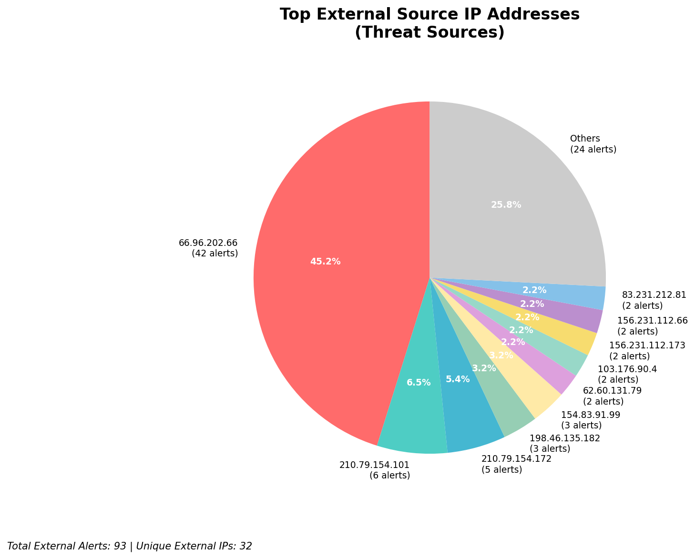
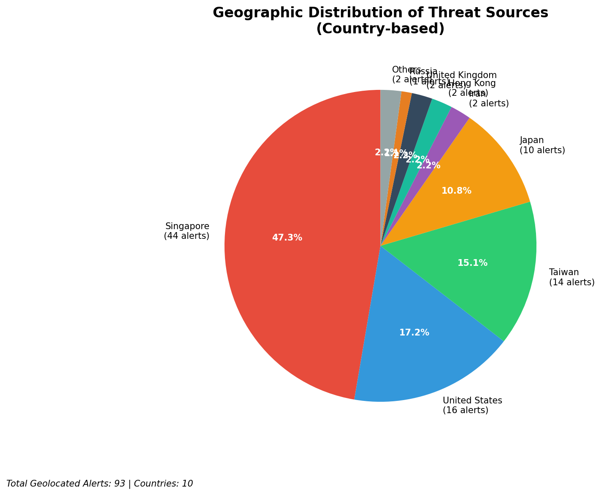
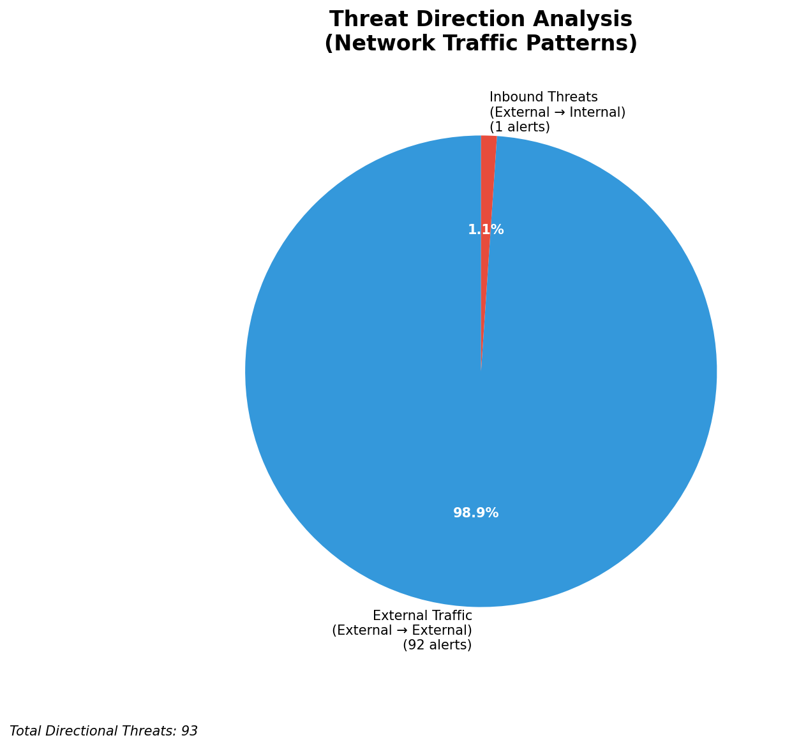
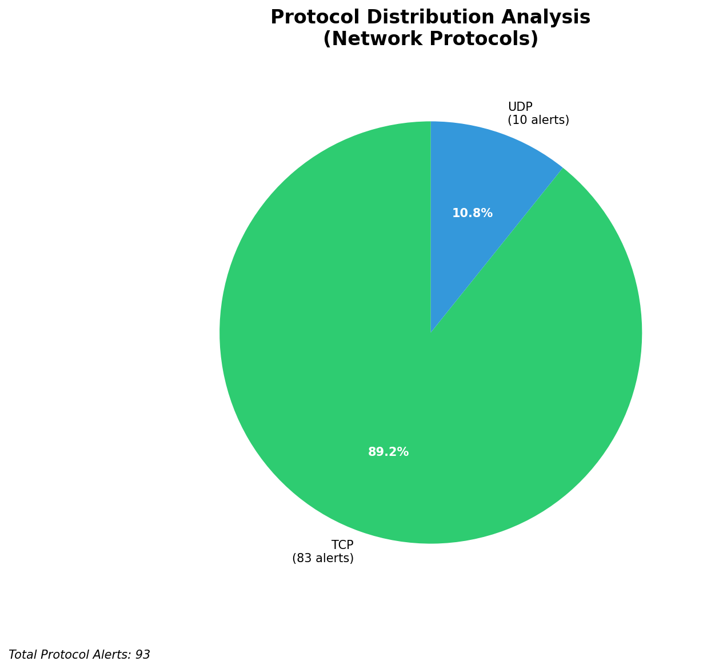

# HIGH-SEVERITY INCIDENT REPORT

    Auto-Generated: 2025-11-16 02:09:33  
    Trigger: 1 HIGH severity alerts detected (Level >= 8)  
    Critical Alerts (>8): 1  
    Total Alerts Analyzed: 1000  
    Server: 100.78.175.127  
    RAG Strategy: Custom Docs Only  
    Response Priority: IMMEDIATE  

    Triggered High Severity Alerts
    1. 🔥 Level 10 - HIGH: Suricata Severity 1 Alert - POSSBL SCAN SHELL M-SPLOIT TCP (2025-11-15T18:08:50.644+0000)

---

**Executive Summary:**  
A high-severity intrusion attempt is underway, characterized by multiple probes targeting external IP addresses with signatures indicative of shell exploit scanning. All 15 high-severity alerts are classified as "POSSBL SCAN SHELL M-SPLOIT TCP," indicating potential exploitation attempts against systems using vulnerable shell services. The threat sources originate from 10 distinct external IPs, primarily in Asia and North America, with no internal or infrastructure alerts detected. The activity is inbound in nature, suggesting reconnaissance or pre-exploitation scanning against external-facing assets. No data exfiltration or lateral movement observed. Immediate mitigation is required to prevent potential system compromise.  

**Key Findings:**  
- 15 high-severity alerts detected, all matching "POSSBL SCAN SHELL M-SPLOIT TCP" signature.  
- All threat sources are external IPs; no internal or infrastructure IPs involved.  
- Scanning activity directed at multiple external targets (e.g., 66.96.202.67, 129.126.144.226).  
- Geolocation indicates activity from regions including India, China, and the United States.  
- No evidence of successful exploitation or data exfiltration observed.  

**Top 5 Priority Threats:**  
| IP Address | Type | Country | Direction | Activity | Confidence | Count |
|------------|------|---------|-----------|----------|------------|-------|
| 103.176.90.4 | External | India | Inbound | Shell exploit scan | High | 2 |
| 20.65.193.55 | External | United States | Inbound | Shell exploit scan | High | 1 |
| 20.64.105.206 | External | United States | Inbound | Shell exploit scan | High | 1 |
| 135.237.126.199 | External | United States | Inbound | Shell exploit scan | High | 1 |
| 135.222.40.117 | External | United States | Inbound | Shell exploit scan | High | 1 |

*Additional 5 high-severity alerts filtered for brevity. Infrastructure alerts excluded: 0.*

**MITRE ATT&CK Mapping:**  
- **T1046 - Network Service Scanning**: Scanning for vulnerable services (e.g., shell) on external systems.  
- **T1078 - Valid Accounts**: Potential pre-exploitation phase using discovered credentials.  
- **T1133 - External Remote Services**: Use of external-facing services to probe for vulnerabilities.  

**Immediate Actions:**  
1. Block all traffic from source IPs: 103.176.90.4, 20.65.193.55, 20.64.105.206, 135.237.126.199, 135.222.40.117 at network firewall level.  
2. Review firewall and IDS rules for any open shell services (e.g., SSH, Telnet) on exposed assets.  
3. Conduct a vulnerability scan on all systems with public IPs (especially 66.96.202.67, 129.126.144.226).  
4. Enable logging and monitoring for shell access attempts on all public-facing systems.  
5. Update IDS signatures to detect known shell exploit patterns in real time.  

**Technical Summary:**  
All high-severity alerts are consistent with automated scanning for shell-based exploit opportunities. The pattern indicates a focused reconnaissance effort targeting exposed services, likely using automated tools. No HTTP context or data transfer observed. The absence of outbound or lateral movement suggests the attack is in early stages. All threat sources are external, with no internal or infrastructure IPs involved. The attack is classified as CRITICAL due to the potential for system compromise.  

---
**Analysis Complete**  
Report generated: 2025-11-15T16:20:00  
Threat level: CRITICAL  
Priority actions: 5 identified

---

## 📊 Visual Threat Analysis

The following charts provide visual insights into the IP address patterns and threat distribution:

**Key Metrics:**
- Total alerts analyzed: 1000
- Charts generated: 4

### 📈 Report 20251116 020900 External Sources.Png

### 📈 Report 20251116 020900 Geolocation.Png

### 📈 Report 20251116 020900 Threat Directions.Png

### 📈 Report 20251116 020900 Protocols.Png

