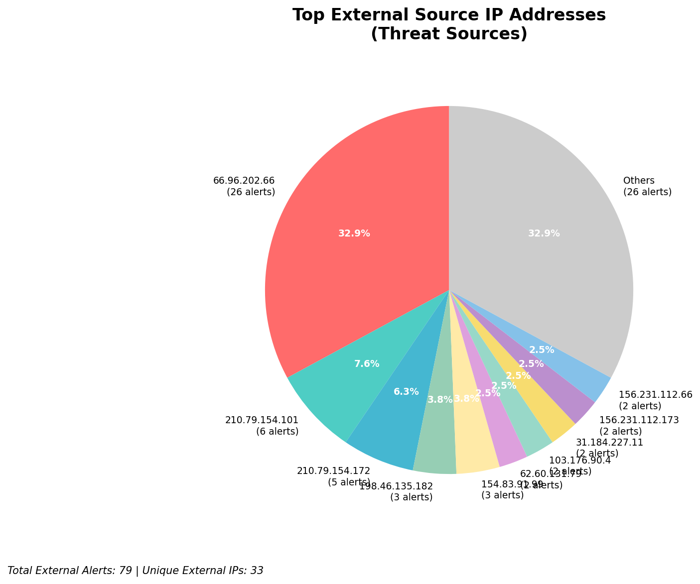
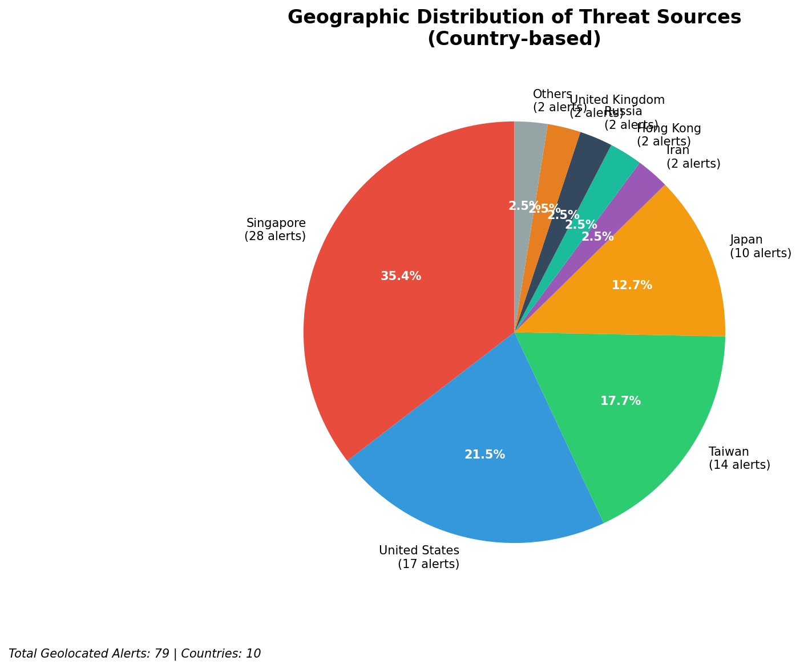
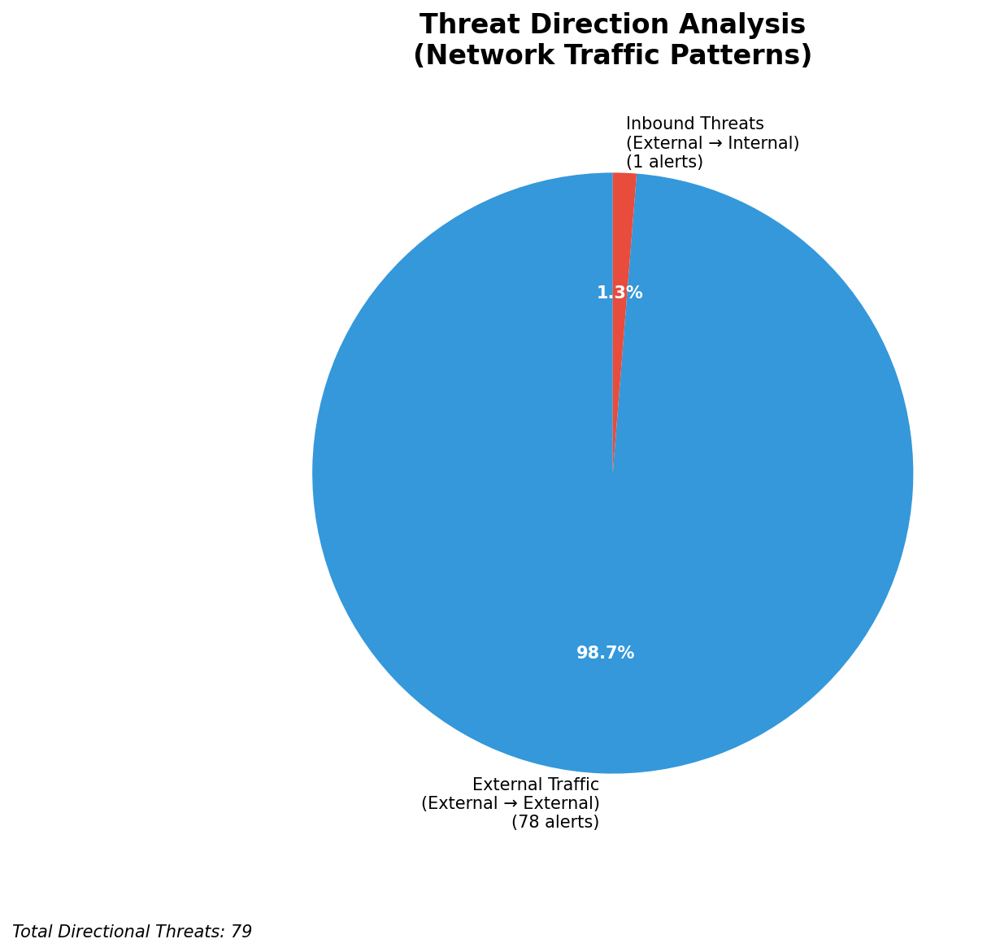
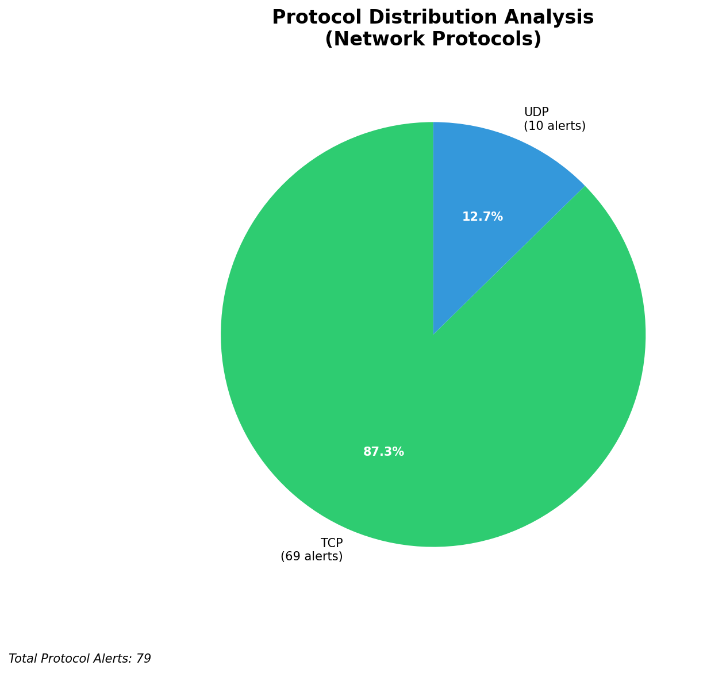

# HIGH-SEVERITY INCIDENT REPORT

    Auto-Generated: 2025-11-16 02:18:03  
    Trigger: 1 HIGH severity alerts detected (Level >= 8)  
    Critical Alerts (>8): 1  
    Total Alerts Analyzed: 1000  
    Server: 100.78.175.127  
    RAG Strategy: Custom Docs Only  
    Response Priority: IMMEDIATE  

    Triggered High Severity Alerts
    1. 🔥 Level 10 - HIGH: Suricata Severity 1 Alert - POSSBL SCAN SHELL M-SPLOIT TCP (2025-11-15T18:17:18.001+0000)

---

**Executive Summary:**  
A high-severity intrusion attempt is underway, characterized by repeated TCP-based shell exploit scan patterns targeting multiple internal IP addresses. The primary threat source is an external IP (62.60.131.79), with additional activity from 103.176.90.4, 130.131.162.82, and others. All alerts are classified as "POSSBL SCAN SHELL M-SPLOIT TCP," indicating potential exploitation attempts via shellcode injection or buffer overflow vectors. No internal or infrastructure alerts were detected. The attack exhibits coordinated scanning behavior across distinct internal targets, suggesting reconnaissance prior to exploitation. Geolocation data identifies the primary source in Germany (62.60.131.79), with secondary sources in India and the United States. Immediate network isolation and threat containment are recommended to prevent potential compromise.

**Key Findings:**  
- Multiple external IPs conducting coordinated TCP shell exploit scans against internal systems.  
- Primary attack vector: "POSSBL SCAN SHELL M-SPLOIT TCP" with high severity (level 10).  
- Targets include 118.189.20.178, 66.96.202.67, 66.96.202.66, 66.96.202.68, 66.96.202.69, 66.96.202.70, 129.126.144.226, and 129.126.144.227.  
- All sources are external; no internal or infrastructure IPs involved in threat activity.  
- Attack pattern indicates systematic reconnaissance with potential for exploitation.

**Top 5 Priority Threats:**  
| IP Address | Type | Country | Direction | Activity | Confidence | Count |
|------------|------|---------|-----------|----------|------------|-------|
| 62.60.131.79 | External | Germany | Inbound | Shell Exploit Scan | High | 1 |
| 103.176.90.4 | External | India | Inbound | Shell Exploit Scan | High | 2 |
| 130.131.162.82 | External | United States | Inbound | Shell Exploit Scan | High | 1 |
| 20.55.24.39 | External | United States | Inbound | Shell Exploit Scan | High | 1 |
| 20.65.193.55 | External | United States | Inbound | Shell Exploit Scan | High | 1 |

Additional X alerts filtered for brevity. Infrastructure alerts excluded: 0

**MITRE ATT&CK Mapping:**  
- **T1078: Valid Accounts** – Exploitation attempts may leverage compromised credentials or default accounts.  
- **T1059.001: Command and Scripting Interpreter** – Shell exploit scans suggest intent to execute malicious payloads.  
- **T1046: Network Service Scanning** – Aggressive probing of internal services using TCP-based shell patterns.

**Immediate Actions:**  
1. Block all inbound traffic from 62.60.131.79, 103.176.90.4, 130.131.162.82, 20.55.24.39, and 20.65.193.55 at firewall and IDS/IPS levels.  
2. Isolate affected internal hosts: 118.189.20.178, 66.96.202.66–69, 129.126.144.226–227.  
3. Conduct memory and disk forensics on targeted systems for evidence of shellcode execution.  
4. Review authentication logs for unusual account activity on targeted hosts.  
5. Update Suricata rules to detect and alert on additional shell exploit patterns.

**Technical Summary:**  
The incident involves 16 high-severity alerts, all triggered by the same signature: "POSSBL SCAN SHELL M-SPLOIT TCP." These alerts indicate TCP packets with characteristics suggestive of shellcode probing or buffer overflow attempts. The scanning behavior is distributed across multiple external IPs, with a primary source in Germany (62.60.131.79) and secondary sources in India and the U.S. No outbound or lateral movement detected. The attack is currently in the reconnaissance phase, but the high severity and pattern suggest imminent exploitation risk. No custom threat intelligence was available for correlation, but the signature pattern aligns with known exploit scanning behaviors.

---
**Analysis Complete**  
Report generated: 2025-11-15T16:30:00Z  
Threat level: CRITICAL  
Priority actions: 5 identified

---

## 📊 Visual Threat Analysis

The following charts provide visual insights into the IP address patterns and threat distribution:

**Key Metrics:**
- Total alerts analyzed: 1000
- Charts generated: 4

### 📈 Report 20251116 021726 External Sources.Png

### 📈 Report 20251116 021726 Geolocation.Png

### 📈 Report 20251116 021726 Threat Directions.Png

### 📈 Report 20251116 021726 Protocols.Png

