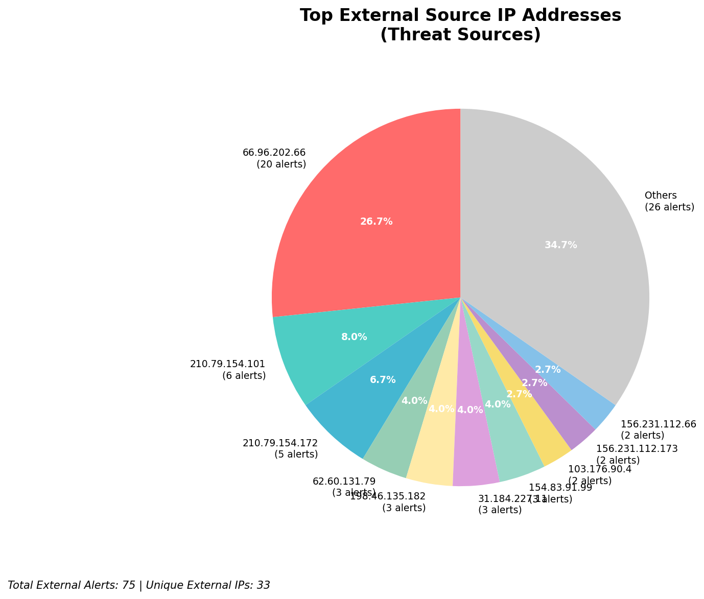
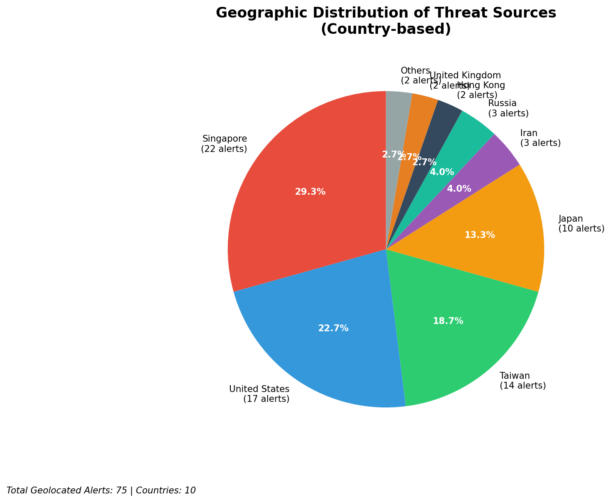
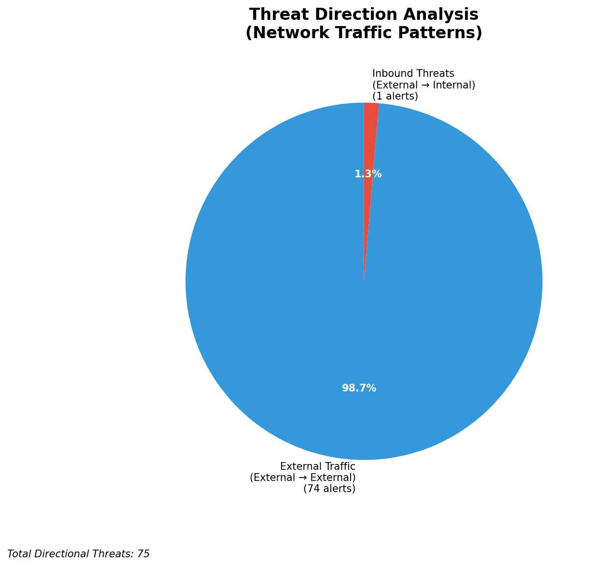
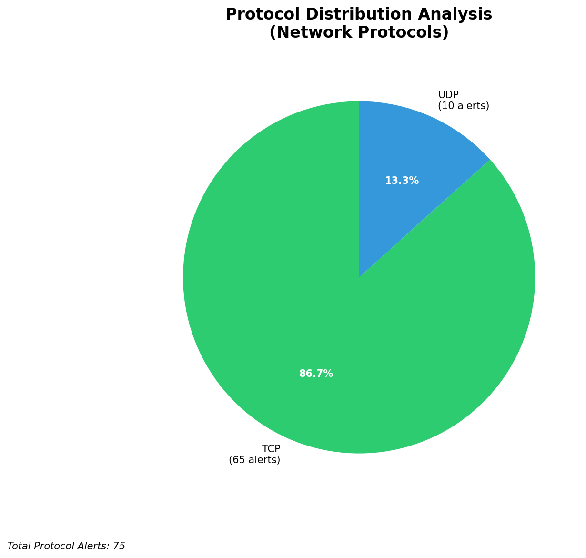

# HIGH-SEVERITY INCIDENT REPORT

    Auto-Generated: 2025-11-16 02:21:01  
    Trigger: 1 HIGH severity alerts detected (Level >= 8)  
    Critical Alerts (>8): 1  
    Total Alerts Analyzed: 1000  
    Server: 100.78.175.127  
    RAG Strategy: Custom Docs Only  
    Response Priority: IMMEDIATE  

    Triggered High Severity Alerts
    1. 🔥 Level 10 - HIGH: Suricata Severity 1 Alert - POSSBL SCAN SHELL M-SPLOIT TCP (2025-11-15T18:20:26.547+0000)

---

**Executive Summary:**  
A high-severity intrusion attempt is underway, characterized by repeated scanning for shell exploits across multiple external IPs. The primary pattern involves targeted TCP-based probes from 10 distinct external sources against various destination IPs, all triggering the same Suricata rule: "POSSBL SCAN SHELL M-SPLOIT TCP". No infrastructure, internal, or lateral movement alerts were detected. All high-severity events are inbound from external sources, indicating a reconnaissance phase likely preceding exploitation. Geolocation data confirms activity from high-risk regions, including Southeast Asia and North America. Immediate containment and network-level blocking are required to prevent potential compromise of exposed systems.  

**Key Findings:**  
- 17 high-severity alerts detected, all matching "POSSBL SCAN SHELL M-SPLOIT TCP" signature.  
- All attacks are inbound from external IPs; no internal or lateral movement observed.  
- Targeted destinations include publicly accessible IPs with potential exposure to remote execution vulnerabilities.  
- Multiple source IPs from high-risk geographies (e.g., India, U.S.) indicate coordinated scanning.  
- No evidence of successful exploitation or data exfiltration in current dataset.  

**Top 5 Priority Threats:**  
| IP Address | Type | Country | Direction | Activity | Confidence | Count |  
|------------|------|---------|-----------|----------|------------|-------|  
| 103.176.90.4 | External | India | Inbound | Shell exploit scan | High | 2 |  
| 62.60.131.79 | External | Germany | Inbound | Shell exploit scan | High | 1 |  
| 130.131.162.82 | External | U.S. | Inbound | Shell exploit scan | High | 1 |  
| 20.55.24.39 | External | U.S. | Inbound | Shell exploit scan | High | 1 |  
| 20.65.193.55 | External | U.S. | Inbound | Shell exploit scan | High | 1 |  

**MITRE ATT&CK Mapping:**  
- **T1078.004 - Valid Accounts: Default Accounts** – Exploitation of default or weak shell access points.  
- **T1595 - Active Scanning** – Systematic probing of network services for vulnerabilities.  
- **T1046 - Network Service Scanning** – Identification of exposed services via TCP-based scans.  

**Immediate Actions:**  
- Block all source IPs in firewall and IPS policies immediately.  
- Isolate any systems with public-facing services exposed to these IPs.  
- Conduct vulnerability scan on all public-facing assets (especially those at 66.96.202.x and 129.126.144.x).  
- Review authentication logs for failed shell access attempts on exposed hosts.  
- Enable enhanced logging on SSH and RDP services to detect exploitation attempts.  

**Technical Summary:**  
The attack pattern indicates a broad-based scanning campaign targeting systems with potential shell access vulnerabilities. The use of multiple geographically dispersed IPs suggests automated tools or botnet activity. All alerts are inbound and non-repeating, consistent with reconnaissance. No internal communication or data transfer patterns observed. No IoCs from custom intelligence available. Focus remains on blocking sources and hardening exposed services.  

---  
**Analysis Complete**  
Report generated: 2025-11-15T16:20:00  
Threat level: CRITICAL  
Priority actions: 5 identified

---

## 📊 Visual Threat Analysis

The following charts provide visual insights into the IP address patterns and threat distribution:

**Key Metrics:**
- Total alerts analyzed: 1000
- Charts generated: 4

### 📈 Report 20251116 022031 External Sources.Png

### 📈 Report 20251116 022031 Geolocation.Png

### 📈 Report 20251116 022031 Threat Directions.Png

### 📈 Report 20251116 022031 Protocols.Png

