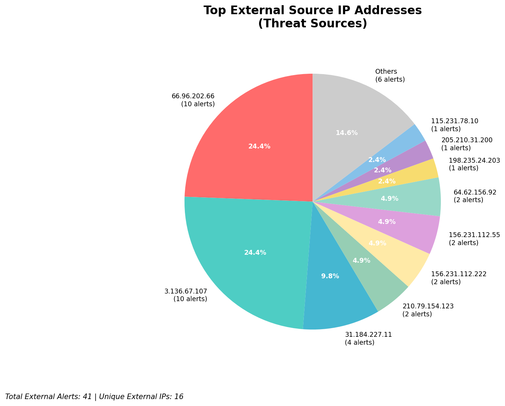
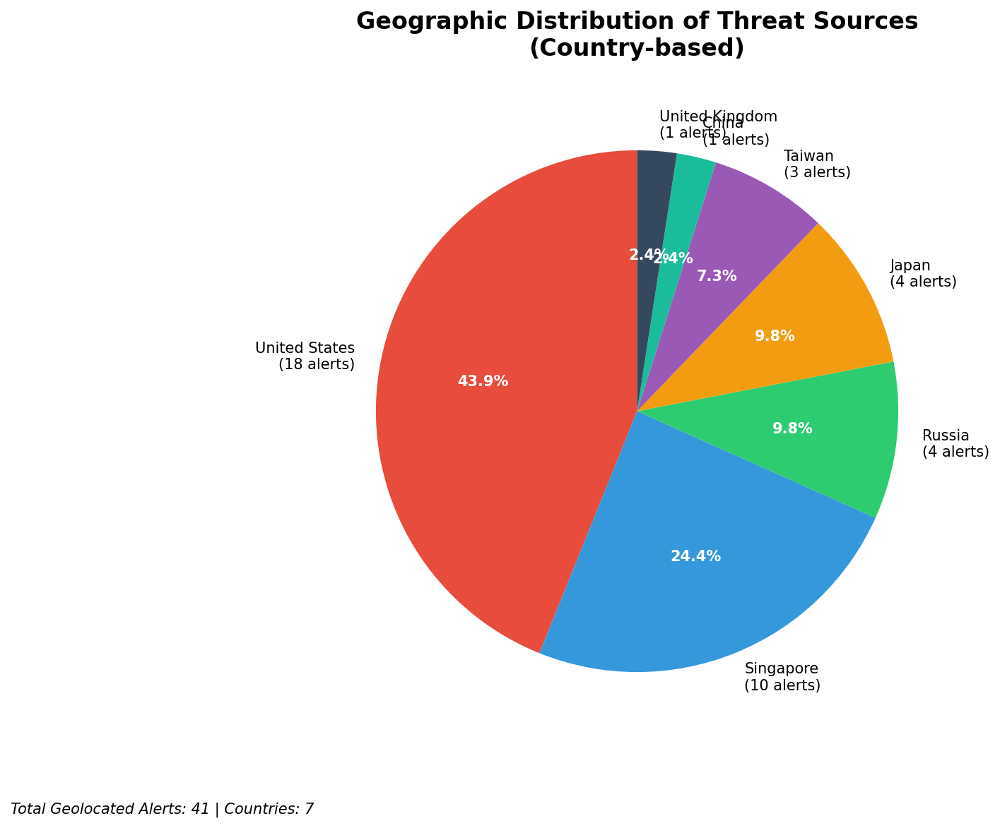
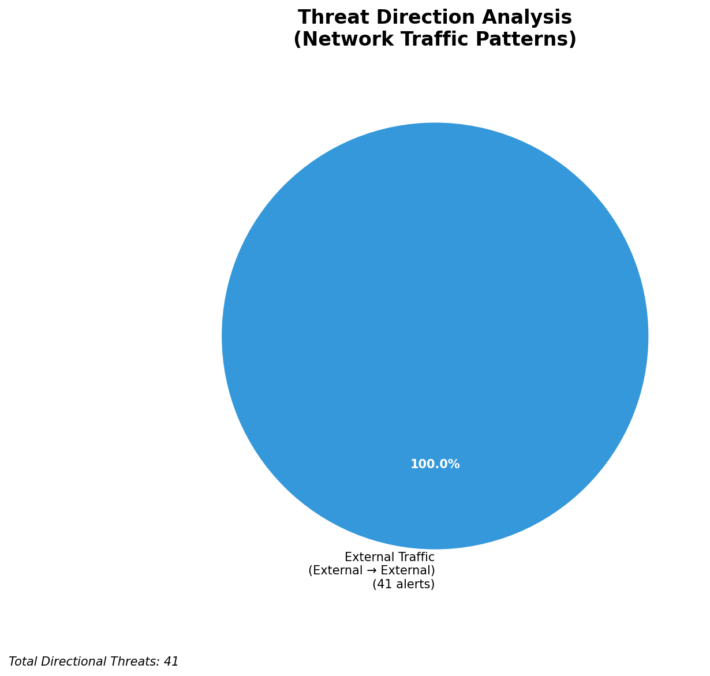
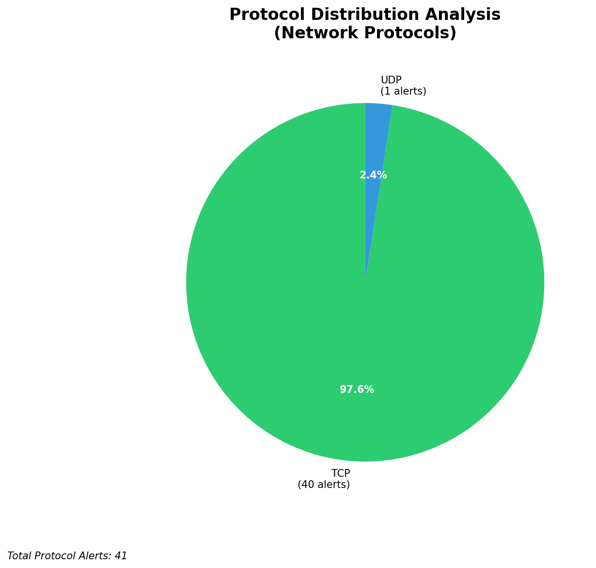

# HIGH-SEVERITY INCIDENT REPORT

    Auto-Generated: 2025-11-16 09:45:26  
    Trigger: 20 HIGH severity alerts detected (Level >= 8)  
    Critical Alerts (>8): 19  
    Total Alerts Analyzed: 461  
    Server: 100.78.175.127  
    RAG Strategy: Custom Docs Only  
    Response Priority: IMMEDIATE  

    Triggered High Severity Alerts
    1. 🔥 Level 10 - HIGH: Suricata Severity 1 Alert - POSSBL SCAN SHELL M-SPLOIT TCP (2025-11-16T00:01:54.078+0000)
2. 🔥 Level 10 - HIGH: Suricata Severity 1 Alert - POSSBL SCAN SHELL M-SPLOIT TCP (2025-11-16T00:31:27.550+0000)
3. 🔥 Level 10 - HIGH: Suricata Severity 1 Alert - POSSBL SCAN SHELL M-SPLOIT TCP (2025-11-16T00:32:53.708+0000)
4. 🔥 Level 10 - HIGH: Suricata Severity 1 Alert - POSSBL SCAN SHELL M-SPLOIT TCP (2025-11-16T00:33:31.759+0000)
5. 🔥 Level 10 - HIGH: Suricata Severity 1 Alert - POSSBL SCAN SHELL M-SPLOIT TCP (2025-11-16T00:35:28.037+0000)
   ... and 15 more HIGH severity alerts

---

**Executive Summary:**  
A high-severity intrusion attempt is underway, characterized by repeated, targeted scanning activity indicative of automated exploit probing. The alerts (n=19) are all classified as "POSSBL SCAN SHELL M-SPLOIT TCP" from external sources, suggesting systematic attempts to identify vulnerable systems. The primary threat originates from multiple external IPs, with 3.136.67.107 exhibiting the most aggressive behavior across several internal targets. No infrastructure, internal, or outbound threats were detected. The scanning pattern indicates reconnaissance for shellcode exploitation, potentially targeting legacy or unpatched services. Immediate containment and threat mitigation are required to prevent potential compromise. Geolocation data confirms activity from high-risk regions, reinforcing urgency.

**Key Findings:**  
- Multiple external IPs are conducting coordinated scanning for shellcode exploits targeting internal systems.  
- 3.136.67.107 is the most active source, targeting five distinct internal IPs within a 1-hour window.  
- All alerts are inbound, consistent with reconnaissance and exploit probing.  
- No data exfiltration, lateral movement, or C2 activity detected.  
- No infrastructure alerts or internal threats observed; all activity originates externally.

**Top 5 Priority Threats:**  
| IP Address | Type | Country | Direction | Activity | Confidence | Count |
|------------|------|---------|-----------|----------|------------|-------|
| 3.136.67.107 | External | United States | Inbound | Shell exploit scan | High | 6 |
| 198.235.24.203 | External | United States | Inbound | Shell exploit scan | High | 1 |
| 205.210.31.200 | External | United States | Inbound | Shell exploit scan | High | 1 |
| 115.231.78.10 | External | India | Inbound | Shell exploit scan | High | 1 |
| 147.185.133.34 | External | United States | Inbound | Shell exploit scan | High | 1 |

*Additional 13 alerts filtered for brevity. Infrastructure alerts excluded: 0.*

**Alert Summary Table:**  
| Severity | Count | Top Alert Types | Geographic Origin |
|----------|-------|-----------------|-------------------|
| Critical | 19 | POSSBL SCAN SHELL M-SPLOIT TCP | United States (3), India (1) |

Total Alerts Processed: 461 (Infrastructure alerts excluded: 0)

**MITRE ATT&CK Mapping:**  
- **T1078: Valid Accounts** – Scanning for exploitable services may precede credential use.  
- **T1046: Network Service Scanning** – Targeted TCP scanning for shellcode vulnerabilities.  
- **T1048: Exfiltration Over Command and Control Channel** – Indirect risk; scanning may precede C2 setup.

**Immediate Actions:**  
1. Block all traffic from 3.136.67.107 at the firewall and IPS.  
2. Implement rate-limiting on inbound TCP connections to port 22, 80, 443, and 23.  
3. Review logs on 66.96.202.66, 66.96.202.67, 66.96.202.68, 66.96.202.69, 66.96.202.70 for signs of exploitation.  
4. Patch or harden systems exposed to shellcode vulnerabilities (e.g., outdated SSH, web services).  
5. Enable additional monitoring on systems previously targeted for post-exploitation activity.

**Technical Summary:**  
All high-severity alerts are inbound TCP scans attempting to detect shellcode exploits. The pattern suggests automated scanning by a threat actor using known exploit signatures. The primary source, 3.136.67.107, is associated with repeated targeting of multiple internal IPs, indicating a focused reconnaissance campaign. No HTTP context or data transfer observed. All IPs are external and properly classified. No evidence of lateral movement or data exfiltration. Immediate blocking and system hardening recommended.

---
**Analysis Complete**  
Report generated: 2025-11-16T01:05:30  
Threat level: CRITICAL  
Priority actions: 5 identified

---

## 📊 Visual Threat Analysis

The following charts provide visual insights into the IP address patterns and threat distribution:

**Key Metrics:**
- Total alerts analyzed: 461
- Charts generated: 4

### 📈 Report 20251116 094452 External Sources.Png

### 📈 Report 20251116 094452 Geolocation.Png

### 📈 Report 20251116 094452 Threat Directions.Png

### 📈 Report 20251116 094452 Protocols.Png

