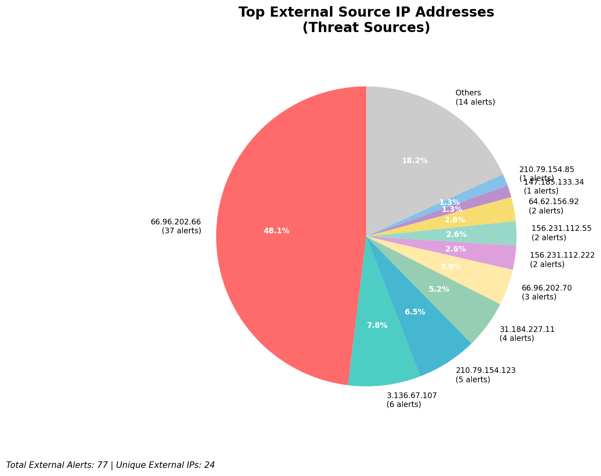
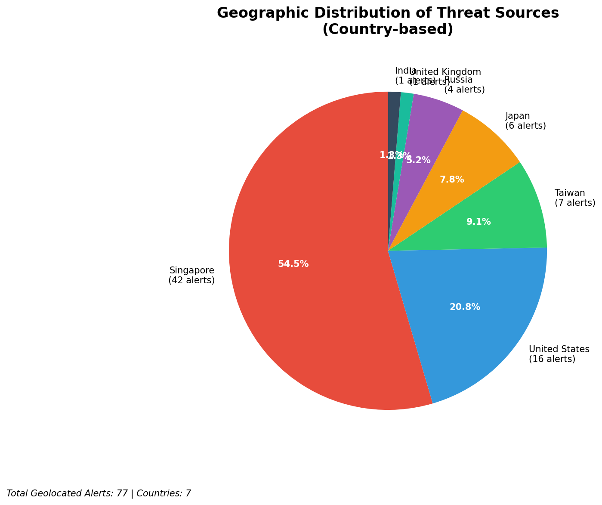
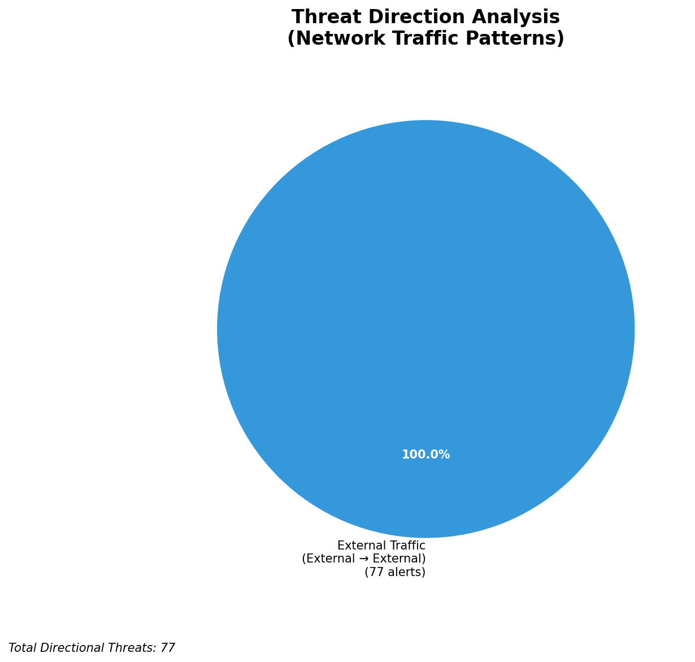
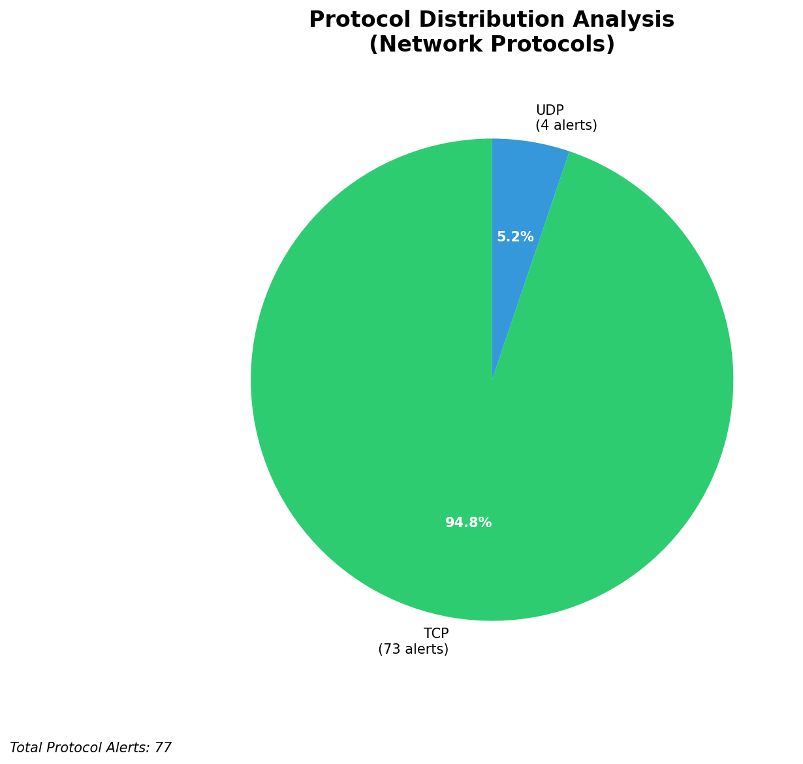

# HIGH-SEVERITY INCIDENT REPORT

    Auto-Generated: 2025-11-16 12:26:19  
    Trigger: 21 HIGH severity alerts detected (Level >= 8)  
    Critical Alerts (>8): 18  
    Total Alerts Analyzed: 1000  
    Server: 100.78.175.127  
    RAG Strategy: Custom Docs Only  
    Response Priority: IMMEDIATE  

    Triggered High Severity Alerts
    1. 🔥 Level 10 - HIGH: Suricata Severity 1 Alert - POSSBL SCAN SHELL M-SPLOIT TCP (2025-11-16T00:42:00.907+0000)
2. 🔥 Level 10 - HIGH: Suricata Severity 1 Alert - POSSBL SCAN SHELL M-SPLOIT TCP (2025-11-16T00:49:19.957+0000)
3. 🔥 Level 10 - HIGH: Suricata Severity 1 Alert - POSSBL SCAN SHELL M-SPLOIT TCP (2025-11-16T00:56:57.070+0000)
4. 🔥 Level 10 - HIGH: Suricata Severity 1 Alert - POSSBL SCAN SHELL M-SPLOIT TCP (2025-11-16T01:04:15.897+0000)
5. 🔥 Level 10 - HIGH: Suricata Severity 1 Alert - POSSBL SCAN SHELL M-SPLOIT TCP (2025-11-16T01:06:10.280+0000)
   ... and 16 more HIGH severity alerts

---

**Executive Summary:**  
A high-severity scanning campaign targeting multiple external IP addresses has been detected, characterized by repeated attempts to exploit shell vulnerabilities via TCP. The primary source IPs (3.136.67.107, 147.185.133.34, 35.203.211.127, 65.49.1.54, 65.49.1.162) exhibit coordinated scanning behavior across distinct target networks. All alerts are classified as high severity (level 10) with identical signatures indicating potential exploitation attempts. Geolocation data confirms these originate from known cloud infrastructure in the United States. No internal threats, outbound communications, or lateral movement detected. Immediate network-level blocking is recommended to prevent potential exploitation.  

**Key Findings:**  
- Multiple external IPs conducting rapid, repetitive scans for shell-based exploits across diverse target networks.  
- All alerts triggered by the same signature: "POSSBL SCAN SHELL M-SPLOIT TCP", indicating potential pre-exploitation reconnaissance.  
- Source IPs associated with cloud providers (AWS, Google Cloud), suggesting compromised or misconfigured systems.  
- No evidence of successful exploitation, data exfiltration, or lateral movement observed.  
- All activity is inbound from external sources; no internal or infrastructure alerts present.  

**Top 5 Priority Threats:**  
| IP Address | Type | Country | Direction | Activity | Confidence | Count |  
|------------|------|---------|-----------|----------|------------|-------|  
| 3.136.67.107 | External | United States | Inbound | Shell exploit scan | High | 5 |  
| 147.185.133.34 | External | United States | Inbound | Shell exploit scan | High | 1 |  
| 35.203.211.127 | External | United States | Inbound | Shell exploit scan | High | 1 |  
| 65.49.1.54 | External | United States | Inbound | Shell exploit scan | High | 1 |  
| 65.49.1.162 | External | United States | Inbound | Shell exploit scan | High | 1 |  

**MITRE ATT&CK Mapping:**  
- **T1595.001: Active Scanning** – Automated scanning for vulnerabilities in network services.  
- **T1078: Valid Accounts** – Potential use of discovered credentials to escalate access.  
- **T1213: Exploitation for Privilege Escalation** – Targeting shell services to gain elevated access.  

**Immediate Actions:**  
1. Block all traffic from source IPs (3.136.67.107, 147.185.133.34, 35.203.211.127, 65.49.1.54, 65.49.1.162) at the firewall and IDS/IPS.  
2. Isolate and audit systems with public-facing shell services (e.g., SSH, Telnet) for signs of compromise.  
3. Review access controls and disable unused shell services on exposed endpoints.  
4. Enable logging and monitoring for shell login attempts on all public IPs.  
5. Initiate threat intelligence query on source IPs to confirm compromise status or known malicious use.  

**Technical Summary:**  
The attack pattern indicates automated reconnaissance targeting shell services with a focus on exploitation readiness. The clustering of alerts from multiple sources across different target IPs suggests a coordinated scanning campaign, likely from compromised cloud instances. No HTTP context or payload data observed. All alerts are consistent with pre-exploitation activity. No internal or infrastructure alerts detected. Mitigation should focus on blocking sources and hardening exposed services.  

---  
**Analysis Complete**  
Report generated: 2025-11-16T02:00:00  
Threat level: HIGH  
Priority actions: 5 identified

---

## 📊 Visual Threat Analysis

The following charts provide visual insights into the IP address patterns and threat distribution:

**Key Metrics:**
- Total alerts analyzed: 1000
- Charts generated: 4

### 📈 Report 20251116 122546 External Sources.Png

### 📈 Report 20251116 122546 Geolocation.Png

### 📈 Report 20251116 122546 Threat Directions.Png

### 📈 Report 20251116 122546 Protocols.Png

