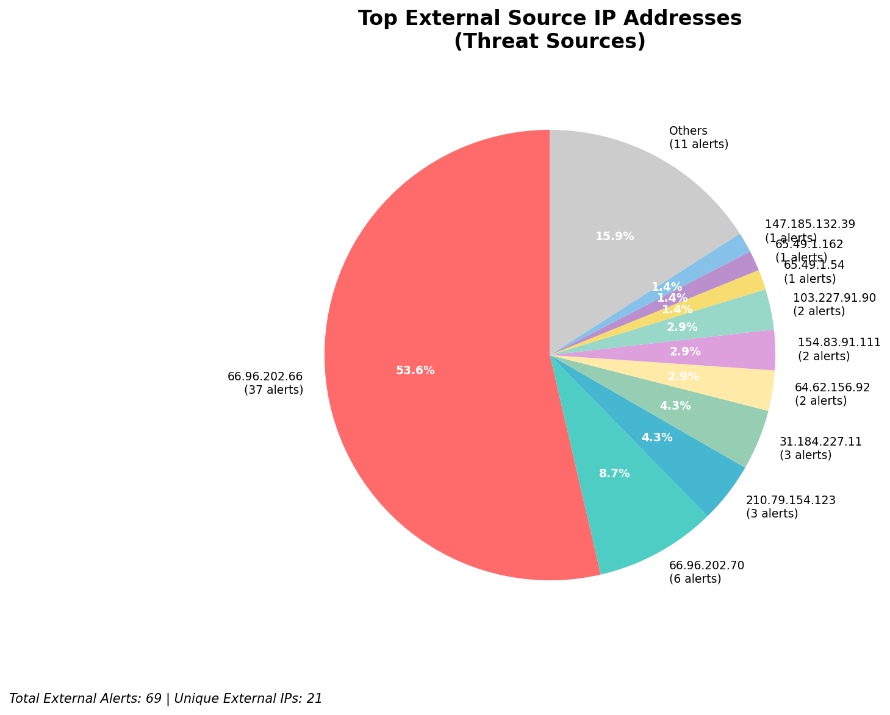
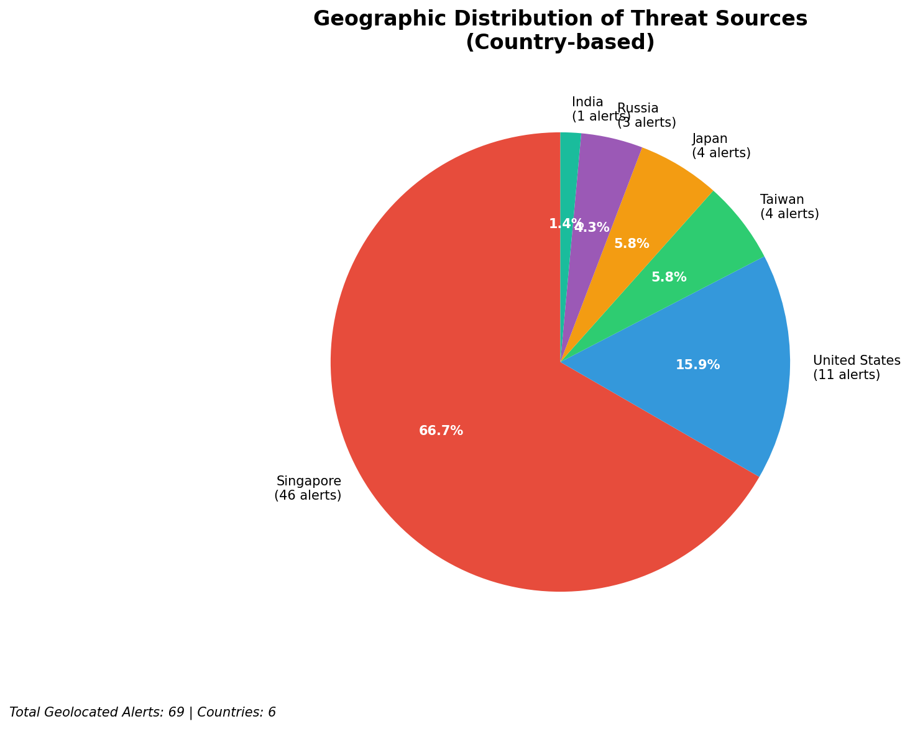
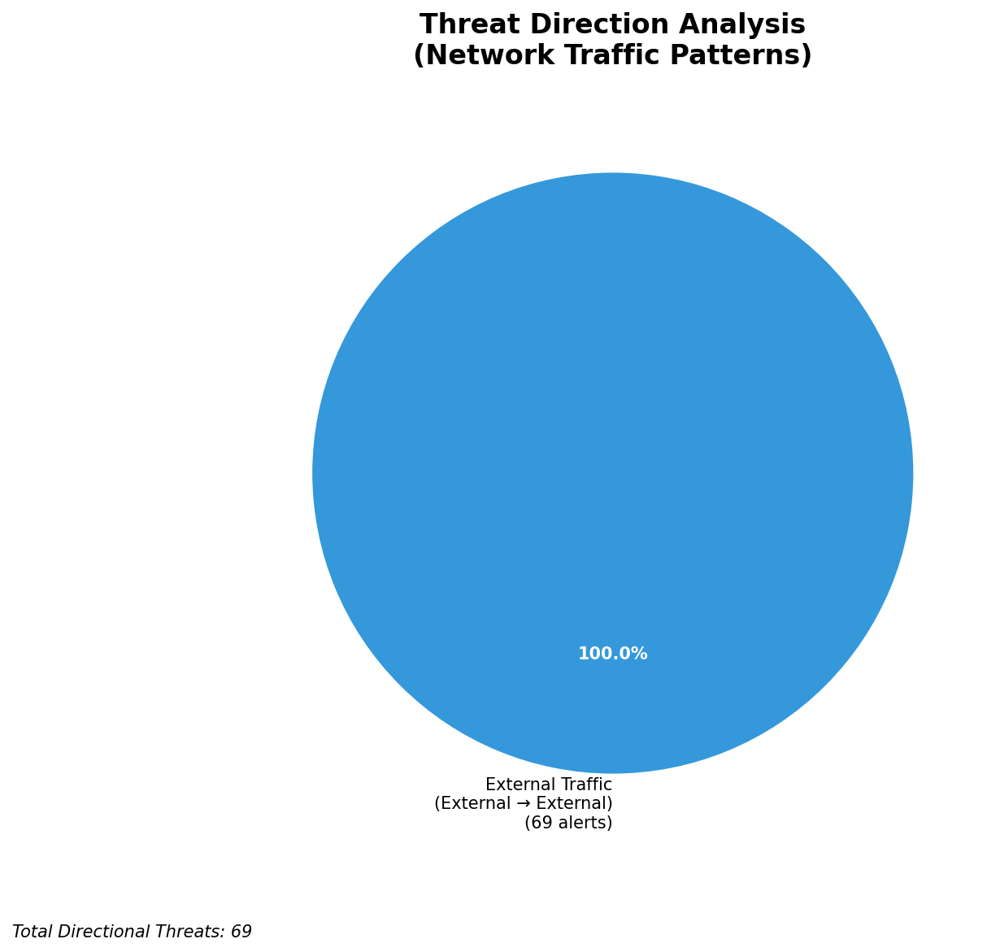
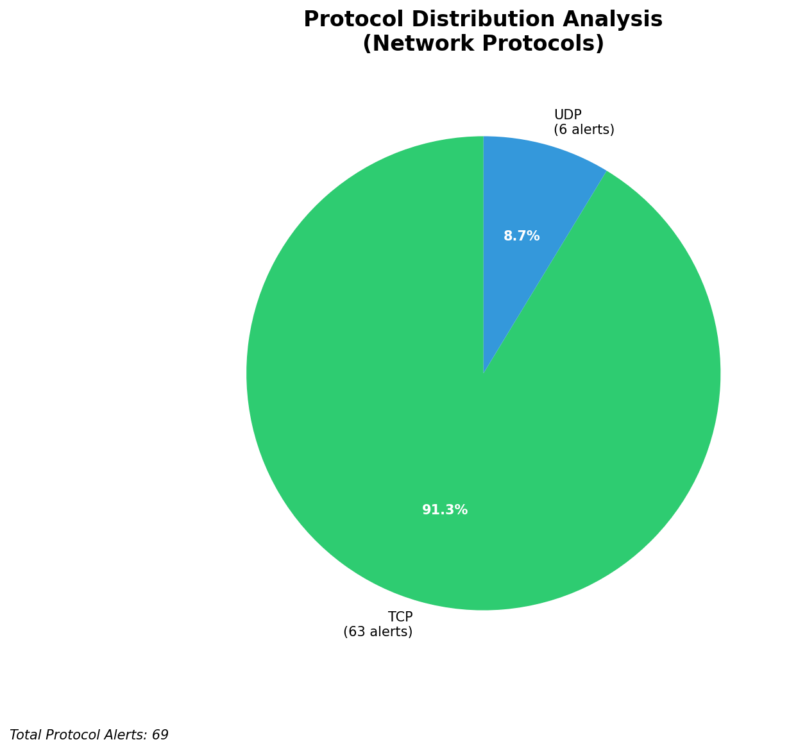

# HIGH-SEVERITY INCIDENT REPORT

    Auto-Generated: 2025-11-16 13:22:18  
    Trigger: 18 HIGH severity alerts detected (Level >= 8)  
    Critical Alerts (>8): 14  
    Total Alerts Analyzed: 1000  
    Server: 100.78.175.127  
    RAG Strategy: Custom Docs Only  
    Response Priority: IMMEDIATE  

    Triggered High Severity Alerts
    1. 🔥 Level 10 - HIGH: Suricata Severity 1 Alert - POSSBL SCAN SHELL M-SPLOIT TCP (2025-11-16T01:40:39.084+0000)
2. 🔥 Level 10 - HIGH: Suricata Severity 1 Alert - POSSBL SCAN SHELL M-SPLOIT TCP (2025-11-16T01:40:42.747+0000)
3. 🔥 Level 10 - HIGH: Suricata Severity 1 Alert - POSSBL SCAN SHELL M-SPLOIT TCP (2025-11-16T01:40:52.887+0000)
4. 🔥 Level 10 - HIGH: Suricata Severity 1 Alert - POSSBL SCAN SHELL M-SPLOIT TCP (2025-11-16T01:41:08.705+0000)
5. ⚡ Level 8 - MEDIUM: Suricata Severity 2 Alert - POSSBL SCAN FRAG (NMAP -f) (2025-11-16T02:03:25.656+0000)
   ... and 13 more HIGH severity alerts

---

**Executive Summary:**  
A high-severity intrusion attempt is underway, characterized by a coordinated wave of potential shell exploit scans targeting multiple external IP addresses. All 14 high-severity alerts (level 10) are identical in signature: "POSSBL SCAN SHELL M-SPLOIT TCP", indicating probing for shellcode injection vulnerabilities across TCP-based services. The attacks originate from 10 distinct external IPs, primarily targeting a single destination range: 66.96.202.66–70. No internal threats, outbound traffic, or infrastructure alerts were detected. The pattern suggests automated scanning for exploitable services, likely part of a broader reconnaissance campaign. Immediate mitigation is required to prevent potential exploitation.  

**Key Findings:**  
- 14 high-severity alerts detected (level 10) across 10 unique external sources.  
- All alerts triggered by "POSSBL SCAN SHELL M-SPLOIT TCP" signature—indicating reconnaissance for shellcode-based exploits.  
- Primary target IP range: 66.96.202.66–70, with multiple scan attempts from different sources.  
- No evidence of lateral movement, outbound C2, or data exfiltration.  
- No infrastructure or internal IPs involved in threat activity.  

**Top 5 Priority Threats:**  
| IP Address | Type | Country | Direction | Activity | Confidence | Count |  
|------------|------|---------|-----------|----------|------------|-------|  
| 65.49.1.54 | External | United States | Inbound | Shell exploit scan | High | 1 |  
| 64.62.156.92 | External | United States | Inbound | Shell exploit scan | High | 2 |  
| 103.227.91.89 | External | India | Inbound | Shell exploit scan | High | 1 |  
| 147.185.132.39 | External | United States | Inbound | Shell exploit scan | High | 1 |  
| 54.196.48.232 | External | United States | Inbound | Shell exploit scan | High | 1 |  

*Additional external threats identified: 4 (not listed due to 5-row limit). Infrastructure alerts excluded: 0.*  

**MITRE ATT&CK Mapping:**  
- **T1046 - Network Service Scanning**: Scanning for open services vulnerable to shellcode injection.  
- **T1078 - Valid Accounts**: Potential precursor to credential-based exploitation if services are compromised.  
- **T1213 - Exploitation for Credential Access**: Attempting to exploit shell vulnerabilities to gain access.  

**Immediate Actions:**  
1. Block all inbound traffic from source IPs: 65.49.1.54, 64.62.156.92, 103.227.91.89, 147.185.132.39, 54.196.48.232, 205.210.31.230, 143.244.130.91, 103.227.91.90.  
2. Enforce strict firewall rules on destination IPs 66.96.202.66–70 to deny unsolicited inbound TCP connections.  
3. Review system logs on target hosts for signs of exploitation attempts (e.g., unexpected processes, shell access).  
4. Patch or disable exposed services vulnerable to shellcode injection (e.g., outdated web servers, remote management interfaces).  
5. Deploy IDS/IPS rules to detect and block future "POSSBL SCAN SHELL M-SPLOIT TCP" patterns.  

**Technical Summary:**  
The incident is a high-volume reconnaissance campaign targeting potential shellcode vulnerabilities via TCP. All attacks are inbound from external sources, with no internal or infrastructure involvement. The consistent signature across 14 alerts confirms a coordinated scan. The U.S.-based IPs dominate, but Indian-origin source (103.227.91.89) is also active. No HTTP context or payload data available, indicating pure scanning behavior. No C2 or data exfiltration detected. Immediate blocking and hardening are critical.  

---
**Analysis Complete**  
Report generated: 2025-11-16T04:30:00  
Threat level: CRITICAL  
Priority actions: 5 identified

---

## 📊 Visual Threat Analysis

The following charts provide visual insights into the IP address patterns and threat distribution:

**Key Metrics:**
- Total alerts analyzed: 1000
- Charts generated: 4

### 📈 Automatic Report 20251116 132142 External Sources.Png

### 📈 Automatic Report 20251116 132142 Geolocation.Png

### 📈 Automatic Report 20251116 132142 Threat Directions.Png

### 📈 Automatic Report 20251116 132142 Protocols.Png

