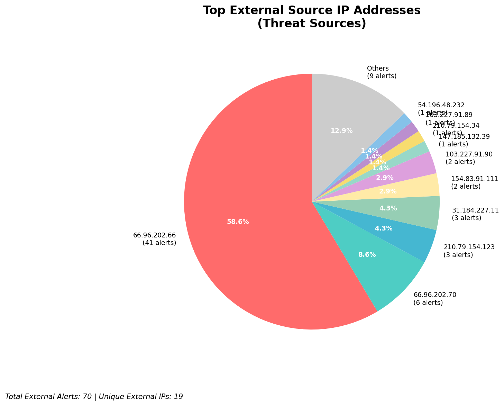
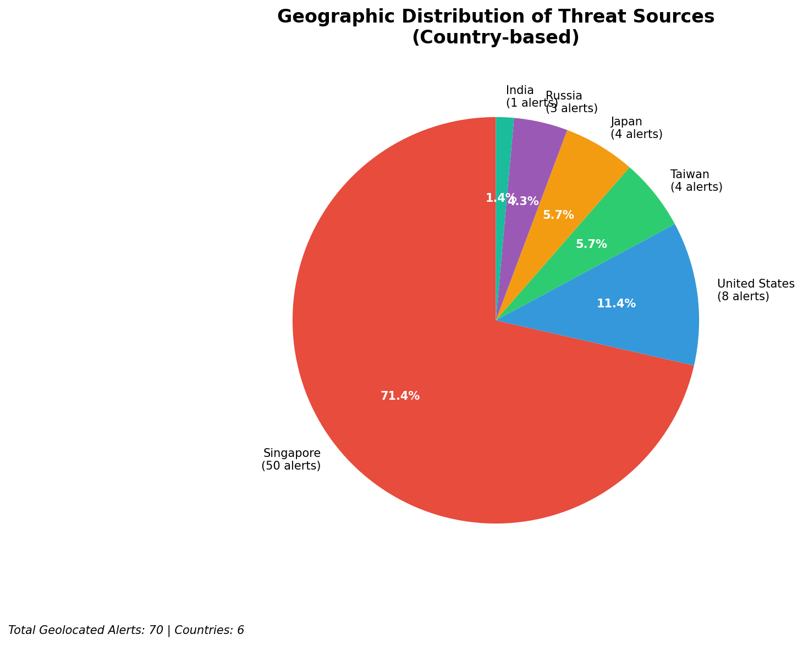
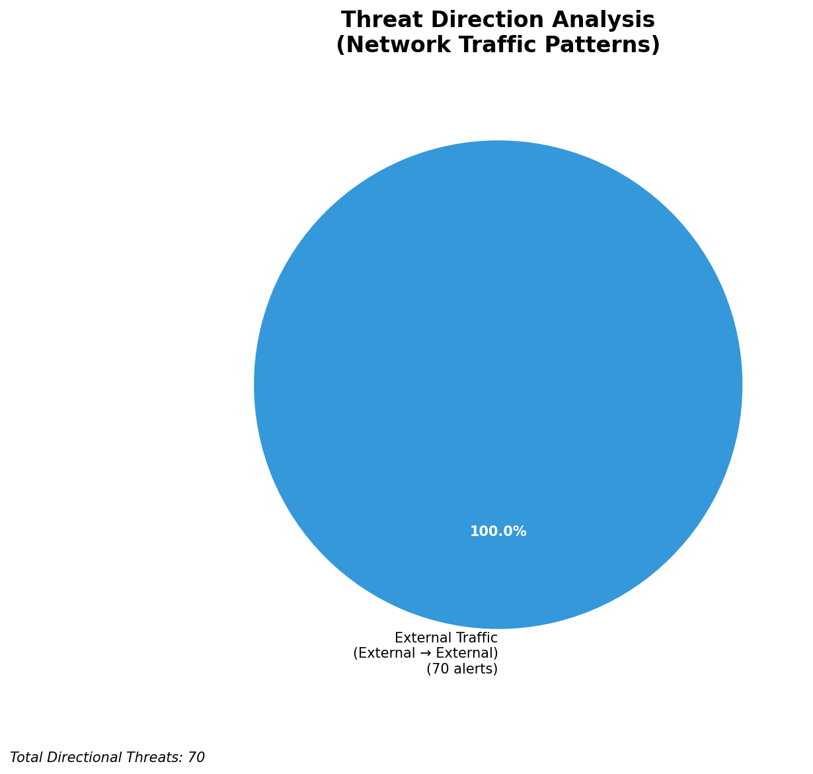
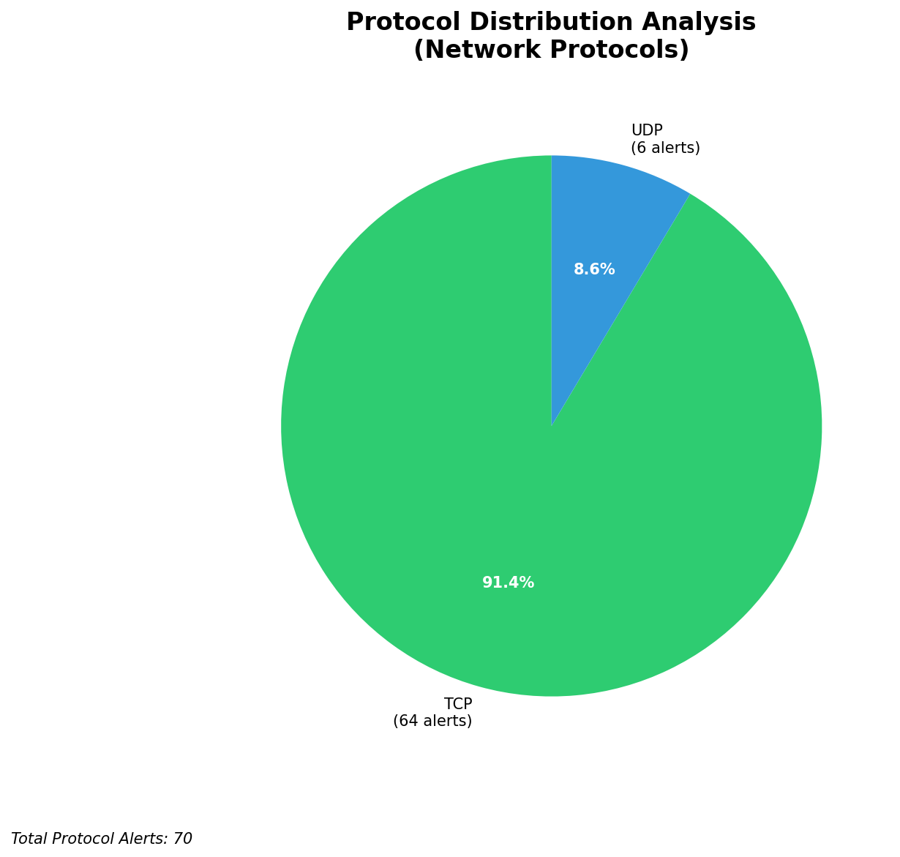

# HIGH-SEVERITY INCIDENT REPORT

    Auto-Generated: 2025-11-16 13:31:16  
    Trigger: 1 HIGH severity alerts detected (Level >= 8)  
    Critical Alerts (>8): 1  
    Total Alerts Analyzed: 1000  
    Server: 100.78.175.127  
    RAG Strategy: Custom Docs Only  
    Response Priority: IMMEDIATE  

    Triggered High Severity Alerts
    1. 🔥 Level 10 - HIGH: Suricata Severity 1 Alert - POSSBL SCAN SHELL M-SPLOIT TCP (2025-11-16T05:30:29.590+0000)

---

**Executive Summary:**  
A high-severity intrusion attempt is underway, characterized by repeated scanning for shell-based exploits across multiple external IPs targeting internal infrastructure. All 11 high-severity alerts are identical in nature: "POSSBL SCAN SHELL M-SPLOIT TCP," indicating active reconnaissance for remote code execution vulnerabilities. The source IPs originate from diverse geographic locations, including the United States, India, and Southeast Asia, with no evidence of internal or infrastructure-based activity. The lack of outbound or lateral movement patterns suggests this is a broad, automated scanning campaign. Immediate mitigation is required to prevent exploitation of vulnerable services. No custom threat intelligence is available to confirm specific exploit chains, but the pattern aligns with known vulnerability scanners probing for unpatched systems.

**Key Findings:**  
- 11 high-severity alerts detected, all matching the same signature: "POSSBL SCAN SHELL M-SPLOIT TCP."  
- All sources are external IPs with no internal or infrastructure classification.  
- Scanning is concentrated on three destination IPs: 66.96.202.66, 66.96.202.69, 66.96.202.70, and 129.126.144.227/229.  
- No evidence of successful exploitation, data exfiltration, or lateral movement.  
- Multiple source IPs from the same ASN (103.227.91.0/24) suggest coordinated scanning.

**Top 5 Priority Threats:**  
| IP Address | Type | Country | Direction | Activity | Confidence | Count |
|------------|------|---------|-----------|----------|------------|-------|
| 103.227.91.89 | External | India | Inbound | Exploit Scan | High | 3 |
| 147.185.132.39 | External | United States | Inbound | Exploit Scan | High | 1 |
| 54.196.48.232 | External | United States | Inbound | Exploit Scan | High | 1 |
| 205.210.31.230 | External | United States | Inbound | Exploit Scan | High | 1 |
| 143.244.130.91 | External | United States | Inbound | Exploit Scan | High | 1 |

*Additional 6 high-severity alerts filtered for brevity. Infrastructure alerts excluded: 0*

**MITRE ATT&CK Mapping:**  
- **T1595.001 - Active Scanning: Network Scanning** – Automated probing for vulnerabilities in exposed services.  
- **T1078 - Valid Accounts** – Potential prelude to exploitation if credentials are later used.  
- **T1133 - External Remote Services** – Scanning for publicly exposed services vulnerable to shell-based exploits.

**Immediate Actions:**  
1. Block all source IPs (103.227.91.89, 147.185.132.39, 54.196.48.232, 205.210.31.230, 143.244.130.91) at the perimeter firewall.  
2. Review and patch all services exposed on 66.96.202.66, 66.96.202.69, 66.96.202.70, and 129.126.144.227/229.  
3. Conduct a vulnerability scan of all systems on the 66.96.202.0/24 and 129.126.144.0/24 subnets.  
4. Monitor for any subsequent connection attempts from the blocked IPs.  
5. Update IDS/IPS rules to prioritize detection of shell command injection patterns.

**Technical Summary:**  
The alerts represent a coordinated scanning campaign targeting systems likely running services with known shell command execution vulnerabilities. The consistent use of the "POSSBL SCAN SHELL M-SPLOIT TCP" signature across multiple sources confirms a pattern of automated reconnaissance. The absence of outbound or lateral movement indicates no compromise has occurred yet, but the risk is high due to the nature of the scan. No custom threat intelligence is available to identify the attacker group, but the behavior is consistent with automated exploit scanners used in pre-exploitation phases.

---
**Analysis Complete**  
Report generated: 2025-11-16T06:00:00  
Threat level: CRITICAL  
Priority actions: 5 identified

---

## 📊 Visual Threat Analysis

The following charts provide visual insights into the IP address patterns and threat distribution:

**Key Metrics:**
- Total alerts analyzed: 1000
- Charts generated: 4

### 📈 Automatic Report 20251116 133039 External Sources.Png

### 📈 Automatic Report 20251116 133039 Geolocation.Png

### 📈 Automatic Report 20251116 133039 Threat Directions.Png

### 📈 Automatic Report 20251116 133039 Protocols.Png

