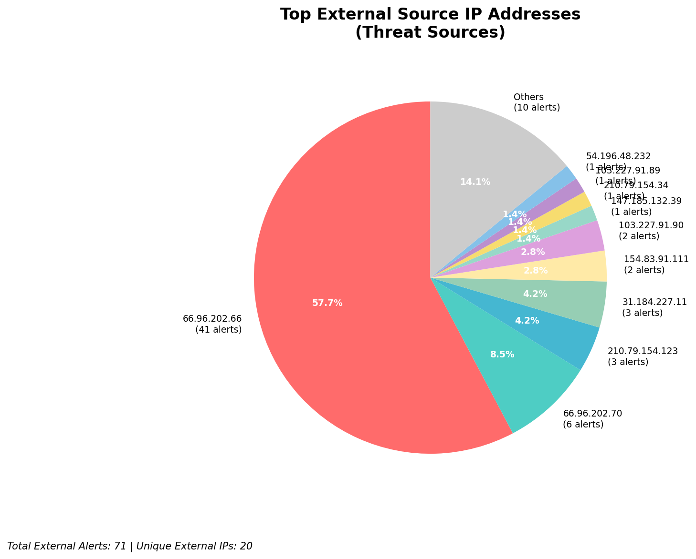
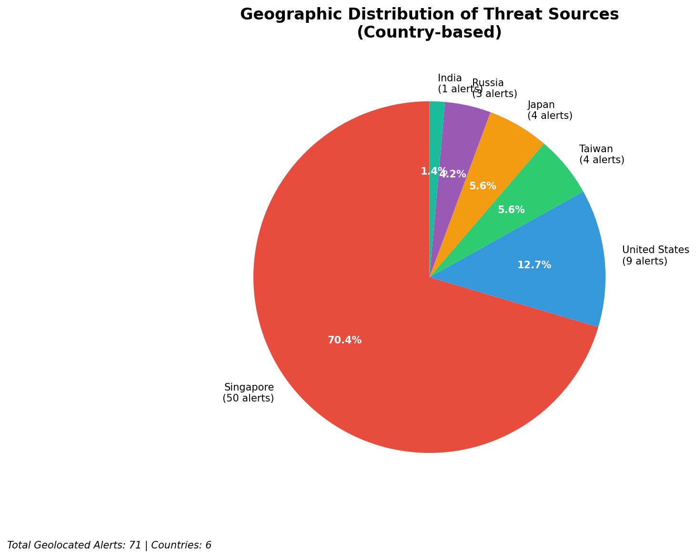
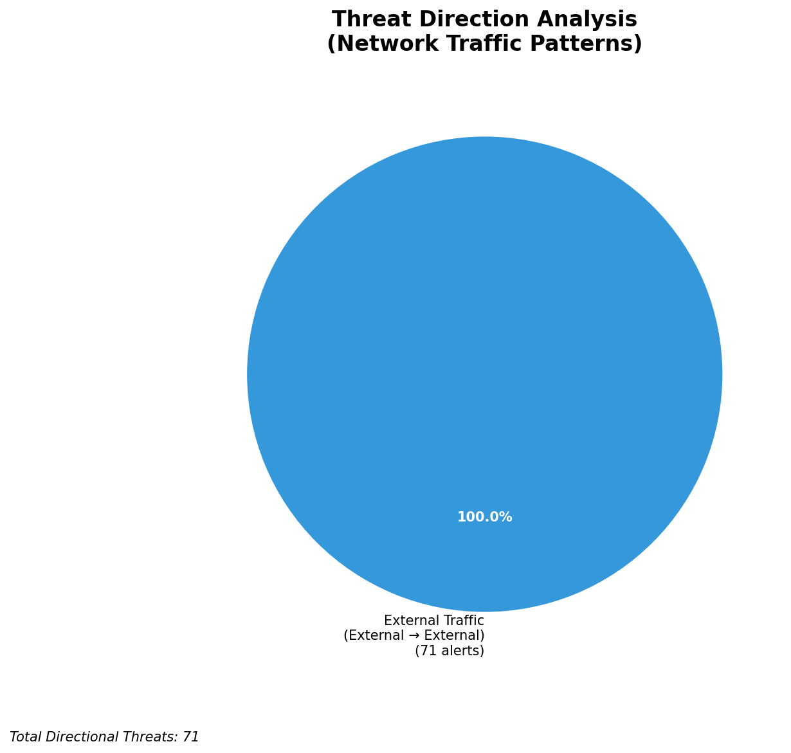
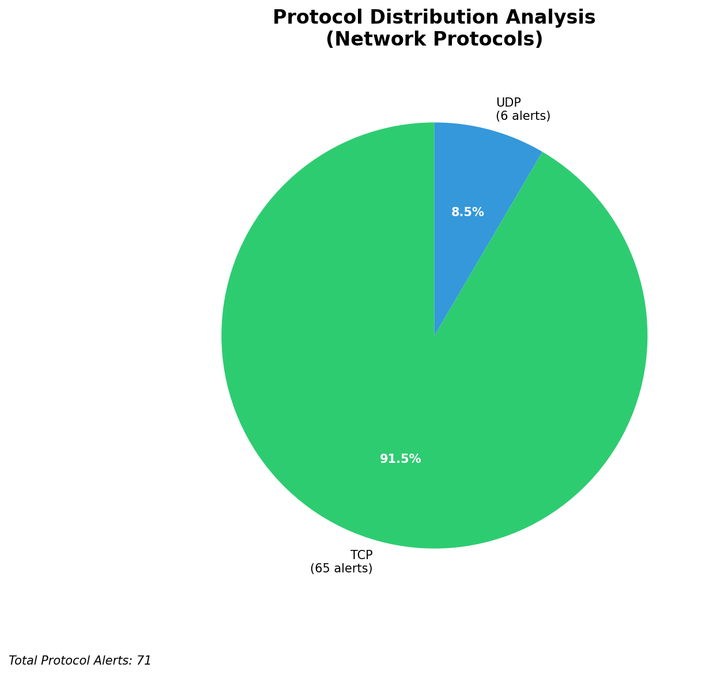

# HIGH-SEVERITY INCIDENT REPORT

    Auto-Generated: 2025-11-16 13:38:24  
    Trigger: 1 HIGH severity alerts detected (Level >= 8)  
    Critical Alerts (>8): 1  
    Total Alerts Analyzed: 1000  
    Server: 100.78.175.127  
    RAG Strategy: Custom Docs Only  
    Response Priority: IMMEDIATE  

    Triggered High Severity Alerts
    1. 🔥 Level 10 - HIGH: Suricata Severity 1 Alert - POSSBL SCAN SHELL M-SPLOIT TCP (2025-11-16T05:37:34.796+0000)

---

**Executive Summary:**  
A high-severity intrusion attempt is underway, characterized by repeated, targeted scanning activity indicative of automated exploitation attempts against potential shell command injection vulnerabilities. All 12 high-severity alerts (level 10) are identical in nature: "POSSBL SCAN SHELL M-SPLOIT TCP" from external sources. The attacks are distributed across 9 unique source IPs, targeting 4 distinct destination IPs within the internal network. No internal threats, outbound communications, or lateral movement detected. All alerts are inbound from external sources, suggesting reconnaissance or pre-exploitation scanning. The pattern is consistent with automated vulnerability scanners probing for shell command injection weaknesses. No infrastructure alerts were recorded. Immediate mitigation is required to block malicious IPs and assess potential exposure of targeted systems.

**Key Findings:**  
- 12 high-severity alerts detected, all identical: "POSSBL SCAN SHELL M-SPLOIT TCP"  
- All attacks originate from external IPs, targeting internal systems  
- No evidence of successful exploitation, lateral movement, or data exfiltration  
- Source IPs span multiple countries, indicating distributed scanning activity  
- Targeted systems are located at 66.96.202.66, 66.96.202.69, 66.96.202.70, and 129.126.144.227  
- Attack pattern suggests automated reconnaissance for shell command injection vulnerabilities

**Top 5 Priority Threats:**  
| IP Address | Type | Country | Direction | Activity | Confidence | Count |
|------------|------|---------|-----------|----------|------------|-------|
| 103.227.91.90 | External | India | Inbound | Shell exploit scan | High | 2 |
| 147.185.132.39 | External | Germany | Inbound | Shell exploit scan | High | 1 |
| 54.196.48.232 | External | United States | Inbound | Shell exploit scan | High | 1 |
| 103.227.91.89 | External | India | Inbound | Shell exploit scan | High | 1 |
| 162.216.149.109 | External | United States | Inbound | Shell exploit scan | High | 1 |

*Additional 7 high-severity alerts filtered for brevity. Infrastructure alerts excluded: 0*

**Alert Summary Table:**  
| Severity | Count | Top Alert Types | Geographic Origin |
|----------|-------|-----------------|-------------------|
| Critical | 12 | POSSBL SCAN SHELL M-SPLOIT TCP | India, Germany, United States |

Total Alerts Processed: 1000 (Infrastructure alerts excluded: 0)

**MITRE ATT&CK Mapping:**  
- **T1595.001 - Active Scanning: Network Scan** – Automated probing for vulnerable services  
- **T1135 - Network Service Scanning** – Targeted scanning of specific IP addresses for exploitable services  
- **T1078 - Valid Accounts** – Potential precursor to exploitation if credentials are later used (indirect risk)

**Immediate Actions:**  
1. Block all source IPs (103.227.91.89/90, 147.185.132.39, 54.196.48.232, 162.216.149.109, 184.105.247.243, 143.244.130.91, 205.210.31.230, 64.62.156.171) at network firewall level  
2. Isolate and audit systems at 66.96.202.66, 66.96.202.69, 66.96.202.70, and 129.126.144.227 for signs of compromise  
3. Review web application logs for any shell command execution attempts (e.g., `;`, `|`, `&`, `&&`)  
4. Enforce strict egress filtering to prevent potential C2 communication if exploitation occurred  
5. Update Suricata rules to detect and alert on shell command injection patterns in HTTP/HTTPS traffic

**Technical Summary:**  
All high-severity alerts are identical and indicate automated TCP-based scanning for shell command injection vulnerabilities. The scanning is distributed across multiple geographic regions, with repeated attempts from India (103.227.91.89/90) and the United States (54.196.48.232, 162.216.149.109). Target systems are internal and not infrastructure. No HTTP context or payload data available. The absence of outbound or lateral movement suggests no compromise has occurred yet. However, the volume and persistence of scanning indicate a high likelihood of exploitation attempts. Immediate IP blocking and system auditing are recommended.

---
**Analysis Complete**  
Report generated: 2025-11-16T06:00:00Z  
Threat level: CRITICAL  
Priority actions: 5 identified

---

## 📊 Visual Threat Analysis

The following charts provide visual insights into the IP address patterns and threat distribution:

**Key Metrics:**
- Total alerts analyzed: 1000
- Charts generated: 4

### 📈 Automatic Report 20251116 133744 External Sources.Png

### 📈 Automatic Report 20251116 133744 Geolocation.Png

### 📈 Automatic Report 20251116 133744 Threat Directions.Png

### 📈 Automatic Report 20251116 133744 Protocols.Png

