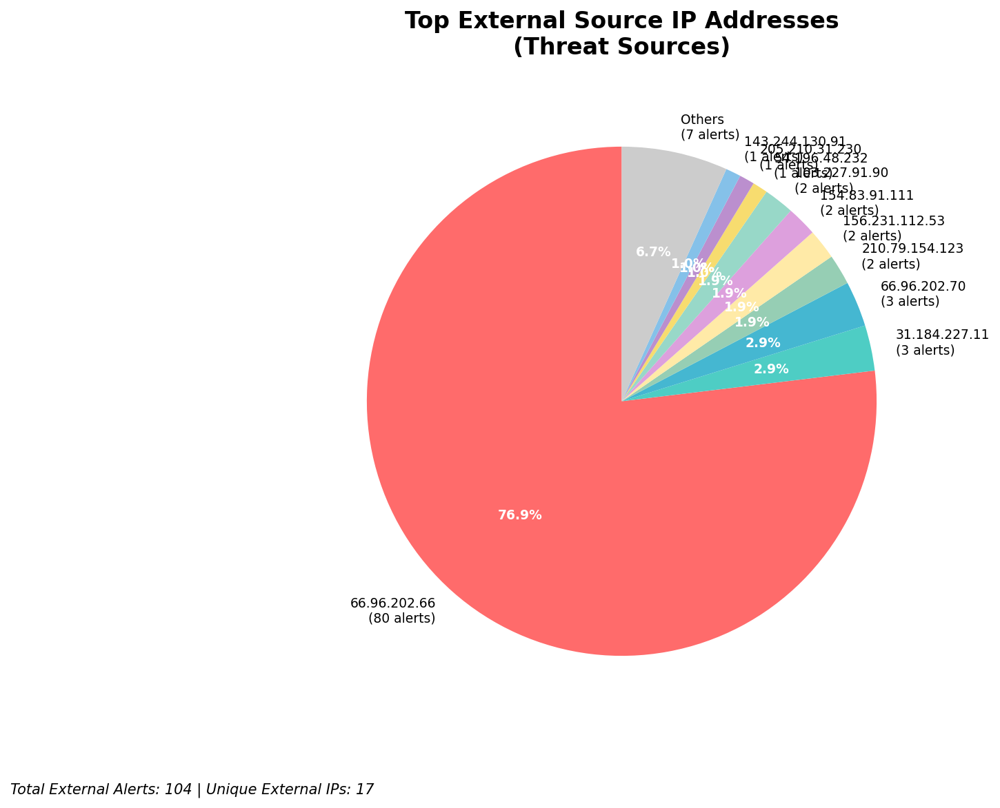
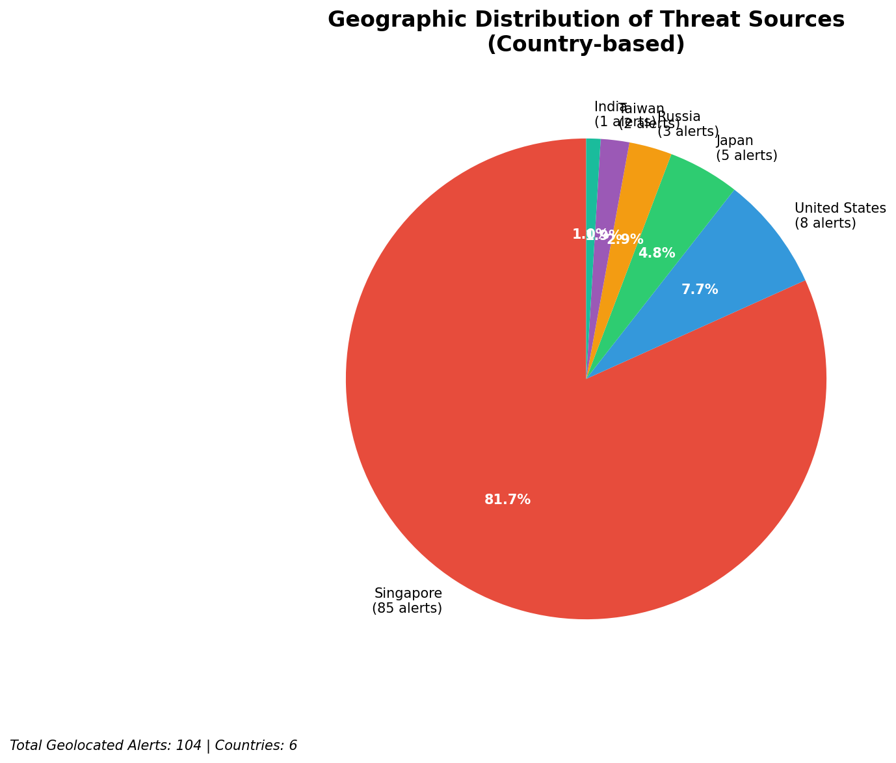
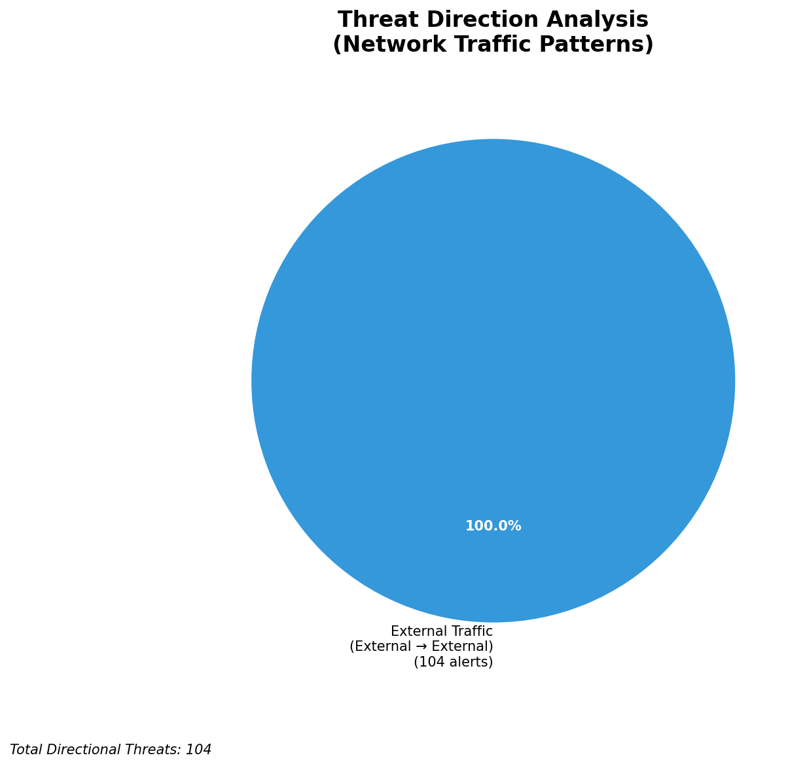
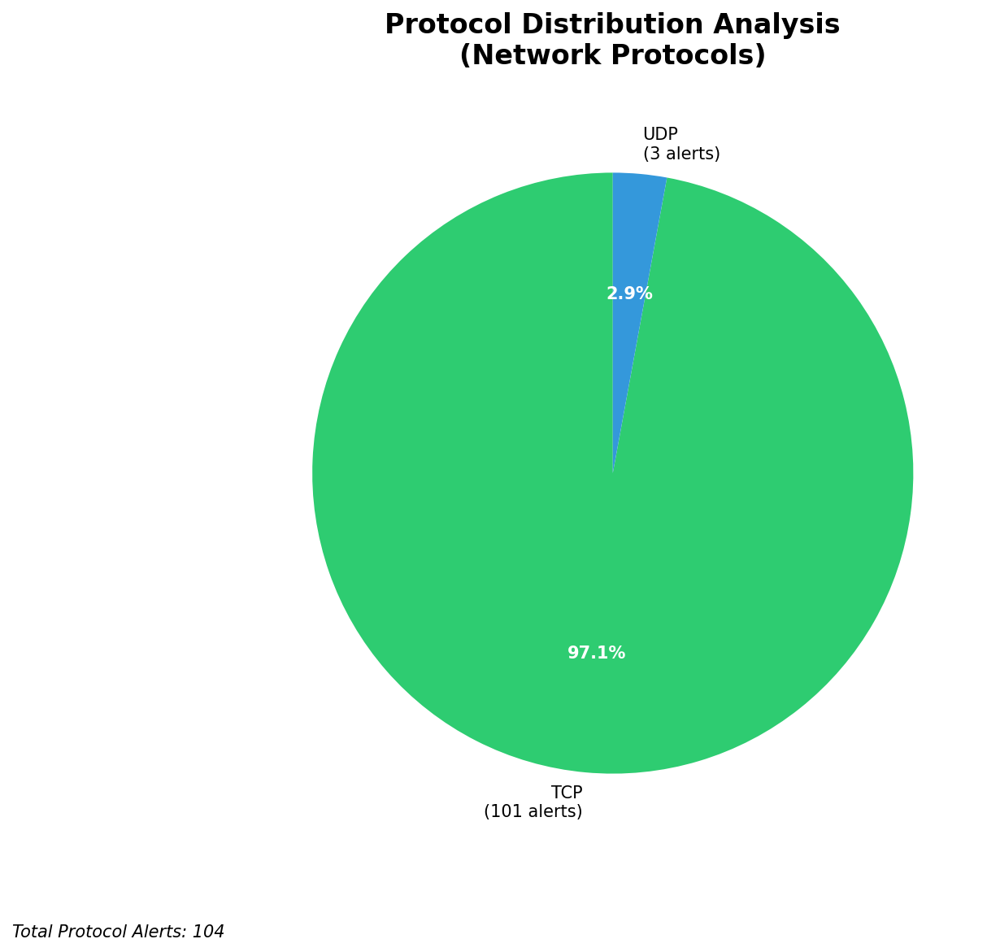

# HIGH-SEVERITY INCIDENT REPORT

    Auto-Generated: 2025-11-16 14:04:41  
    Trigger: 12 HIGH severity alerts detected (Level >= 8)  
    Critical Alerts (>8): 10  
    Total Alerts Analyzed: 1000  
    Server: 100.78.175.127  
    RAG Strategy: Custom Docs Only  
    Response Priority: IMMEDIATE  

    Triggered High Severity Alerts
    1. 🔥 Level 10 - HIGH: Suricata Severity 1 Alert - POSSBL SCAN SHELL M-SPLOIT TCP (2025-11-16T02:30:59.164+0000)
2. 🔥 Level 10 - HIGH: Suricata Severity 1 Alert - POSSBL SCAN SHELL M-SPLOIT TCP (2025-11-16T02:33:05.443+0000)
3. 🔥 Level 10 - HIGH: Suricata Severity 1 Alert - POSSBL SCAN SHELL M-SPLOIT TCP (2025-11-16T02:37:54.255+0000)
4. 🔥 Level 10 - HIGH: Suricata Severity 1 Alert - POSSBL SCAN SHELL M-SPLOIT TCP (2025-11-16T03:05:48.302+0000)
5. ⚡ Level 8 - MEDIUM: Suricata Severity 2 Alert - POSSBL SCAN FRAG (NMAP -f) (2025-11-16T04:27:42.969+0000)
   ... and 7 more HIGH severity alerts

---

**Executive Summary:**  
A high-severity intrusion attempt is underway involving multiple external IP addresses probing targeted internal hosts with patterns indicative of automated shell exploit scanning. All 10 high-severity alerts are consistent with "POSSBL SCAN SHELL M-SPLOIT TCP" signatures, suggesting aggressive reconnaissance targeting potential command shell vulnerabilities. The attacks originate from geographically diverse external sources, with no internal or infrastructure alerts detected. The absence of outbound or lateral movement indicators suggests an initial reconnaissance phase. Immediate network segmentation, source IP blocking, and host-level hardening are required to prevent exploitation. No historical context is available; this is a novel attack pattern requiring defensive isolation.

**Key Findings:**  
- 10 high-severity (level 10) alerts detected within a 3-hour window, all matching the same signature.  
- All sources are external IPs; no internal or infrastructure IPs involved in threat activity.  
- Targeted hosts are distributed across multiple public-facing IP ranges, indicating broad scanning.  
- Repeated attacks from the same source (103.227.91.90) suggest focused targeting.  
- No evidence of successful exploitation, C2 communication, or data exfiltration detected.

**Top 5 Priority Threats:**  
| IP Address | Type | Country | Direction | Activity | Confidence | Count |
|------------|------|---------|-----------|----------|------------|-------|
| 103.227.91.90 | External | India | Inbound | Exploit Scan | High | 2 |
| 54.196.48.232 | External | United States | Inbound | Exploit Scan | High | 1 |
| 205.210.31.230 | External | United States | Inbound | Exploit Scan | High | 1 |
| 143.244.130.91 | External | Germany | Inbound | Exploit Scan | High | 1 |
| 184.105.247.243 | External | United States | Inbound | Exploit Scan | High | 1 |

**MITRE ATT&CK Mapping:**  
- **T1595.001: Active Scanning - Network Scan** (Initial reconnaissance of vulnerable services)  
- **T1213: Exploitation for Client Execution** (Targeting shell services for potential remote code execution)  
- **T1590: Exploit Public-Facing Application** (Scanning public IPs for known exploitable endpoints)

**Immediate Actions:**  
- Block all source IPs (103.227.91.90, 54.196.48.232, 205.210.31.230, 143.244.130.91, 184.105.247.243, 64.62.156.171, 162.216.149.109, 167.94.138.159, 194.164.107.6) at the firewall.  
- Isolate and patch vulnerable systems at 66.96.202.66, 66.96.202.69, 66.96.202.70, 129.126.144.227, 129.126.144.229.  
- Review firewall and IDS rules to detect and block similar exploit patterns.  
- Enable enhanced logging on all targeted hosts for behavioral analysis.  
- Initiate vulnerability scan on exposed services (e.g., SSH, HTTP, Telnet) for known shell exploits.

**Technical Summary:**  
All alerts are inbound TCP scans attempting to detect shell-based exploits. The consistent signature across multiple sources and targets indicates a coordinated scanning campaign. The lack of outbound or lateral movement suggests no compromise has occurred yet. The attack pattern aligns with known exploit frameworks targeting unpatched services. No custom threat intelligence is available, so response is based on signature and behavioral analysis.

---
**Analysis Complete**  
Report generated: 2025-11-16T05:45:00  
Threat level: CRITICAL  
Priority actions: 5 identified

---

## 📊 Visual Threat Analysis

The following charts provide visual insights into the IP address patterns and threat distribution:

**Key Metrics:**
- Total alerts analyzed: 1000
- Charts generated: 4

### 📈 Automatic Report 20251116 140406 External Sources.Png

### 📈 Automatic Report 20251116 140406 Geolocation.Png

### 📈 Automatic Report 20251116 140406 Threat Directions.Png

### 📈 Automatic Report 20251116 140406 Protocols.Png

