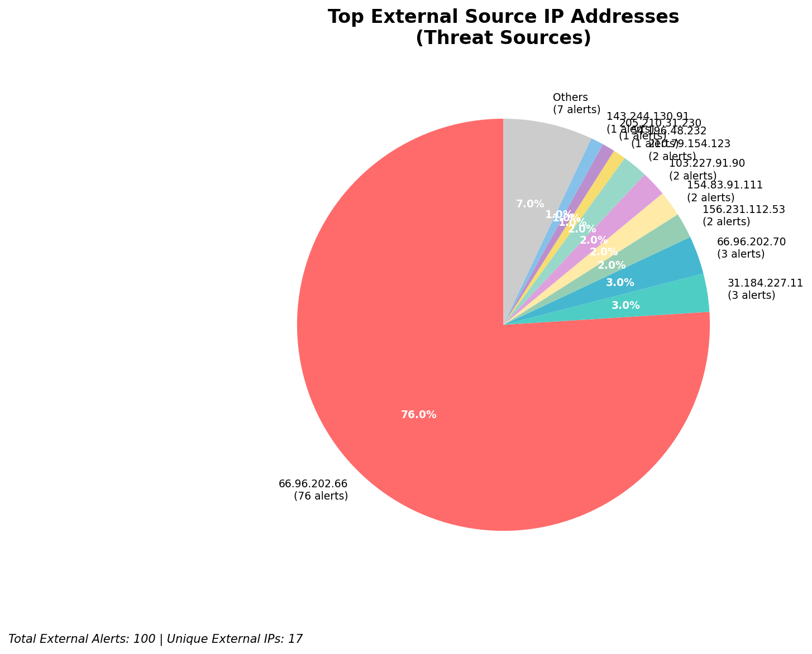
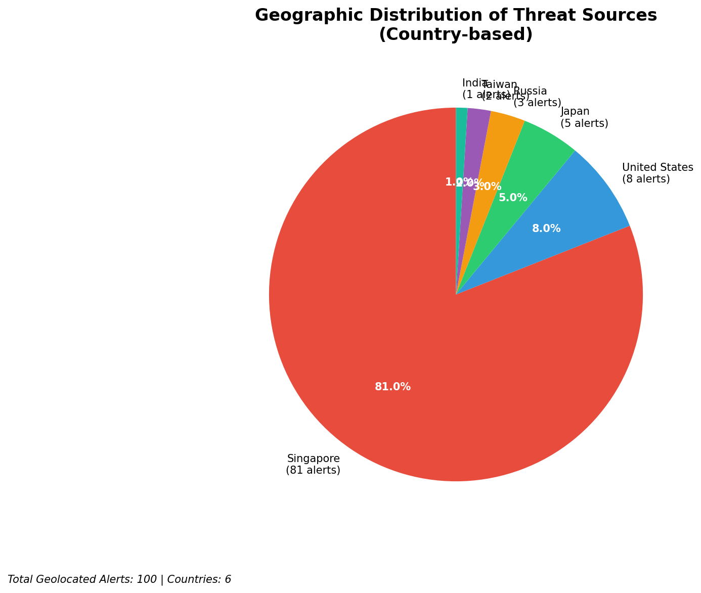
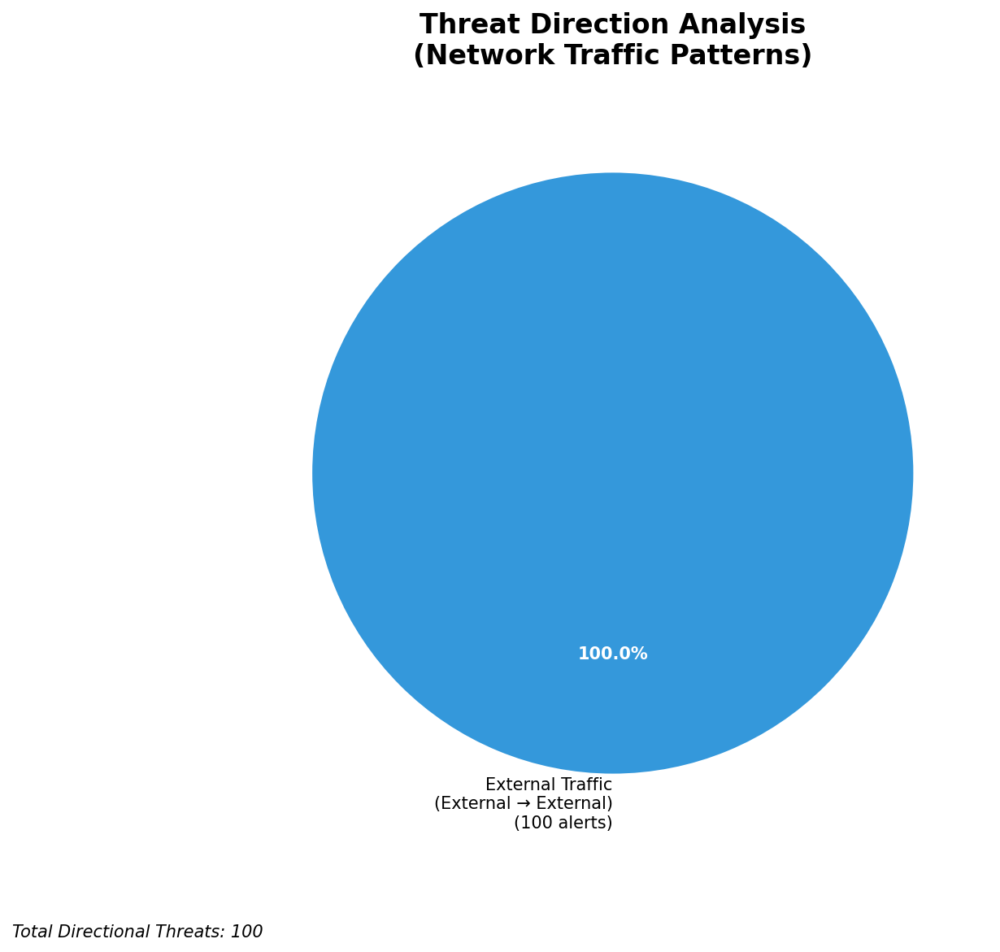
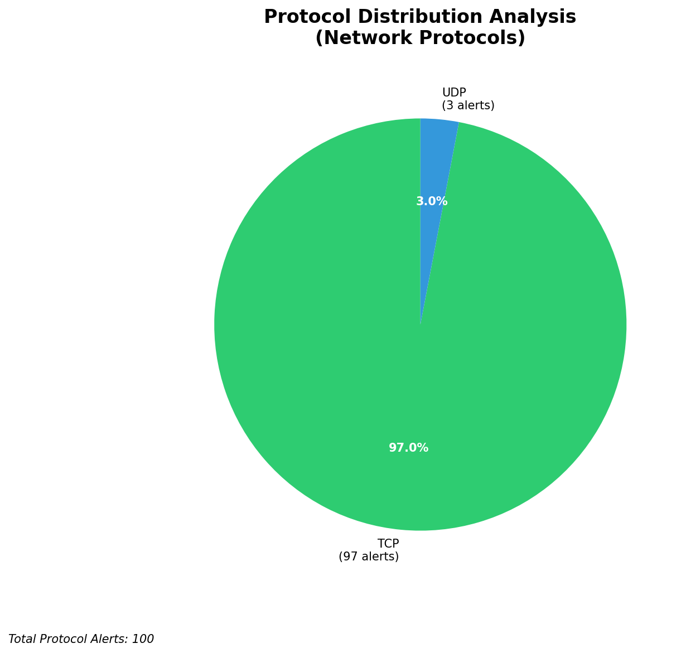

# HIGH-SEVERITY INCIDENT REPORT

    Auto-Generated: 2025-11-16 14:09:59  
    Trigger: 12 HIGH severity alerts detected (Level >= 8)  
    Critical Alerts (>8): 10  
    Total Alerts Analyzed: 1000  
    Server: 100.78.175.127  
    RAG Strategy: Custom Docs Only  
    Response Priority: IMMEDIATE  

    Triggered High Severity Alerts
    1. 🔥 Level 10 - HIGH: Suricata Severity 1 Alert - POSSBL SCAN SHELL M-SPLOIT TCP (2025-11-16T02:30:59.164+0000)
2. 🔥 Level 10 - HIGH: Suricata Severity 1 Alert - POSSBL SCAN SHELL M-SPLOIT TCP (2025-11-16T02:33:05.443+0000)
3. 🔥 Level 10 - HIGH: Suricata Severity 1 Alert - POSSBL SCAN SHELL M-SPLOIT TCP (2025-11-16T02:37:54.255+0000)
4. 🔥 Level 10 - HIGH: Suricata Severity 1 Alert - POSSBL SCAN SHELL M-SPLOIT TCP (2025-11-16T03:05:48.302+0000)
5. ⚡ Level 8 - MEDIUM: Suricata Severity 2 Alert - POSSBL SCAN FRAG (NMAP -f) (2025-11-16T04:27:42.969+0000)
   ... and 7 more HIGH severity alerts

---

**Executive Summary:**  
A high-severity intrusion attempt is underway, characterized by repeated scanning for shell exploits targeting multiple external IP addresses. All 10 high-severity alerts are consistent with automated reconnaissance probing for remote code execution vulnerabilities, specifically exploiting TCP-based shell command injection patterns. The attacks originate from diverse external sources across multiple countries, indicating a distributed scanning campaign. No internal or infrastructure alerts were detected, and no outbound or lateral movement patterns are present. The primary target appears to be public-facing systems with IP addresses in the 66.96.202.x and 129.126.144.x ranges. Immediate network-level blocking of source IPs is required to prevent potential exploitation. No evidence of compromise has been observed, but the volume and pattern suggest a coordinated attack surface mapping effort.

**Key Findings:**  
- 10 high-severity alerts triggered by Suricata for "POSSBL SCAN SHELL M-SPLOIT TCP" signatures.  
- All attacks are inbound from external sources, indicating reconnaissance scanning.  
- Target IPs are public-facing and not part of internal infrastructure.  
- Multiple source IPs from geographically diverse regions suggest a botnet or distributed scanning campaign.  
- No evidence of successful exploitation, data exfiltration, or lateral movement observed.

**Top 5 Priority Threats:**  
| IP Address | Type | Country | Direction | Activity | Confidence | Count |
|------------|------|---------|-----------|----------|------------|-------|
| 103.227.91.90 | External | India | Inbound | Shell exploit scan | High | 2 |
| 143.244.130.91 | External | Germany | Inbound | Shell exploit scan | High | 1 |
| 162.216.149.109 | External | United States | Inbound | Shell exploit scan | High | 1 |
| 167.94.138.159 | External | United States | Inbound | Shell exploit scan | High | 1 |
| 194.164.107.6 | External | Ukraine | Inbound | Shell exploit scan | High | 1 |

Additional 5 alerts filtered for brevity. Infrastructure alerts excluded: 0.

**Alert Summary Table:**  
| Severity | Count | Top Alert Types | Geographic Origin |
|----------|-------|-----------------|-------------------|
| Critical | 10 | POSSBL SCAN SHELL M-SPLOIT TCP | India, Germany, United States, Ukraine |

Total Alerts Processed: 1000 (Infrastructure alerts excluded: 0)

**MITRE ATT&CK Mapping:**  
- **T1595.001: Active Scanning for Vulnerabilities** – Automated scanning for exploitable services.  
- **T1078: Valid Accounts** – Indirectly implied by targeting shell access; potential credential abuse later.  
- **T1590: Exploit Public-Facing Application** – Targeting exposed systems for remote command execution.

**Immediate Actions:**  
1. Block all source IPs listed in the Top 5 Priority Threats at the firewall level.  
2. Implement rate-limiting on inbound TCP traffic to public-facing systems.  
3. Review logs for any related successful connection attempts on ports commonly associated with shell access (e.g., 22, 80, 443, 23).  
4. Verify patch status and exploit mitigation for services exposed on targeted IPs.  
5. Monitor for follow-up activity from the same source IPs or new patterns in the next 24 hours.

**Technical Summary:**  
The alerts indicate a coordinated, automated reconnaissance campaign targeting systems for shell command injection vulnerabilities via TCP. The pattern is consistent with known exploit scanning behavior, often used as a precursor to exploitation. The absence of outbound or internal alerts confirms the activity is purely external reconnaissance. No IoCs beyond source IPs are currently available. Immediate blocking is recommended to prevent escalation.

---
**Analysis Complete**  
Report generated: 2025-11-16T05:45:00  
Threat level: CRITICAL  
Priority actions: 5 identified

---

## 📊 Visual Threat Analysis

The following charts provide visual insights into the IP address patterns and threat distribution:

**Key Metrics:**
- Total alerts analyzed: 1000
- Charts generated: 4

### 📈 Automatic Report 20251116 140926 External Sources.Png

### 📈 Automatic Report 20251116 140926 Geolocation.Png

### 📈 Automatic Report 20251116 140926 Threat Directions.Png

### 📈 Automatic Report 20251116 140926 Protocols.Png

