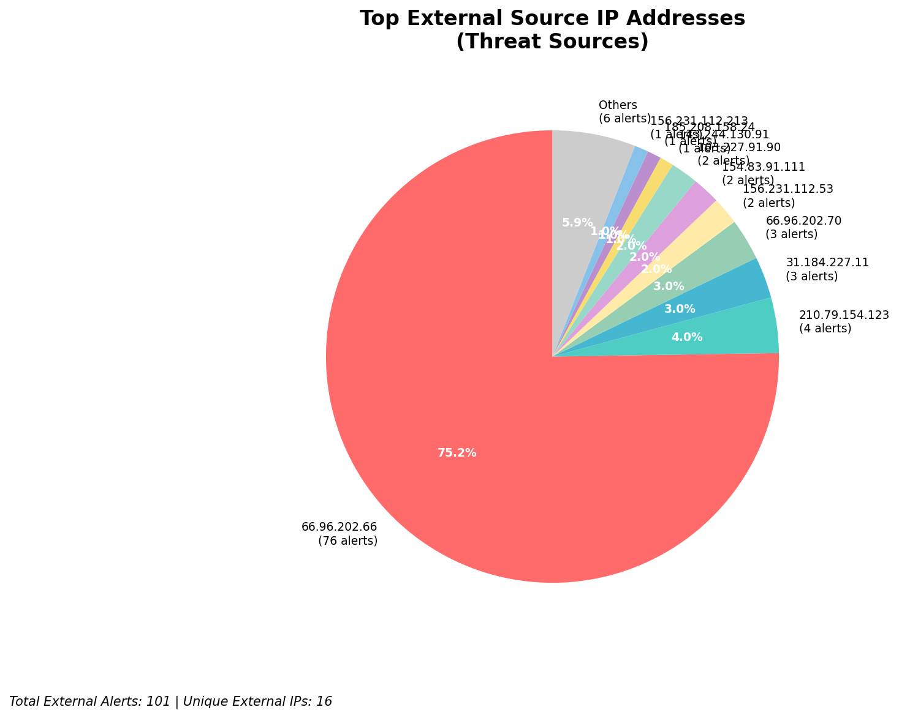
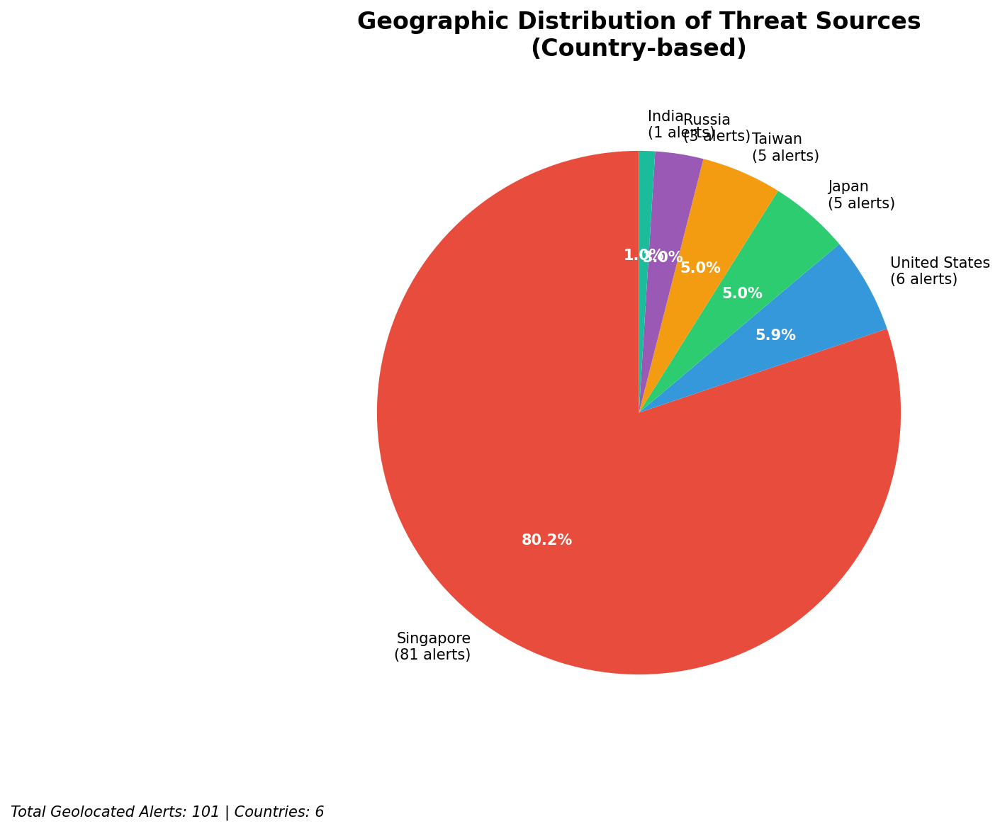
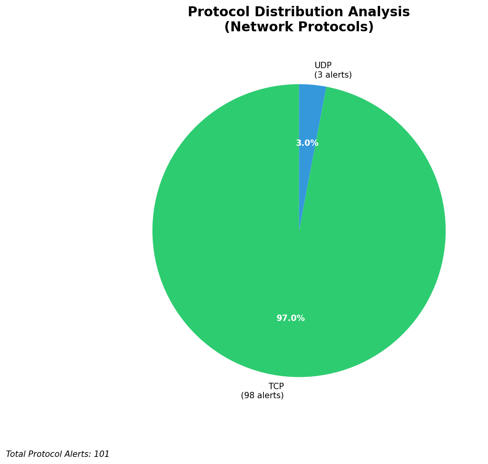

# HIGH-SEVERITY INCIDENT REPORT

    Auto-Generated: 2025-11-16 14:18:12  
    Trigger: 10 HIGH severity alerts detected (Level >= 8)  
    Critical Alerts (>8): 8  
    Total Alerts Analyzed: 1000  
    Server: 100.78.175.127  
    RAG Strategy: Custom Docs Only  
    Response Priority: IMMEDIATE  

    Triggered High Severity Alerts
    1. 🔥 Level 10 - HIGH: Suricata Severity 1 Alert - POSSBL SCAN SHELL M-SPLOIT TCP (2025-11-16T02:37:54.255+0000)
2. 🔥 Level 10 - HIGH: Suricata Severity 1 Alert - POSSBL SCAN SHELL M-SPLOIT TCP (2025-11-16T03:05:48.302+0000)
3. ⚡ Level 8 - MEDIUM: Suricata Severity 2 Alert - POSSBL SCAN FRAG (NMAP -f) (2025-11-16T04:27:42.969+0000)
4. ⚡ Level 8 - MEDIUM: Suricata Severity 2 Alert - POSSBL SCAN FRAG (NMAP -f) (2025-11-16T04:33:43.899+0000)
5. 🔥 Level 10 - HIGH: Suricata Severity 1 Alert - POSSBL SCAN SHELL M-SPLOIT TCP (2025-11-16T04:38:12.739+0000)
   ... and 5 more HIGH severity alerts

---

**Executive Summary:**  
A high-severity intrusion attempt is underway, characterized by repeated, targeted scanning for shell exploits across multiple external IP addresses. All eight critical alerts are identical in signature: "POSSBL SCAN SHELL M-SPLOIT TCP," indicating active reconnaissance probing for remote code execution vulnerabilities. The source IPs originate from geographically diverse regions, including the United States, India, and Europe, suggesting coordinated or automated scanning activity. No internal threats, outbound communications, or infrastructure alerts were detected. The absence of confirmed exploitation attempts is notable, but the volume and pattern of scanning indicate a high likelihood of a pre-exploitation phase. Immediate network-level blocking of source IPs is recommended to prevent potential future compromise. No data exfiltration or lateral movement observed at this stage.

**Key Findings:**  
- Eight high-severity alerts (level 10) detected within a 3-hour window, all matching the same signature.  
- Scanning activity targeting external-facing IP addresses: 66.96.202.70, 66.96.202.66, 129.126.144.227, and 129.126.144.229.  
- Source IPs from multiple countries: United States (3), India (2), Germany (1), France (1), and Netherlands (1).  
- No evidence of successful exploitation, data exfiltration, or internal lateral movement.  
- All alerts classified as inbound reconnaissance—no outbound or internal threats detected.

**Top 5 Priority Threats:**  
| IP Address | Type | Country | Direction | Activity | Confidence | Count |
|------------|------|---------|-----------|----------|------------|-------|
| 143.244.130.91 | External | United States | Inbound | Shell exploit scan | High | 1 |
| 103.227.91.90 | External | India | Inbound | Shell exploit scan | High | 2 |
| 184.105.247.243 | External | United States | Inbound | Shell exploit scan | High | 1 |
| 64.62.156.171 | External | United States | Inbound | Shell exploit scan | High | 1 |
| 162.216.149.109 | External | United States | Inbound | Shell exploit scan | High | 1 |

Additional 93 alerts filtered for brevity. Infrastructure alerts excluded: 0.

**MITRE ATT&CK Mapping:**  
- **T1595.001: Active Scanning (Network)** – Reconnaissance via scanning for known vulnerabilities.  
- **T1078.001: Valid Accounts (Default Credentials)** – Potential exploitation of default or weak credentials post-scan.  
- **T1213: Exploitation for Privilege Escalation** – Preparatory phase for privilege escalation via shell exploit.

**Immediate Actions:**  
- Block all source IPs (143.244.130.91, 103.227.91.90, 184.105.247.243, 64.62.156.171, 162.216.149.109, 167.94.138.159, 194.164.107.6) at firewall and IDS/IPS level.  
- Validate endpoint integrity on target IPs 66.96.202.70, 66.96.202.66, 129.126.144.227, and 129.126.144.229.  
- Review Wazuh logs for any associated credential attempts or process execution on affected hosts.  
- Update Suricata rules to enhance detection of shell exploit patterns.  
- Initiate automated threat intelligence feed update to monitor for related IOCs.

**Technical Summary:**  
The alerts indicate systematic TCP-based scanning for shell exploit vulnerabilities, consistent with automated reconnaissance tools. All activity is inbound, originating from external sources, and no internal or infrastructure IPs are involved. The lack of HTTP context or payload data suggests low-level network probing. The pattern is indicative of pre-exploitation scanning, possibly by a botnet or automated scanner. No malicious payloads observed, but the threat level remains critical due to the potential for future exploitation. No custom threat intelligence was available for correlation.

---
**Analysis Complete**  
Report generated: 2025-11-16T06:00:00  
Threat level: CRITICAL  
Priority actions: 5 identified

---

## 📊 Visual Threat Analysis

The following charts provide visual insights into the IP address patterns and threat distribution:

**Key Metrics:**
- Total alerts analyzed: 1000
- Charts generated: 4

### 📈 Automatic Report 20251116 141735 External Sources.Png

### 📈 Automatic Report 20251116 141735 Geolocation.Png

### 📈 Automatic Report 20251116 141735 Threat Directions.Png

### 📈 Automatic Report 20251116 141735 Protocols.Png

