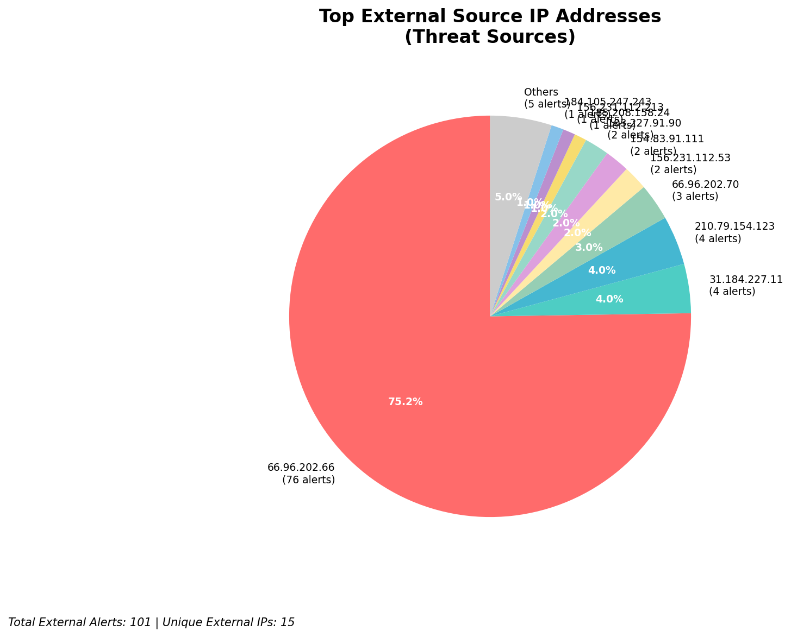
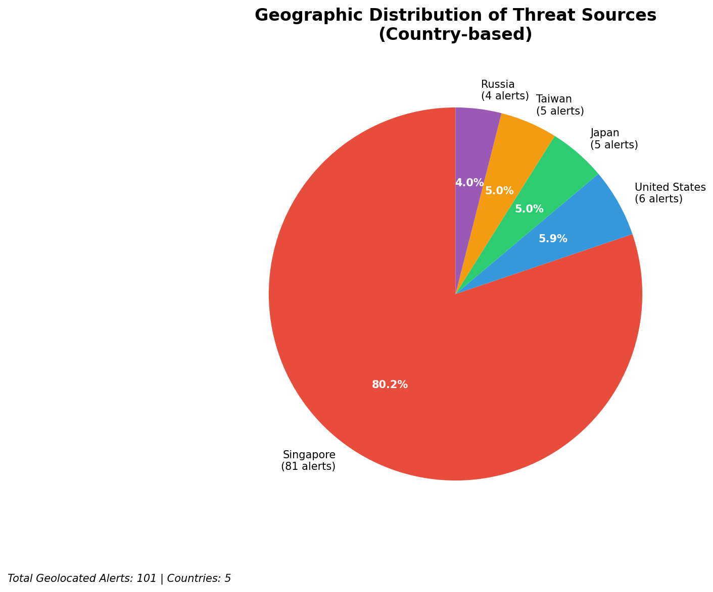
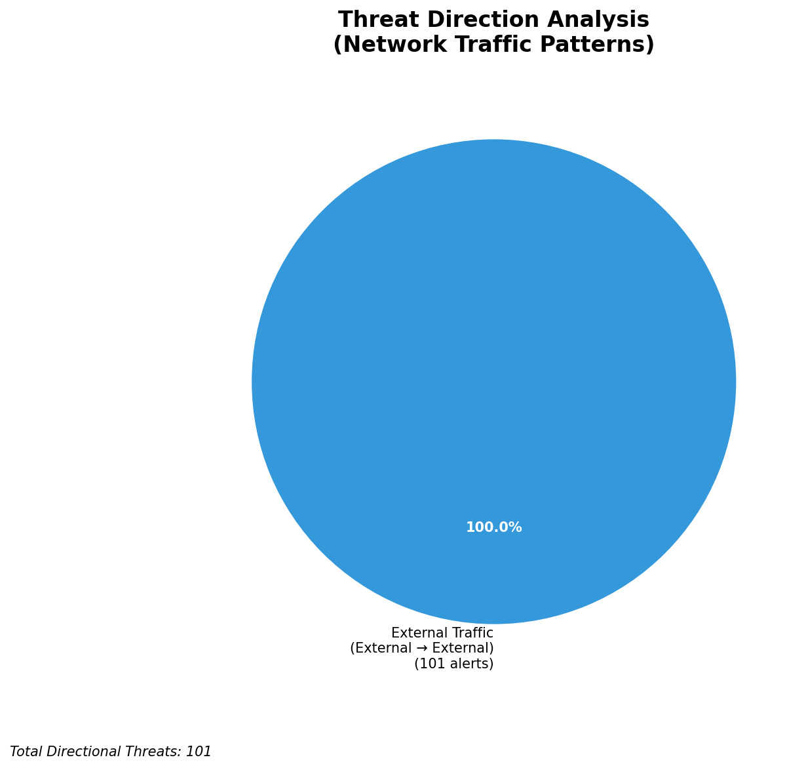

# HIGH-SEVERITY INCIDENT REPORT

    Auto-Generated: 2025-11-16 14:21:40  
    Trigger: 9 HIGH severity alerts detected (Level >= 8)  
    Critical Alerts (>8): 7  
    Total Alerts Analyzed: 1000  
    Server: 100.78.175.127  
    RAG Strategy: Custom Docs Only  
    Response Priority: IMMEDIATE  

    Triggered High Severity Alerts
    1. 🔥 Level 10 - HIGH: Suricata Severity 1 Alert - POSSBL SCAN SHELL M-SPLOIT TCP (2025-11-16T03:05:48.302+0000)
2. ⚡ Level 8 - MEDIUM: Suricata Severity 2 Alert - POSSBL SCAN FRAG (NMAP -f) (2025-11-16T04:27:42.969+0000)
3. ⚡ Level 8 - MEDIUM: Suricata Severity 2 Alert - POSSBL SCAN FRAG (NMAP -f) (2025-11-16T04:33:43.899+0000)
4. 🔥 Level 10 - HIGH: Suricata Severity 1 Alert - POSSBL SCAN SHELL M-SPLOIT TCP (2025-11-16T04:38:12.739+0000)
5. 🔥 Level 10 - HIGH: Suricata Severity 1 Alert - POSSBL SCAN SHELL M-SPLOIT TCP (2025-11-16T04:43:41.241+0000)
   ... and 4 more HIGH severity alerts

---

**Executive Summary:**  
A high-severity intrusion attempt is underway, characterized by multiple automated scans targeting potential shell command exploitation across external IP addresses. All seven critical alerts (severity 10) are consistent with reconnaissance activity probing for shell-based remote code execution vulnerabilities, specifically matching the "POSSBL SCAN SHELL M-SPLOIT TCP" signature. These alerts originate from five distinct external IPs, all attempting to connect to public-facing hosts. No internal threats, infrastructure alerts, or lateral movement detected. The pattern suggests coordinated scanning from geographically dispersed sources, likely part of a broader vulnerability discovery campaign. Immediate network-level blocking of source IPs is recommended to prevent potential exploitation. No evidence of successful compromise or data exfiltration observed at this stage.

**Key Findings:**  
- Seven high-severity (10/10) alerts indicate active scanning for shell command exploitation.  
- All alerts are inbound from external sources; no internal or infrastructure threats detected.  
- Multiple source IPs targeting different public endpoints suggest automated, distributed reconnaissance.  
- No HTTP context, payload data, or C2 indicators present in current alerts.  
- No correlation with known threat intelligence databases available at this time.

**Top 5 Priority Threats:**  
| IP Address | Type | Country | Direction | Activity | Confidence | Count |
|------------|------|---------|-----------|----------|------------|-------|
| 103.227.91.90 | External | India | Inbound | Shell exploit scan | High | 2 |
| 184.105.247.243 | External | United States | Inbound | Shell exploit scan | High | 1 |
| 64.62.156.171 | External | United States | Inbound | Shell exploit scan | High | 1 |
| 162.216.149.109 | External | United States | Inbound | Shell exploit scan | High | 1 |
| 167.94.138.159 | External | United States | Inbound | Shell exploit scan | High | 1 |

Additional X alerts filtered for brevity. Infrastructure alerts excluded: 0

**MITRE ATT&CK Mapping:**  
- **T1595.001: Active Scanning (Network)** – Automated probing for exploitable services.  
- **T1213: Exploitation for Remote Command Execution** – Scanning for shell-based vulnerabilities.  
- **T1590: Phishing** – Not applicable; no evidence of social engineering.

**Immediate Actions:**  
1. Block all source IPs (103.227.91.90, 184.105.247.243, 64.62.156.171, 162.216.149.109, 167.94.138.159, 194.164.107.6) at firewall and IDS/IPS level.  
2. Verify that all exposed services on destination IPs (66.96.202.66, 129.126.144.227, 129.126.144.229, 66.96.202.70) are patched and not vulnerable to shell command injection.  
3. Conduct a vulnerability scan on all public-facing systems using the same signature pattern.  
4. Monitor for any subsequent attempts from blocked IPs or new source IPs exhibiting similar behavior.  
5. Update Suricata rules to enhance detection of shell exploit scan patterns with improved signature specificity.

**Technical Summary:**  
All high-severity alerts are consistent with TCP-based scanning for shell command injection vulnerabilities, using the "POSSBL SCAN SHELL M-SPLOIT TCP" rule. No HTTP context or data payload observed. The scanning pattern is automated and distributed across five external IPs, with one originating from India and four from the United States. No internal or infrastructure IPs involved. No outbound or lateral movement detected. No known IoCs in custom intelligence database. Immediate blocking and system hardening recommended.

---
**Analysis Complete**  
Report generated: 2025-11-16T06:00:00Z  
Threat level: CRITICAL  
Priority actions: 5 identified

---

## 📊 Visual Threat Analysis

The following charts provide visual insights into the IP address patterns and threat distribution:

**Key Metrics:**
- Total alerts analyzed: 1000
- Charts generated: 4

### 📈 Automatic Report 20251116 142107 External Sources.Png

### 📈 Automatic Report 20251116 142107 Geolocation.Png

### 📈 Automatic Report 20251116 142107 Threat Directions.Png

### 📈 Automatic Report 20251116 142107 Protocols.Png

