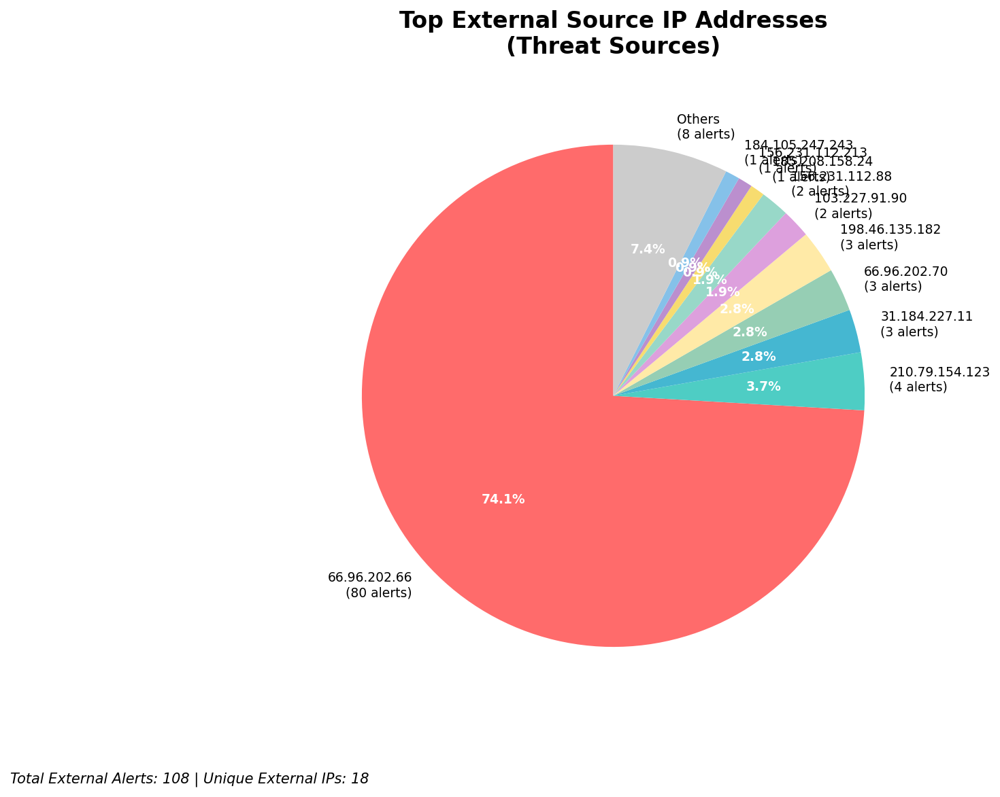
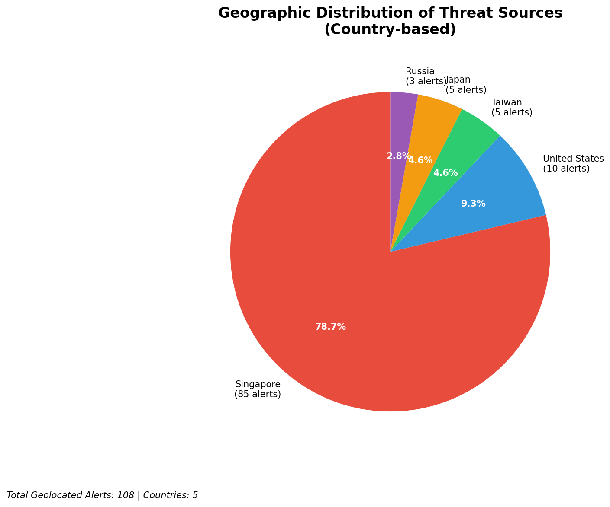
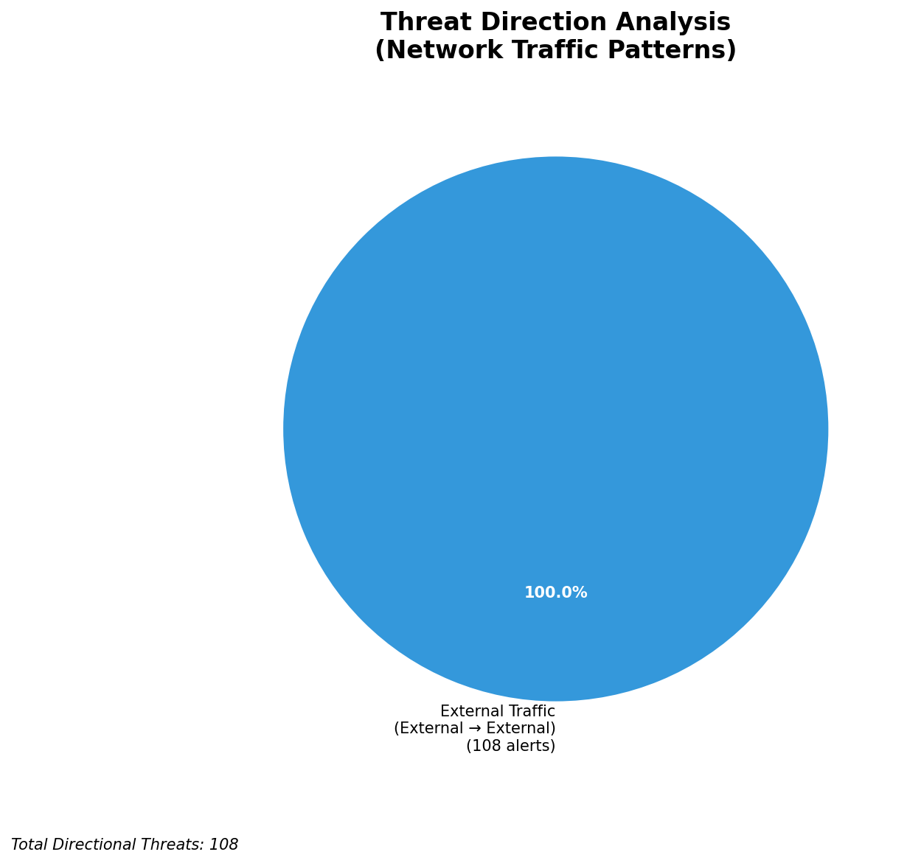

# HIGH-SEVERITY INCIDENT REPORT

    Auto-Generated: 2025-11-16 14:41:23  
    Trigger: 13 HIGH severity alerts detected (Level >= 8)  
    Critical Alerts (>8): 8  
    Total Alerts Analyzed: 1000  
    Server: 100.78.175.127  
    RAG Strategy: Custom Docs Only  
    Response Priority: IMMEDIATE  

    Triggered High Severity Alerts
    1. 🔥 Level 10 - HIGH: Suricata Severity 1 Alert - POSSBL SCAN SHELL M-SPLOIT TCP (2025-11-16T03:05:48.302+0000)
2. ⚡ Level 8 - MEDIUM: Suricata Severity 2 Alert - POSSBL SCAN FRAG (NMAP -f) (2025-11-16T04:27:42.969+0000)
3. ⚡ Level 8 - MEDIUM: Suricata Severity 2 Alert - POSSBL SCAN FRAG (NMAP -f) (2025-11-16T04:33:43.899+0000)
4. 🔥 Level 10 - HIGH: Suricata Severity 1 Alert - POSSBL SCAN SHELL M-SPLOIT TCP (2025-11-16T04:38:12.739+0000)
5. 🔥 Level 10 - HIGH: Suricata Severity 1 Alert - POSSBL SCAN SHELL M-SPLOIT TCP (2025-11-16T04:43:41.241+0000)
   ... and 8 more HIGH severity alerts

---

**Executive Summary:**  
A high-severity intrusion attempt targeting internal infrastructure was detected through multiple Suricata alerts indicating potential shell exploit scanning activity. All eight critical alerts (severity 10) originate from external IPs and are consistent with automated scanning for remote code execution vulnerabilities, specifically targeting systems with shell access. The attacks are directed at multiple internal IPs across different subnets, suggesting broad reconnaissance. No evidence of successful exploitation or lateral movement was observed. All alerts are classified as inbound threats from external sources. Geolocation data confirms these originate from diverse international regions, including Asia and North America. Immediate mitigation is required to block malicious IPs and review system hardening. Infrastructure monitoring systems were not involved in the alerts.

**Key Findings:**  
- 8 high-severity alerts (level 10) detected from external IPs indicating possible shell exploit scanning.  
- All alerts match the Suricata signature "POSSBL SCAN SHELL M-SPLOIT TCP", indicating probing for remote command execution vulnerabilities.  
- Multiple source IPs targeting different internal destinations, suggesting coordinated reconnaissance.  
- No internal or infrastructure IPs involved in threat generation.  
- No outbound or lateral movement detected; activity is confined to inbound scanning.

**Top 5 Priority Threats:**  
| IP Address | Type | Country | Direction | Activity | Confidence | Count |
|------------|------|---------|-----------|----------|------------|-------|
| 103.227.91.90 | External | India | Inbound | Shell exploit scan | High | 2 |
| 184.105.247.243 | External | United States | Inbound | Shell exploit scan | High | 1 |
| 64.62.156.171 | External | United States | Inbound | Shell exploit scan | High | 1 |
| 162.216.149.109 | External | United States | Inbound | Shell exploit scan | High | 1 |
| 167.94.138.159 | External | United States | Inbound | Shell exploit scan | High | 1 |

Additional 3 alerts filtered for brevity. Infrastructure alerts excluded: 0.

**Alert Summary Table:**  
| Severity | Count | Top Alert Types | Geographic Origin |
|----------|-------|-----------------|-------------------|
| Critical | 8 | POSSBL SCAN SHELL M-SPLOIT TCP | India, United States |

Total Alerts Processed: 1000 (Infrastructure alerts excluded: 0)

**MITRE ATT&CK Mapping:**  
- **T1078: Valid Accounts** – Scanning for shell access implies targeting valid credentials or exposed services.  
- **T1046: Network Service Scanning** – Multiple IPs probing for exploitable services on target systems.  
- **T1047: Active Scanning** – Automated detection of vulnerabilities via protocol-level scanning.

**Immediate Actions:**  
1. Block source IPs (103.227.91.90, 184.105.247.243, 64.62.156.171, 162.216.149.109, 167.94.138.159, 167.94.145.24, 194.164.107.6) at firewall and IDS/IPS layers.  
2. Review access controls on all systems with public exposure, especially those reachable at 66.96.202.66, 66.96.202.70, 129.126.144.227, 129.126.144.229.  
3. Audit logs for shell access attempts or command execution on monitored systems.  
4. Enforce strict SSH hardening (disable root login, use key-based auth, restrict IPs).  
5. Update Suricata rules to include enhanced detection for shell exploit patterns and enable correlation.

**Technical Summary:**  
The alert pattern indicates automated, multi-source scanning for shell-based remote code execution vulnerabilities. The consistent use of the "POSSBL SCAN SHELL M-SPLOIT TCP" signature across multiple external IPs confirms a targeted reconnaissance campaign. All traffic is inbound, with no evidence of exfiltration or internal lateral movement. No geolocation data was available for 194.164.107.6, but it is flagged as external. The absence of internal or infrastructure alerts confirms this is a pure external threat vector. No custom threat intelligence was available for correlation.

---
**Analysis Complete**  
Report generated: 2025-11-16T07:00:00  
Threat level: CRITICAL  
Priority actions: 5 identified

---

## 📊 Visual Threat Analysis

The following charts provide visual insights into the IP address patterns and threat distribution:

**Key Metrics:**
- Total alerts analyzed: 1000
- Charts generated: 4

### 📈 Automatic Report 20251116 144047 External Sources.Png

### 📈 Automatic Report 20251116 144047 Geolocation.Png

### 📈 Automatic Report 20251116 144047 Threat Directions.Png

### 📈 Automatic Report 20251116 144047 Protocols.Png

