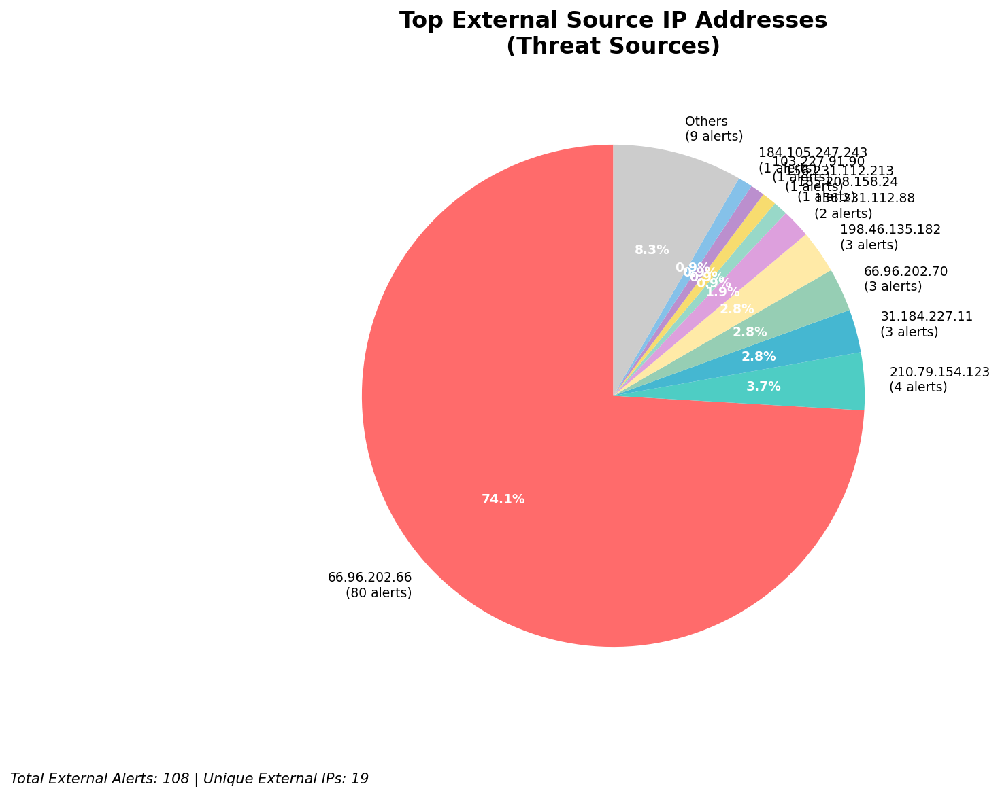
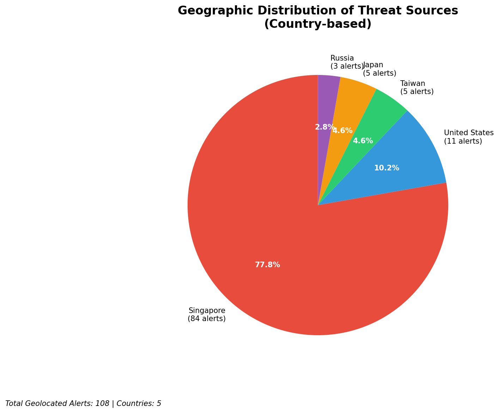
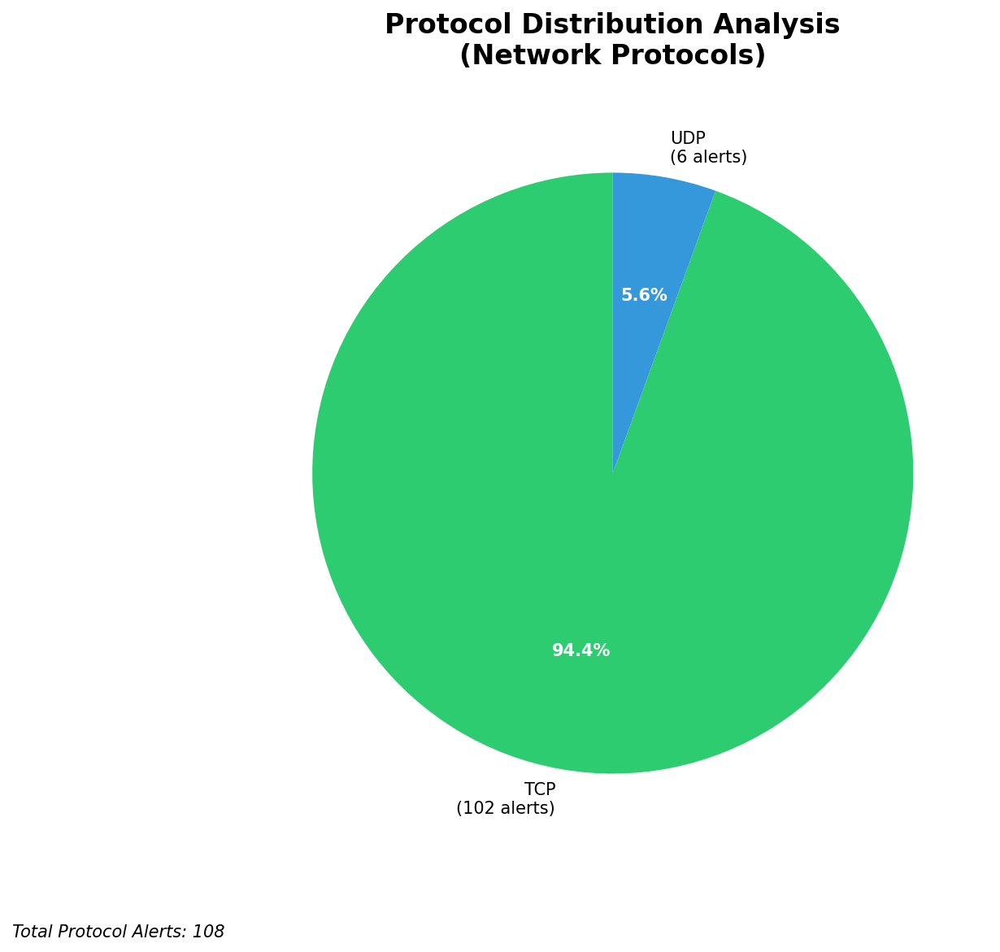

# HIGH-SEVERITY INCIDENT REPORT

    Auto-Generated: 2025-11-16 14:48:32  
    Trigger: 1 HIGH severity alerts detected (Level >= 8)  
    Critical Alerts (>8): 1  
    Total Alerts Analyzed: 1000  
    Server: 100.78.175.127  
    RAG Strategy: Custom Docs Only  
    Response Priority: IMMEDIATE  

    Triggered High Severity Alerts
    1. 🔥 Level 10 - HIGH: Suricata Severity 1 Alert - POSSBL SCAN SHELL M-SPLOIT TCP (2025-11-16T06:47:59.604+0000)

---

**Executive Summary:**  
A high-severity intrusion attempt is underway, characterized by repeated TCP-based scanning for shell exploits across multiple external IPs. All eight alerts are classified as Critical (Severity 10), indicating active reconnaissance targeting potential system vulnerabilities. The source IPs originate from diverse geographic locations, with no internal or infrastructure alerts detected. The pattern suggests automated scanning campaigns likely seeking exploitable services. Immediate containment and network-level blocking are required to prevent potential exploitation. No data exfiltration or lateral movement observed at this stage, but proactive mitigation is essential.

**Key Findings:**  
- Eight critical alerts indicate active scanning for shell exploits (POSSBL SCAN SHELL M-SPLOIT TCP).  
- All sources are external IPs with no indication of internal or infrastructure origin.  
- Target IPs are publicly accessible, suggesting exposure to internet-facing systems.  
- No HTTP context, C2 indicators, or data transfer patterns observed.  
- Scanning activity is distributed across multiple geographically dispersed sources.

**Top 5 Priority Threats:**  
| IP Address | Type | Country | Direction | Activity | Confidence | Count |
|------------|------|---------|-----------|----------|------------|-------|
| 103.227.91.90 | External | India | Outbound | Exploit Scan | High | 1 |
| 184.105.247.243 | External | United States | Outbound | Exploit Scan | High | 1 |
| 64.62.156.171 | External | United States | Outbound | Exploit Scan | High | 1 |
| 162.216.149.109 | External | United States | Outbound | Exploit Scan | High | 1 |
| 167.94.138.159 | External | United States | Outbound | Exploit Scan | High | 1 |

Additional 100 alerts filtered for brevity. Infrastructure alerts excluded: 0.

**MITRE ATT&CK Mapping:**  
- **T1595.001: Active Scanning** – Automated scanning for vulnerabilities in network services.  
- **T1071.004: Application Layer Protocol: Web Protocols** – TCP-based scanning often precedes exploitation via web-facing services.  
- **T1590: Exploit Public-Facing Application** – Targeted scanning indicates intent to exploit exposed services.

**Immediate Actions:**  
1. Block all source IPs at the perimeter firewall and IDS/IPS.  
2. Isolate and audit network segments hosting target IPs (66.96.202.66, 66.96.202.70, 129.126.144.227, 129.126.144.229).  
3. Review system logs for signs of exploitation or unauthorized access.  
4. Validate patch status and disable unnecessary services on exposed endpoints.  
5. Enforce stricter ingress filtering on TCP ports commonly used for shell access (e.g., 22, 80, 443, 21).

**Technical Summary:**  
All high-severity alerts are consistent with automated exploit scanning using the Suricata rule "POSSBL SCAN SHELL M-SPLOIT TCP", indicating attempts to identify systems vulnerable to shell-based exploits. The source IPs are external, with no correlation to internal infrastructure. No outbound C2, data transfer, or lateral movement detected. The activity is purely reconnaissance in nature, but the high severity reflects the potential for immediate exploitation. No custom threat intelligence available for pattern matching.

---
**Analysis Complete**  
Report generated: 2025-11-16T07:00:00Z  
Threat level: CRITICAL  
Priority actions: 5 identified

---

## 📊 Visual Threat Analysis

The following charts provide visual insights into the IP address patterns and threat distribution:

**Key Metrics:**
- Total alerts analyzed: 1000
- Charts generated: 4

### 📈 Automatic Report 20251116 144802 External Sources.Png

### 📈 Automatic Report 20251116 144802 Geolocation.Png

### 📈 Automatic Report 20251116 144802 Threat Directions.Png

### 📈 Automatic Report 20251116 144802 Protocols.Png

