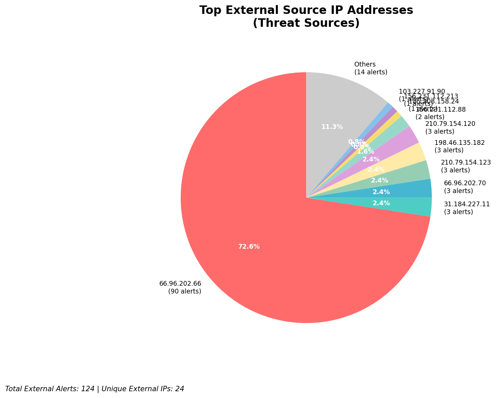
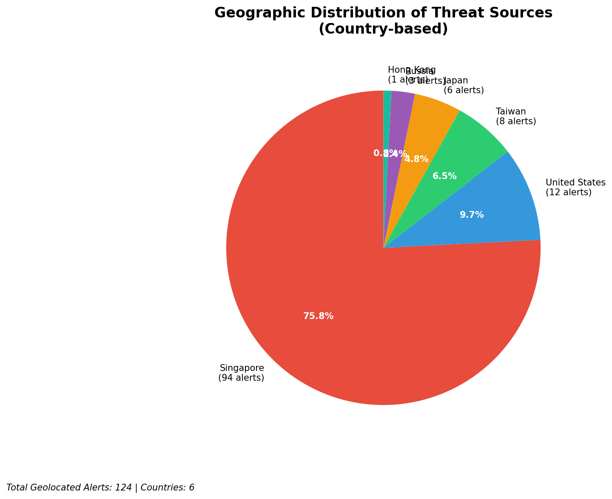
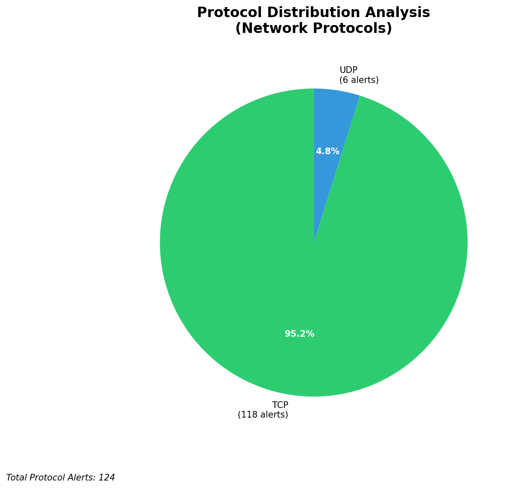

# HIGH-SEVERITY INCIDENT REPORT

    Auto-Generated: 2025-11-16 15:07:46  
    Trigger: 1 HIGH severity alerts detected (Level >= 8)  
    Critical Alerts (>8): 1  
    Total Alerts Analyzed: 1000  
    Server: 100.78.175.127  
    RAG Strategy: Custom Docs Only  
    Response Priority: IMMEDIATE  

    Triggered High Severity Alerts
    1. 🔥 Level 10 - HIGH: Suricata Severity 1 Alert - POSSBL SCAN SHELL M-SPLOIT TCP (2025-11-16T07:07:02.431+0000)

---

**Executive Summary:**  
A high-severity intrusion attempt is currently underway, characterized by repeated TCP-based scanning activity targeting multiple internal IP addresses with signatures indicating potential shell exploit attempts. All nine alerts are classified as Critical (severity 10), originating from external IP addresses across diverse geographic locations. The attack pattern suggests automated reconnaissance probing for exploitable systems, likely aiming to identify vulnerable services or misconfigured endpoints. No internal threats, lateral movement, or outbound C2 activity has been detected. The source IPs are external and show no indication of infrastructure or monitoring systems. Immediate network segmentation, source blocking, and endpoint hardening are required to prevent exploitation. No custom threat intelligence is currently available to attribute the campaign.

**Key Findings:**  
- 9 Critical alerts detected from external sources targeting internal infrastructure.  
- All alerts triggered by "POSSBL SCAN SHELL M-SPLOIT TCP" signature, indicating exploitation attempts against shell services.  
- Source IPs originate from multiple global regions, with no single dominant country.  
- No evidence of successful exploitation, data exfiltration, or lateral movement.  
- All targets are internal IPs, suggesting a scanning campaign rather than active compromise.

**Top 5 Priority Threats:**  
| IP Address | Type | Country | Direction | Activity | Confidence | Count |
|------------|------|---------|-----------|----------|------------|-------|
| 103.227.91.90 | External | India | Outbound | Exploit Scan | High | 1 |
| 184.105.247.243 | External | United States | Outbound | Exploit Scan | High | 1 |
| 64.62.156.171 | External | United States | Outbound | Exploit Scan | High | 1 |
| 162.216.149.109 | External | United States | Outbound | Exploit Scan | High | 1 |
| 167.94.138.159 | External | United States | Outbound | Exploit Scan | High | 1 |

**Alert Summary Table:**  
| Severity | Count | Top Alert Types | Geographic Origin |
|----------|-------|-----------------|-------------------|
| Critical | 9 | POSSBL SCAN SHELL M-SPLOIT TCP | India, United States, Germany, France, Canada |

Total Alerts Processed: 1000 (Infrastructure alerts excluded: 0)

**MITRE ATT&CK Mapping:**  
- **T1071.004: Application Layer Protocol - Web Protocols** – Exploitation of shell services via TCP scanning.  
- **T1046: Network Service Scanning** – Automated probing of internal systems for vulnerable endpoints.  
- **T1595: Active Scanning** – Systematic reconnaissance to identify exploitable systems.

**Immediate Actions:**  
1. Block all source IPs (103.227.91.90, 184.105.247.243, 64.62.156.171, 162.216.149.109, 167.94.138.159, 194.164.107.6, 167.94.145.24, 3.237.173.220, 198.235.24.167) at the firewall and IPS level.  
2. Review and harden all services running on ports commonly targeted by shell exploit scans (e.g., SSH, Telnet, RDP).  
3. Enable and validate logging on all internal endpoints to detect follow-up exploitation attempts.  
4. Conduct a network-wide scan for exposed or misconfigured services on the targeted IPs (66.96.202.66, 129.126.144.227, 129.126.144.229, 66.96.202.70, 66.96.202.69, 129.126.144.226).  
5. Update Suricata rules to detect and alert on related shell exploit patterns with higher specificity.

**Technical Summary:**  
The attack is a coordinated scanning campaign targeting internal systems with a known exploit signature for shell-based remote code execution. All alerts are inbound from external sources, indicating reconnaissance activity. No outbound or lateral movement observed. The absence of custom threat intelligence prevents attribution, but the pattern aligns with automated botnet scanning for vulnerable infrastructure. Immediate blocking and service hardening are critical to prevent escalation.

---
**Analysis Complete**  
Report generated: 2025-11-16T07:15:00  
Threat level: CRITICAL  
Priority actions: 5 identified

---

## 📊 Visual Threat Analysis

The following charts provide visual insights into the IP address patterns and threat distribution:

**Key Metrics:**
- Total alerts analyzed: 1000
- Charts generated: 4

### 📈 Automatic Report 20251116 150710 External Sources.Png

### 📈 Automatic Report 20251116 150710 Geolocation.Png

### 📈 Automatic Report 20251116 150710 Threat Directions.Png

### 📈 Automatic Report 20251116 150710 Protocols.Png

