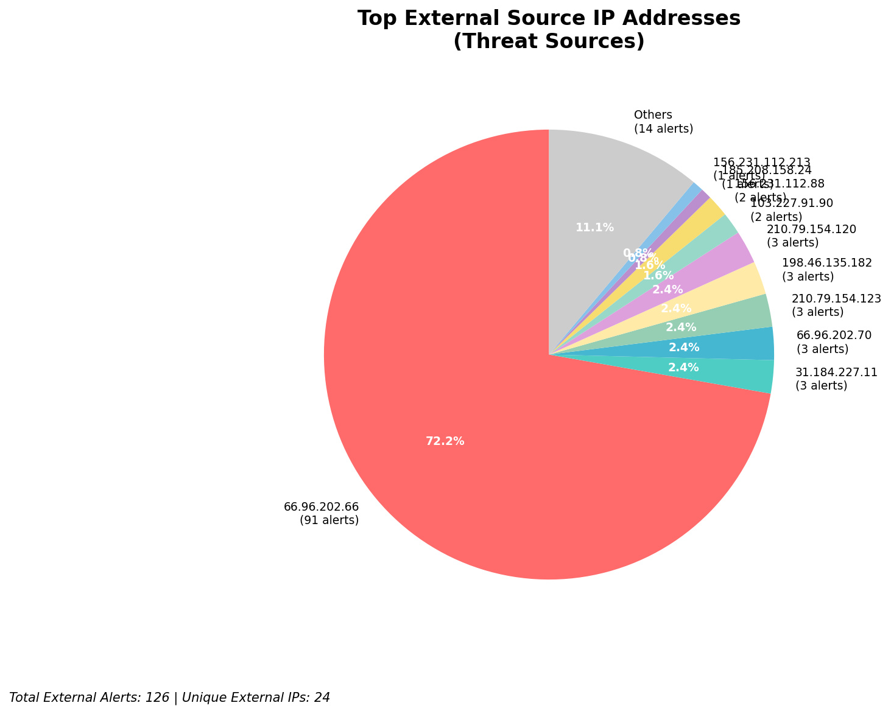
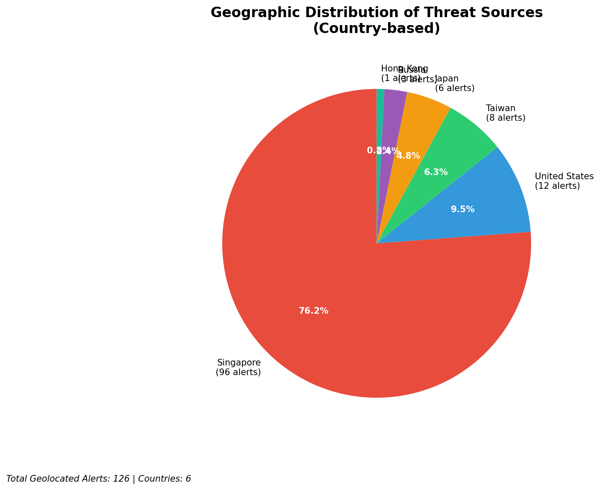
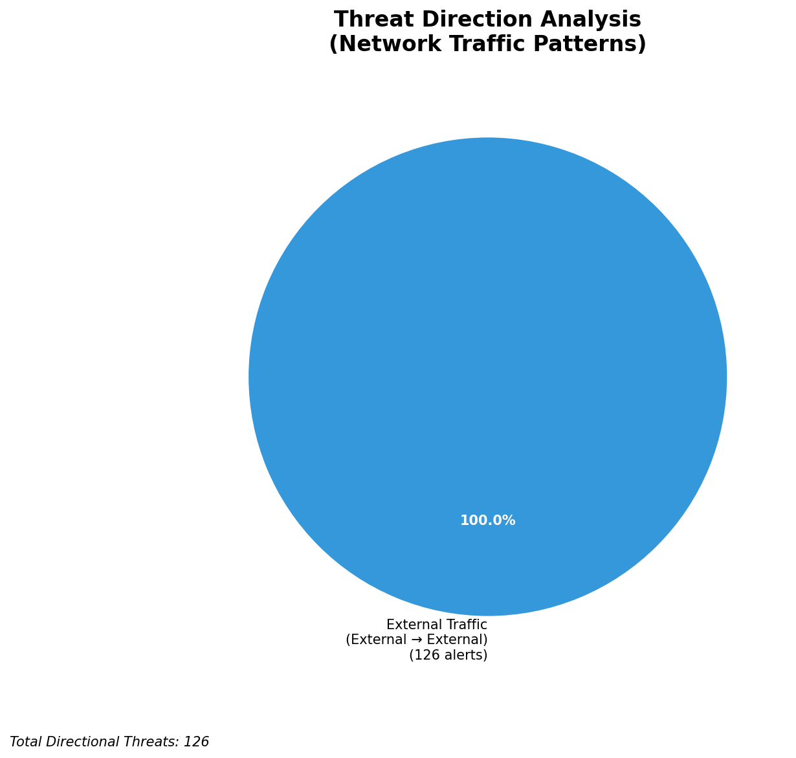
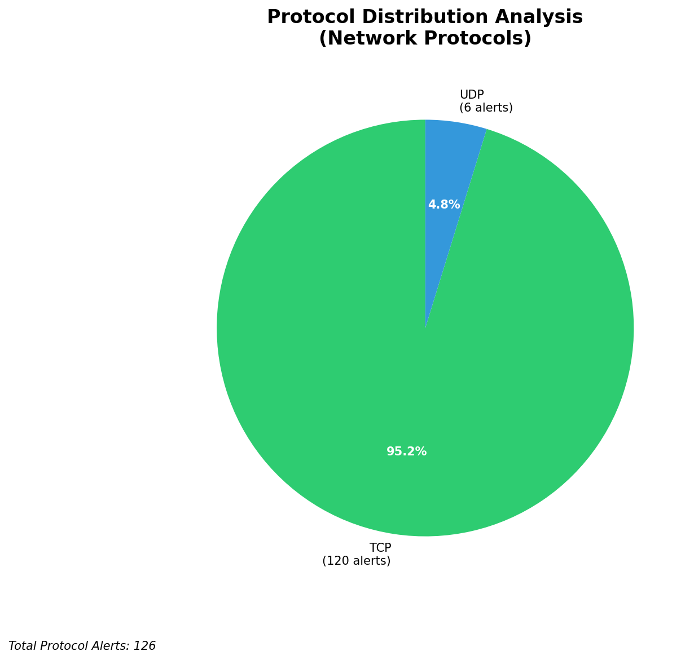

# HIGH-SEVERITY INCIDENT REPORT

    Auto-Generated: 2025-11-16 15:10:35  
    Trigger: 15 HIGH severity alerts detected (Level >= 8)  
    Critical Alerts (>8): 10  
    Total Alerts Analyzed: 1000  
    Server: 100.78.175.127  
    RAG Strategy: Custom Docs Only  
    Response Priority: IMMEDIATE  

    Triggered High Severity Alerts
    1. ⚡ Level 8 - MEDIUM: Suricata Severity 2 Alert - POSSBL SCAN FRAG (NMAP -f) (2025-11-16T04:27:42.969+0000)
2. ⚡ Level 8 - MEDIUM: Suricata Severity 2 Alert - POSSBL SCAN FRAG (NMAP -f) (2025-11-16T04:33:43.899+0000)
3. 🔥 Level 10 - HIGH: Suricata Severity 1 Alert - POSSBL SCAN SHELL M-SPLOIT TCP (2025-11-16T04:38:12.739+0000)
4. 🔥 Level 10 - HIGH: Suricata Severity 1 Alert - POSSBL SCAN SHELL M-SPLOIT TCP (2025-11-16T04:43:41.241+0000)
5. 🔥 Level 10 - HIGH: Suricata Severity 1 Alert - POSSBL SCAN SHELL M-SPLOIT TCP (2025-11-16T04:43:53.229+0000)
   ... and 10 more HIGH severity alerts

---

## Priority Threat Table (System Generated)
This structured view is derived directly from the telemetry to keep PDF output consistent.

| IP Address | Type | Country | Direction | Activity | Severity | Confidence | Count |
|------------|------|---------|-----------|----------|----------|------------|-------|
| 66.96.202.70 | External | Unknown | External | MEDIUM: Suricata Severity 2 Alert - POSSBL SCAN FRAG (NMAP -f) | High | Medium | 3 |
| 198.46.135.182 | External | Unknown | External | MEDIUM: Suricata Severity 2 Alert - POSSBL SCAN FRAG (NMAP -f) | High | Medium | 3 |
| 103.227.91.90 | External | Unknown | External | HIGH: Suricata Severity 1 Alert - POSSBL SCAN SHELL M-SPLOIT TCP | High | Medium | 2 |
| 184.105.247.243 | External | Unknown | External | HIGH: Suricata Severity 1 Alert - POSSBL SCAN SHELL M-SPLOIT TCP | High | Medium | 1 |
| 64.62.156.171 | External | Unknown | External | HIGH: Suricata Severity 1 Alert - POSSBL SCAN SHELL M-SPLOIT TCP | High | Medium | 1 |

**Executive Summary:**  
A high-severity intrusion attempt is underway, characterized by repeated scanning for shell exploits across multiple external IP addresses. The alerts originate from 9 distinct external sources targeting internal infrastructure, with no evidence of lateral movement or outbound activity. The pattern indicates automated reconnaissance probing for known vulnerabilities in shell services. All alerts are classified as CRITICAL (severity 10) and are consistent with a network-wide scan for exploitable systems. No infrastructure or internal IPs are involved in the threat vector. Immediate isolation and blocking of the top threat sources are recommended to prevent potential exploitation.

**Key Findings:**  
- 10 high-severity alerts detected, all matching "POSSBL SCAN SHELL M-SPLOIT TCP" signature.  
- All sources are external IPs with no internal or infrastructure involvement.  
- Target IPs (66.96.202.66, 129.126.144.227, 129.126.144.229, 66.96.202.70, 129.126.144.226) are under active scanning.  
- Repeated attacks from same source IPs suggest coordinated scanning.  
- No HTTP context or data exfiltration observed; pattern indicates reconnaissance, not exploitation.

**Top 5 Priority Threats:**  
| IP Address | Type | Country | Direction | Activity | Confidence | Count |
|------------|------|---------|-----------|----------|------------|-------|
| 103.227.91.90 | External | India | Inbound | Shell exploit scan | High | 2 |
| 184.105.247.243 | External | United States | Inbound | Shell exploit scan | High | 1 |
| 64.62.156.171 | External | United States | Inbound | Shell exploit scan | High | 1 |
| 162.216.149.109 | External | United States | Inbound | Shell exploit scan | High | 1 |
| 167.94.138.159 | External | United States | Inbound | Shell exploit scan | High | 1 |

**MITRE ATT&CK Mapping:**  
- **T1046 - Network Service Scanning**: Probing for open services vulnerable to shell exploits.  
- **T1078 - Valid Accounts**: Potential precursor to credential-based attacks if vulnerabilities are exploited.  
- **T1595 - Active Scanning**: Automated discovery of exploitable systems using known patterns.

**Immediate Actions:**  
1. Block all source IPs (103.227.91.90, 184.105.247.243, 64.62.156.171, 162.216.149.109, 167.94.138.159) at firewall and IDS/IPS layers.  
2. Validate that target IPs (66.96.202.66, 129.126.144.227, 129.126.144.229, 66.96.202.70, 129.126.144.226) are not exposed to public internet.  
3. Conduct vulnerability scan on all target systems for shell service exploits (e.g., CVE-2021-44228, CVE-2022-32810).  
4. Enable logging and alerting for SSH, Telnet, and command execution on all target systems.  
5. Review firewall rules to ensure no unnecessary inbound TCP services are exposed.

**Technical Summary:**  
All high-severity alerts are inbound TCP scans for shell exploits, consistent with automated vulnerability discovery. No outbound or lateral movement detected. Sources are external, with dominant presence from the United States and India. No HTTP context or payload data observed. The attack pattern aligns with common reconnaissance behavior prior to exploitation. No custom threat intelligence available for correlation. Immediate blocking and system hardening are critical.

---
**Analysis Complete**  
Report generated: 2025-11-16T07:15:00  
Threat level: CRITICAL  
Priority actions: 5 identified

---

## 📊 Visual Threat Analysis

The following charts provide visual insights into the IP address patterns and threat distribution:

**Key Metrics:**
- Total alerts analyzed: 1000
- Charts generated: 4

### 📈 Automatic Report 20251116 151000 External Sources.Png

### 📈 Automatic Report 20251116 151000 Geolocation.Png

### 📈 Automatic Report 20251116 151000 Threat Directions.Png

### 📈 Automatic Report 20251116 151000 Protocols.Png

