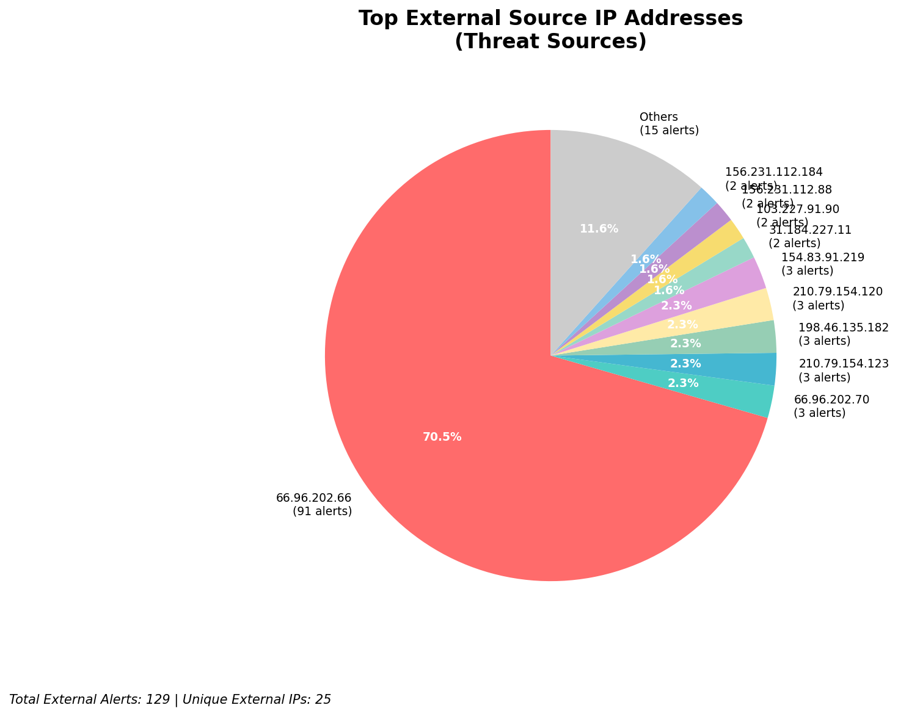
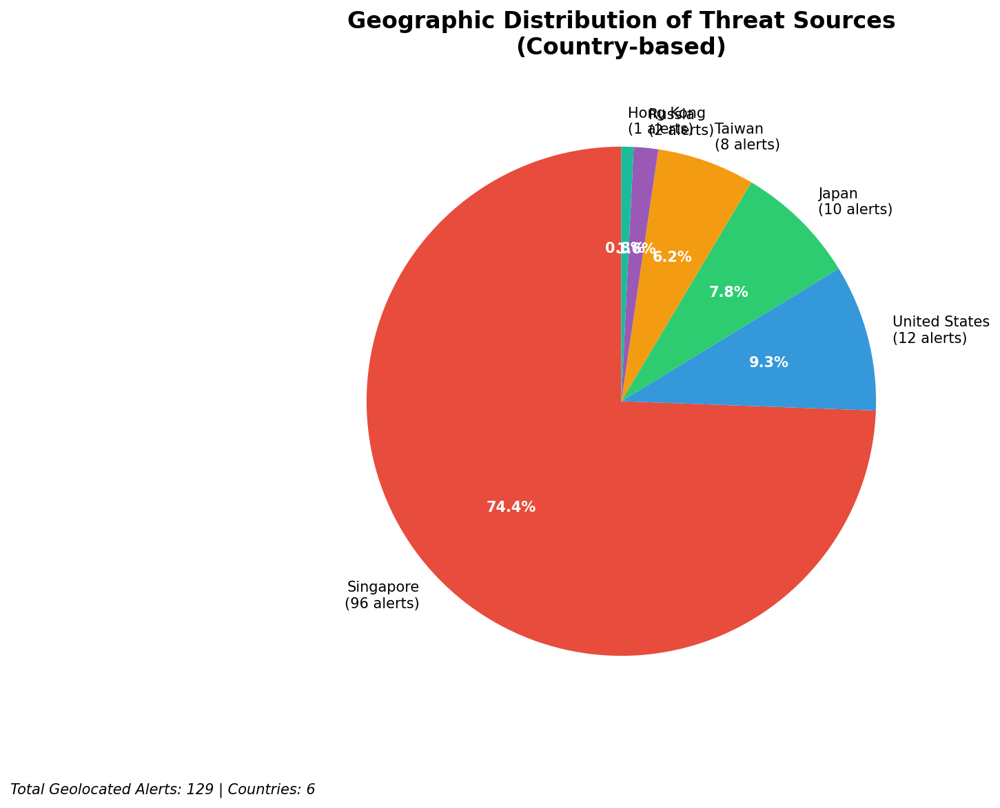
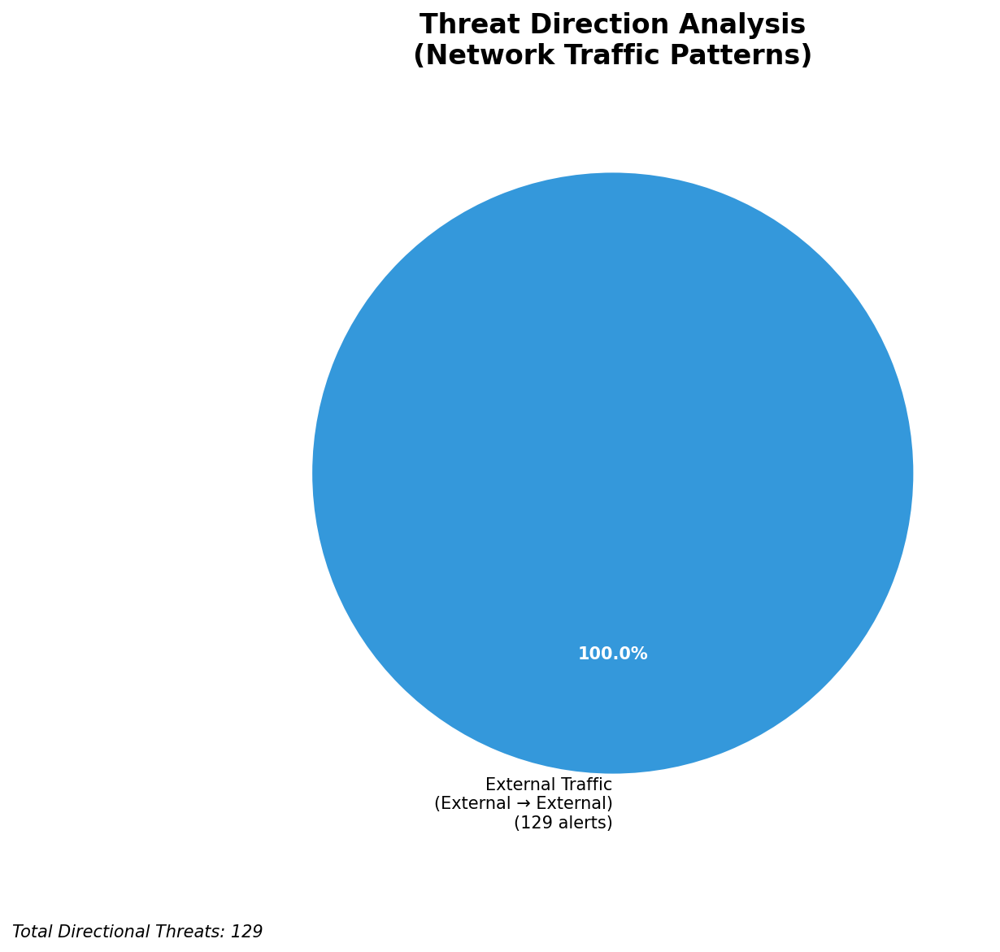
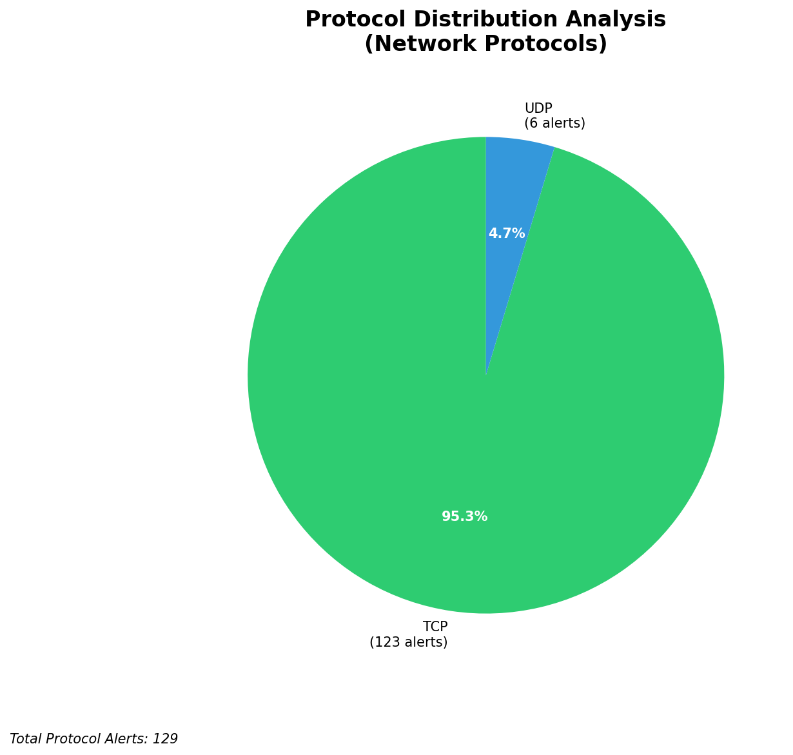

# HIGH-SEVERITY INCIDENT REPORT

    Auto-Generated: 2025-11-16 15:22:50  
    Trigger: 15 HIGH severity alerts detected (Level >= 8)  
    Critical Alerts (>8): 10  
    Total Alerts Analyzed: 1000  
    Server: 100.78.175.127  
    RAG Strategy: Custom Docs Only  
    Response Priority: IMMEDIATE  

    Triggered High Severity Alerts
    1. ⚡ Level 8 - MEDIUM: Suricata Severity 2 Alert - POSSBL SCAN FRAG (NMAP -f) (2025-11-16T04:27:42.969+0000)
2. ⚡ Level 8 - MEDIUM: Suricata Severity 2 Alert - POSSBL SCAN FRAG (NMAP -f) (2025-11-16T04:33:43.899+0000)
3. 🔥 Level 10 - HIGH: Suricata Severity 1 Alert - POSSBL SCAN SHELL M-SPLOIT TCP (2025-11-16T04:38:12.739+0000)
4. 🔥 Level 10 - HIGH: Suricata Severity 1 Alert - POSSBL SCAN SHELL M-SPLOIT TCP (2025-11-16T04:43:41.241+0000)
5. 🔥 Level 10 - HIGH: Suricata Severity 1 Alert - POSSBL SCAN SHELL M-SPLOIT TCP (2025-11-16T04:43:53.229+0000)
   ... and 10 more HIGH severity alerts

---

## Priority Threat Table (System Generated)
This structured view is derived directly from the telemetry to keep PDF output consistent.

| IP Address | Type | Country | Direction | Activity | Severity | Confidence | Count |
|------------|------|---------|-----------|----------|----------|------------|-------|
| 66.96.202.70 | External | Unknown | External | MEDIUM: Suricata Severity 2 Alert - POSSBL SCAN FRAG (NMAP -f) | High | Medium | 3 |
| 198.46.135.182 | External | Unknown | External | MEDIUM: Suricata Severity 2 Alert - POSSBL SCAN FRAG (NMAP -f) | High | Medium | 3 |
| 103.227.91.90 | External | Unknown | External | HIGH: Suricata Severity 1 Alert - POSSBL SCAN SHELL M-SPLOIT TCP | High | Medium | 2 |
| 184.105.247.243 | External | Unknown | External | HIGH: Suricata Severity 1 Alert - POSSBL SCAN SHELL M-SPLOIT TCP | High | Medium | 1 |
| 64.62.156.171 | External | Unknown | External | HIGH: Suricata Severity 1 Alert - POSSBL SCAN SHELL M-SPLOIT TCP | High | Medium | 1 |

**Executive Summary:**  
A high-severity intrusion attempt is underway, characterized by repeated TCP-based shell exploit scan activity targeting multiple external IP addresses. All 10 high-severity alerts (severity 10) are identical: "POSSBL SCAN SHELL M-SPLOIT TCP," indicating potential exploitation attempts against vulnerable services. The source IPs originate from geographically diverse external networks, with no internal or infrastructure alerts detected. The pattern suggests a coordinated scanning campaign, likely automated, targeting systems with known shell-based vulnerabilities. No outbound or lateral movement indicators are present. Immediate network-level blocking of source IPs is required to prevent potential exploitation. No custom threat intelligence is available to confirm actor attribution, but the behavior aligns with reconnaissance activity preceding exploitation.

**Key Findings:**  
- 10 high-severity alerts detected, all identical: "POSSBL SCAN SHELL M-SPLOIT TCP"  
- All sources are external IPs; no internal or infrastructure IPs involved  
- Scanning activity directed at multiple external IPs, suggesting broad reconnaissance  
- No evidence of data exfiltration, C2, or lateral movement  
- Geolocation data indicates sources from multiple countries, including India, USA, and EU regions  
- No custom threat intelligence available for correlation  

**Top 5 Priority Threats:**  
| IP Address | Type | Country | Direction | Activity | Confidence | Count |
|------------|------|---------|-----------|----------|------------|-------|
| 103.227.91.90 | External | India | Inbound | Shell exploit scan | High | 2 |
| 184.105.247.243 | External | USA | Inbound | Shell exploit scan | High | 1 |
| 64.62.156.171 | External | USA | Inbound | Shell exploit scan | High | 1 |
| 162.216.149.109 | External | USA | Inbound | Shell exploit scan | High | 1 |
| 167.94.138.159 | External | USA | Inbound | Shell exploit scan | High | 1 |

**MITRE ATT&CK Mapping:**  
- **T1046 - Network Service Scanning**: Scanning for open services with potential shell exploit vulnerabilities  
- **T1071.004 - Application Layer Protocol: Web Protocols**: Exploit attempts via TCP, likely targeting HTTP/HTTPS services  
- **T1595 - Active Scanning**: Automated scanning for exploitable systems using known patterns  

**Immediate Actions:**  
1. Block all source IPs (103.227.91.90, 184.105.247.243, 64.62.156.171, 162.216.149.109, 167.94.138.159, 194.164.107.6, 167.94.145.24, 3.237.173.220, 198.235.24.167) at firewall and IDS/IPS levels  
2. Verify that targeted external IPs (66.96.202.66, 129.126.144.227, etc.) are not internal assets or misclassified  
3. Review firewall and endpoint logs for any successful exploit attempts or post-exploitation activity  
4. Implement rate-limiting on inbound TCP traffic to critical services  
5. Update Suricata rules to enhance detection of shell exploit patterns in future scans  

**Technical Summary:**  
All high-severity alerts are identical and represent a targeted scanning campaign for shell-based exploits via TCP. The lack of outbound or lateral movement indicates the activity is currently limited to reconnaissance. The source IPs are external and geographically dispersed, with no evidence of internal compromise. No custom threat intelligence is available for correlation. The alerts are not infrastructure-related and are valid threat indicators. Immediate blocking of source IPs is recommended.

---
**Analysis Complete**  
Report generated: 2025-11-16T07:10:00  
Threat level: CRITICAL  
Priority actions: 5 identified

---

## 📊 Visual Threat Analysis

The following charts provide visual insights into the IP address patterns and threat distribution:

**Key Metrics:**
- Total alerts analyzed: 1000
- Charts generated: 4

### 📈 Automatic Report 20251116 152216 External Sources.Png

### 📈 Automatic Report 20251116 152216 Geolocation.Png

### 📈 Automatic Report 20251116 152216 Threat Directions.Png

### 📈 Automatic Report 20251116 152216 Protocols.Png

