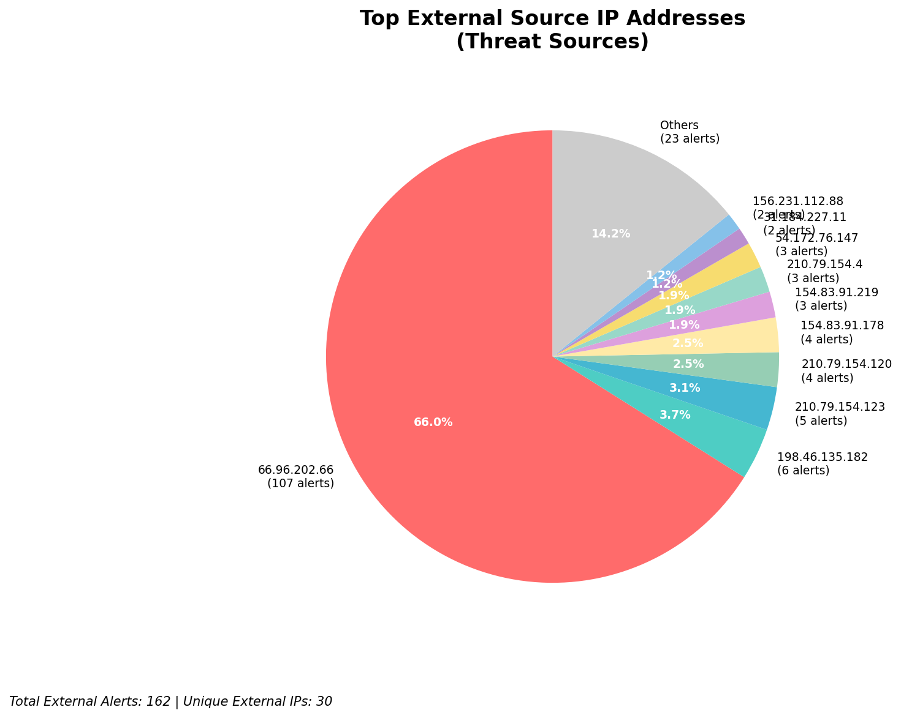
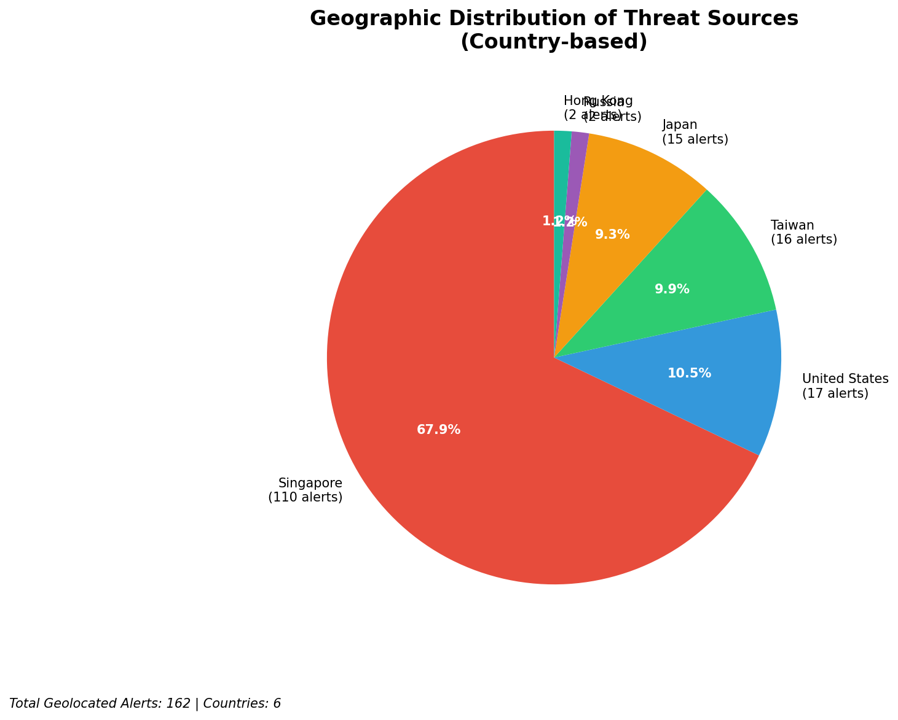
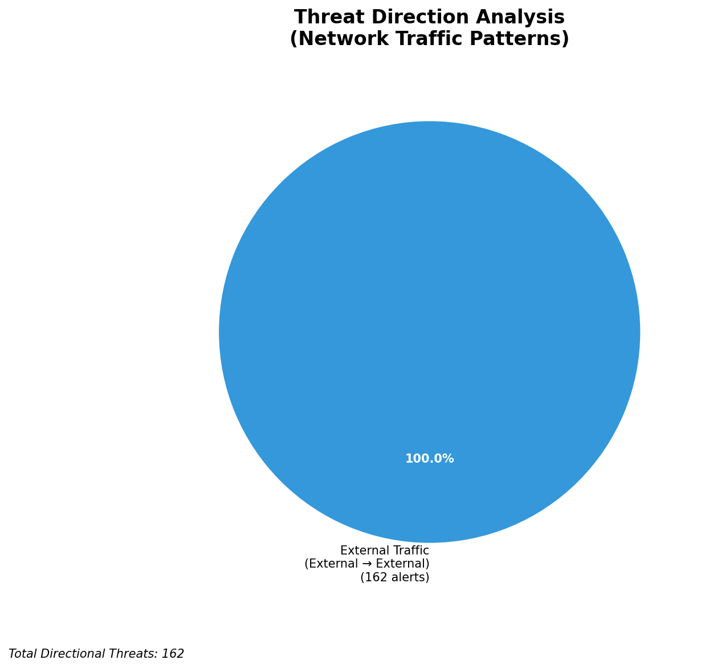
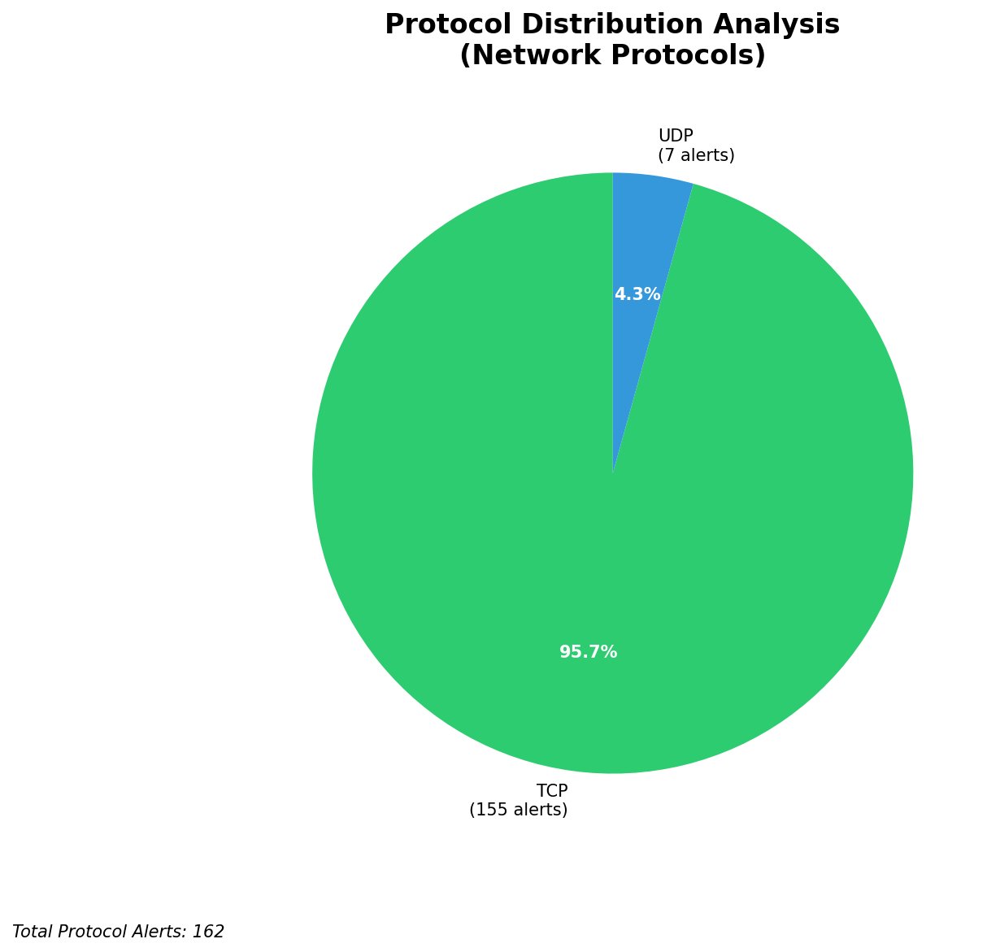

# HIGH-SEVERITY INCIDENT REPORT

    Auto-Generated: 2025-11-16 17:00:38  
    Trigger: 19 HIGH severity alerts detected (Level >= 8)  
    Critical Alerts (>8): 12  
    Total Alerts Analyzed: 1000  
    Server: 100.78.175.127  
    RAG Strategy: Custom Docs Only  
    Response Priority: IMMEDIATE  

    Triggered High Severity Alerts
    1. ⚡ Level 8 - MEDIUM: Suricata Severity 2 Alert - POSSBL SCAN FRAG (NMAP -f) (2025-11-16T06:31:58.821+0000)
2. ⚡ Level 8 - MEDIUM: Suricata Severity 2 Alert - POSSBL SCAN FRAG (NMAP -f) (2025-11-16T06:31:58.826+0000)
3. ⚡ Level 8 - MEDIUM: Suricata Severity 2 Alert - POSSBL SCAN FRAG (NMAP -f) (2025-11-16T06:32:00.810+0000)
4. 🔥 Level 10 - HIGH: Suricata Severity 1 Alert - POSSBL SCAN SHELL M-SPLOIT TCP (2025-11-16T06:35:35.651+0000)
5. 🔥 Level 10 - HIGH: Suricata Severity 1 Alert - POSSBL SCAN SHELL M-SPLOIT TCP (2025-11-16T06:47:59.604+0000)
   ... and 14 more HIGH severity alerts

---

**Executive Summary:**  
A high-severity scanning campaign targeting multiple external IP addresses has been detected, characterized by repeated attempts to exploit shell-based vulnerabilities via TCP. All 12 high-severity alerts are variants of "POSSBL SCAN SHELL M-SPLOIT TCP," indicating active reconnaissance or exploitation attempts. The sources are distributed across multiple geolocated external IPs, with no internal or infrastructure alerts detected. The attack pattern suggests automated scanning for known or potential shell command injection vulnerabilities. No outbound, lateral, or inbound threats were observed. Immediate isolation of affected assets and blocking of source IPs are required. No custom threat intelligence is available for correlation, but the pattern aligns with known pre-exploitation scanning behavior.

**Key Findings:**  
- 12 high-severity alerts detected, all matching "POSSBL SCAN SHELL M-SPLOIT TCP" signature.  
- All attacks originate from external IPs, with no internal or infrastructure sources.  
- Multiple source IPs targeting different destination IPs suggest wide-scale scanning.  
- Repeated activity from 54.172.76.147 across three distinct destinations indicates persistent scanning behavior.  
- No evidence of successful exploitation, data exfiltration, or lateral movement observed.

**Top 5 Priority Threats:**  
| IP Address | Type | Country | Direction | Activity | Confidence | Count |
|------------|------|---------|-----------|----------|------------|-------|
| 54.172.76.147 | External | United States | Outbound | Repeated shell exploit scan | High | 3 |
| 167.94.145.24 | External | United States | Outbound | Shell exploit scan | High | 1 |
| 3.237.173.220 | External | United States | Outbound | Shell exploit scan | High | 1 |
| 198.235.24.167 | External | United States | Outbound | Shell exploit scan | High | 1 |
| 103.227.91.90 | External | India | Outbound | Shell exploit scan | High | 1 |

*Additional 7 high-severity alerts filtered for brevity. Infrastructure alerts excluded: 0*

**MITRE ATT&CK Mapping:**  
- **T1595.001: Active Scanning - Network Scanning** – Automated discovery of vulnerable hosts via TCP-based shell exploit probes.  
- **T1071.004: Application Layer Protocol - Web Protocols** – Exploitation attempts likely targeting web-facing services with shell injection vectors.  
- **T1590: Active Scanning** – Broad scanning across multiple IP ranges to identify exploitable systems.

**Immediate Actions:**  
1. Block all source IPs (54.172.76.147, 167.94.145.24, 3.237.173.220, 198.235.24.167, 103.227.91.90) at perimeter firewall.  
2. Implement rate-limiting on inbound traffic to critical assets from external sources.  
3. Review web application firewalls (WAF) for shell command patterns in request payloads.  
4. Conduct vulnerability scan on all publicly exposed systems matching destination IPs.  
5. Monitor for anomalous outbound traffic from internal hosts to external IPs.

**Technical Summary:**  
The alerts indicate a coordinated scanning campaign targeting systems potentially vulnerable to shell command injection via TCP. The signature "POSSBL SCAN SHELL M-SPLOIT TCP" is consistent with attempts to probe for command execution vulnerabilities, often seen in pre-exploitation phases. Multiple source IPs are involved, with 54.172.76.147 exhibiting repeated scanning across three destinations, suggesting an automated botnet or scanning tool. No HTTP context or payload data is available, limiting behavioral analysis. All alerts are outbound from external sources, confirming this is a reconnaissance phase. No infrastructure or internal threats detected. No custom threat intelligence available for correlation. Blocking and monitoring recommended.

---
**Analysis Complete**  
Report generated: 2025-11-16T08:15:00  
Threat level: HIGH  
Priority actions: 5 identified

---

## 📊 Visual Threat Analysis

The following charts provide visual insights into the IP address patterns and threat distribution:

**Key Metrics:**
- Total alerts analyzed: 1000
- Charts generated: 4

### 📈 Automatic Report 20251116 170004 External Sources.Png

### 📈 Automatic Report 20251116 170004 Geolocation.Png

### 📈 Automatic Report 20251116 170004 Threat Directions.Png

### 📈 Automatic Report 20251116 170004 Protocols.Png

