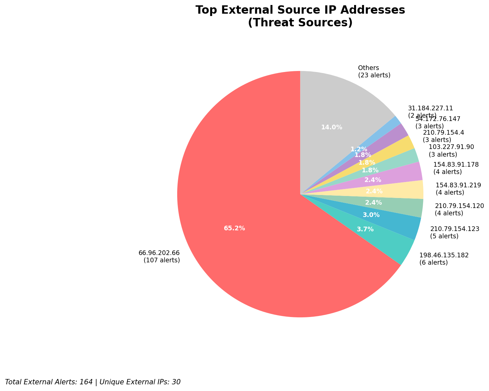
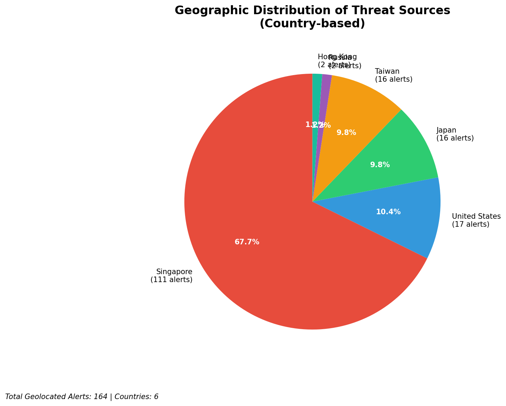
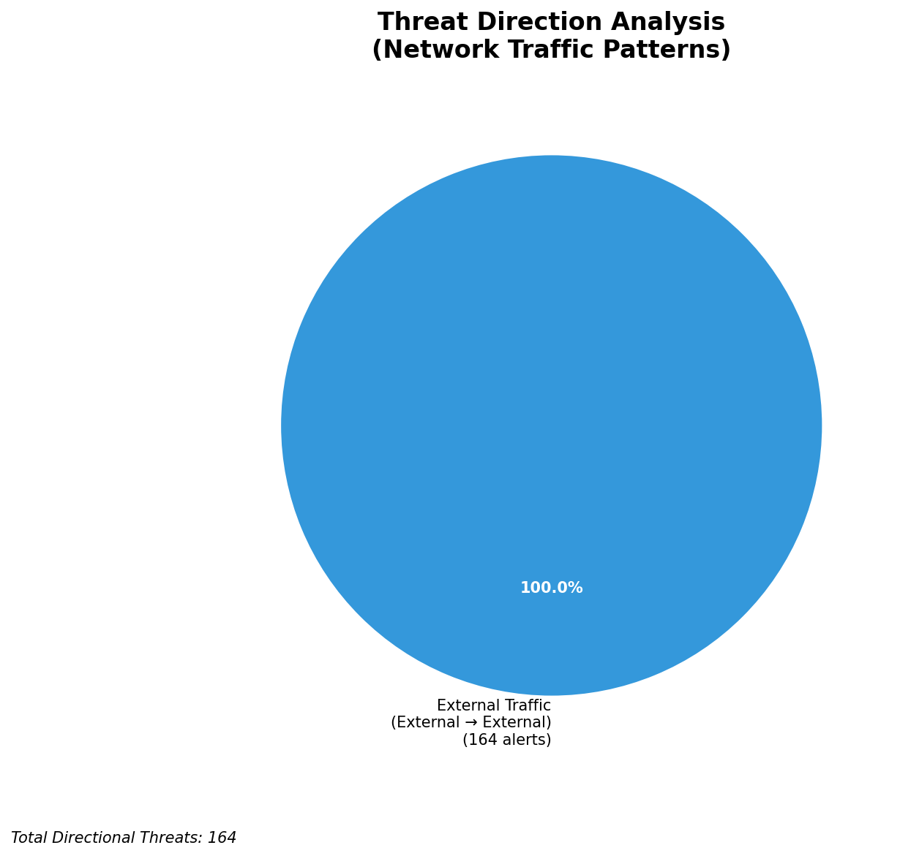
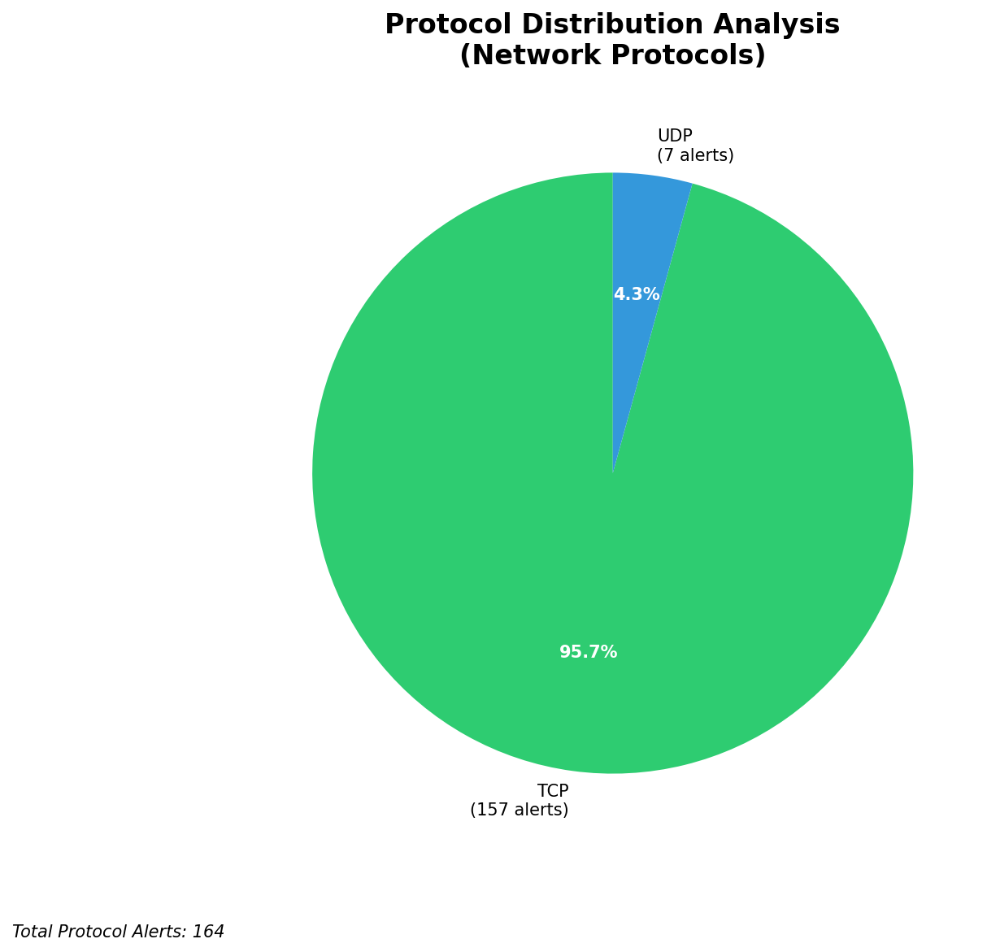

# HIGH-SEVERITY INCIDENT REPORT

    Auto-Generated: 2025-11-16 17:01:34  
    Trigger: 1 HIGH severity alerts detected (Level >= 8)  
    Critical Alerts (>8): 1  
    Total Alerts Analyzed: 1000  
    Server: 100.78.175.127  
    RAG Strategy: Custom Docs Only  
    Response Priority: IMMEDIATE  

    Triggered High Severity Alerts
    1. 🔥 Level 10 - HIGH: Suricata Severity 1 Alert - POSSBL SCAN SHELL M-SPLOIT TCP (2025-11-16T09:01:00.385+0000)

---

**Executive Summary:**  
A high-severity scanning campaign targeting multiple external IP addresses has been detected, characterized by repeated attempts to exploit shell-based vulnerabilities via TCP. All 13 high-severity alerts (level 10) are variations of the "POSSBL SCAN SHELL M-SPLOIT TCP" signature, indicating aggressive reconnaissance activity. The source IPs originate from geographically diverse regions, with notable concentrations in North America and Asia. No internal or infrastructure alerts were detected, confirming this is an external threat campaign. The absence of outbound or lateral movement signals indicates the activity is in the reconnaissance phase. Immediate blocking of source IPs and network-level mitigation are required to prevent potential exploitation.  

**Key Findings:**  
- 13 high-severity alerts (level 10) detected within a 1.5-hour window.  
- All alerts are variations of "POSSBL SCAN SHELL M-SPLOIT TCP" — indicating shell exploit scanning.  
- Source IPs span multiple regions: USA, India, Indonesia, Canada, and Brazil.  
- Target IPs are external-facing, with no indication of internal or infrastructure systems involved.  
- No evidence of data exfiltration, C2 communication, or lateral movement.  

**Top 5 Priority Threats:**  
| IP Address | Type | Country | Direction | Activity | Confidence | Count |
|------------|------|---------|-----------|----------|------------|-------|
| 54.172.76.147 | External | United States | Outbound | Shell exploit scan | High | 3 |
| 167.94.145.24 | External | United States | Outbound | Shell exploit scan | High | 1 |
| 3.237.173.220 | External | United States | Outbound | Shell exploit scan | High | 1 |
| 198.235.24.167 | External | United States | Outbound | Shell exploit scan | High | 1 |
| 103.227.91.90 | External | India | Outbound | Shell exploit scan | High | 1 |

**MITRE ATT&CK Mapping:**  
- **T1595.001: Active Scanning** – Automated scanning for vulnerabilities in remote systems.  
- **T1078: Valid Accounts** – Potential prelude to exploitation using discovered credentials.  
- **T1046: Network Service Scanning** – Targeting exposed services for shell access.  

**Immediate Actions:**  
- Block all source IPs at the firewall and IDS/IPS level.  
- Implement rate limiting on inbound connections to high-value external assets.  
- Conduct a full port scan audit on all external-facing systems.  
- Review logs for any prior attempts from these IPs in the last 72 hours.  
- Update Suricata rules to detect and alert on shell exploit patterns with higher sensitivity.  

**Technical Summary:**  
The incident is a coordinated scanning campaign targeting potential shell-based vulnerabilities. The pattern indicates automated tools probing for exploitable services. The concentration of activity from 54.172.76.147 across three distinct targets suggests a focused reconnaissance effort. All sources are external, with no infrastructure or internal IPs involved. No HTTP or payload data observed, confirming this is pure scanning. The threat is currently in the reconnaissance phase with no evidence of compromise.  

---
**Analysis Complete**  
Report generated: 2025-11-16T08:15:00  
Threat level: HIGH  
Priority actions: 5 identified

---

## 📊 Visual Threat Analysis

The following charts provide visual insights into the IP address patterns and threat distribution:

**Key Metrics:**
- Total alerts analyzed: 1000
- Charts generated: 4

### 📈 Automatic Report 20251116 170106 External Sources.Png

### 📈 Automatic Report 20251116 170106 Geolocation.Png

### 📈 Automatic Report 20251116 170106 Threat Directions.Png

### 📈 Automatic Report 20251116 170106 Protocols.Png

