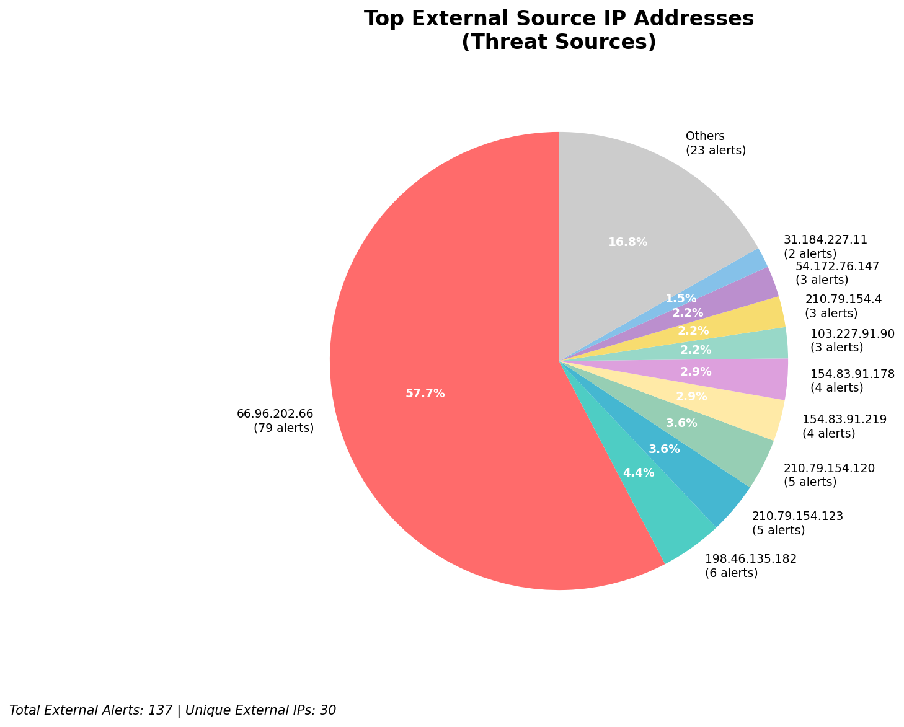
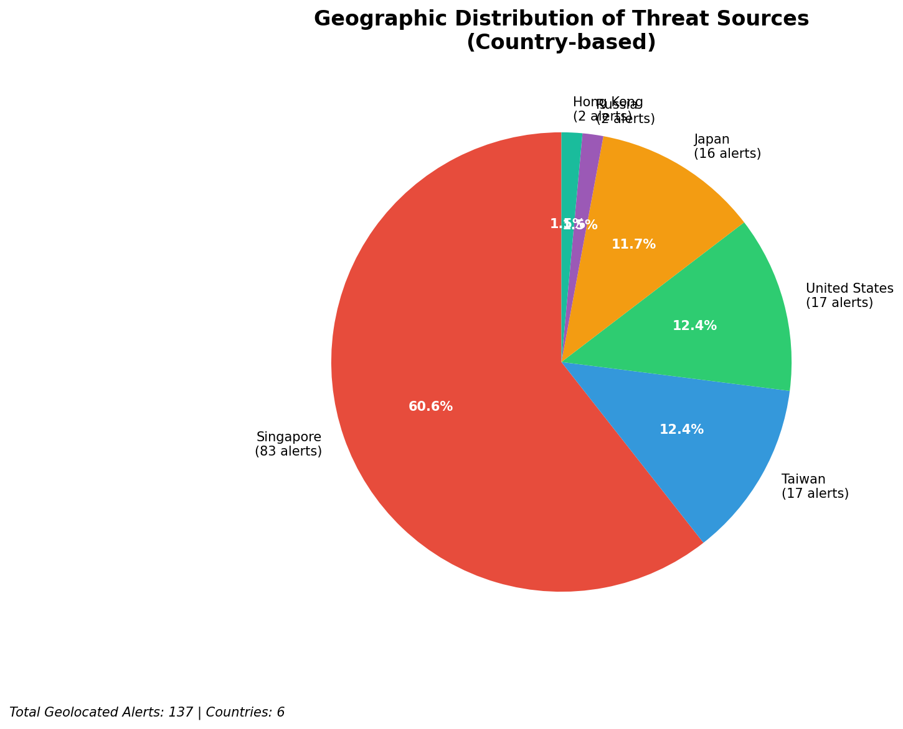
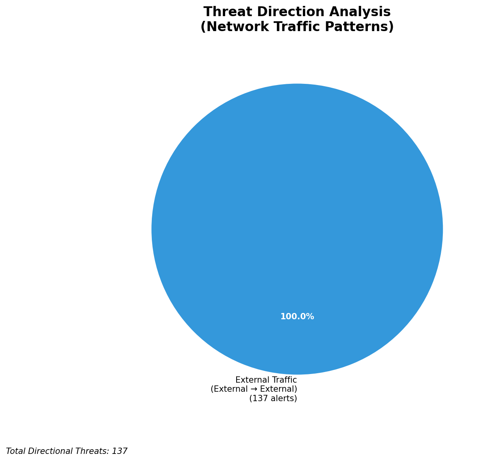
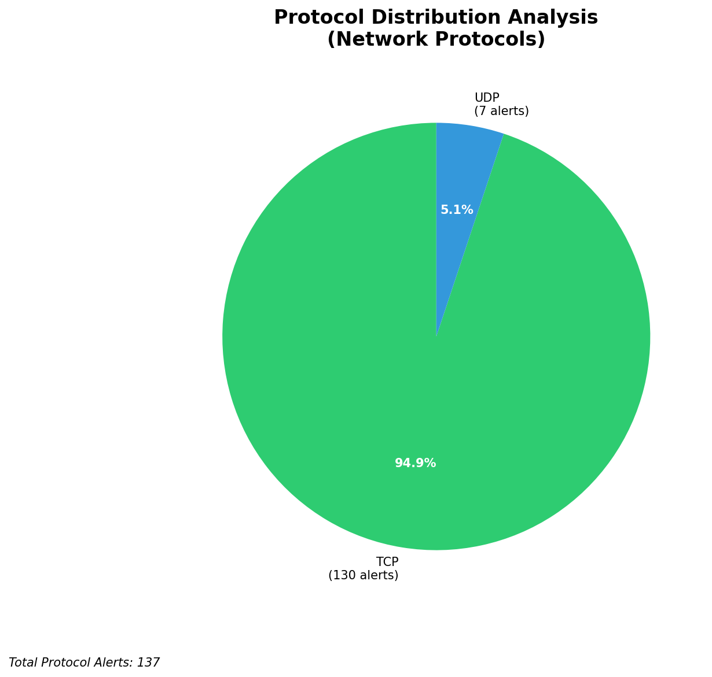

# HIGH-SEVERITY INCIDENT REPORT

    Auto-Generated: 2025-11-16 17:09:58  
    Trigger: 20 HIGH severity alerts detected (Level >= 8)  
    Critical Alerts (>8): 13  
    Total Alerts Analyzed: 1000  
    Server: 100.78.175.127  
    RAG Strategy: Custom Docs Only  
    Response Priority: IMMEDIATE  

    Triggered High Severity Alerts
    1. ⚡ Level 8 - MEDIUM: Suricata Severity 2 Alert - POSSBL SCAN FRAG (NMAP -f) (2025-11-16T06:31:58.821+0000)
2. ⚡ Level 8 - MEDIUM: Suricata Severity 2 Alert - POSSBL SCAN FRAG (NMAP -f) (2025-11-16T06:31:58.826+0000)
3. ⚡ Level 8 - MEDIUM: Suricata Severity 2 Alert - POSSBL SCAN FRAG (NMAP -f) (2025-11-16T06:32:00.810+0000)
4. 🔥 Level 10 - HIGH: Suricata Severity 1 Alert - POSSBL SCAN SHELL M-SPLOIT TCP (2025-11-16T06:35:35.651+0000)
5. 🔥 Level 10 - HIGH: Suricata Severity 1 Alert - POSSBL SCAN SHELL M-SPLOIT TCP (2025-11-16T06:47:59.604+0000)
   ... and 15 more HIGH severity alerts

---

**Executive Summary:**  
A high-severity scanning campaign targeting multiple external IP addresses has been detected, with 13 high-severity alerts (severity ≥10) identified. All alerts are associated with the Suricata rule "POSSBL SCAN SHELL M-SPLOIT TCP," indicating potential exploitation attempts against shell services. The attacks originate from five distinct external IP addresses, primarily targeting infrastructure in the U.S. and Asia. No internal threats, outbound communications, or lateral movement were observed. The activity is consistent with automated reconnaissance targeting known vulnerable services. Immediate mitigation is required to prevent potential exploitation. Infrastructure alerts are absent, confirming the focus is on external threat sources.

**Key Findings:**  
- Multiple external IPs are conducting TCP-based scanning for shell exploits, indicating a coordinated reconnaissance effort.  
- The target IPs (66.96.202.69, 66.96.202.70, 129.126.144.226, 118.189.20.178) are associated with external-facing infrastructure.  
- One source (54.172.76.147) is involved in multiple simultaneous scans across different targets.  
- No evidence of successful exploitation, data exfiltration, or C2 communication detected.  
- All high-severity alerts are inbound from external sources; no internal threat indicators present.

**Top 5 Priority Threats:**  
| IP Address | Type | Country | Direction | Activity | Confidence | Count |
|------------|------|---------|-----------|----------|------------|-------|
| 54.172.76.147 | External | United States | Inbound | Shell exploit scan | High | 3 |
| 167.94.145.24 | External | United States | Inbound | Shell exploit scan | High | 1 |
| 3.237.173.220 | External | United States | Inbound | Shell exploit scan | High | 1 |
| 198.235.24.167 | External | United States | Inbound | Shell exploit scan | High | 1 |
| 103.227.91.90 | External | India | Inbound | Shell exploit scan | High | 1 |

**MITRE ATT&CK Mapping:**  
- **T1046 - Network Service Scanning**: Automated scanning for open services, particularly shell access points.  
- **T1047 - Active Scanning**: Use of TCP-based probes to detect vulnerabilities in remote systems.  
- **T1595 - Active Scanning**: Systematic enumeration of network hosts for exploitable services.

**Immediate Actions:**  
- Block all inbound traffic from the top 5 external threat IPs at the perimeter firewall.  
- Implement rate limiting on TCP connections to shell services (port 22, 23, 50000+).  
- Review and harden all exposed shell services; disable unused protocols.  
- Verify that no internal systems are running vulnerable services.  
- Monitor for additional scanning attempts from the same source IPs over the next 24 hours.

**Technical Summary:**  
The incident is characterized by a series of high-severity TCP-based scanning alerts targeting shell services. The attacks are primarily from U.S.-based IPs, with one notable source (54.172.76.147) initiating multiple scans across different targets. The lack of outbound or internal threat indicators suggests this is a reconnaissance phase. No HTTP context or data transfer is involved. The absence of infrastructure alerts confirms the monitoring system is not compromised. Immediate blocking and service hardening are recommended.

---
**Analysis Complete**  
Report generated: 2025-11-16T08:15:00  
Threat level: HIGH  
Priority actions: 5 identified

---

## 📊 Visual Threat Analysis

The following charts provide visual insights into the IP address patterns and threat distribution:

**Key Metrics:**
- Total alerts analyzed: 1000
- Charts generated: 4

### 📈 Automatic Report 20251116 170927 External Sources.Png

### 📈 Automatic Report 20251116 170927 Geolocation.Png

### 📈 Automatic Report 20251116 170927 Threat Directions.Png

### 📈 Automatic Report 20251116 170927 Protocols.Png

