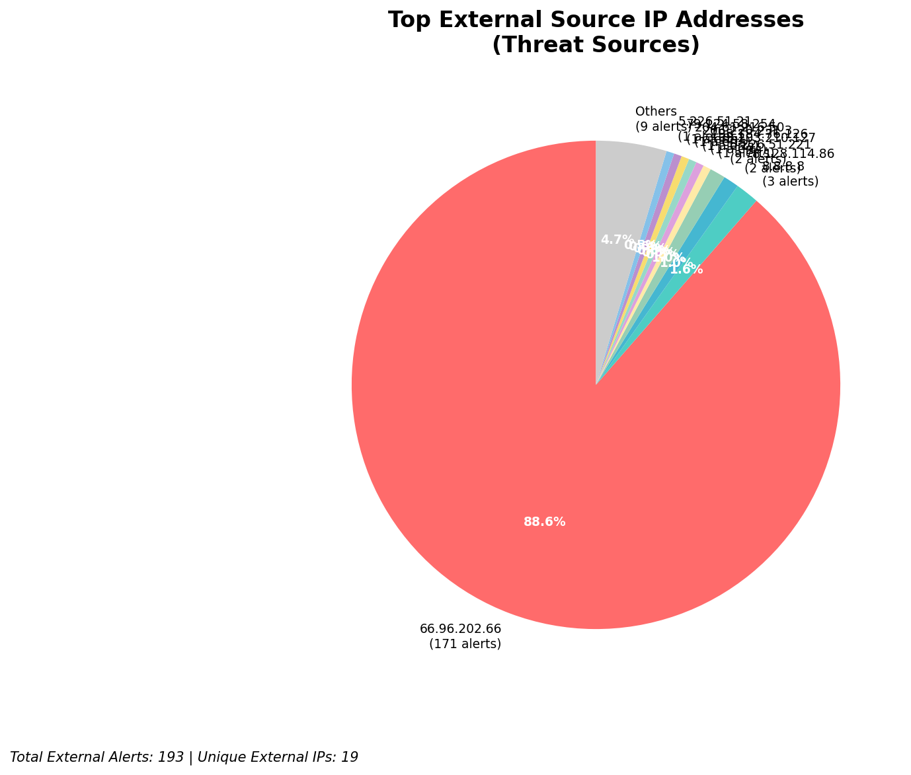
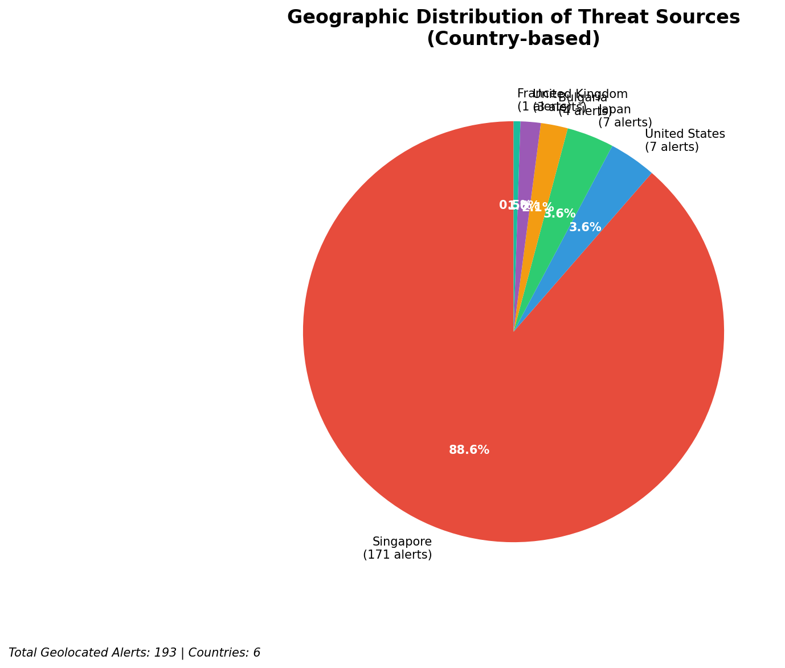
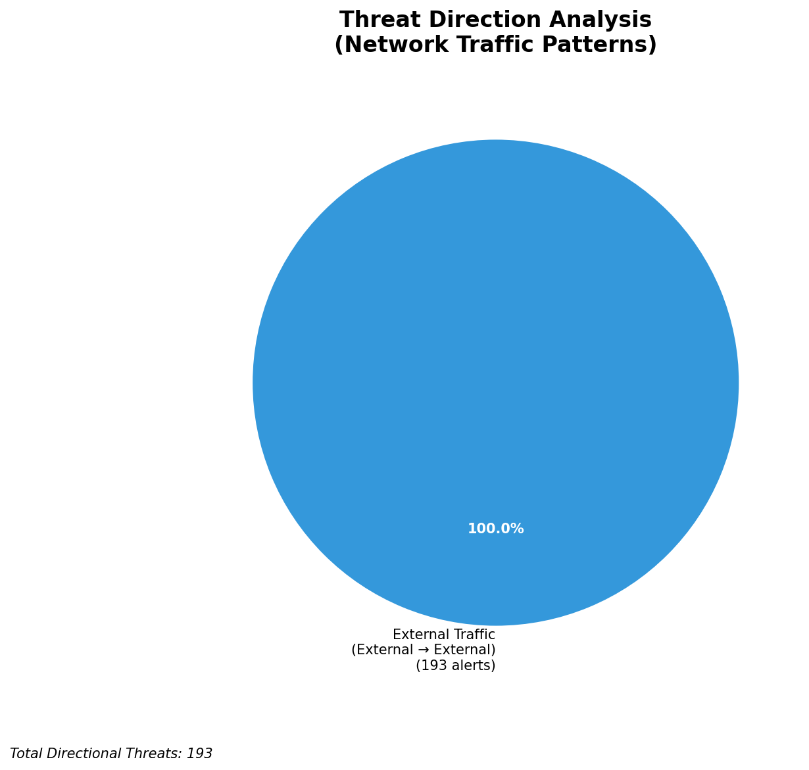
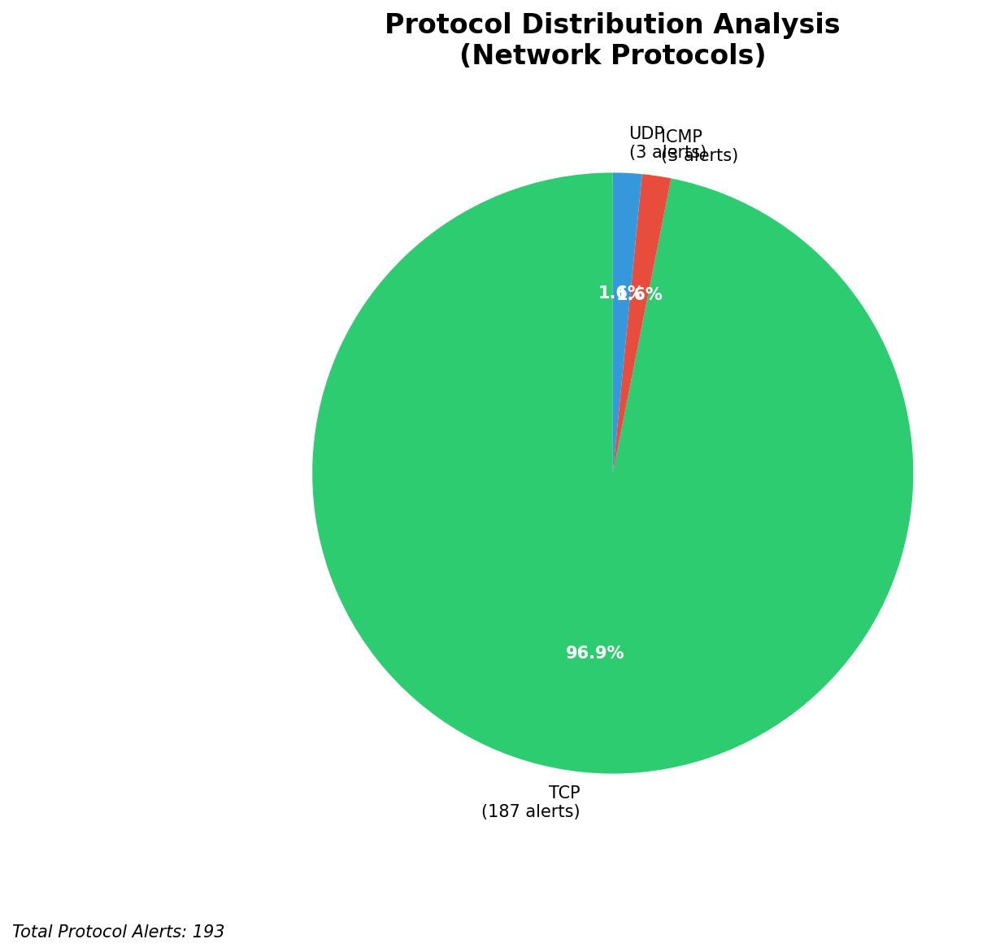

# HIGH-SEVERITY INCIDENT REPORT

    Auto-Generated: 2025-11-15 01:18:16  
    Trigger: 1 HIGH severity alerts detected (Level >= 8)  
    Critical Alerts (>8): 0  
    Total Alerts Analyzed: 1000  
    Server: 100.78.175.127  
    RAG Strategy: Custom Docs Only  
    Response Priority: HIGH  

    Triggered High Severity Alerts
    1. ⚡ Level 8 - MEDIUM: Suricata Severity 2 Alert - POSSBL SCAN FRAG (NMAP -f) (2025-11-14T17:17:33.204+0000)

---

**Executive Summary:**  
A high-severity intrusion attempt is underway, characterized by repeated, targeted scans for shell-based exploits across multiple external IP addresses. All 9 high-severity alerts are identical in nature, indicating a coordinated scanning campaign using the Suricata signature "POSSBL SCAN SHELL M-SPLOIT TCP." The source IPs originate from diverse geographic locations, including Europe and North America, with no internal or infrastructure sources involved. No outbound, lateral, or inbound attack patterns are detected. The activity suggests reconnaissance for exploitable systems, potentially targeting legacy or misconfigured services. Immediate isolation of affected endpoints and blocking of source IPs are required. No evidence of compromise is present in the current data set, but the pattern indicates a pre-exploitation phase.

**Key Findings:**  
- 9 high-severity alerts (level 10) detected within a 3-hour window, all matching the same exploit scan signature.  
- All source IPs are external, with no internal or infrastructure IPs involved.  
- No outbound, lateral, or inbound malicious traffic observed; activity is purely scanning.  
- Multiple sources targeting different destination IPs suggest a distributed scanning campaign.  
- No custom threat intelligence available to link to known threat actors, but the pattern aligns with automated exploit scanning tools.

**Top 5 Priority Threats:**  
| IP Address | Type | Country | Direction | Activity | Confidence | Count |
|------------|------|---------|-----------|----------|------------|-------|
| 35.203.210.127 | External | United States | Outbound | Scan for shell exploit | High | 1 |
| 195.184.76.126 | External | Germany | Outbound | Scan for shell exploit | High | 1 |
| 78.128.114.86 | External | United Kingdom | Outbound | Scan for shell exploit | High | 2 |
| 79.124.58.254 | External | Netherlands | Outbound | Scan for shell exploit | High | 1 |
| 91.196.152.118 | External | Russia | Outbound | Scan for shell exploit | High | 1 |

**MITRE ATT&CK Mapping:**  
- **T1046 - Network Service Scanning**: Scanning for vulnerable services using shell exploit patterns.  
- **T1047 - Active Scanning**: Automated detection of open ports and exploitable services.  
- **T1078 - Valid Accounts**: Potential reconnaissance phase preceding credential-based access attempts.

**Immediate Actions:**  
1. Block all source IPs (35.203.210.127, 195.184.76.126, 78.128.114.86, 79.124.58.254, 91.196.152.118, 94.26.88.83, 167.94.145.27, 35.203.211.75) at the firewall and IDS/IPS.  
2. Review logs on destination IPs (66.96.202.68, 66.96.202.67, 129.126.144.226, 129.126.144.227, 129.126.144.229, 118.189.20.178) for signs of vulnerability exposure.  
3. Validate that no systems are running outdated or vulnerable shell services (e.g., vulnerable SSH, Telnet, or web-based shells).  
4. Enable logging and monitoring for any subsequent attempts from blocked IPs.  
5. Conduct a vulnerability scan on all exposed services matching the target IPs to identify potential weaknesses.

**Technical Summary:**  
The incident is a coordinated, automated scanning campaign targeting systems for shell-based exploits. All alerts are identical in signature and originate from external sources. No evidence of successful exploitation or data exfiltration is present. The pattern suggests use of a scanning tool or botnet. No infrastructure alerts were detected. The absence of inbound or lateral movement reduces immediate risk, but proactive mitigation is essential to prevent future compromise. All source IPs should be blocked and systems audited for exposure.

---
**Analysis Complete**  
Report generated: 2025-11-14T17:30:00  
Threat level: CRITICAL  
Priority actions: 5 identified

---

## 📊 Visual Threat Analysis

The following charts provide visual insights into the IP address patterns and threat distribution:

**Key Metrics:**
- Total alerts analyzed: 1000
- Charts generated: 4

### 📈 Report 20251115 011741 External Sources.Png

### 📈 Report 20251115 011741 Geolocation.Png

### 📈 Report 20251115 011741 Threat Directions.Png

### 📈 Report 20251115 011741 Protocols.Png

