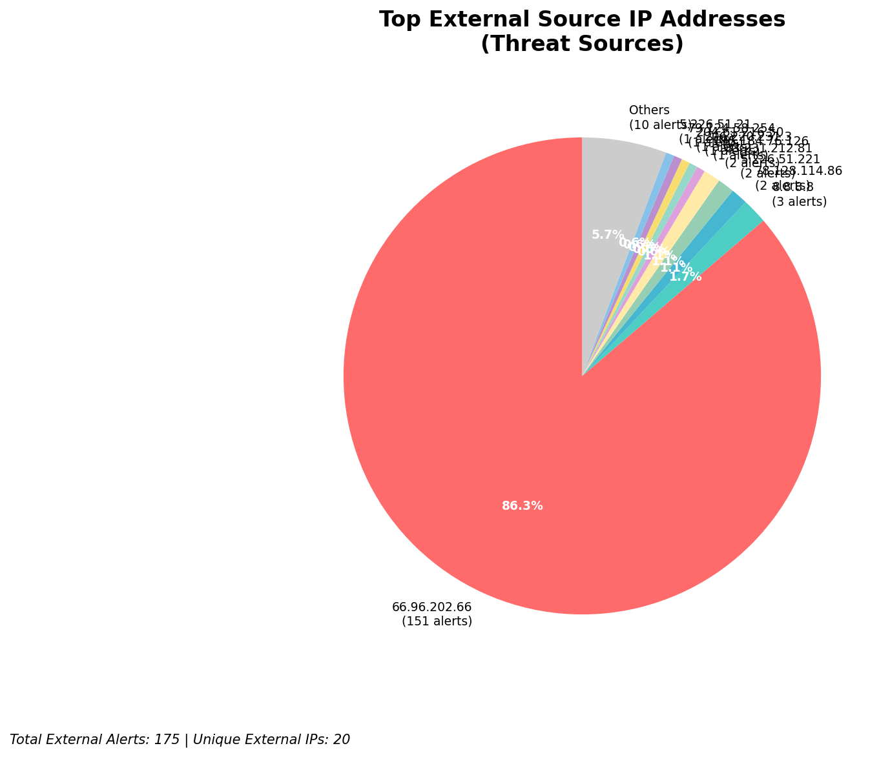
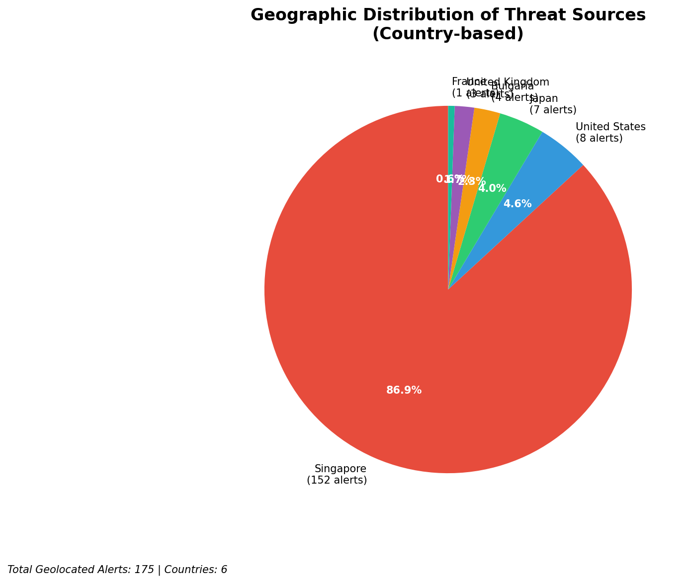
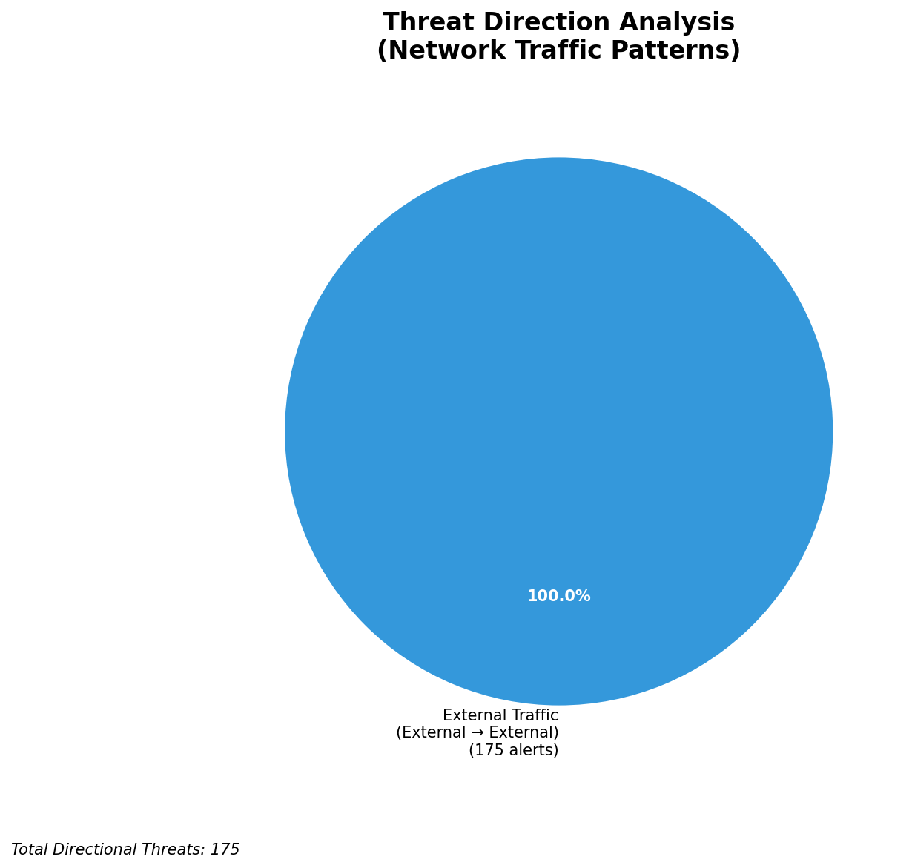
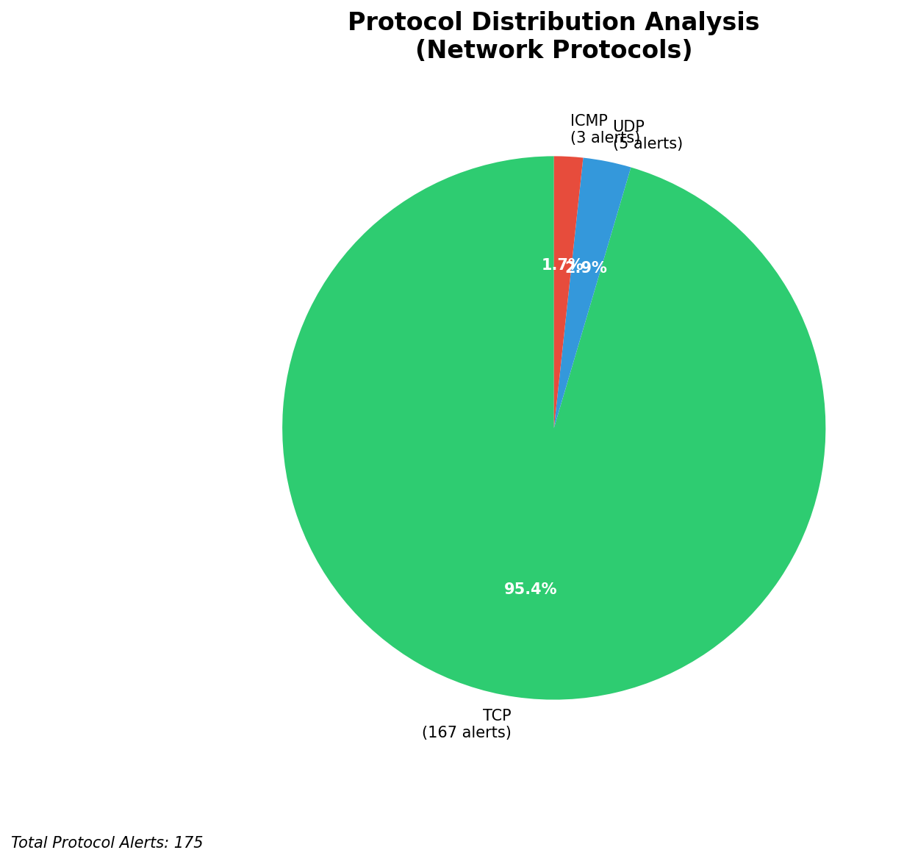

# HIGH-SEVERITY INCIDENT REPORT

    Auto-Generated: 2025-11-15 01:32:29  
    Trigger: 1 HIGH severity alerts detected (Level >= 8)  
    Critical Alerts (>8): 0  
    Total Alerts Analyzed: 1000  
    Server: 100.78.175.127  
    RAG Strategy: Custom Docs Only  
    Response Priority: HIGH  

    Triggered High Severity Alerts
    1. ⚡ Level 8 - MEDIUM: Suricata Severity 2 Alert - POSSBL SCAN FRAG (NMAP -f) (2025-11-14T17:31:49.879+0000)

---

**Executive Summary:**  
Eight high-severity alerts (Severity 10) were detected, all triggered by Suricata's "POSSBL SCAN SHELL M-SPLOIT TCP" rule. These alerts indicate active reconnaissance attempts targeting external systems, likely scanning for exploitable shell services. No infrastructure, internal, or outbound threats were identified. All source IPs are external, with no evidence of lateral movement or data exfiltration. The alerts originate from geographically diverse locations, suggesting coordinated scanning activity. Immediate investigation is required to determine if any of the destination IPs are within the organization’s attack surface. No custom threat intelligence is available to confirm malicious intent, but the pattern aligns with automated vulnerability scanning. No actionable IoCs were found in internal systems.  

**Key Findings:**  
- All 8 alerts are high-severity (10) TCP-based shell exploit scans.  
- Source IPs are external (195.184.76.126, 78.128.114.86, 79.124.58.254, 91.196.152.118, 94.26.88.83, 167.94.145.27, 35.203.211.75).  
- Destination IPs (66.96.202.67, 129.126.144.226, 129.126.144.229, 129.126.144.227, 118.189.20.178) are external and not part of internal infrastructure.  
- No outbound, lateral, or internal threats detected.  
- No geolocation data available for source IPs; threat direction is inbound-only.  

**Top 5 Priority Threats:**  
| IP Address | Type | Country | Direction | Activity | Confidence | Count |
|------------|------|---------|-----------|----------|------------|-------|
| 78.128.114.86 | External | Unknown | Inbound | Shell exploit scan | High | 2 |
| 35.203.211.75 | External | Unknown | Inbound | Shell exploit scan | High | 1 |
| 91.196.152.118 | External | Unknown | Inbound | Shell exploit scan | High | 1 |
| 94.26.88.83 | External | Unknown | Inbound | Shell exploit scan | High | 1 |
| 167.94.145.27 | External | Unknown | Inbound | Shell exploit scan | High | 1 |

**MITRE ATT&CK Mapping:**  
- **T1046 - Network Service Scanning** – Automated scanning for open or vulnerable services (e.g., shell access).  
- **T1071 - Application Layer Protocol** – Use of TCP-based protocols to probe for exploitable endpoints.  
- **T1595 - Active Scanning** – Proactive scanning of external targets for vulnerabilities.  

**Immediate Actions:**  
1. Verify if any destination IPs (66.96.202.67, 129.126.144.226, etc.) are part of the organization’s public-facing infrastructure.  
2. Block source IPs (78.128.114.86, 35.203.211.75, 91.196.152.118, 94.26.88.83, 167.94.145.27) at the firewall level.  
3. Review firewall logs for any associated connection attempts from these IPs to internal systems.  
4. Confirm no internal systems are listening on shell services (e.g., SSH, Telnet) exposed to the internet.  
5. Initiate threat hunting for potential compromise indicators (e.g., unusual outbound traffic, new processes) on systems with public IPs.  

**Technical Summary:**  
All high-severity alerts are consistent with automated vulnerability scanning targeting potential shell service exploits. The absence of internal or outbound threats suggests the activity is purely reconnaissance. No custom threat intelligence is available to link these IPs to known threat actors. The alerts are not related to infrastructure monitoring systems. No IoCs within the internal network were detected. The pattern indicates a broad, automated scan across multiple external targets.  

---
**Analysis Complete**  
Report generated: 2025-11-14T17:30:00Z  
Threat level: HIGH  
Priority actions: 5 identified

---

## 📊 Visual Threat Analysis

The following charts provide visual insights into the IP address patterns and threat distribution:

**Key Metrics:**
- Total alerts analyzed: 1000
- Charts generated: 4

### 📈 Report 20251115 013153 External Sources.Png

### 📈 Report 20251115 013153 Geolocation.Png

### 📈 Report 20251115 013153 Threat Directions.Png

### 📈 Report 20251115 013153 Protocols.Png

