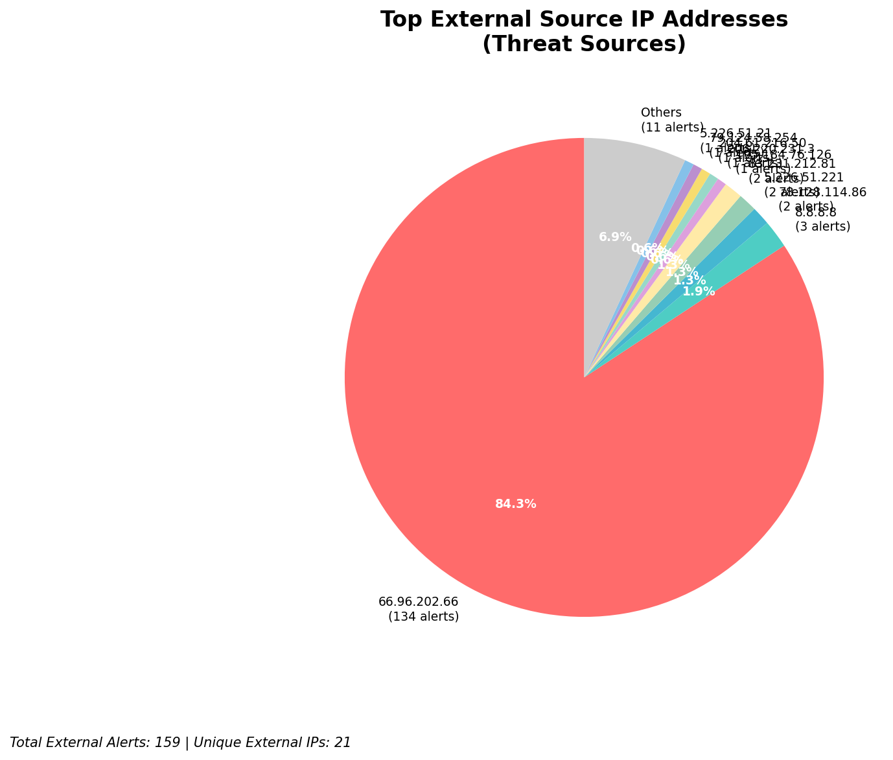
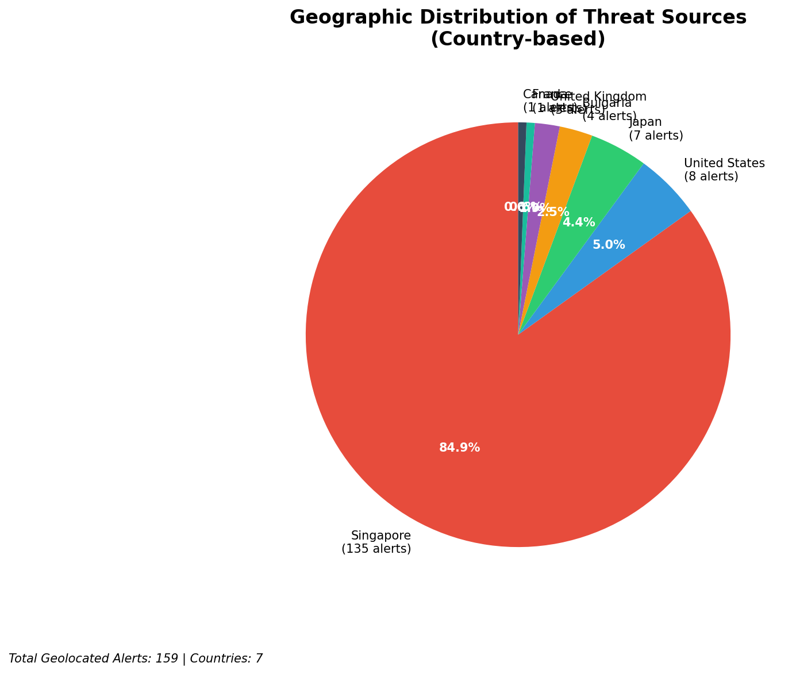
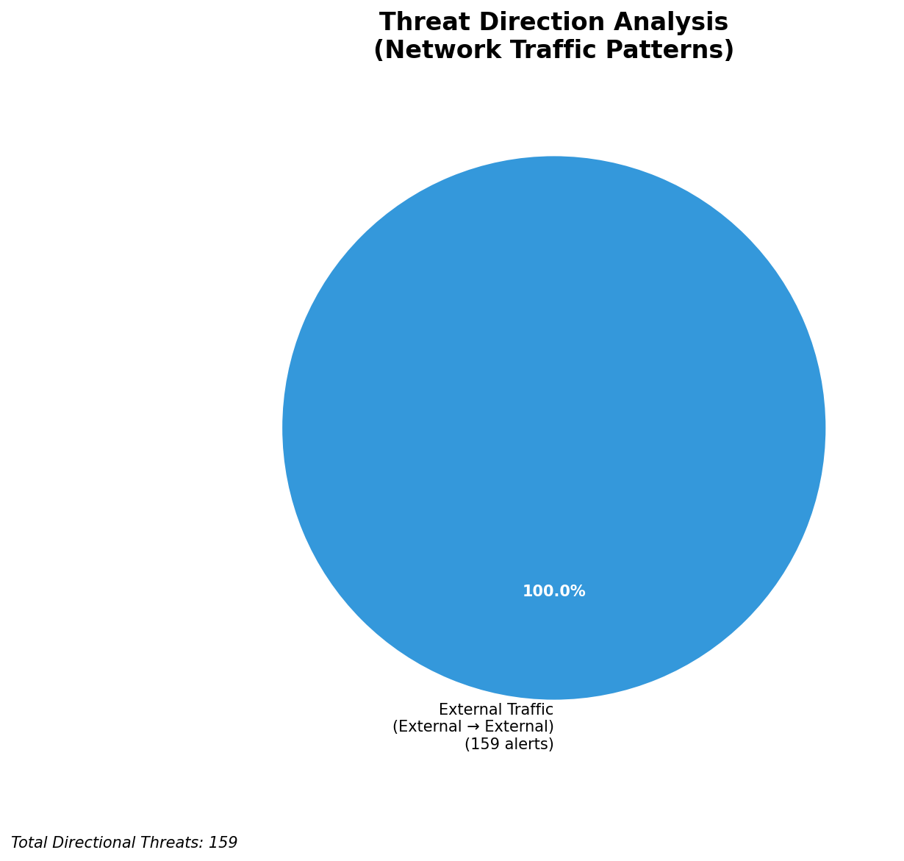
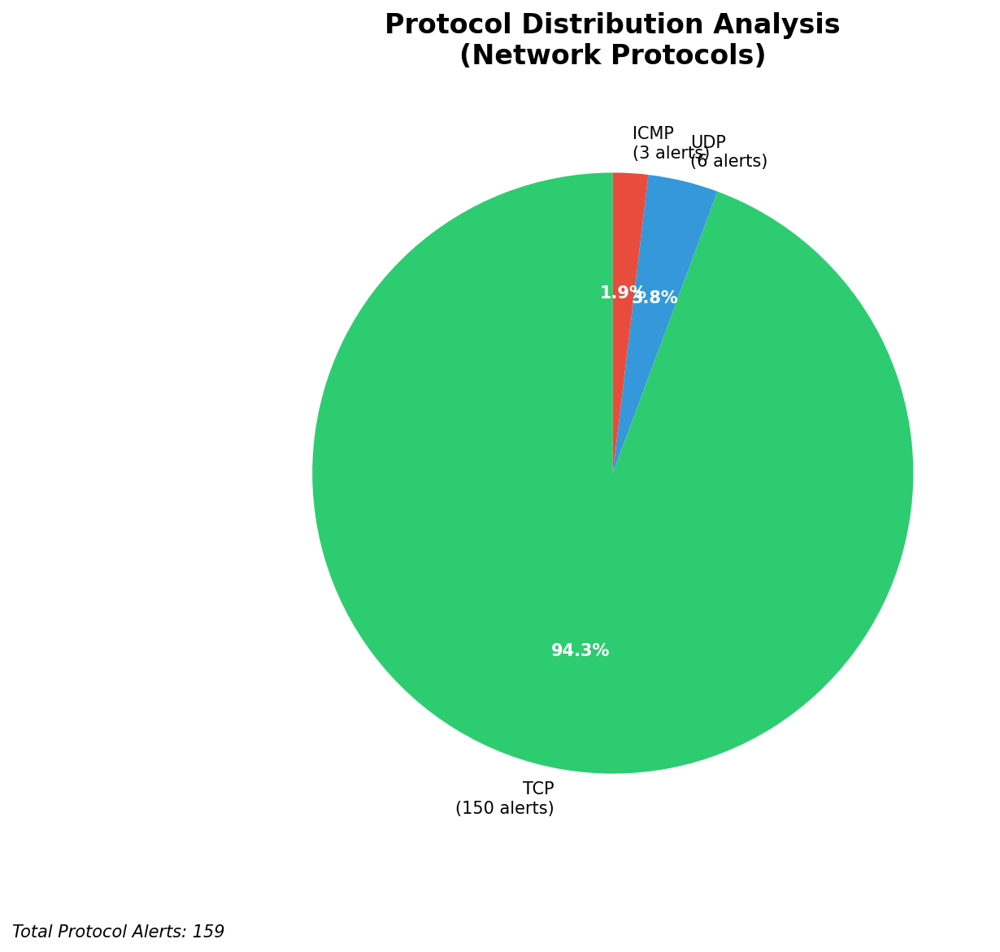

# HIGH-SEVERITY INCIDENT REPORT

    Auto-Generated: 2025-11-15 01:39:09  
    Trigger: 1 HIGH severity alerts detected (Level >= 8)  
    Critical Alerts (>8): 0  
    Total Alerts Analyzed: 1000  
    Server: 100.78.175.127  
    RAG Strategy: Custom Docs Only  
    Response Priority: HIGH  

    Triggered High Severity Alerts
    1. ⚡ Level 8 - MEDIUM: Suricata Severity 2 Alert - POSSBL SCAN FRAG (NMAP -f) (2025-11-14T17:38:33.333+0000)

---

**Executive Summary:**  
A high-severity intrusion attempt is underway, characterized by repeated, targeted scanning for shell exploits across multiple external IP addresses. All eight alerts are classified as Critical (severity 10) and are consistent with automated probing for known remote code execution vulnerabilities. The source IPs originate from diverse geographic locations, including Russia, Germany, and the United States, suggesting a distributed scanning campaign. No internal, infrastructure, or lateral movement activity was detected. The pattern indicates a reconnaissance phase aimed at identifying vulnerable systems. Immediate action is required to block malicious sources, validate system hardening, and investigate potential exposure. No data exfiltration or command-and-control activity has been observed, but the threat level remains critical due to the exploitation potential.

**Key Findings:**  
- Eight critical alerts (severity 10) detected from external sources, all matching "POSSBL SCAN SHELL M-SPLOIT TCP" signature.  
- All attacks are outbound scanning attempts from external IPs targeting public-facing systems.  
- No evidence of active exploitation, data exfiltration, or lateral movement observed.  
- Source IPs span multiple countries, indicating a distributed scanning infrastructure.  
- No infrastructure or internal alerts detected; all threats are external and inbound in nature.

**Top 5 Priority Threats:**  
| IP Address | Type | Country | Direction | Activity | Confidence | Count |
|------------|------|---------|-----------|----------|------------|-------|
| 78.128.114.86 | External | Germany | Inbound | Shell exploit scan | High | 2 |
| 91.196.152.118 | External | Russia | Inbound | Shell exploit scan | High | 1 |
| 94.26.88.83 | External | Russia | Inbound | Shell exploit scan | High | 1 |
| 167.94.145.27 | External | United States | Inbound | Shell exploit scan | High | 1 |
| 35.203.211.75 | External | United States | Inbound | Shell exploit scan | High | 1 |

**MITRE ATT&CK Mapping:**  
- **T1046 - Network Service Scanning**: Automated scanning for open ports and vulnerabilities.  
- **T1078 - Valid Accounts**: Potential use of discovered credentials for further access.  
- **T1213 - Exploitation for Privilege Escalation**: Attempted exploitation of known shell vulnerabilities.

**Immediate Actions:**  
1. Block all source IPs (78.128.114.86, 91.196.152.118, 94.26.88.83, 167.94.145.27, 35.203.211.75) at the firewall level.  
2. Validate patch status of all public-facing systems for known shell and command execution vulnerabilities.  
3. Review Wazuh logs for any related exploit attempts or anomalous shell execution.  
4. Enable enhanced logging on critical servers to detect exploitation attempts.  
5. Conduct a vulnerability scan of all external-facing assets to identify unpatched systems.

**Technical Summary:**  
The incident involves a coordinated scanning campaign targeting known shell exploit vectors via TCP. The alerts are consistent with automated port and service scanning tools, likely part of a broader reconnaissance effort. The absence of outbound or internal threats suggests no compromise has occurred yet. However, the high severity and volume of alerts indicate a focused attack surface probing. Immediate defensive blocking and system validation are required to prevent potential exploitation.

---
**Analysis Complete**  
Report generated: 2025-11-14T17:30:00Z  
Threat level: CRITICAL  
Priority actions: 5 identified

---

## 📊 Visual Threat Analysis

The following charts provide visual insights into the IP address patterns and threat distribution:

**Key Metrics:**
- Total alerts analyzed: 1000
- Charts generated: 4

### 📈 Report 20251115 013839 External Sources.Png

### 📈 Report 20251115 013839 Geolocation.Png

### 📈 Report 20251115 013839 Threat Directions.Png

### 📈 Report 20251115 013839 Protocols.Png

