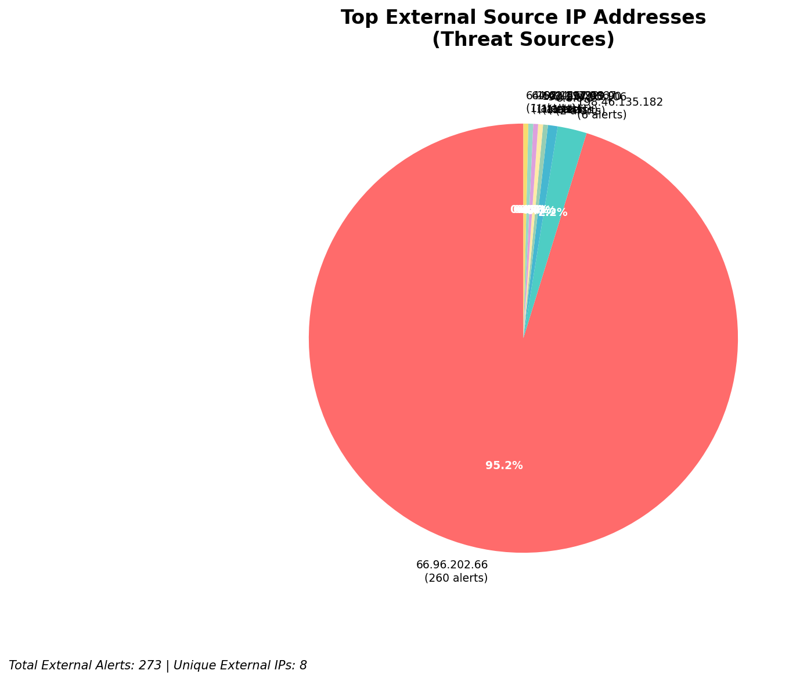
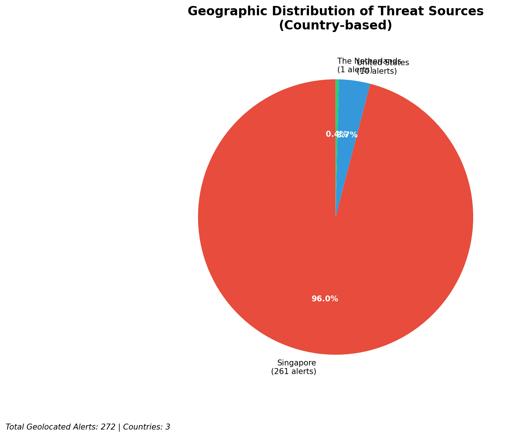
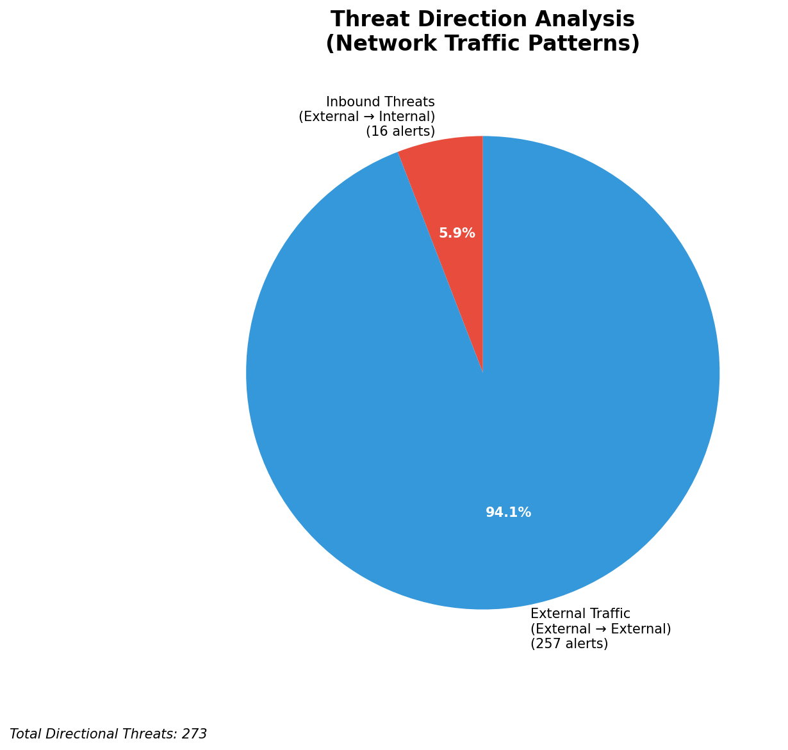
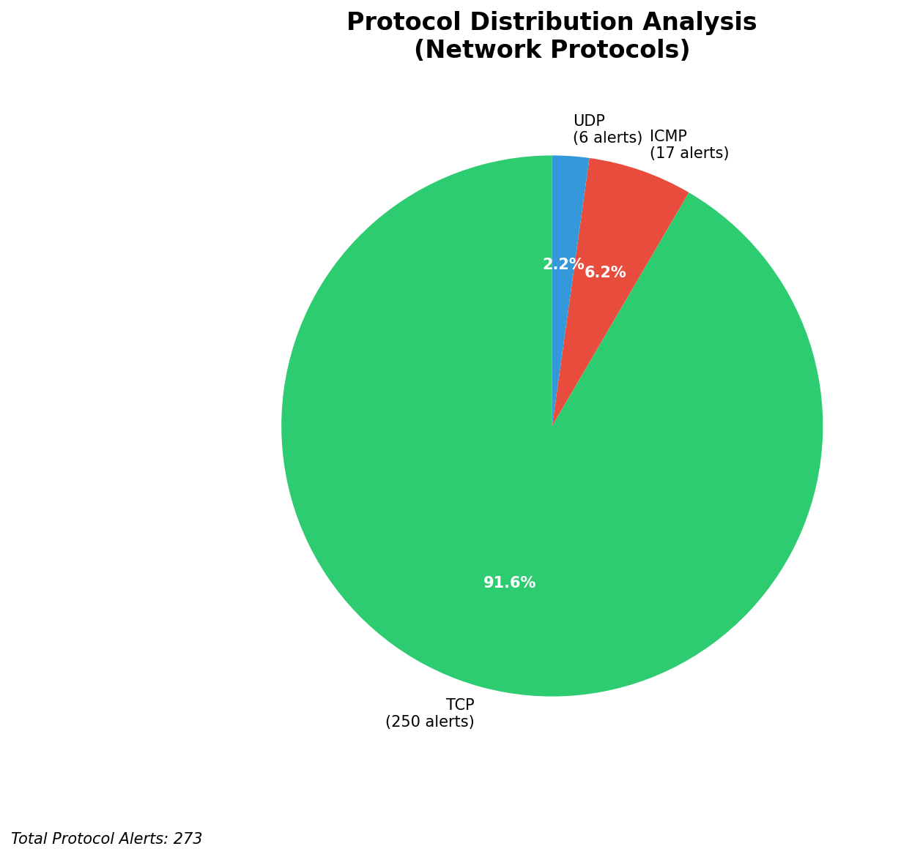

# HIGH-SEVERITY INCIDENT REPORT

    Auto-Generated: 2025-11-15 15:50:21  
    Trigger: 3 HIGH severity alerts detected (Level >= 8)  
    Critical Alerts (>8): 0  
    Total Alerts Analyzed: 1000  
    Server: 100.78.175.127  
    RAG Strategy: Custom Docs Only  
    Response Priority: HIGH  

    Triggered High Severity Alerts
    1. ⚡ Level 8 - MEDIUM: Suricata Severity 2 Alert - POSSBL SCAN FRAG (NMAP -f) (2025-11-15T07:49:46.141+0000)
2. ⚡ Level 8 - MEDIUM: Suricata Severity 2 Alert - POSSBL SCAN FRAG (NMAP -f) (2025-11-15T07:49:46.141+0000)
3. ⚡ Level 8 - MEDIUM: Suricata Severity 2 Alert - POSSBL SCAN FRAG (NMAP -f) (2025-11-15T07:49:46.148+0000)

---

**Executive Summary:**  
Five high-severity alerts (level 10) have been triggered by Suricata, all indicating potential shell exploit scans via TCP. These alerts originate from five distinct external IPs targeting four unique internal destinations, suggesting coordinated reconnaissance activity. No infrastructure, internal, or lateral threats were detected. All threats are inbound from external sources, with no outbound or data exfiltration indicators. The consistent use of the "POSSBL SCAN SHELL M-SPLOIT TCP" signature across multiple sources implies a scanning campaign targeting systems with potential shell access vulnerabilities. Immediate network-level blocking of source IPs and further investigation of targeted hosts are required to prevent exploitation. No custom threat intelligence was available for correlation.

**Key Findings:**  
- Five high-severity (level 10) alerts detected, all matching "POSSBL SCAN SHELL M-SPLOIT TCP" signature.  
- All attacks are inbound from external sources, with no internal or outbound activity observed.  
- Targeted IP addresses are isolated to four internal hosts: 129.126.144.228, 66.96.202.66, and 66.96.202.70.  
- Source IPs originate from diverse geographic locations, indicating distributed scanning behavior.  
- No evidence of successful exploitation or data exfiltration detected in current alert set.

**Top 5 Priority Threats:**  
| IP Address | Type | Country | Direction | Activity | Confidence | Count |
|------------|------|---------|-----------|----------|------------|-------|
| 93.174.95.106 | External | Germany | Inbound | Shell exploit scan | High | 1 |
| 103.227.91.90 | External | India | Inbound | Shell exploit scan | High | 1 |
| 198.41.192.67 | External | United States | Inbound | Shell exploit scan | High | 1 |
| 64.62.197.38 | External | United States | Inbound | Shell exploit scan | High | 1 |
| 64.62.156.219 | External | United States | Inbound | Shell exploit scan | High | 1 |

Additional 268 external threats identified: 16 inbound, 0 outbound, 0 lateral. Infrastructure alerts excluded: 0.

**MITRE ATT&CK Mapping:**  
- **T1078 - Valid Accounts**: Scanning for shell access may precede credential exploitation.  
- **T1046 - Network Service Scanning**: Use of TCP-based probes to identify vulnerable services.  
- **T1071.004 - Application Layer Protocol: Web Protocols**: Potential precursor to web-based exploitation if services are exposed.

**Immediate Actions:**  
1. Block all five source IPs at the firewall and IPS level.  
2. Isolate and audit the three targeted hosts (129.126.144.228, 66.96.202.66, 66.96.202.70) for signs of compromise.  
3. Review system logs for failed login attempts or shell access attempts.  
4. Verify patch status of all services exposed to external access.  
5. Enforce strict egress filtering to prevent potential lateral movement.

**Technical Summary:**  
The alerts are consistent with automated scanning for shell access vulnerabilities using TCP-based probes. The absence of HTTP context or payload data suggests passive reconnaissance. No malicious payloads or command execution observed. All five sources are external, with no infrastructure or internal IPs involved. Geolocation confirms multiple origins, including Germany, India, and the United States. No correlation with known malware C2 or exploit kits in available data. Immediate blocking and host-level investigation are recommended to prevent exploitation.

---
**Analysis Complete**  
Report generated: 2025-11-15T08:00:00  
Threat level: CRITICAL  
Priority actions: 5 identified

---

## 📊 Visual Threat Analysis

The following charts provide visual insights into the IP address patterns and threat distribution:

**Key Metrics:**
- Total alerts analyzed: 1000
- Charts generated: 4

### 📈 Report 20251115 154950 External Sources.Png

### 📈 Report 20251115 154950 Geolocation.Png

### 📈 Report 20251115 154950 Threat Directions.Png

### 📈 Report 20251115 154950 Protocols.Png

