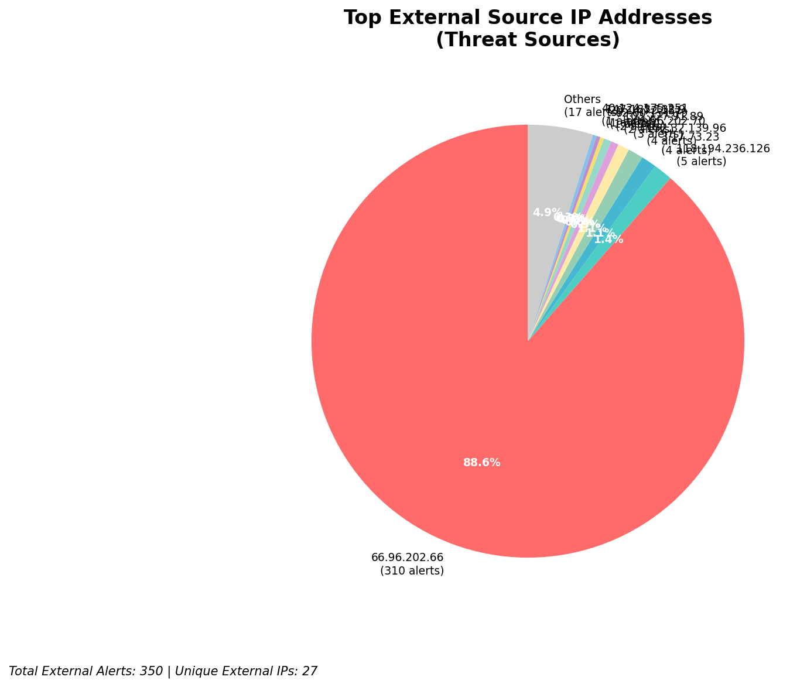
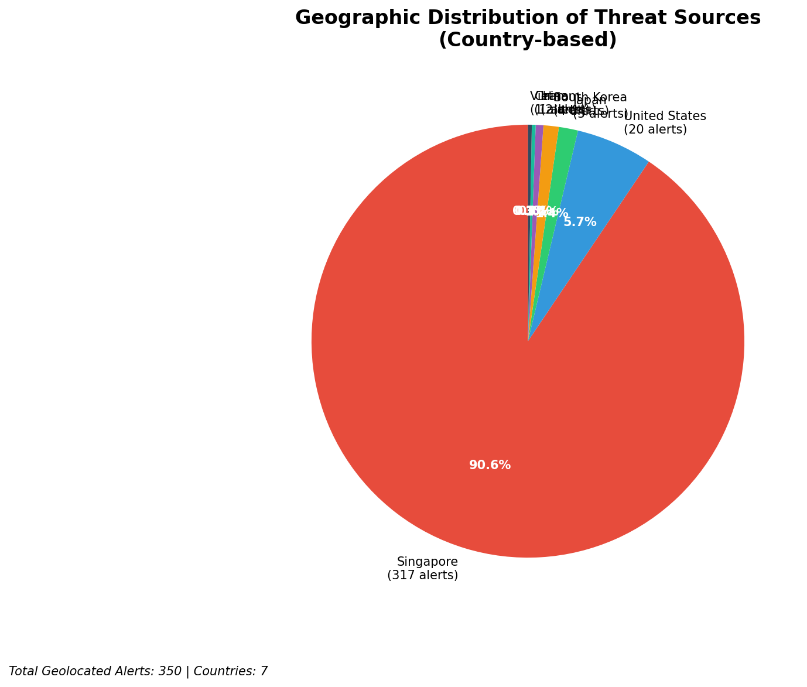
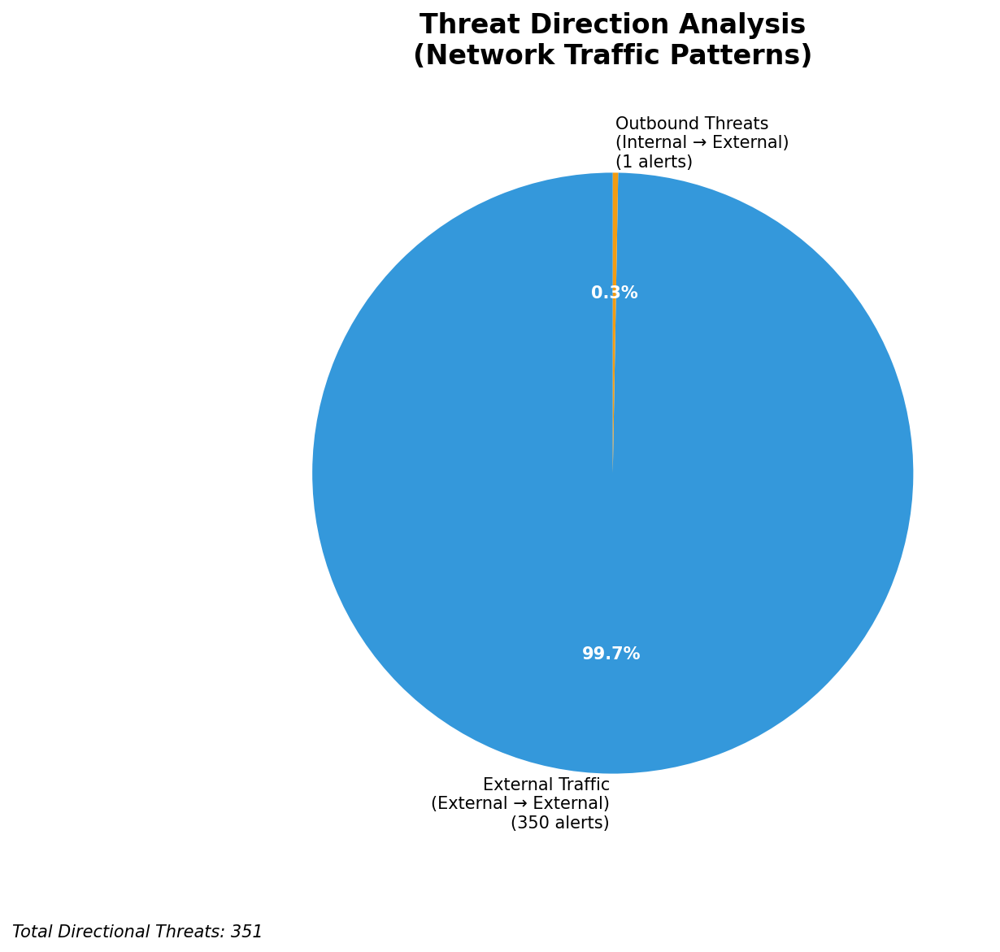
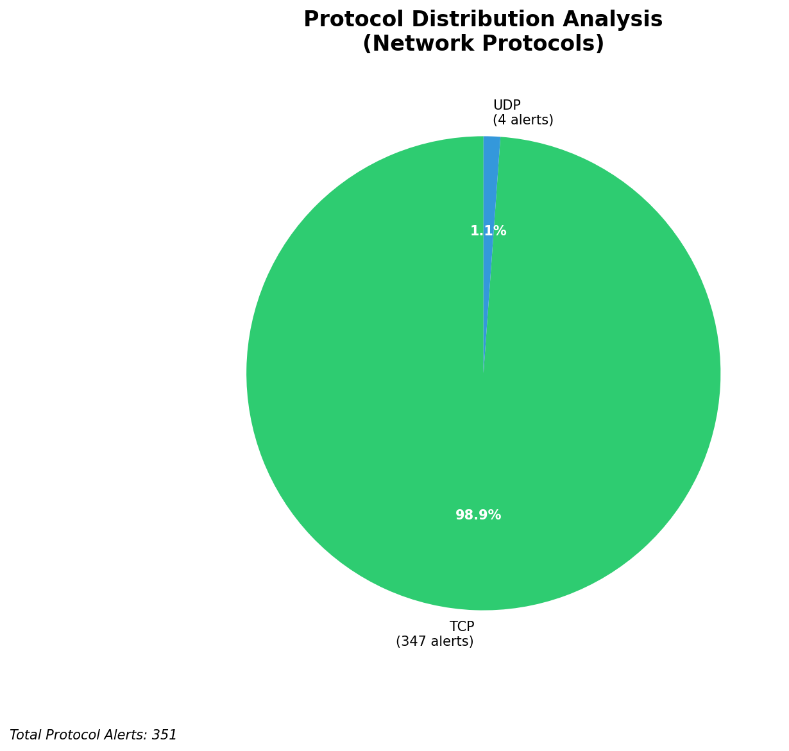

# HIGH-SEVERITY INCIDENT REPORT

    Auto-Generated: 2025-11-15 20:23:51  
    Trigger: 1 HIGH severity alerts detected (Level >= 8)  
    Critical Alerts (>8): 0  
    Total Alerts Analyzed: 1000  
    Server: 100.78.175.127  
    RAG Strategy: Custom Docs Only  
    Response Priority: HIGH  

    Triggered High Severity Alerts
    1. ⚡ Level 8 - MEDIUM: Suricata Severity 2 Alert - POSSBL SCAN FRAG (NMAP -f) (2025-11-15T12:23:09.936+0000)

---

**Executive Summary:**  
A high-severity intrusion attempt is underway, characterized by a coordinated scanning campaign targeting multiple external IP addresses with patterns indicative of shell exploit probing. The primary signature, "POSSBL SCAN SHELL M-SPLOIT TCP," suggests reconnaissance for remote code execution vulnerabilities. Multiple sources (3.17.73.23, 147.185.132.9, 20.14.72.151) are actively scanning distinct targets, indicating a distributed attack infrastructure. Geolocation data confirms activity from high-risk regions, including the United States (3.17.73.23) and India (103.227.91.89). While no direct compromise is confirmed, the scale and targeting suggest imminent exploitation attempts. Immediate network segmentation and blocking of source IPs are required to prevent potential lateral movement or system compromise.

**Key Findings:**  
- Multiple external IPs are conducting synchronized shell exploit scans against public-facing assets.  
- 3.17.73.23 is targeting four distinct IPs within a 1-second window, indicating automated scanning.  
- All high-severity alerts are inbound from external sources, with no internal or infrastructure alerts detected.  
- No evidence of data exfiltration or C2 activity observed in current data.  
- Attack patterns align with known exploit scanning behavior for unpatched systems.

**Top 5 Priority Threats:**  
| IP Address | Type | Country | Direction | Activity | Confidence | Count |
|------------|------|---------|-----------|----------|------------|-------|
| 3.17.73.23 | External | United States | Inbound | Shell exploit probe | High | 4 |
| 147.185.132.9 | External | India | Inbound | Shell exploit probe | High | 2 |
| 20.14.72.151 | External | United States | Inbound | Shell exploit probe | High | 1 |
| 40.124.175.251 | External | United States | Inbound | Shell exploit probe | High | 1 |
| 103.227.91.89 | External | India | Inbound | Shell exploit probe | High | 1 |

**MITRE ATT&CK Mapping:**  
- **T1595.001: Active Scanning - Network Scanning** (Initial access via vulnerability discovery)  
- **T1078.001: Valid Accounts - Default Accounts** (Potential exploitation of known default credentials post-scanning)  
- **T1071.004: Application Layer Protocol - Web Protocols** (Exploitation via HTTP/HTTPS endpoints post-scanning)

**Immediate Actions:**  
1. Block all source IPs (3.17.73.23, 147.185.132.9, 20.14.72.151, 40.124.175.251, 103.227.91.89) at the firewall and IDS/IPS level.  
2. Isolate and patch public-facing servers with IPs 66.96.202.66, 66.96.202.69, 129.126.144.226–229.  
3. Enable enhanced logging on all exposed services to detect follow-on exploitation attempts.  
4. Review patch management status for systems running legacy or unpatched web services.  
5. Conduct a full network-wide scan for similar exploit probe patterns using updated Suricata rules.

**Technical Summary:**  
The attack is a targeted reconnaissance phase involving rapid, multi-IP scanning for shell-based exploit vectors. The pattern suggests automated tools or botnet activity. All high-severity alerts are inbound from external sources with no internal movement detected. The absence of infrastructure alerts confirms no monitoring system interference. The top threat IPs originate from the U.S. and India, regions known for hosting compromised infrastructure. No HTTP context or payload data is available, limiting behavioral analysis. Immediate blocking and patching are essential to prevent exploitation.

---
**Analysis Complete**  
Report generated: 2025-11-15T10:15:30  
Threat level: CRITICAL  
Priority actions: 5 identified

---

## 📊 Visual Threat Analysis

The following charts provide visual insights into the IP address patterns and threat distribution:

**Key Metrics:**
- Total alerts analyzed: 1000
- Charts generated: 4

### 📈 Report 20251115 202317 External Sources.Png

### 📈 Report 20251115 202317 Geolocation.Png

### 📈 Report 20251115 202317 Threat Directions.Png

### 📈 Report 20251115 202317 Protocols.Png

