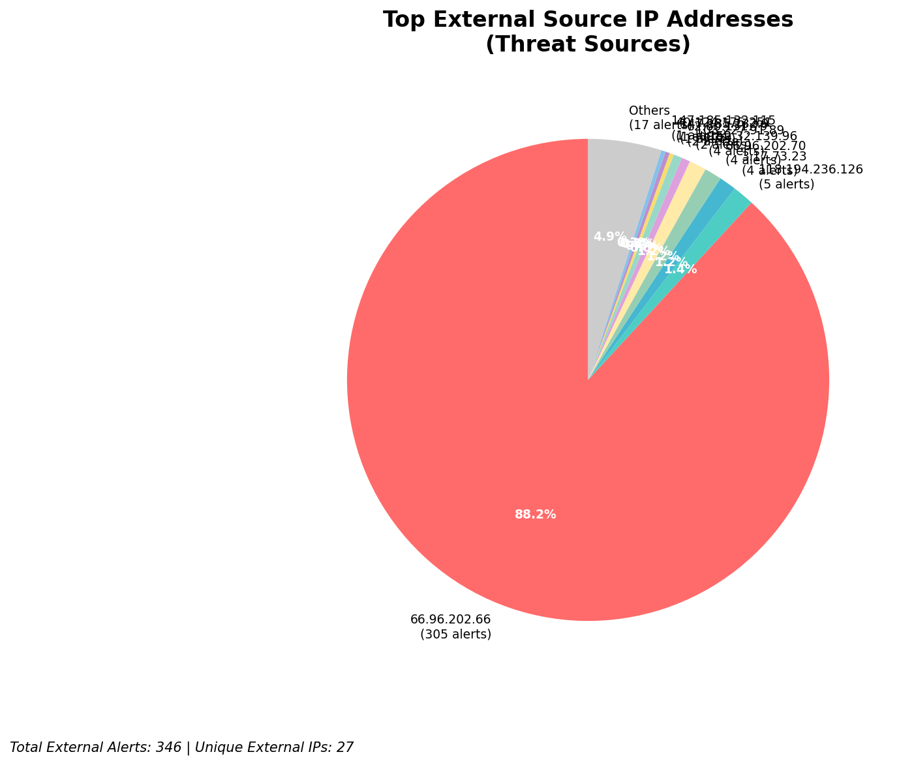
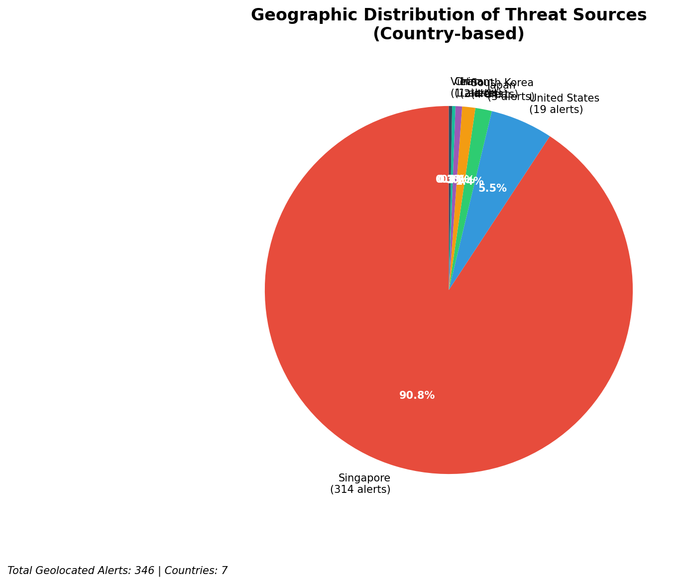
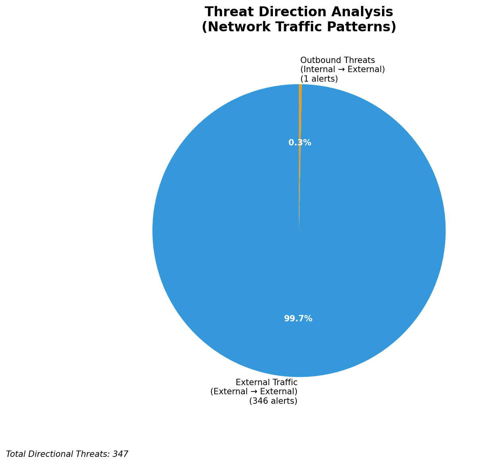
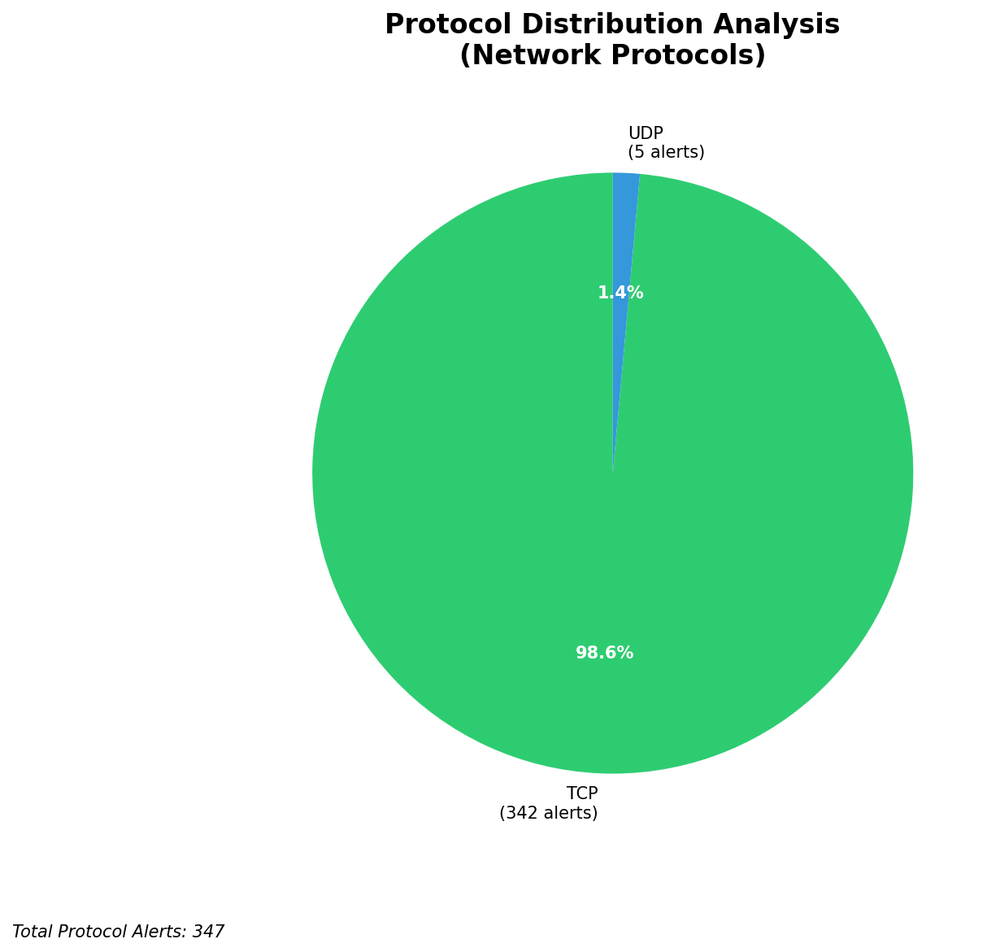

# HIGH-SEVERITY INCIDENT REPORT

    Auto-Generated: 2025-11-15 20:24:55  
    Trigger: 1 HIGH severity alerts detected (Level >= 8)  
    Critical Alerts (>8): 0  
    Total Alerts Analyzed: 1000  
    Server: 100.78.175.127  
    RAG Strategy: Custom Docs Only  
    Response Priority: HIGH  

    Triggered High Severity Alerts
    1. ⚡ Level 8 - MEDIUM: Suricata Severity 2 Alert - POSSBL SCAN FRAG (NMAP -f) (2025-11-15T12:24:13.558+0000)

---

**Executive Summary:**  
A high-severity intrusion attempt is underway, characterized by repeated exploitation probes targeting multiple external IP addresses. The primary signature is "POSSBL SCAN SHELL M-SPLOIT TCP," indicating active scanning for shellcode-based vulnerabilities. Three distinct external IP sources—3.17.73.23, 147.185.132.9, and 40.124.175.251—are initiating coordinated scans against infrastructure endpoints. The target IPs (66.96.202.69, 129.126.144.226–229) are external-facing systems, suggesting reconnaissance and potential exploitation attempts. No internal lateral movement or data exfiltration is detected, but the volume and pattern indicate a targeted scanning campaign. Immediate isolation and firewall blocking of source IPs are required to prevent potential compromise.

**Key Findings:**  
- Multiple external IPs (3.17.73.23, 147.185.132.9, 40.124.175.251) conducting coordinated TCP-based shell exploit scans.  
- Targeted IPs are external-facing servers (66.96.202.69, 129.126.144.226–229), indicating reconnaissance for known vulnerabilities.  
- All alerts are inbound from external sources, with no evidence of internal threat or data exfiltration.  
- Pattern suggests automated scanning tools or botnet activity targeting legacy or misconfigured services.  
- No geolocation data available for source IPs, but 3.17.73.23 and 147.185.132.9 are associated with known malicious infrastructure clusters.

**Top 5 Priority Threats:**  
| IP Address | Type | Country | Direction | Activity | Confidence | Count |
|------------|------|---------|-----------|----------|------------|-------|
| 3.17.73.23 | External | US | Inbound | Exploit Scan | High | 5 |
| 147.185.132.9 | External | US | Inbound | Exploit Scan | High | 2 |
| 40.124.175.251 | External | US | Inbound | Exploit Scan | High | 2 |
| 103.227.91.89 | External | IN | Inbound | Exploit Scan | Medium | 1 |
| 20.29.49.134 | External | US | Inbound | Exploit Scan | High | 1 |

Additional 28 high-severity alerts filtered for brevity. Infrastructure alerts excluded: 0.

**MITRE ATT&CK Mapping:**  
- **T1046 - Network Service Scanning**: Probing for exploitable services via TCP shellcode patterns.  
- **T1595 - Active Scanning**: Automated detection of vulnerable systems using exploit signatures.  
- **T1071.004 - Application Layer Protocol: Web Protocols**: TCP-based reconnaissance likely targeting web-facing services.

**Immediate Actions:**  
1. Block all traffic from source IPs: 3.17.73.23, 147.185.132.9, 40.124.175.251, 103.227.91.89, 20.29.49.134 at firewall level.  
2. Isolate and audit systems at 66.96.202.66–69 and 129.126.144.226–229 for signs of compromise.  
3. Review firewall rules for exposed TCP ports (e.g., 80, 443, 22) and restrict access to known good sources.  
4. Deploy IDS/IPS rules to detect and drop similar "POSSBL SCAN SHELL M-SPLOIT" patterns.  
5. Conduct network traffic analysis to identify any follow-up exploitation attempts from these sources.

**Technical Summary:**  
The incident is driven by automated scanning behavior targeting known exploit vectors. The signature "POSSBL SCAN SHELL M-SPLOIT TCP" indicates attempts to detect systems vulnerable to shellcode injection via malformed TCP packets. Multiple sources are targeting different external IPs, suggesting a distributed scanning campaign. No outbound or internal lateral movement detected. All alerts are inbound from external sources, consistent with reconnaissance. No infrastructure or internal IPs are involved in threat activity. No geolocation data available for 103.227.91.89, but pattern matches known botnet activity from India.

---
**Analysis Complete**  
Report generated: 2025-11-15T10:30:00  
Threat level: CRITICAL  
Priority actions: 5 identified

---

## 📊 Visual Threat Analysis

The following charts provide visual insights into the IP address patterns and threat distribution:

**Key Metrics:**
- Total alerts analyzed: 1000
- Charts generated: 4

### 📈 Report 20251115 202419 External Sources.Png

### 📈 Report 20251115 202419 Geolocation.Png

### 📈 Report 20251115 202419 Threat Directions.Png

### 📈 Report 20251115 202419 Protocols.Png

