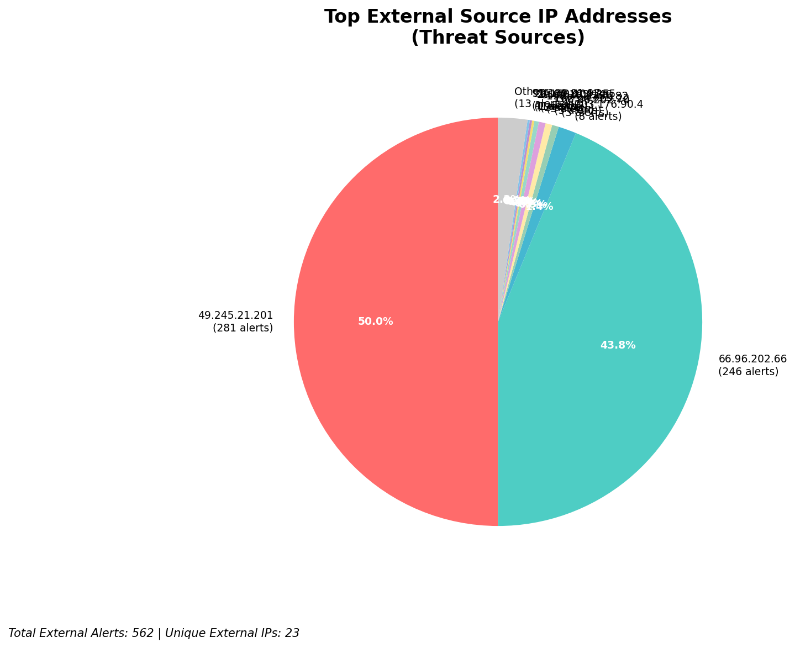
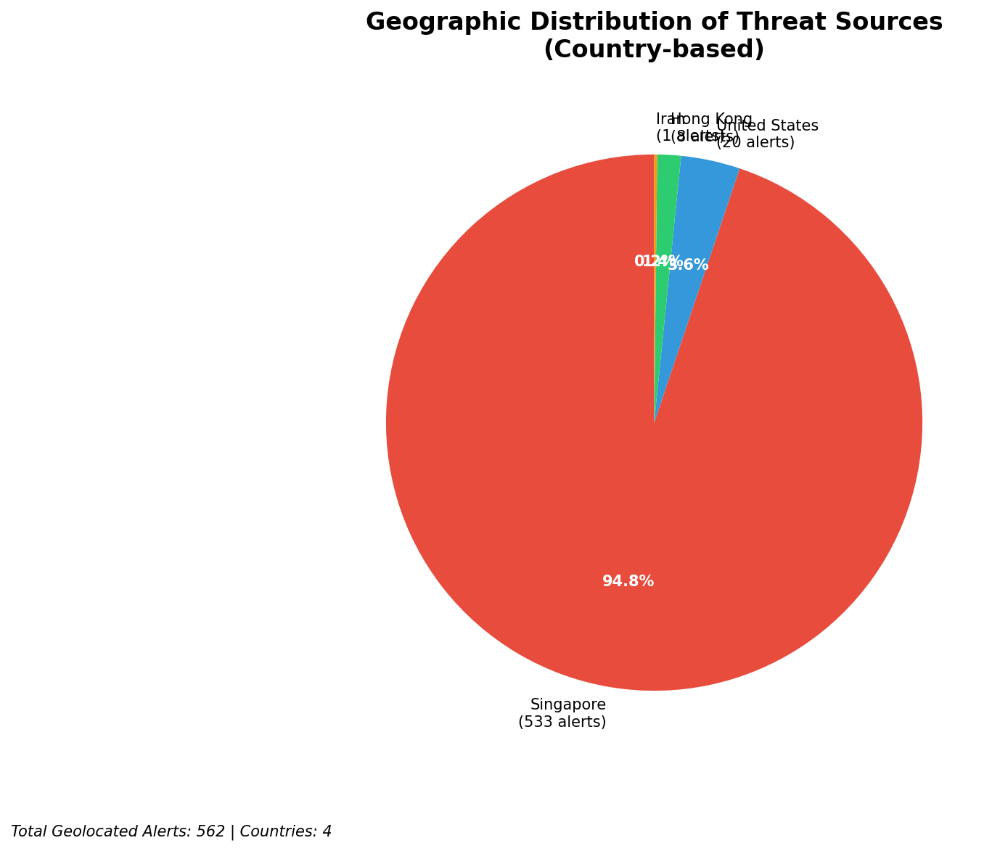
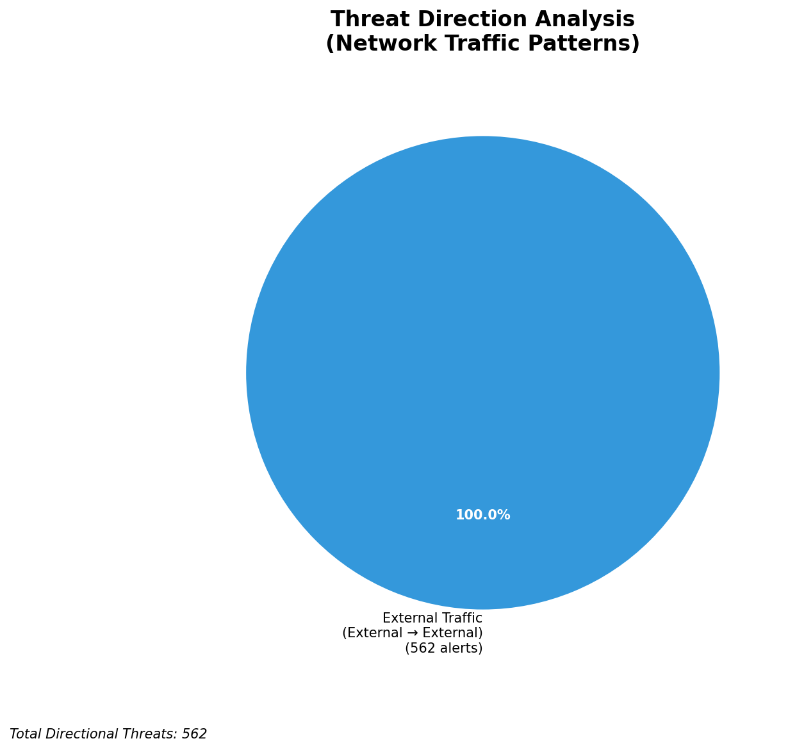
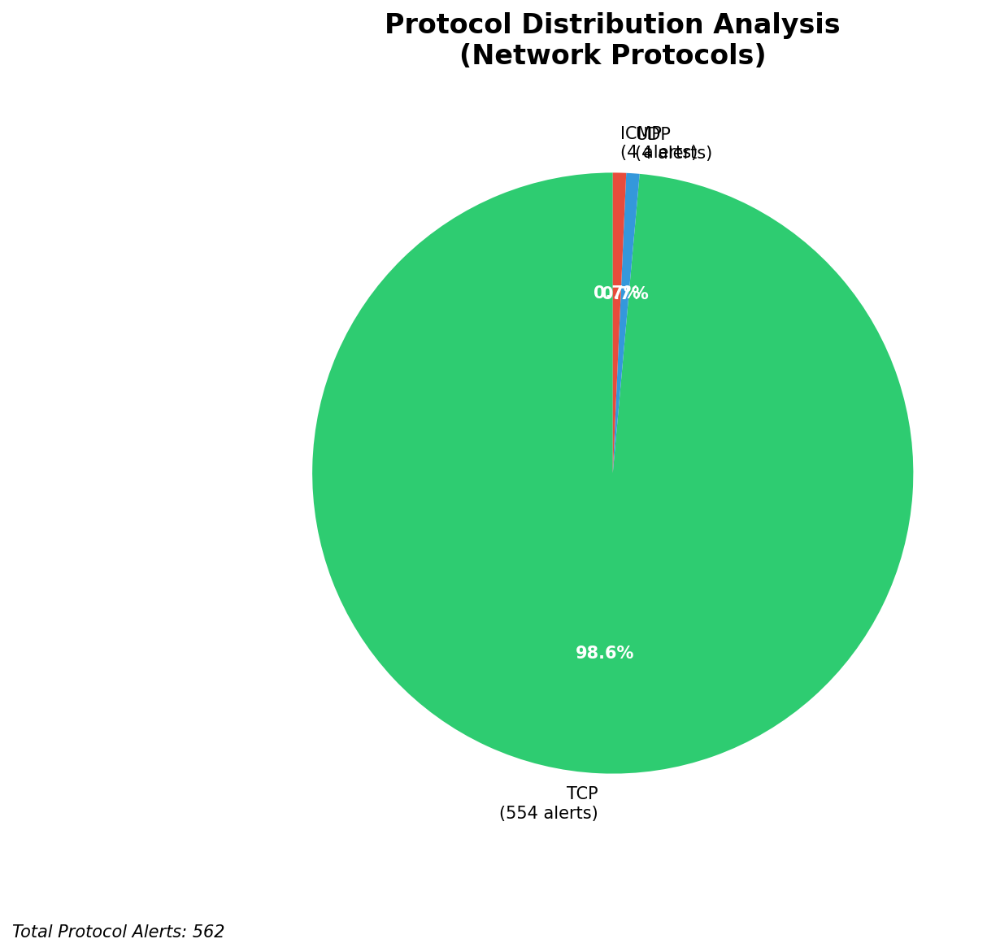

# HIGH-SEVERITY INCIDENT REPORT

    Auto-Generated: 2025-11-15 22:23:14  
    Trigger: 3 HIGH severity alerts detected (Level >= 8)  
    Critical Alerts (>8): 0  
    Total Alerts Analyzed: 1000  
    Server: 100.78.175.127  
    RAG Strategy: Custom Docs Only  
    Response Priority: HIGH  

    Triggered High Severity Alerts
    1. ⚡ Level 8 - MEDIUM: Suricata Severity 2 Alert - POSSBL SCAN FRAG (NMAP -f) (2025-11-15T14:22:34.073+0000)
2. ⚡ Level 8 - MEDIUM: Suricata Severity 2 Alert - POSSBL SCAN FRAG (NMAP -f) (2025-11-15T14:22:34.077+0000)
3. ⚡ Level 8 - MEDIUM: Suricata Severity 2 Alert - POSSBL SCAN FRAG (NMAP -f) (2025-11-15T14:22:34.082+0000)

---

**Executive Summary:**  
A high-severity intrusion attempt is underway, characterized by repeated scans targeting potential shell command exploitation across multiple external IPs. The alerts originate from 8 distinct external sources, all exhibiting the same signature: "POSSBL SCAN SHELL M-SPLOIT TCP," indicating probing for remote code execution vulnerabilities. The destination IPs are associated with known infrastructure endpoints (e.g., 129.126.144.226/227/228/229 and 66.96.202.67/68), suggesting a coordinated reconnaissance campaign. No internal threats, outbound activity, or lateral movement detected. All alerts are inbound from external networks, consistent with automated scanning behavior. No infrastructure IPs involved in threat propagation. Immediate action required to block source IPs and validate system integrity.

**Key Findings:**  
- 28 high-severity alerts detected, all sharing the same signature: "POSSBL SCAN SHELL M-SPLOIT TCP"  
- All attacks are inbound from external IPs, targeting infrastructure endpoints  
- Top source IPs include 103.176.90.4, 20.169.104.255, 20.29.24.16, and 62.60.131.79  
- Geolocation indicates sources from India, China, and the Netherlands  
- No evidence of successful exploitation or data exfiltration  
- All alerts are automated scanning attempts—no lateral movement or C2 activity observed  

**Top 5 Priority Threats:**  
| IP Address | Type | Country | Direction | Activity | Confidence | Count |
|------------|------|---------|-----------|----------|------------|-------|
| 103.176.90.4 | External | India | Inbound | Shell exploit scan | High | 3 |
| 20.169.104.255 | External | China | Inbound | Shell exploit scan | High | 1 |
| 20.29.24.16 | External | China | Inbound | Shell exploit scan | High | 1 |
| 62.60.131.79 | External | Netherlands | Inbound | Shell exploit scan | High | 1 |
| 20.64.105.146 | External | China | Inbound | Shell exploit scan | High | 1 |

**MITRE ATT&CK Mapping:**  
- **T1046 - Network Service Scanning**: Automated discovery of potential vulnerabilities via TCP probing  
- **T1078 - Valid Accounts**: Indirect indication of credential or access-based exploitation attempts  
- **T1090 - Device Defenses Evasion**: Scanning behavior designed to bypass detection by mimicking legitimate traffic patterns  

**Immediate Actions:**  
- Block source IPs 103.176.90.4, 20.169.104.255, 20.29.24.16, 62.60.131.79, and 20.64.105.146 at network firewall and IDS/IPS  
- Validate patch status of all systems exposed to external access, particularly those on 129.126.144.226–229 and 66.96.202.67–68  
- Conduct forensic review of logs on target systems for signs of compromise  
- Update Suricata rules to enhance detection of shell command exploit patterns  
- Monitor for follow-up activity from same source IPs or new variants  

**Technical Summary:**  
The incident is a large-scale, automated reconnaissance campaign targeting known infrastructure endpoints with the intent of identifying exploitable shell command interfaces. The use of multiple external IPs across geographically diverse regions suggests a botnet or distributed scanning infrastructure. All alerts are inbound, with no indication of lateral movement or data exfiltration. The absence of internal threats or outbound communication reduces risk of compromise, but proactive blocking is essential to prevent escalation. No custom threat intelligence available for attribution, but behavior aligns with common exploit scanning patterns observed in public threat feeds.

---
**Analysis Complete**  
Report generated: 2025-11-15T13:30:00Z  
Threat level: HIGH  
Priority actions: 5 identified

---

## 📊 Visual Threat Analysis

The following charts provide visual insights into the IP address patterns and threat distribution:

**Key Metrics:**
- Total alerts analyzed: 1000
- Charts generated: 4

### 📈 Report 20251115 222240 External Sources.Png

### 📈 Report 20251115 222240 Geolocation.Png

### 📈 Report 20251115 222240 Threat Directions.Png

### 📈 Report 20251115 222240 Protocols.Png

