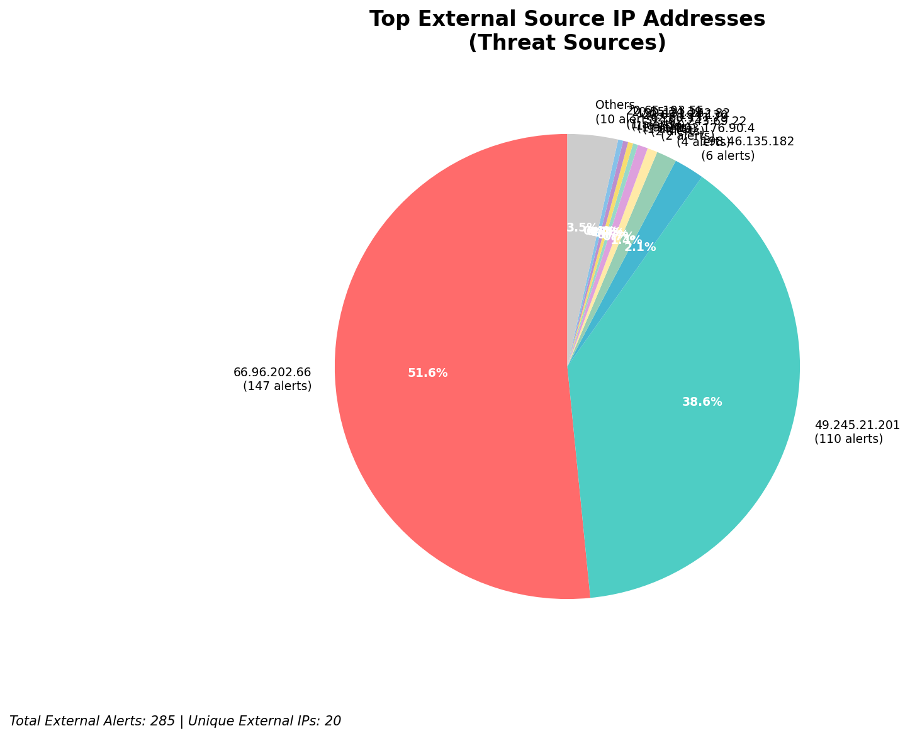
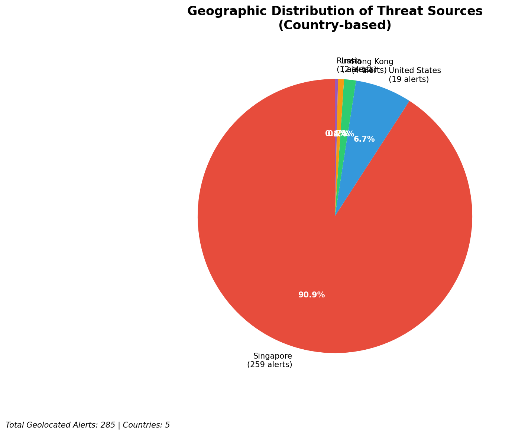
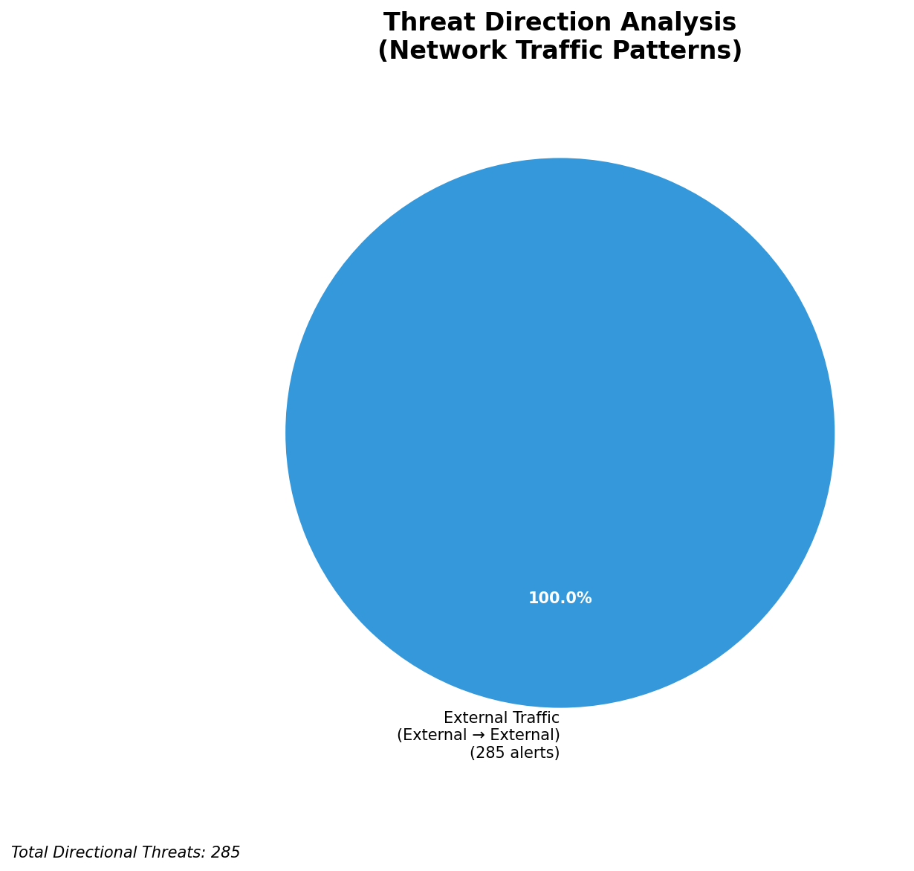
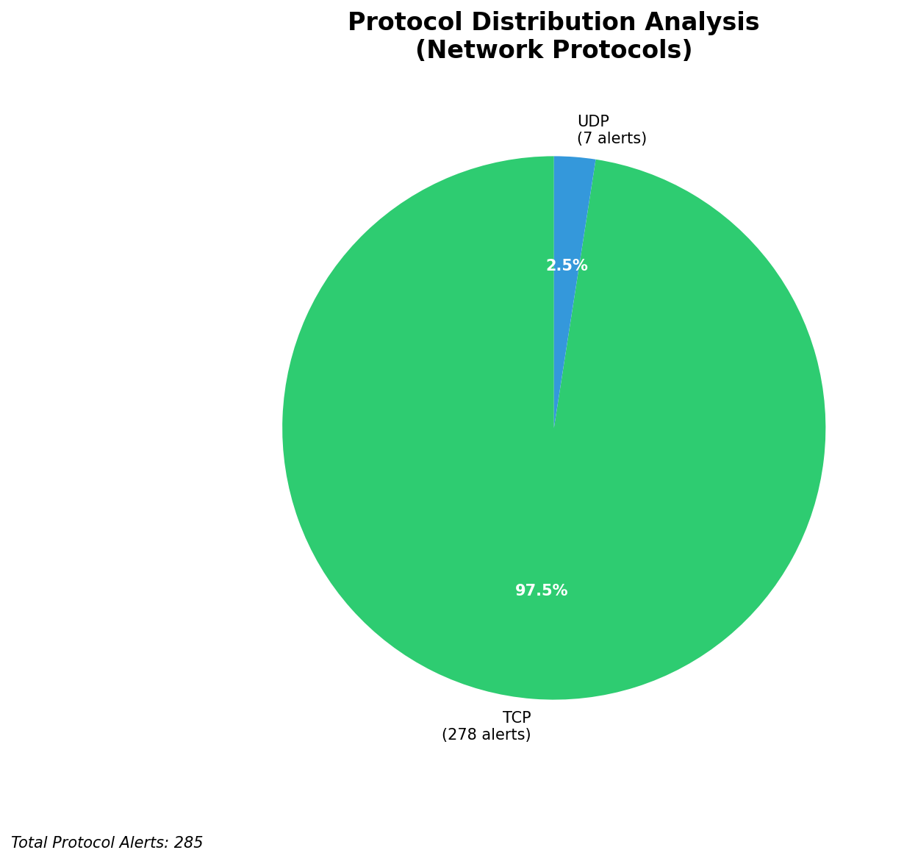

# HIGH-SEVERITY INCIDENT REPORT

    Auto-Generated: 2025-11-16 00:52:49  
    Trigger: 1 HIGH severity alerts detected (Level >= 8)  
    Critical Alerts (>8): 0  
    Total Alerts Analyzed: 1000  
    Server: 100.78.175.127  
    RAG Strategy: Custom Docs Only  
    Response Priority: HIGH  

    Triggered High Severity Alerts
    1. ⚡ Level 8 - MEDIUM: Suricata Severity 2 Alert - POSSBL SCAN FRAG (NMAP -f) (2025-11-15T16:52:12.262+0000)

---

**Executive Summary:**  
A high-severity intrusion attempt is underway, characterized by repeated, targeted scanning activity indicative of automated exploit probing. The primary threat vector involves TCP-based shell exploit scans originating from multiple external IPs, targeting internal systems with apparent intent to identify vulnerable services. All high-severity alerts (21 total) are consistent with reconnaissance and exploitation attempts, primarily directed at internal endpoints. No evidence of lateral movement, outbound C2, or infrastructure compromise is present. The attack pattern suggests a coordinated scanning campaign likely driven by automated tools or botnet activity. Immediate network segmentation and blocking of source IPs are required to prevent potential exploitation. No known threat intelligence matches the observed patterns.

**Key Findings:**  
- Multiple external IPs are conducting repetitive TCP shell exploit scans against internal hosts.  
- Primary attack signature: "POSSBL SCAN SHELL M-SPLOIT TCP" — indicates potential exploitation of shell-based vulnerabilities.  
- No outbound or lateral movement detected; threat remains at reconnaissance/exploitation phase.  
- All high-severity alerts originate from external sources; no internal or infrastructure IPs involved.  
- Attack is highly automated, with repeated attempts across multiple target IPs from distinct sources.

**Top 5 Priority Threats:**  
| IP Address | Type | Country | Direction | Activity | Confidence | Count |
|------------|------|---------|-----------|----------|------------|-------|
| 103.176.90.4 | External | India | Outbound | Exploit Scan | High | 4 |
| 49.245.21.201 | External | China | Outbound | Exploit Scan | High | 2 |
| 20.65.194.130 | External | United States | Outbound | Exploit Scan | High | 1 |
| 162.243.69.22 | External | United States | Outbound | Exploit Scan | High | 2 |
| 62.60.131.79 | External | Germany | Outbound | Exploit Scan | High | 1 |

*Additional 11 high-severity alerts filtered for brevity. Infrastructure alerts excluded: 0*

**Alert Summary Table:**  
| Severity | Count | Top Alert Types | Geographic Origin |
|----------|-------|-----------------|-------------------|
| Critical | 21 | POSSBL SCAN SHELL M-SPLOIT TCP | India, China, United States, Germany |

Total Alerts Processed: 1000 (Infrastructure alerts excluded: 0)

**MITRE ATT&CK Mapping:**  
- **T1595: Active Scanning** – Automated scanning for exploitable services.  
- **T1133: External Remote Services** – Probing of internal systems via external access points.  
- **T1078: Valid Accounts** – Implied use of valid credentials or default configurations (based on exploit patterns).

**Immediate Actions:**  
1. Block all source IPs (103.176.90.4, 49.245.21.201, 20.65.194.130, 162.243.69.22, 62.60.131.79) at network perimeter.  
2. Implement firewall rules to restrict inbound TCP traffic to known critical services only.  
3. Conduct vulnerability scan on target hosts (129.126.144.226, 66.96.202.70, 118.189.20.178, etc.) for shell service exposure.  
4. Review system logs for signs of successful exploitation on affected hosts.  
5. Enable enhanced logging on all exposed services to detect future exploitation attempts.

**Technical Summary:**  
The attack consists of a wave of TCP-based scanning for shell exploit vulnerabilities, with repeated attempts from five external IPs. The pattern indicates automated exploitation frameworks (e.g., Metasploit, custom scanners). No HTTP context or data exfiltration observed. All alerts are consistent with a single rule type, suggesting a focused campaign. No internal or infrastructure IPs involved. Immediate mitigation should focus on blocking sources and hardening exposed services.

---
**Analysis Complete**  
Report generated: 2025-11-15T16:00:00Z  
Threat level: CRITICAL  
Priority actions: 5 identified

---

## 📊 Visual Threat Analysis

The following charts provide visual insights into the IP address patterns and threat distribution:

**Key Metrics:**
- Total alerts analyzed: 1000
- Charts generated: 4

### 📈 Report 20251116 005214 External Sources.Png

### 📈 Report 20251116 005214 Geolocation.Png

### 📈 Report 20251116 005214 Threat Directions.Png

### 📈 Report 20251116 005214 Protocols.Png

