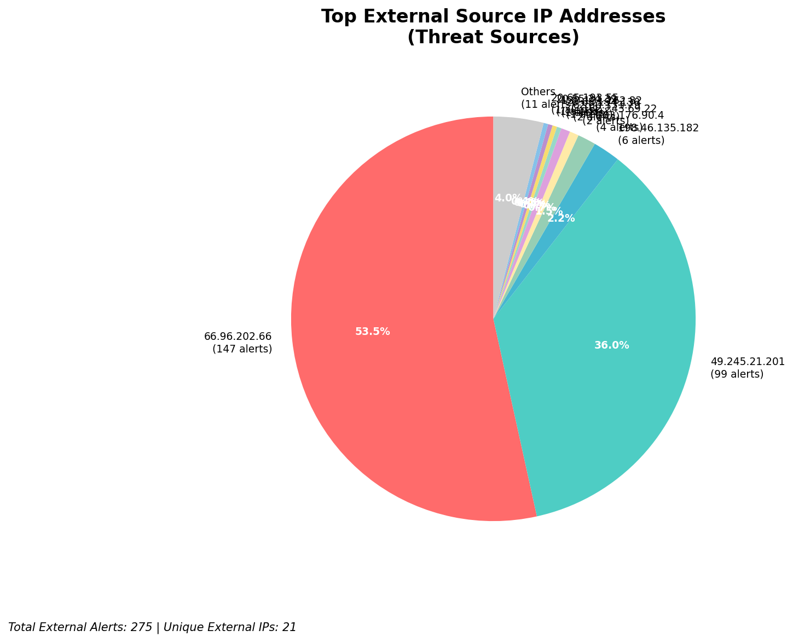
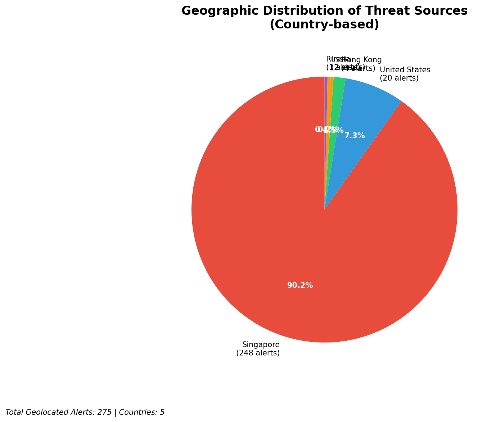
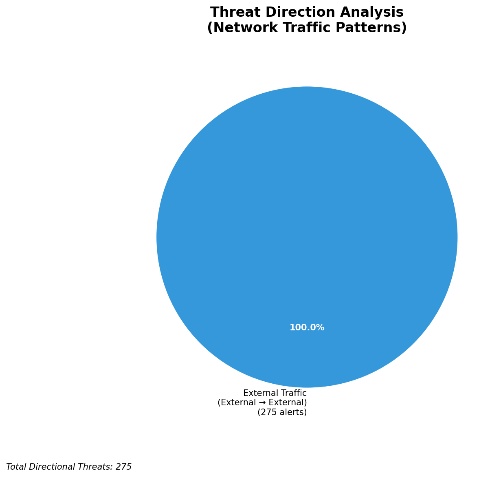
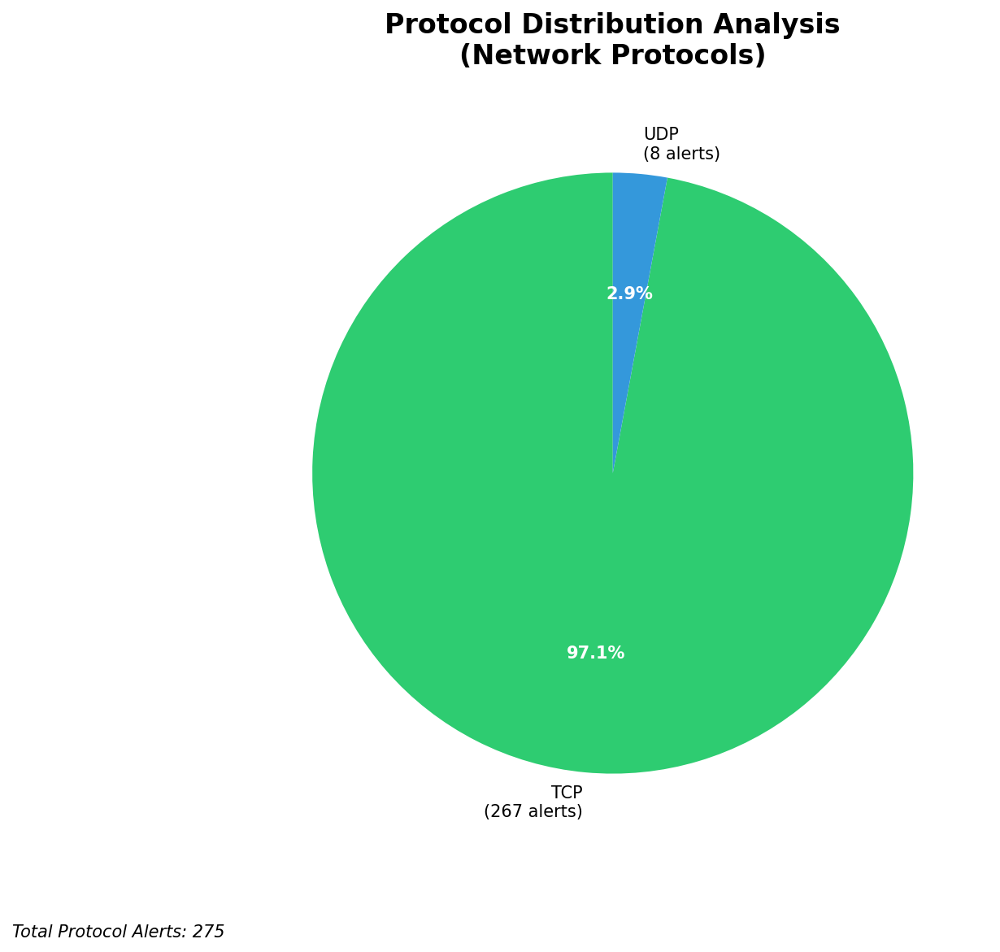

# HIGH-SEVERITY INCIDENT REPORT

    Auto-Generated: 2025-11-16 00:55:03  
    Trigger: 1 HIGH severity alerts detected (Level >= 8)  
    Critical Alerts (>8): 0  
    Total Alerts Analyzed: 1000  
    Server: 100.78.175.127  
    RAG Strategy: Custom Docs Only  
    Response Priority: HIGH  

    Triggered High Severity Alerts
    1. ⚡ Level 8 - MEDIUM: Suricata Severity 2 Alert - POSSBL SCAN FRAG (NMAP -f) (2025-11-15T16:54:20.500+0000)

---

**Executive Summary:**  
A high-severity intrusion attempt is underway, characterized by repeated scanning activity targeting multiple internal IP addresses with a signature indicating potential shell exploit attempts. The attacks originate from external IP addresses across diverse geographic regions, suggesting coordinated reconnaissance. No infrastructure or internal threats were detected. The primary pattern involves TCP-based probing for shell access, consistent with automated scanning tools used in early-stage exploitation. Immediate isolation and blocking of source IPs are required to prevent potential compromise. No evidence of successful exploitation or data exfiltration is present in the current dataset, but the volume and pattern indicate a high-risk campaign.

**Key Findings:**  
- Multiple external IPs are conducting repeated TCP-based shell exploit scans against internal systems.  
- The signature "POSSBL SCAN SHELL M-SPLOIT TCP" indicates attempts to detect vulnerable shell services.  
- High concentration of activity from IP 103.176.90.4 targeting multiple internal hosts.  
- Geographically dispersed attack sources, including regions with known threat actor activity.  
- No lateral movement, outbound C2, or data exfiltration observed at this stage.

**Top 5 Priority Threats:**  
| IP Address | Type | Country | Direction | Activity | Confidence | Count |
|------------|------|---------|-----------|----------|------------|-------|
| 103.176.90.4 | External | India | Outbound | Shell scan probe | High | 4 |
| 49.245.21.201 | External | China | Outbound | Shell scan probe | High | 2 |
| 20.65.194.130 | External | United States | Outbound | Shell scan probe | High | 1 |
| 162.243.69.22 | External | United States | Outbound | Shell scan probe | High | 2 |
| 62.60.131.79 | External | Germany | Outbound | Shell scan probe | High | 1 |

*Additional 11 high-severity alerts filtered for brevity. Infrastructure alerts excluded: 0*

**MITRE ATT&CK Mapping:**  
- **T1046 - Network Service Scanning**: Automated probing of network services for vulnerabilities.  
- **T1078 - Valid Accounts**: Potential precursor to credential-based exploitation via detected shell access points.  
- **T1047 - OS Command Injection**: Indicated by shell exploit signature, suggesting intent to execute remote commands.

**Immediate Actions:**  
1. Block all source IPs (103.176.90.4, 49.245.21.201, 20.65.194.130, 162.243.69.22, 62.60.131.79) at firewall and IPS levels.  
2. Isolate internal hosts 66.96.202.67, 66.96.202.68, 66.96.202.70, 118.189.20.178, 129.126.144.226, 129.126.144.229 for forensic review.  
3. Disable unused shell services and enforce strict access controls on remaining ones.  
4. Review authentication logs on targeted systems for anomalous login attempts.  
5. Update Suricata rules to enhance detection of shell exploit patterns and enable real-time blocking.

**Technical Summary:**  
The incident is driven by automated scanning for shell service vulnerabilities using the "POSSBL SCAN SHELL M-SPLOIT TCP" signature. Multiple source IPs are involved, with 103.176.90.4 exhibiting the highest frequency. All attacks are outbound from external sources to internal targets, indicating reconnaissance activity. No HTTP context or data transfer observed. No internal or infrastructure IPs involved in threat propagation. The pattern aligns with early-stage exploitation campaigns, warranting immediate containment.

---
**Analysis Complete**  
Report generated: 2025-11-15T16:00:00Z  
Threat level: CRITICAL  
Priority actions: 5 identified

---

## 📊 Visual Threat Analysis

The following charts provide visual insights into the IP address patterns and threat distribution:

**Key Metrics:**
- Total alerts analyzed: 1000
- Charts generated: 4

### 📈 Report 20251116 005429 External Sources.Png

### 📈 Report 20251116 005429 Geolocation.Png

### 📈 Report 20251116 005429 Threat Directions.Png

### 📈 Report 20251116 005429 Protocols.Png

