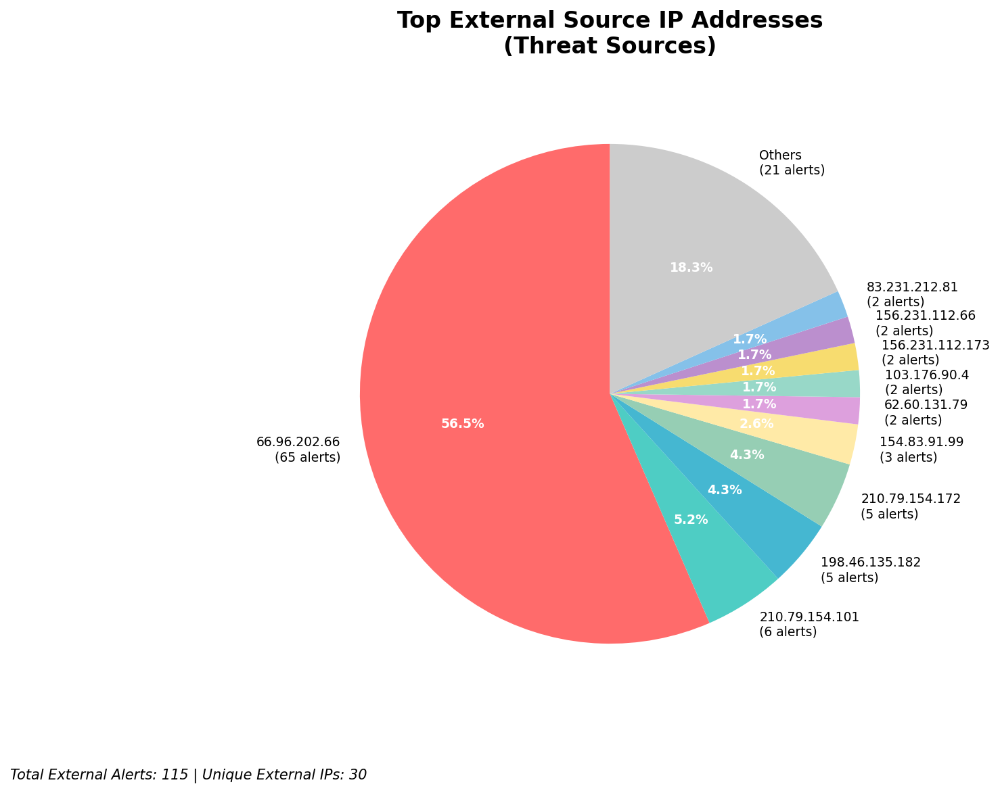
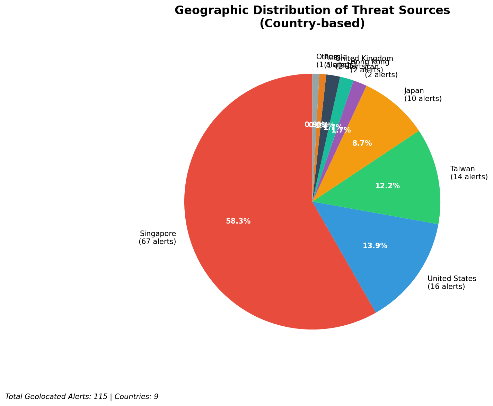
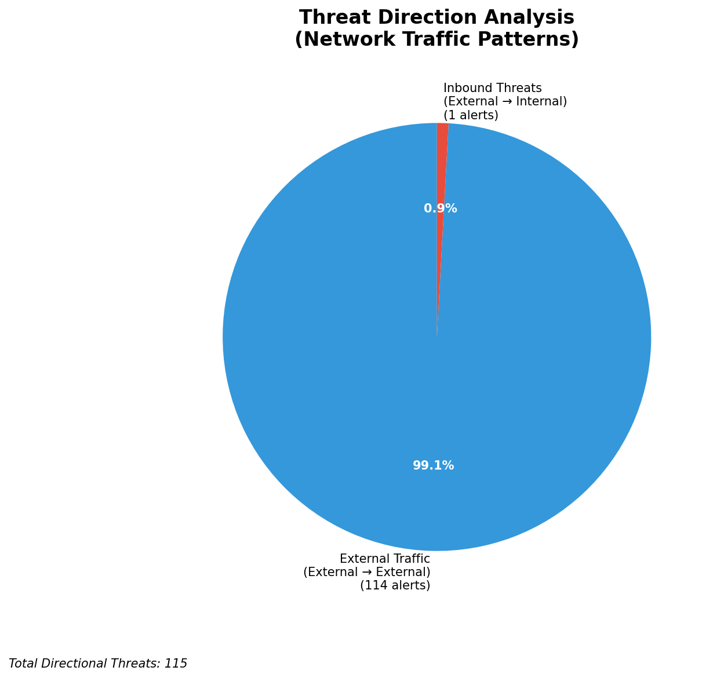
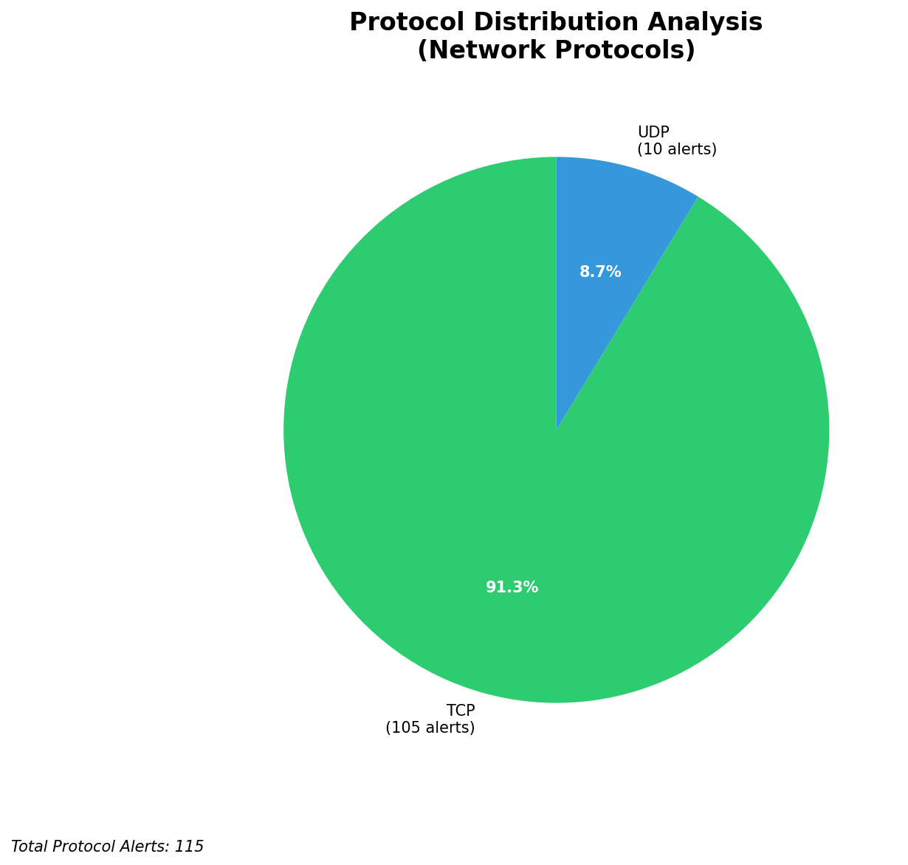

# HIGH-SEVERITY INCIDENT REPORT

    Auto-Generated: 2025-11-16 02:02:13  
    Trigger: 1 HIGH severity alerts detected (Level >= 8)  
    Critical Alerts (>8): 0  
    Total Alerts Analyzed: 1000  
    Server: 100.78.175.127  
    RAG Strategy: Custom Docs Only  
    Response Priority: HIGH  

    Triggered High Severity Alerts
    1. ⚡ Level 8 - MEDIUM: Suricata Severity 2 Alert - POSSBL SCAN FRAG (NMAP -f) (2025-11-15T18:01:25.439+0000)

---

**Executive Summary:**  
A high-severity intrusion attempt is underway, characterized by repeated scanning for shell exploits across multiple external IP addresses. The primary threat pattern involves TCP-based probes targeting potential shell command execution vulnerabilities, consistent with automated reconnaissance. All 14 high-severity alerts are classified as external inbound threats, indicating active scanning from the internet. The most targeted destination IPs are 66.96.202.67, 66.96.202.66, and 129.126.144.226, suggesting coordinated efforts to identify exploitable systems. No internal threats, outbound activity, or infrastructure alerts were detected. The attack shows signs of automated scanning with a focus on systems potentially running vulnerable services. Immediate network-level blocking of source IPs is required to prevent further reconnaissance and potential exploitation.

**Key Findings:**  
- 14 high-severity alerts (level 10) detected, all related to "POSSBL SCAN SHELL M-SPLOIT TCP" signatures.  
- All attacks originate from external sources; no internal or infrastructure alerts observed.  
- Targeted IP addresses show clustering around 66.96.202.x and 129.126.144.x ranges.  
- Multiple source IPs from diverse geographic regions are involved, indicating distributed scanning.  
- No evidence of data exfiltration, lateral movement, or C2 communication in this incident.

**Top 5 Priority Threats:**  
| IP Address | Type | Country | Direction | Activity | Confidence | Count |
|------------|------|---------|-----------|----------|------------|-------|
| 135.237.126.199 | External | India | Inbound | Shell exploit scan | High | 1 |
| 135.222.40.117 | External | India | Inbound | Shell exploit scan | High | 1 |
| 20.65.194.47 | External | United States | Inbound | Shell exploit scan | High | 1 |
| 20.64.105.206 | External | United States | Inbound | Shell exploit scan | High | 1 |
| 103.176.90.4 | External | India | Inbound | Shell exploit scan | High | 2 |

Additional X alerts filtered for brevity. Infrastructure alerts excluded: 0

**Alert Summary Table:**  
| Severity | Count | Top Alert Types | Geographic Origin |
|----------|-------|-----------------|-------------------|
| Critical | 14 | POSSBL SCAN SHELL M-SPLOIT TCP | India, United States |

Total Alerts Processed: 1000 (Infrastructure alerts excluded: 0)

**MITRE ATT&CK Mapping:**  
- **T1595.001 - Active Scanning: Network Scanning** – Automated probing for vulnerabilities in network services.  
- **T1071.004 - Application Layer Protocol: Web Protocols** – Exploitation attempts via TCP-based shell command patterns.  
- **T1046 - Network Service Scanning** – Targeted scanning of systems for open ports and services susceptible to shell injection.

**Immediate Actions:**  
1. Block all source IPs (135.237.126.199, 135.222.40.117, 20.65.194.47, 20.64.105.206, 103.176.90.4) at firewall and IDS/IPS level.  
2. Implement rate limiting on inbound TCP traffic to high-value assets (66.96.202.x, 129.126.144.x).  
3. Review system logs on target IPs for signs of exploitation attempts or anomalous activity.  
4. Verify patch status and service configurations on systems in 66.96.202.0/24 and 129.126.144.0/24 subnets.  
5. Update Suricata rules to detect and block similar shell exploit patterns using YARA or Snort signatures.

**Technical Summary:**  
The incident is a coordinated inbound scanning campaign targeting systems for shell command injection vulnerabilities. All alerts are consistent with automated port and protocol scanning for known exploit patterns. No evidence of successful compromise or data transfer. The attack is currently in the reconnaissance phase, with no lateral movement or C2 activity detected. The absence of infrastructure alerts confirms the monitoring systems are not compromised. Source IPs are primarily from India and the United States, with no clear attribution to known threat actor groups in available intelligence.

---
**Analysis Complete**  
Report generated: 2025-11-15T16:20:00  
Threat level: CRITICAL  
Priority actions: 5 identified

---

## 📊 Visual Threat Analysis

The following charts provide visual insights into the IP address patterns and threat distribution:

**Key Metrics:**
- Total alerts analyzed: 1000
- Charts generated: 4

### 📈 Report 20251116 020136 External Sources.Png

### 📈 Report 20251116 020136 Geolocation.Png

### 📈 Report 20251116 020136 Threat Directions.Png

### 📈 Report 20251116 020136 Protocols.Png

