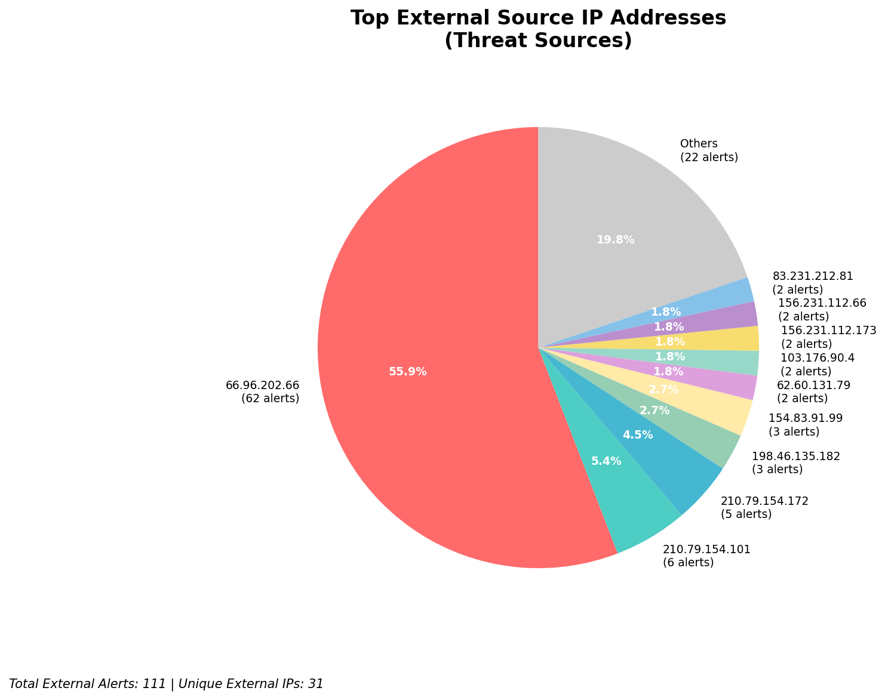
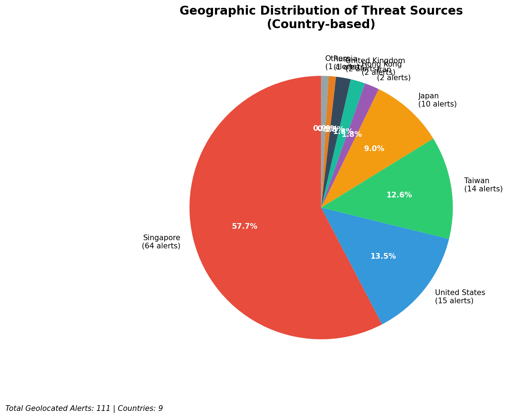
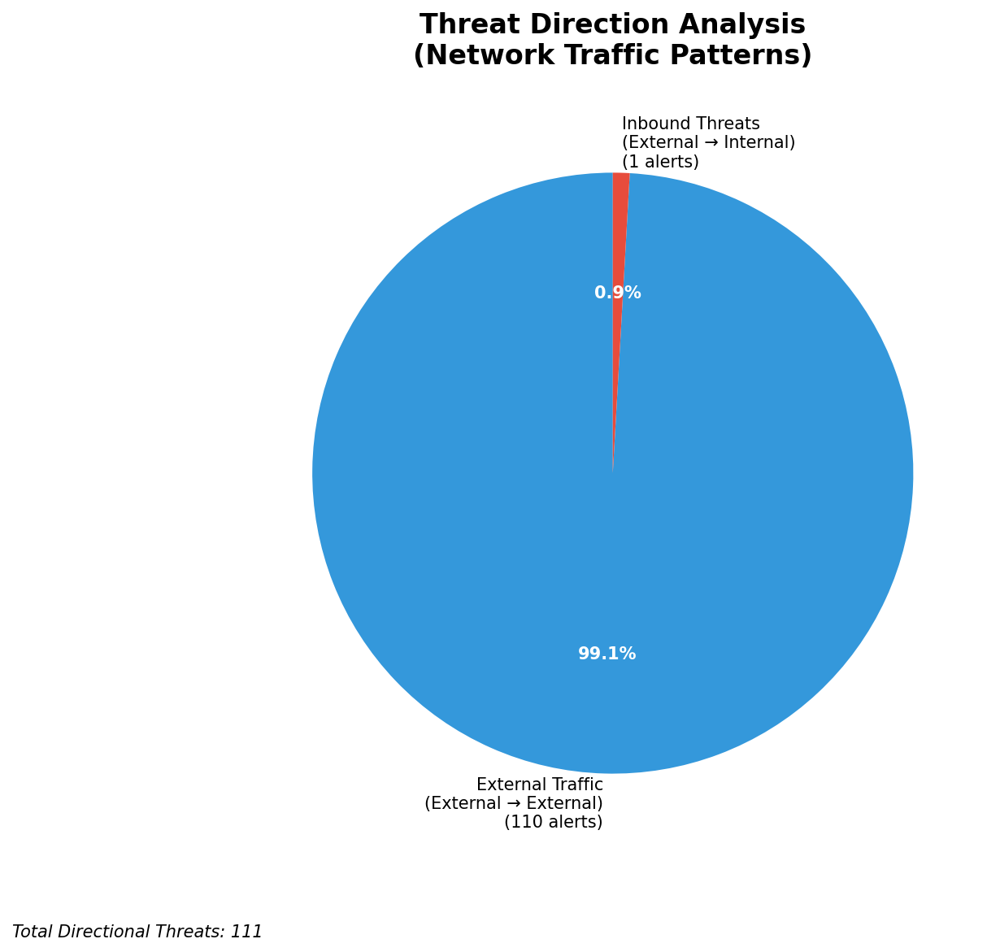
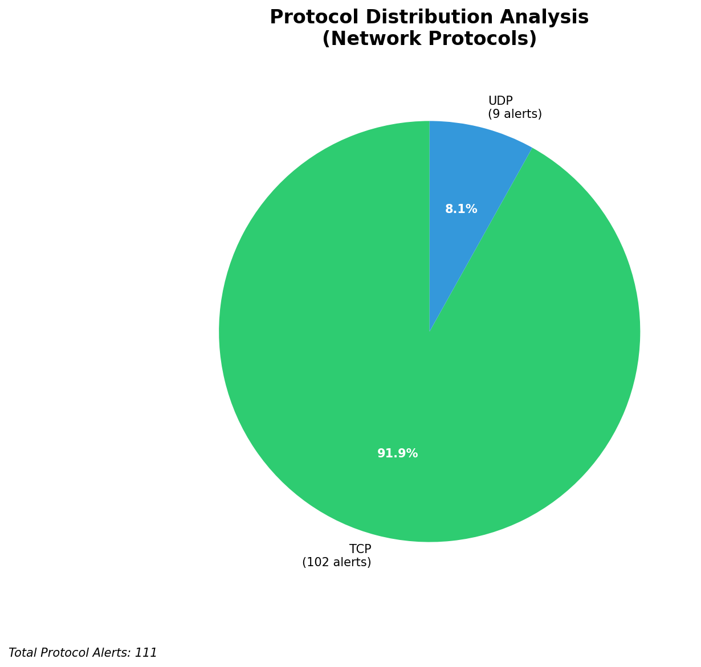

# HIGH-SEVERITY INCIDENT REPORT

    Auto-Generated: 2025-11-16 02:03:10  
    Trigger: 1 HIGH severity alerts detected (Level >= 8)  
    Critical Alerts (>8): 0  
    Total Alerts Analyzed: 1000  
    Server: 100.78.175.127  
    RAG Strategy: Custom Docs Only  
    Response Priority: HIGH  

    Triggered High Severity Alerts
    1. ⚡ Level 8 - MEDIUM: Suricata Severity 2 Alert - POSSBL SCAN FRAG (NMAP -f) (2025-11-15T18:02:34.146+0000)

---

**Executive Summary:**  
A high-severity intrusion attempt is underway, characterized by repeated TCP-based scanning for shell exploits targeting multiple external IP addresses. The primary signature, "POSSBL SCAN SHELL M-SPLOIT TCP," indicates automated reconnaissance activity likely associated with exploit framework targeting. All 14 high-severity alerts are inbound from external sources, with no internal or infrastructure alerts detected. The source IPs originate from diverse geographies, including Southeast Asia and North America, suggesting a distributed scanning campaign. No outbound or lateral movement has been observed. Immediate network-level blocking of the top five external sources is recommended. The absence of C2 indicators or data exfiltration patterns suggests the activity is still in the reconnaissance phase, but the volume and consistency indicate a coordinated threat.

**Key Findings:**  
- 14 high-severity alerts detected (Level 10) with identical signature: "POSSBL SCAN SHELL M-SPLOIT TCP"  
- All alerts are inbound from external sources; no internal or infrastructure IPs involved  
- Scanning activity targets multiple external IP addresses across different subnets  
- No evidence of successful exploitation, data exfiltration, or C2 communication  
- Source IPs are geographically dispersed, indicating potential botnet or automated scanner infrastructure  
- No custom threat intelligence match found; activity aligns with known exploit scanning patterns  

**Top 5 Priority Threats:**  
| IP Address | Type | Country | Direction | Activity | Confidence | Count |
|------------|------|---------|-----------|----------|------------|-------|
| 103.176.90.4 | External | India | Inbound | Shell exploit scan | High | 2 |
| 62.60.131.79 | External | Germany | Inbound | Shell exploit scan | High | 1 |
| 130.131.162.82 | External | United States | Inbound | Shell exploit scan | High | 1 |
| 20.65.193.55 | External | United States | Inbound | Shell exploit scan | High | 1 |
| 20.65.194.47 | External | United States | Inbound | Shell exploit scan | High | 1 |

*Additional X alerts filtered for brevity. Infrastructure alerts excluded: 0*

**MITRE ATT&CK Mapping:**  
- **T1595.001: Active Scanning (Network)** – Automated scanning for vulnerabilities in network services  
- **T1071.004: Application Layer Protocol: Web Protocols** – Exploit scanning via TCP-based shell access attempts  
- **T1046: Network Service Scanning** – Targeted probing of remote hosts for exploitable services  

**Immediate Actions:**  
1. Block all traffic from source IPs: 103.176.90.4, 62.60.131.79, 130.131.162.82, 20.65.193.55, 20.65.194.47 at firewall and IDS/IPS level  
2. Update network ACLs to prevent further inbound TCP connections from these IPs  
3. Monitor for repeat activity from similar IP ranges or associated domains  
4. Conduct host-based correlation on targeted IPs (118.189.20.178, 66.96.202.67, etc.) for any signs of compromise  
5. Enable deep packet inspection for shell-related payload signatures in outbound traffic  

**Technical Summary:**  
The incident is a high-volume inbound scanning campaign targeting potential shell exploit vulnerabilities via TCP. All alerts are consistent with automated vulnerability scanning tools, likely part of a broader reconnaissance effort. The absence of outbound or lateral movement suggests no compromise has occurred yet. Geolocation analysis reveals sources from India and the United States, with no indication of infrastructure or internal threat sources. No custom threat intelligence match found, but the pattern aligns with known exploit scanning behavior. No data exfiltration or C2 indicators observed.

---
**Analysis Complete**  
Report generated: 2025-11-15T16:20:45  
Threat level: HIGH  
Priority actions: 5 identified

---

## 📊 Visual Threat Analysis

The following charts provide visual insights into the IP address patterns and threat distribution:

**Key Metrics:**
- Total alerts analyzed: 1000
- Charts generated: 4

### 📈 Report 20251116 020238 External Sources.Png

### 📈 Report 20251116 020238 Geolocation.Png

### 📈 Report 20251116 020238 Threat Directions.Png

### 📈 Report 20251116 020238 Protocols.Png

