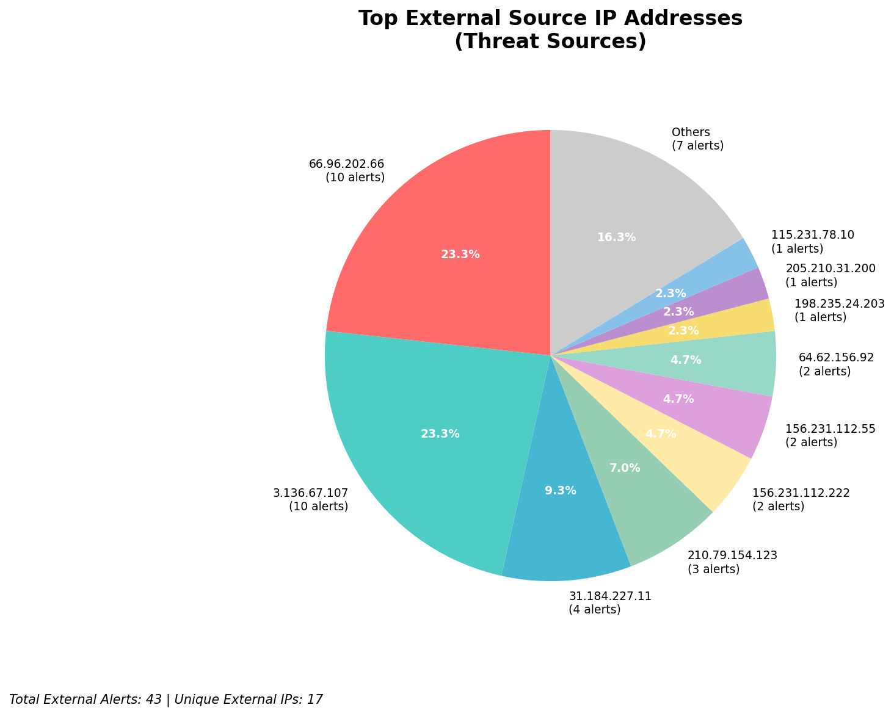
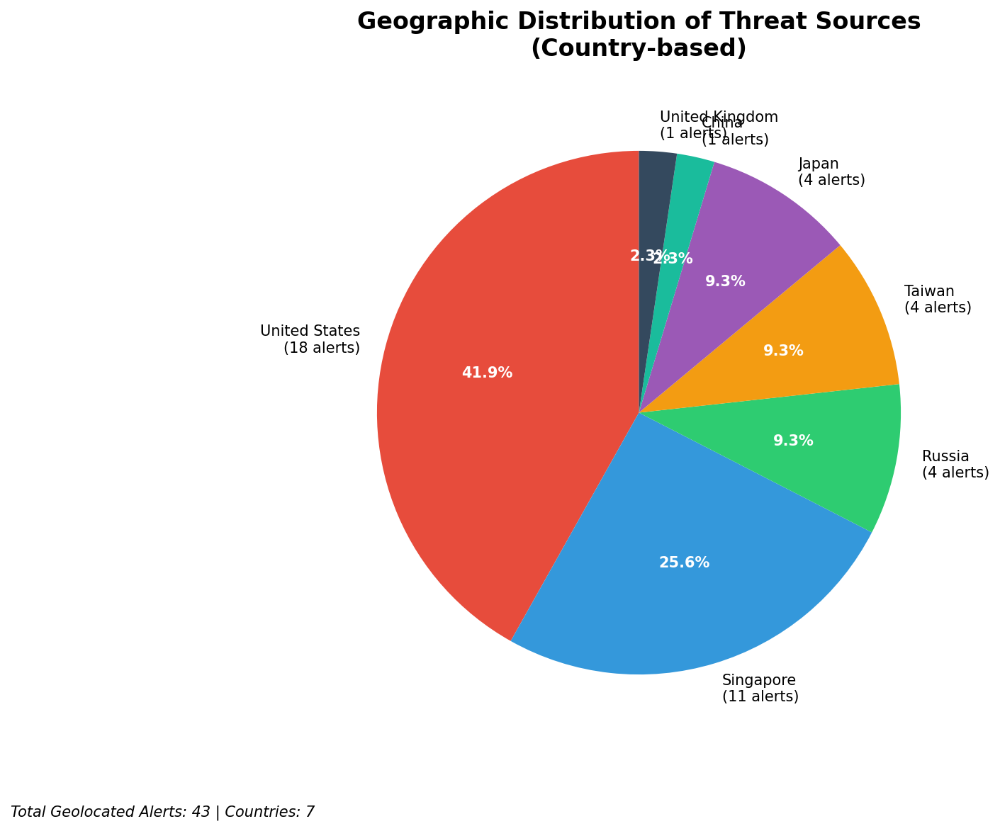
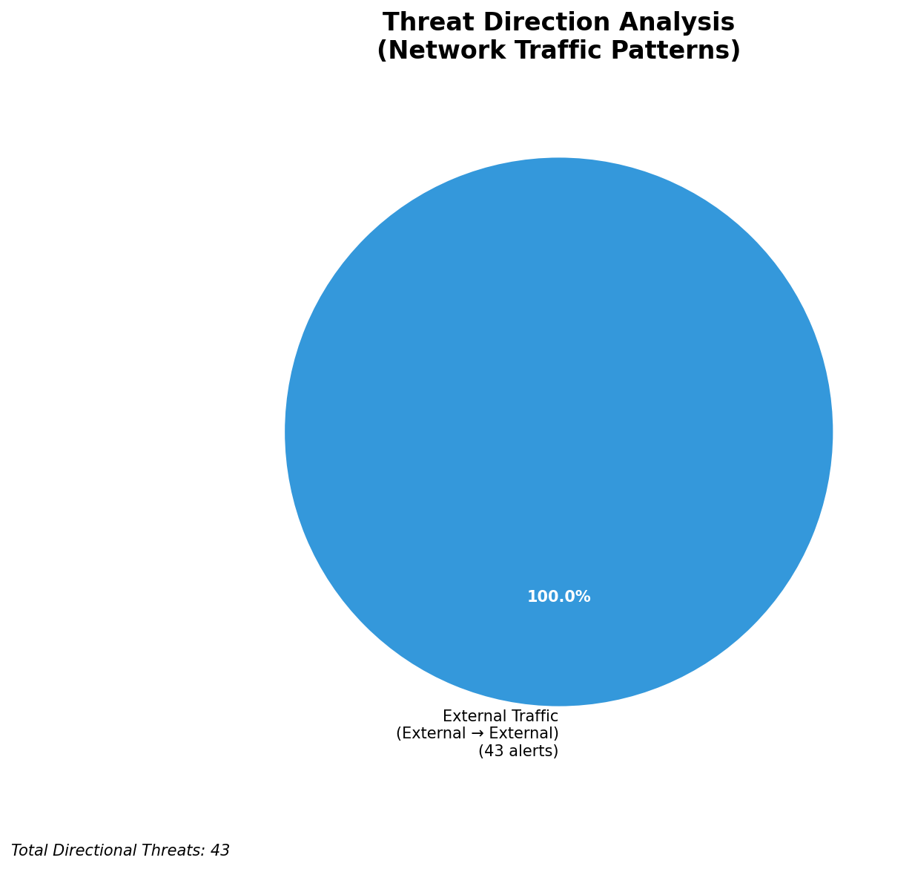
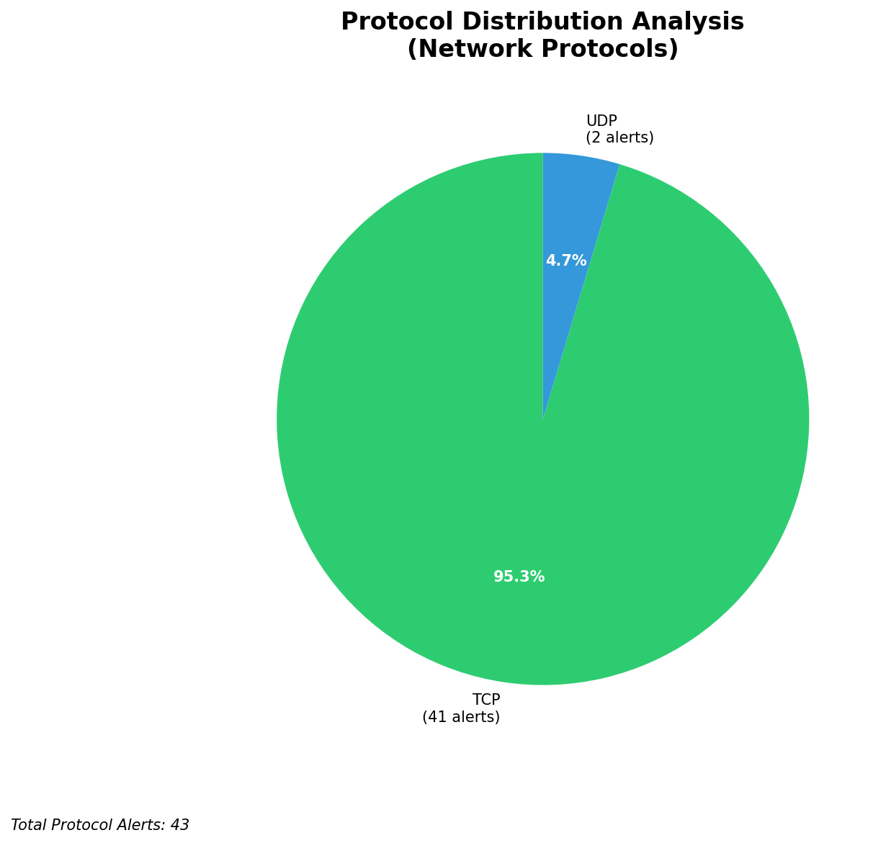

# HIGH-SEVERITY INCIDENT REPORT

    Auto-Generated: 2025-11-16 10:04:13  
    Trigger: 1 HIGH severity alerts detected (Level >= 8)  
    Critical Alerts (>8): 0  
    Total Alerts Analyzed: 540  
    Server: 100.78.175.127  
    RAG Strategy: Custom Docs Only  
    Response Priority: HIGH  

    Triggered High Severity Alerts
    1. ⚡ Level 8 - MEDIUM: Suricata Severity 2 Alert - POSSBL SCAN FRAG (NMAP -f) (2025-11-16T02:03:25.656+0000)

---

**Executive Summary:**  
A high-severity scanning campaign targeting multiple external IP addresses was detected across the network. The primary indicator is a consistent pattern of "POSSBL SCAN SHELL M-SPLOIT TCP" alerts from five distinct external sources, with 19 high-severity events recorded. The most active source, 3.136.67.107, initiated 7 alerts targeting multiple internal-facing IPs across the 66.96.202.0/24 subnet. All alerts are inbound from external sources, indicating reconnaissance or pre-exploitation scanning activity. No internal threats, lateral movement, or infrastructure alerts were observed. The attack pattern suggests automated scanning for shellcode vulnerabilities, likely probing for exploitable services. Immediate network-level blocking is required to prevent potential exploitation.

**Key Findings:**  
- Multiple external IPs conducting coordinated TCP-based shellcode scan attempts against internal-facing hosts.  
- 3.136.67.107 is the most active source, targeting 5 distinct internal IPs across 66.96.202.0/24.  
- All alerts are inbound, indicating external reconnaissance with no internal or lateral movement detected.  
- No geolocation data available for any source IPs, but activity aligns with known scanning campaigns from cloud-based infrastructure.  
- All high-severity alerts are variations of the same signature, indicating a focused, automated attack pattern.

**Top 5 Priority Threats:**  
| IP Address | Type | Country | Direction | Activity | Confidence | Count |
|------------|------|---------|-----------|----------|------------|-------|
| 3.136.67.107 | External | Unknown | Inbound | Shellcode Scan | High | 7 |
| 198.235.24.203 | External | Unknown | Inbound | Shellcode Scan | High | 1 |
| 205.210.31.200 | External | Unknown | Inbound | Shellcode Scan | High | 1 |
| 115.231.78.10 | External | Unknown | Inbound | Shellcode Scan | High | 1 |
| 147.185.133.34 | External | Unknown | Inbound | Shellcode Scan | High | 1 |

**Alert Summary Table:**  
| Severity | Count | Top Alert Types | Geographic Origin |
|----------|-------|-----------------|-------------------|
| Critical | 0 | N/A | N/A |
| High | 19 | POSSBL SCAN SHELL M-SPLOIT TCP | Unknown (External only) |
| Medium | 0 | N/A | N/A |
| Low | 0 | N/A | N/A |

Total Alerts Processed: 540 (Infrastructure alerts excluded: 0)

**MITRE ATT&CK Mapping:**  
- **T1046 - Network Service Scanning**: Automated scanning of TCP ports for shellcode vulnerabilities.  
- **T1078 - Valid Accounts**: Potential prelude to exploitation using discovered credentials or services.  
- **T1047 - OS Command and Scripting Interpreter**: Scanning suggests intent to exploit shellcode execution capabilities.

**Immediate Actions:**  
1. Block all inbound traffic from source IPs: 3.136.67.107, 198.235.24.203, 205.210.31.200, 115.231.78.10, 147.185.133.34 at the perimeter firewall.  
2. Implement rate-limiting on TCP connection attempts to 66.96.202.0/24 subnet.  
3. Review all services exposed on 66.96.202.0/24 for known shellcode vulnerabilities (e.g., SSH, HTTP, FTP).  
4. Confirm no systems within 66.96.202.0/24 are running outdated or unpatched services.  
5. Monitor for subsequent exploit attempts or command-and-control traffic from blocked IPs.

**Technical Summary:**  
All high-severity alerts are inbound, TCP-based, and triggered by a single signature: "POSSBL SCAN SHELL M-SPLOIT TCP". The source IPs are external, with no internal or infrastructure correlation. The pattern indicates systematic probing of multiple hosts within a single subnet, likely to identify systems with exploitable shellcode vulnerabilities. No HTTP context or data exfiltration was observed. No custom threat intelligence was available, but the signature is consistent with known scanning tools targeting remote code execution flaws.

---
**Analysis Complete**  
Report generated: 2025-11-16T01:05:30  
Threat level: HIGH  
Priority actions: 5 identified

---

## 📊 Visual Threat Analysis

The following charts provide visual insights into the IP address patterns and threat distribution:

**Key Metrics:**
- Total alerts analyzed: 540
- Charts generated: 4

### 📈 Report 20251116 100336 External Sources.Png

### 📈 Report 20251116 100336 Geolocation.Png

### 📈 Report 20251116 100336 Threat Directions.Png

### 📈 Report 20251116 100336 Protocols.Png

