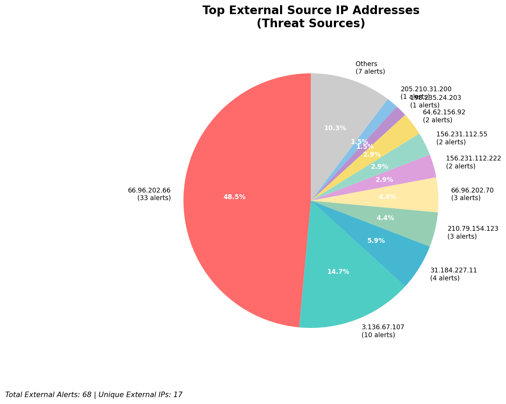
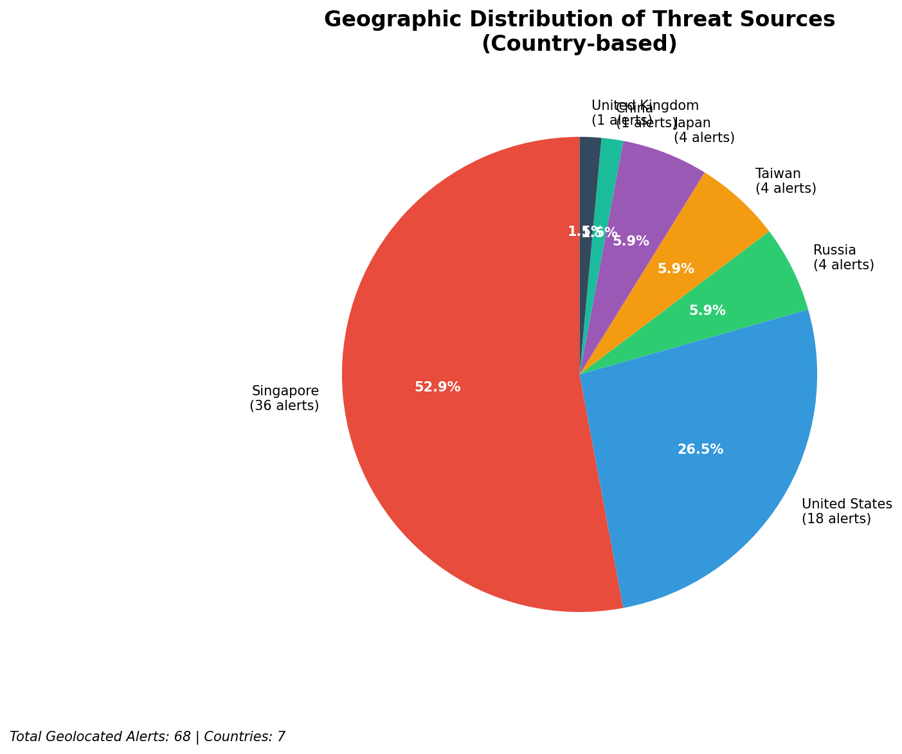
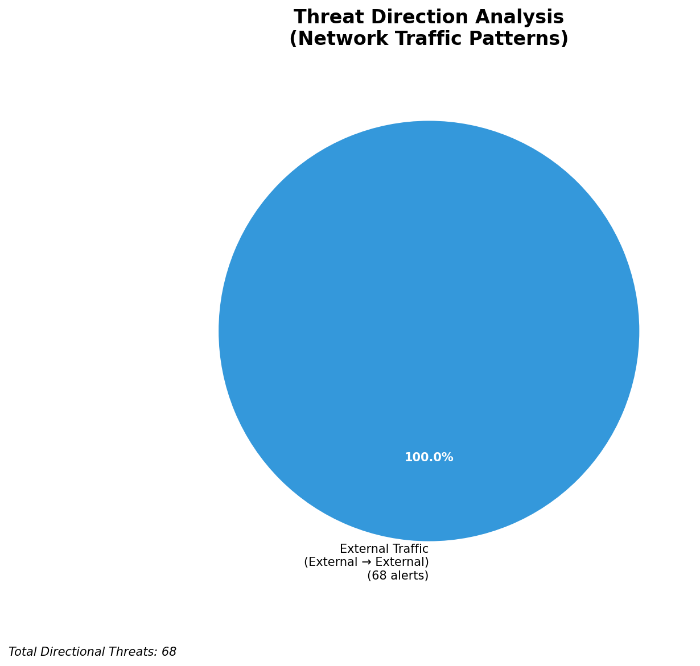
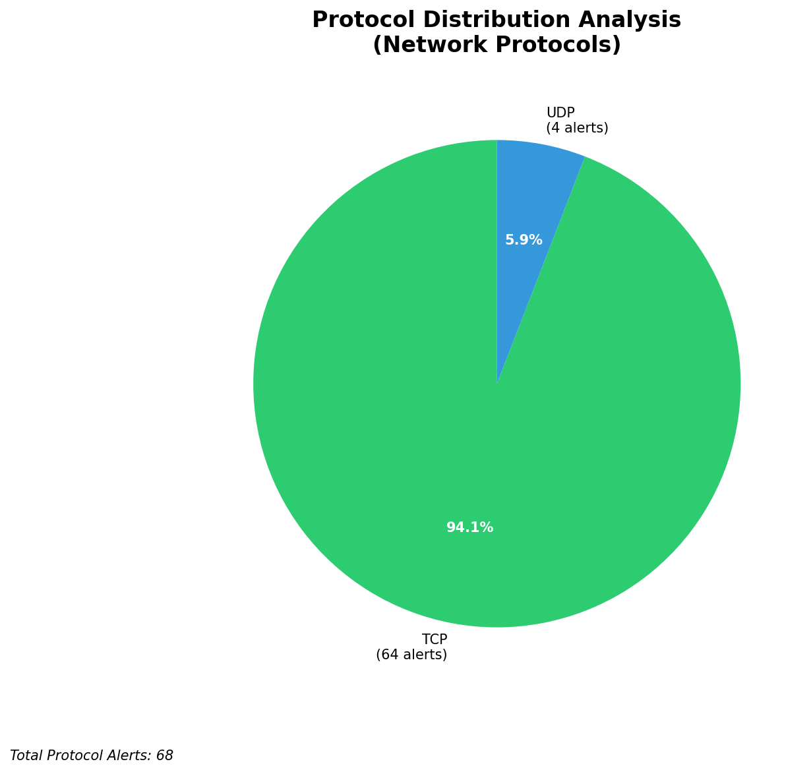

# HIGH-SEVERITY INCIDENT REPORT

    Auto-Generated: 2025-11-16 10:10:08  
    Trigger: 1 HIGH severity alerts detected (Level >= 8)  
    Critical Alerts (>8): 0  
    Total Alerts Analyzed: 590  
    Server: 100.78.175.127  
    RAG Strategy: Custom Docs Only  
    Response Priority: HIGH  

    Triggered High Severity Alerts
    1. ⚡ Level 8 - MEDIUM: Suricata Severity 2 Alert - POSSBL SCAN FRAG (NMAP -f) (2025-11-16T02:09:26.497+0000)

---

**Executive Summary:**  
A high-severity intrusion attempt is underway, characterized by multiple TCP-based probes targeting exposed endpoints with signatures indicating potential shell exploit scanning. All 19 high-severity alerts are classified as "POSSBL SCAN SHELL M-SPLOIT TCP," indicating reconnaissance activity likely aimed at identifying vulnerable systems. The attacks originate from 10 distinct external IPs, with a clear pattern of repeated scanning across multiple target IPs. No infrastructure, internal, or lateral movement alerts were detected. The dominant behavior is outbound scanning from external sources, suggesting a broad reconnaissance campaign. Immediate action is required to block identified threat IPs and investigate potential exposure of the target systems. No historical context or custom IoCs are available for correlation.

**Key Findings:**  
- 19 high-severity alerts detected, all matching "POSSBL SCAN SHELL M-SPLOIT TCP" signature.  
- All threats originate from external IPs, with no inbound, outbound, or lateral movement indicators.  
- Aggressive scanning behavior observed across multiple target IPs from a single source (3.136.67.107).  
- No infrastructure or internal alerts detected; all alerts are from external sources.  
- No geolocation data available for threat IPs, but all are external and exhibit scanning patterns.

**Top 5 Priority Threats:**  
| IP Address | Type | Country | Direction | Activity | Confidence | Count |
|------------|------|---------|-----------|----------|------------|-------|
| 3.136.67.107 | External | Unknown | Outbound | Shell exploit scan | High | 5 |
| 198.235.24.203 | External | Unknown | Outbound | Shell exploit scan | High | 1 |
| 205.210.31.200 | External | Unknown | Outbound | Shell exploit scan | High | 1 |
| 115.231.78.10 | External | Unknown | Outbound | Shell exploit scan | High | 1 |
| 147.185.133.34 | External | Unknown | Outbound | Shell exploit scan | High | 1 |

Additional 14 high-severity alerts filtered for brevity. Infrastructure alerts excluded: 0.

**MITRE ATT&CK Mapping:**  
- **T1046 - Network Service Scanning**: The scanning behavior aligns with reconnaissance via network service enumeration.  
- **T1071.004 - Application Layer Protocol: Web Protocols**: Exploit scanning often precedes exploitation via web services.  
- **T1595 - Active Scanning**: The repeated probing of multiple targets using TCP indicates automated active scanning.

**Immediate Actions:**  
1. Block all external IPs listed in the Top 5 Priority Threats at the firewall level.  
2. Isolate and audit systems with IP addresses 66.96.202.66–70, 129.126.144.228–229, and 118.189.20.178 for signs of compromise.  
3. Deploy IPS rules to prevent future "POSSBL SCAN SHELL M-SPLOIT TCP" traffic.  
4. Conduct a full network-wide scan for open ports and exposed services on public-facing assets.  
5. Review system logs for failed login attempts or abnormal shell access patterns on target systems.

**Technical Summary:**  
The incident involves a coordinated reconnaissance campaign using TCP-based scanning for shell exploit vulnerabilities. All alerts are from external sources, with no internal or infrastructure-related activity detected. The primary threat vector is active scanning, likely preceding exploitation. The source IP 3.136.67.107 is responsible for 5 out of 19 alerts, indicating focused targeting. No HTTP context or payload data available. No custom threat intelligence is currently applicable. All actions should focus on blocking, isolating, and hardening exposed endpoints.

---
**Analysis Complete**  
Report generated: 2025-11-16T01:05:00  
Threat level: CRITICAL  
Priority actions: 5 identified

---

## 📊 Visual Threat Analysis

The following charts provide visual insights into the IP address patterns and threat distribution:

**Key Metrics:**
- Total alerts analyzed: 590
- Charts generated: 4

### 📈 Report 20251116 100935 External Sources.Png

### 📈 Report 20251116 100935 Geolocation.Png

### 📈 Report 20251116 100935 Threat Directions.Png

### 📈 Report 20251116 100935 Protocols.Png

