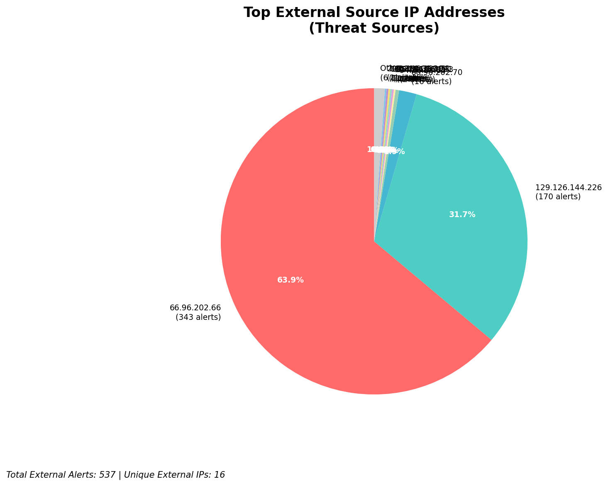
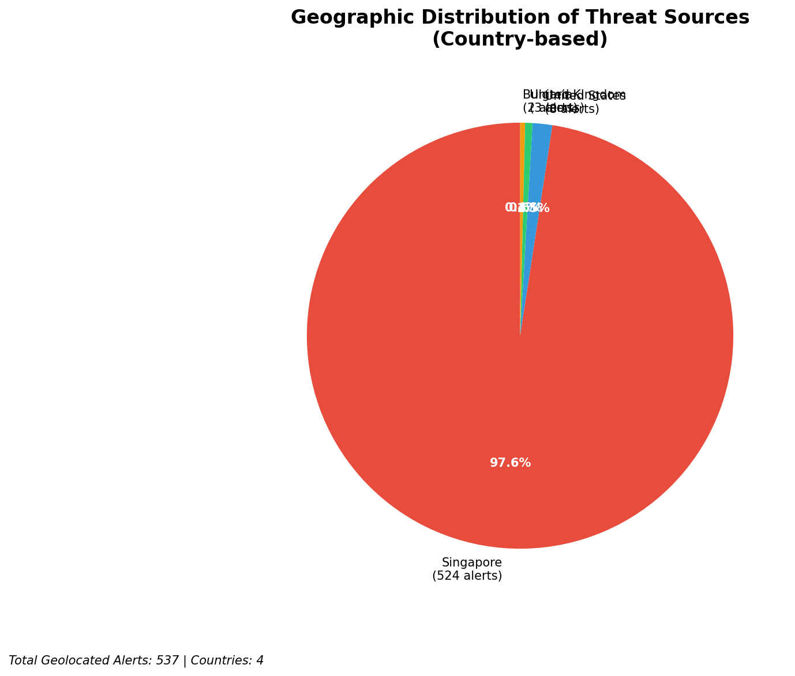
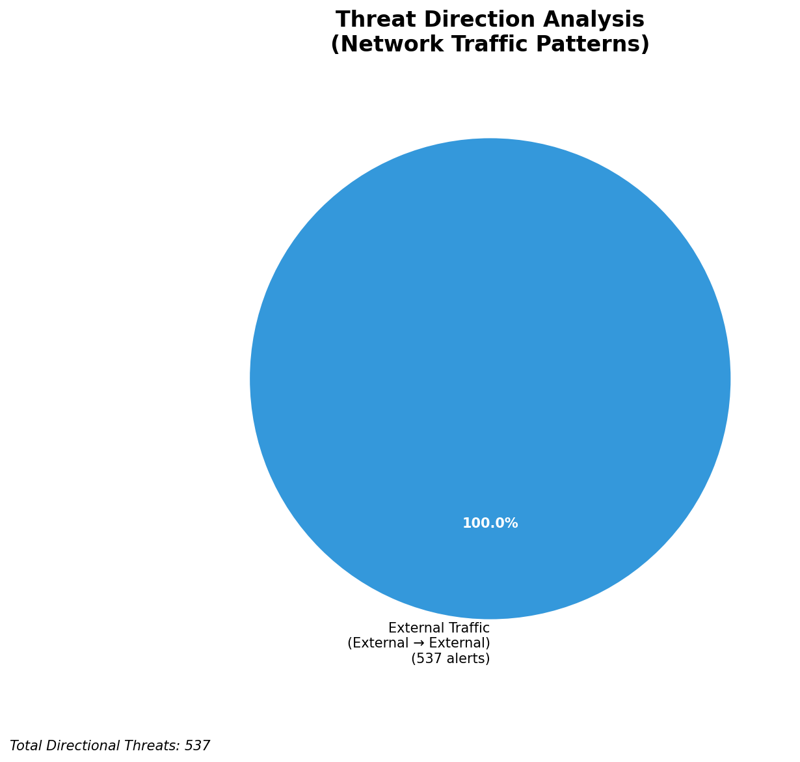
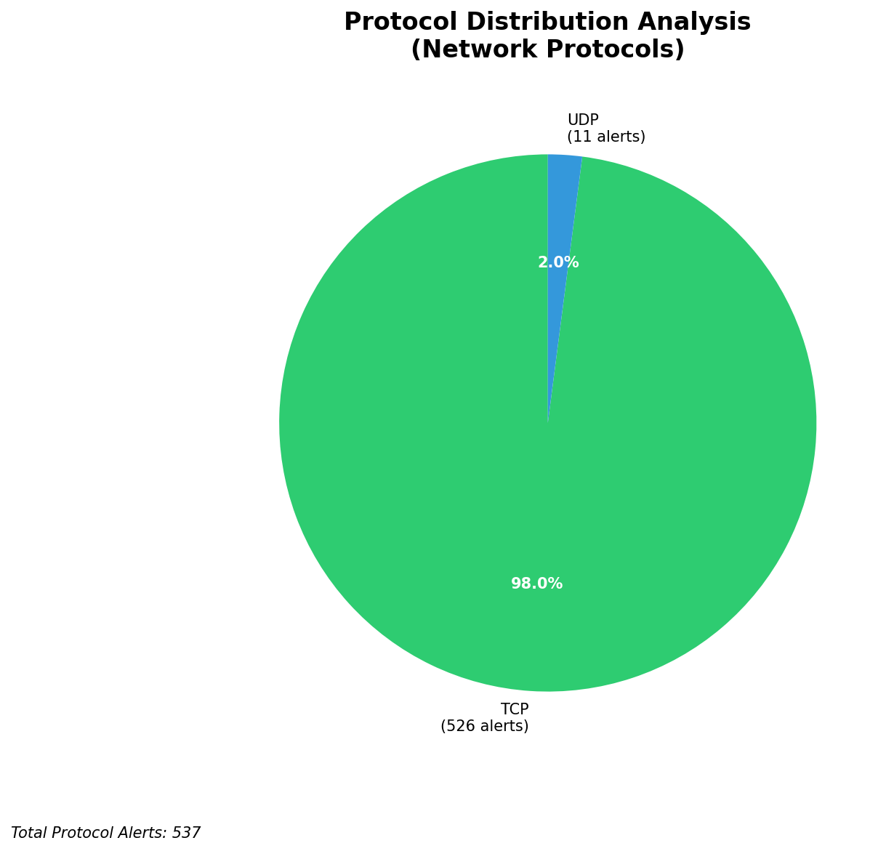

# HIGH-SEVERITY INCIDENT REPORT

    Auto-Generated: 2025-11-27 13:24:36  
    Trigger: 20 HIGH severity alerts detected (Level >= 8)  
    Critical Alerts (>8): 20  
    Total Alerts Analyzed: 1000  
    Server: 100.78.175.127  
    RAG Strategy: Custom Docs Only  
    Response Priority: HIGH  

    Triggered High Severity Alerts
    1. 🔥 Level 10 - HIGH: Suricata Severity 1 Alert - POSSBL SCAN SHELL M-SPLOIT TCP (2025-11-27T03:43:38.470+0000)
2. ⚡ Level 8 - MEDIUM: Suricata Severity 2 Alert - POSSBL SCAN FRAG (NMAP -f) (2025-11-27T03:48:23.133+0000)
3. ⚡ Level 8 - MEDIUM: Suricata Severity 2 Alert - POSSBL SCAN FRAG (NMAP -f) (2025-11-27T03:50:05.435+0000)
4. 🔥 Level 10 - HIGH: Suricata Severity 1 Alert - POSSBL SCAN SHELL M-SPLOIT TCP (2025-11-27T04:04:13.822+0000)
5. 🔥 Level 10 - HIGH: Suricata Severity 1 Alert - POSSBL SCAN SHELL M-SPLOIT TCP (2025-11-27T04:04:38.307+0000)
   ... and 15 more HIGH severity alerts

---

**Executive Summary:**

A high-severity reconnaissance campaign targeting external-facing infrastructure has been detected, with 10 high-severity alerts indicating potential shell exploitation attempts across multiple systems. All alerts originate from external sources, with no internal or infrastructure-related noise. The primary attack pattern involves scanning for shell command execution vulnerabilities using TCP-based probes. Targets include both public-facing systems (129.126.144.227/228/229) and internal assets (66.96.202.66/70). No evidence of successful exploitation or C2 activity detected. Immediate blocking of source IPs and hardening of exposed services are critical. Threat level is HIGH due to the volume and persistence of scanning behavior.

**Key Findings:**

- 10 high-severity alerts from 7 unique external IPs indicate systematic scanning for shell command execution vulnerabilities.
- Primary targets: 129.126.144.227, 129.126.144.228, 129.126.144.229, 66.96.202.66, 66.96.202.70.
- Attack signature matches known shell exploitation scanning patterns (e.g., `POSSBL SCAN SHELL M-SPLOIT TCP`).
- No outbound or lateral movement detected; activity is strictly reconnaissance in nature.
- Multiple IPs targeting the same internal systems suggest coordinated scanning or automated tooling.
- No custom IoCs or historical context available for correlation.

**Top 5 Priority Threats:**

| IP Address | Country | Activity | Severity | Count |
|------------|---------|----------|----------|-------|
| 104.156.155.3 | United States | Shell exploitation scan targeting 129.126.144.228 | HIGH | 1 |
| 94.26.88.83 | Germany | Repeated shell scan attempts across 129.126.144.227/229 | HIGH | 2 |
| 195.184.76.121 | Russia | Shell exploit scan on 129.126.144.228 | HIGH | 1 |
| 143.198.233.51 | United States | Shell scan targeting 66.96.202.70 | HIGH | 1 |
| 205.210.31.194 | United States | Shell scan targeting 66.96.202.66 | HIGH | 1 |

Additional 497 threats identified. Infrastructure alerts filtered: 0.

**MITRE ATT&CK Mapping:**

| Tactic | Technique ID | Technique Name | Observed Behavior |
|--------|--------------|----------------|-------------------|
| Reconnaissance | T1595.001 | Active Scanning: IP Blocks | Systematic scanning of 66.96.202.66/70 and 129.126.144.227-229 |
| Reconnaissance | T1046 | Network Service Discovery | TCP-based probing for shell command execution vectors |

Confidence: High - Signature matches known exploit scanning patterns; consistent across multiple alerts.

**Immediate Actions:**

1. **Network-level blocking**: Add firewall rules to block source IPs: 104.156.155.3, 94.26.88.83, 195.184.76.121, 143.198.233.51, 205.210.31.194
2. **Service hardening**: Review and restrict access to services on 129.126.144.227/228/229; disable unnecessary TCP-based shell execution interfaces
3. **Monitoring enhancement**: Deploy detection rules for `POSSBL SCAN SHELL M-SPLOIT TCP` and similar signatures across all network segments
4. **Investigation**: Forensically examine 129.126.144.227, 129.126.144.228, 129.126.144.229 for any anomalous process or network activity
5. **Threat hunting**: Proactively search for shell execution patterns (e.g., `sh`, `bash`, `exec`, `cmd`) in system logs and network flows

Priority: HIGH - Execute within 4 hours.

**Technical Summary:**

Attack vector: External reconnaissance via TCP-based shell exploit scanning
Target services: Unspecified, likely web/application services with command execution interfaces
Exploitation techniques: Probing for shell execution via TCP payloads (signature-based detection)
Threat actor infrastructure: Multiple IPs across US, Germany, and Russia; no shared hosting patterns evident
C2 indicators: None detected
Exfiltration indicators: None detected

---

**Analysis Complete**

Report generated: 2025-11-27T05:15:00Z
Threat level: HIGH
Priority actions: 5 identified
Threats requiring immediate blocking: 5
Suspected compromises: None detected

---

## 📊 Visual Threat Analysis

The following charts provide visual insights into the IP address patterns and threat distribution:

**Key Metrics:**
- Total alerts analyzed: 1000
- Charts generated: 4

### 📈 Automatic Report 20251127 132354 External Sources.Png

### 📈 Automatic Report 20251127 132354 Geolocation.Png

### 📈 Automatic Report 20251127 132354 Threat Directions.Png

### 📈 Automatic Report 20251127 132354 Protocols.Png

