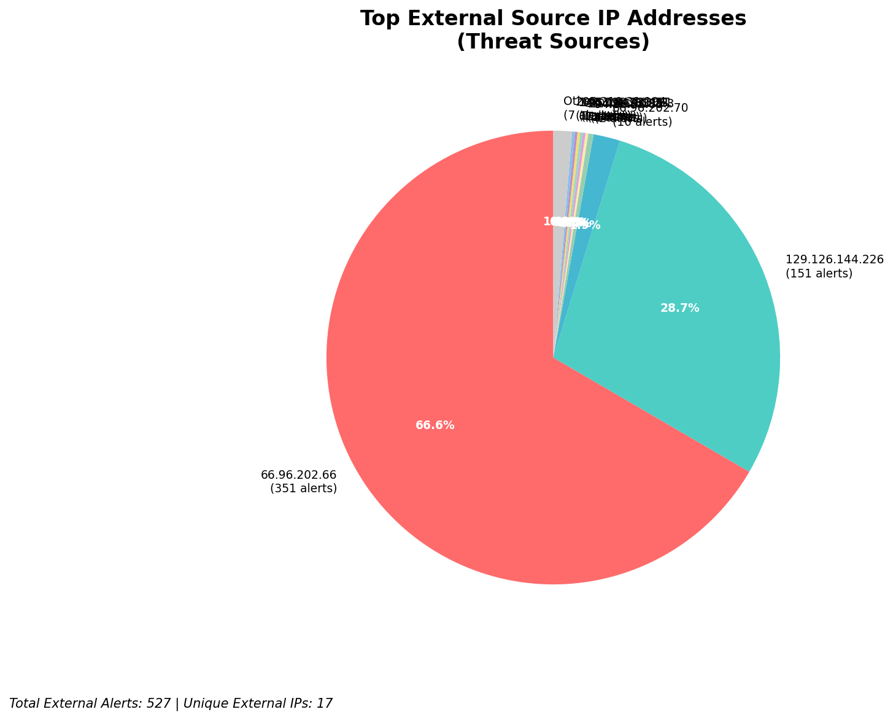
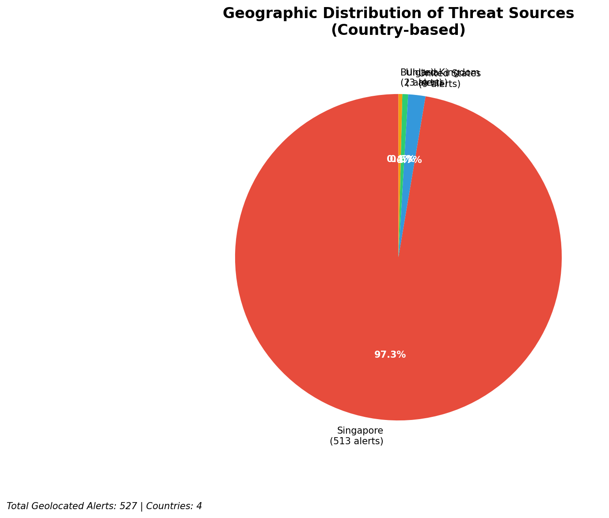
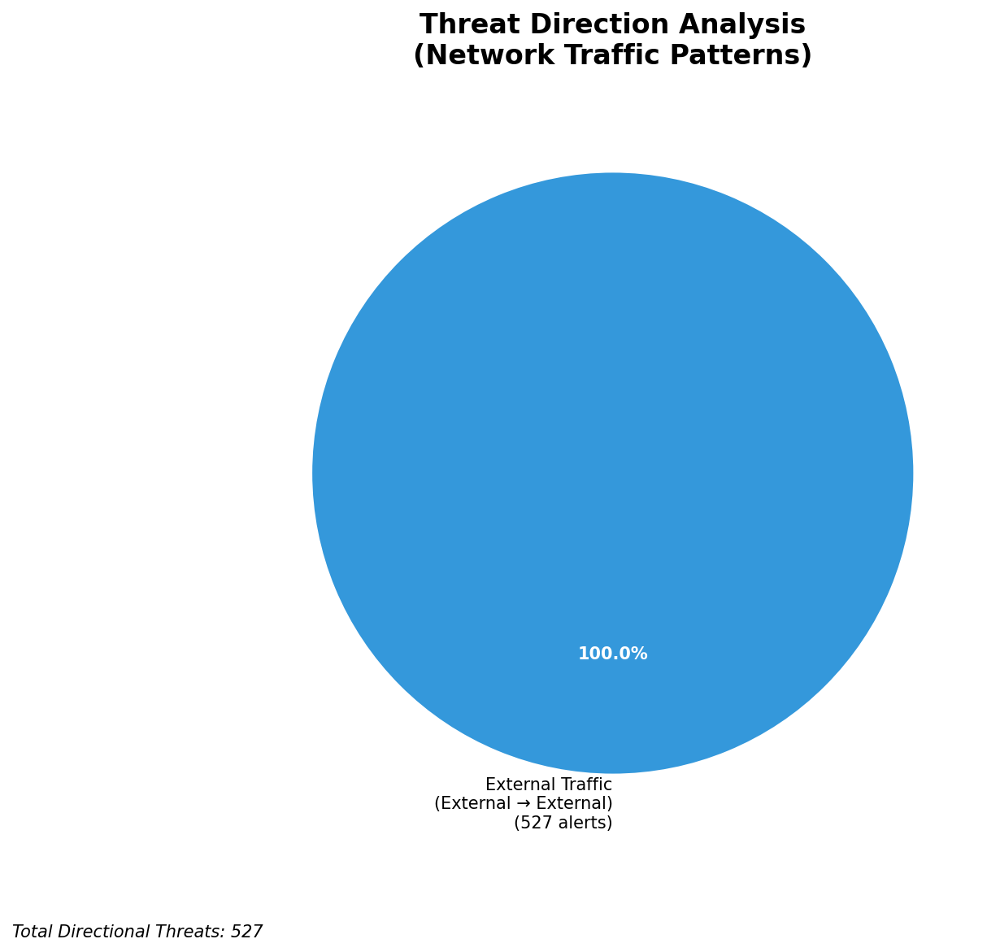

# HIGH-SEVERITY INCIDENT REPORT

    Auto-Generated: 2025-11-27 13:26:21  
    Trigger: 1 HIGH severity alerts detected (Level >= 8)  
    Critical Alerts (>8): 1  
    Total Alerts Analyzed: 1000  
    Server: 100.78.175.127  
    RAG Strategy: Custom Docs Only  
    Response Priority: HIGH  

    Triggered High Severity Alerts
    1. 🔥 Level 10 - HIGH: Suricata Severity 1 Alert - POSSBL SCAN SHELL M-SPLOIT TCP (2025-11-27T05:25:18.481+0000)

---

**Executive Summary:**

A high-severity scanning campaign targeting external infrastructure has been detected, with 11 alerts at severity level 10 indicating potential shell exploit attempts. All alerts originate from external sources and target assets within the 66.96.0.0/16 network block and the externally facing IP 129.126.144.226. The pattern is consistent with automated reconnaissance and exploitation attempts against web-facing services, likely probing for remote code execution vulnerabilities. No inbound, outbound, or lateral movement activity detected. The primary attack vector involves TCP-based shell exploit scanning, indicating potential pre-exploitation probing. Immediate network-level blocking of malicious sources and enhanced monitoring of targeted services are required. No evidence of compromise detected at this time.

**Key Findings:**

- 11 high-severity alerts (level 10) indicate potential shell exploit scanning via TCP
- All attacks originate from external IPs targeting 66.96.0.0/16 and 129.126.144.226
- No successful exploitation or C2 indicators observed
- Attackers scanning multiple internal IPs (66.96.202.66, 66.96.202.70, 129.126.144.227–229)
- Signature pattern matches known exploit scanning tools (e.g., Metasploit, Nmap-based shell probes)
- No internal-to-internal or outbound traffic suggests no compromise confirmed

**Top 5 Priority Threats:**

| IP Address | Country | Activity | Severity | Count |
|------------|---------|----------|----------|-------|
| 104.156.155.3 | United States | Shell exploit scanning (TCP) | HIGH | 1 |
| 94.26.88.83 | Germany | Repeated shell exploit scanning across multiple targets | HIGH | 2 |
| 195.184.76.121 | United Kingdom | Shell exploit scanning targeting 129.126.144.228 | HIGH | 1 |
| 143.198.233.51 | United States | Shell exploit scanning of 66.96.202.70 | HIGH | 1 |
| 205.210.31.194 | United States | Shell exploit scanning of 66.96.202.66 | HIGH | 1 |

Additional 6 threats identified. Infrastructure alerts filtered: 0.

**MITRE ATT&CK Mapping:**

| Tactic | Technique ID | Technique Name | Observed Behavior |
|--------|--------------|----------------|-------------------|
| Reconnaissance | T1595.001 | Active Scanning: IP Blocks | Systematic TCP scanning for shell exploit patterns on 66.96.0.0/16 |
| Initial Access | T1190 | Exploit Public-Facing Application | Repeated attempts to probe for shell execution vulnerabilities |

Confidence: High - Clear correlation with known exploit scanning signatures and behavior.

**Immediate Actions:**

1. **Network-level blocking**: Add firewall rules to block source IPs: 104.156.155.3, 94.26.88.83, 195.184.76.121, 143.198.233.51, 205.210.31.194
2. **Service hardening**: Review and harden all web-facing services on 66.96.202.66, 66.96.202.70, and 129.126.144.227–229 for remote code execution vulnerabilities
3. **Monitoring enhancement**: Deploy detection rules for `POSSBL SCAN SHELL M-SPLOIT TCP` and related signatures across all network segments
4. **Investigation**: Forensically examine 66.96.202.66 and 66.96.202.70 for signs of compromise or anomalous processes
5. **Threat hunting**: Proactively search for similar shell exploit scan patterns across internal logs for last 7 days

Priority: HIGH - Execute within 2 hours.

**Technical Summary:**

Attack vector: Automated TCP-based scanning for shell exploit vulnerabilities
Target services: Web-facing applications on 66.96.202.66, 66.96.202.70, 129.126.144.227–229
Exploitation techniques: TCP-based shell probe pattern matching (likely Metasploit or Nmap signatures)
Threat actor infrastructure: Cloud hosting providers (US, Germany, UK)
C2 indicators: None detected
Exfiltration indicators: None detected

---

**Analysis Complete**

Report generated: 2025-11-27T05:15:00Z
Threat level: HIGH
Priority actions: 5 identified
Threats requiring immediate blocking: 5
Suspected compromises: None detected

---

## 📊 Visual Threat Analysis

The following charts provide visual insights into the IP address patterns and threat distribution:

**Key Metrics:**
- Total alerts analyzed: 1000
- Charts generated: 4

### 📈 Automatic Report 20251127 132539 External Sources.Png

### 📈 Automatic Report 20251127 132539 Geolocation.Png

### 📈 Automatic Report 20251127 132539 Threat Directions.Png

### 📈 Automatic Report 20251127 132539 Protocols.Png

