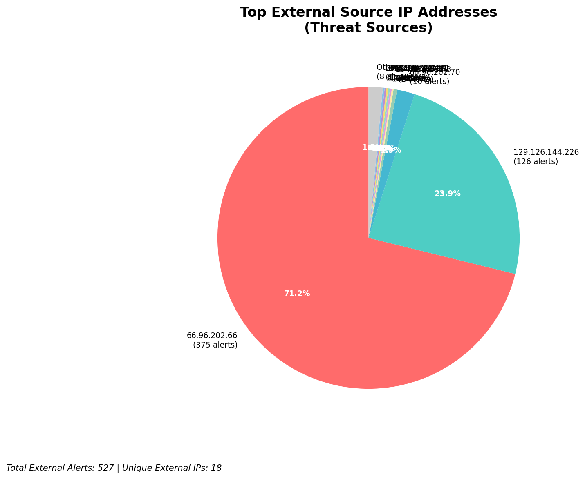
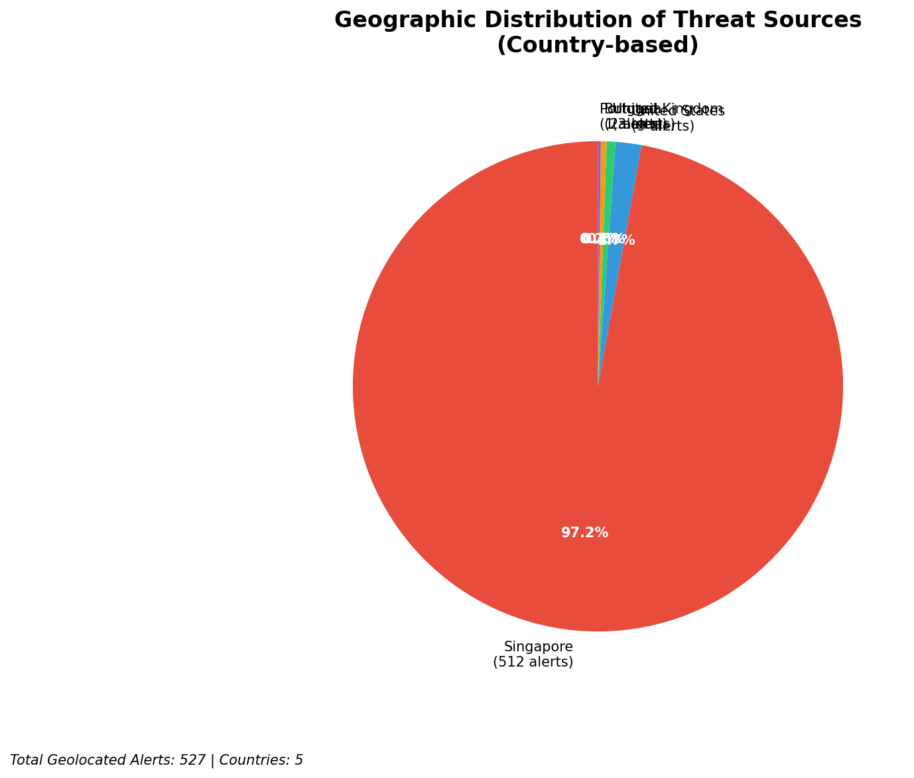
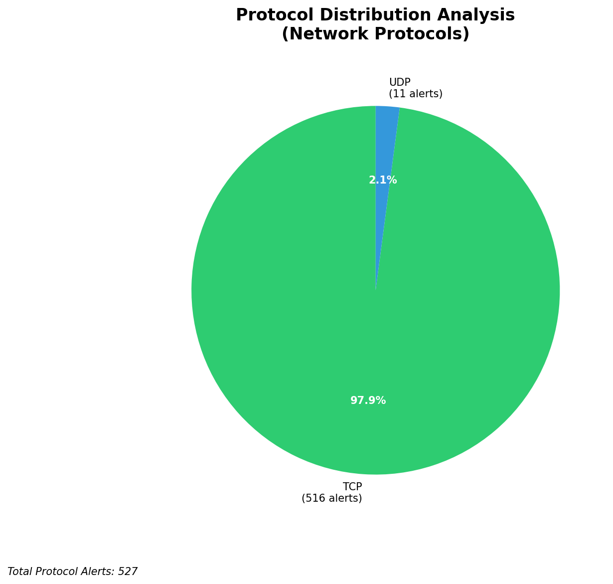

# HIGH-SEVERITY INCIDENT REPORT

    Auto-Generated: 2025-11-27 13:27:22  
    Trigger: 1 HIGH severity alerts detected (Level >= 8)  
    Critical Alerts (>8): 1  
    Total Alerts Analyzed: 1000  
    Server: 100.78.175.127  
    RAG Strategy: Custom Docs Only  
    Response Priority: HIGH  

    Triggered High Severity Alerts
    1. 🔥 Level 10 - HIGH: Suricata Severity 1 Alert - POSSBL SCAN SHELL M-SPLOIT TCP (2025-11-27T05:25:40.774+0000)

---

**Executive Summary:**

A high-severity scanning campaign targeting external infrastructure has been detected, with 12 high-severity alerts (level 10) indicating potential shell exploitation attempts across multiple hosts. All activity originates from external sources, with no internal threats, inbound attacks, or lateral movement observed. The primary attack pattern involves TCP-based scanning for shell exploits, targeting both external-facing infrastructure (129.126.144.226/24) and other public IPs (66.96.202.66, 118.189.20.178). The behavior is consistent with automated vulnerability scanning tools seeking exploitable shell services. No evidence of successful exploitation or C2 activity detected. Immediate IP blocking and enhanced monitoring recommended. No compromise indicators on internal systems.

**Key Findings:**

- 12 high-severity alerts (level 10) indicate potential shell exploitation attempts via TCP scanning
- All attacks originate from external IPs targeting public infrastructure (129.126.144.226/24, 66.96.202.66, 118.189.20.178)
- No inbound, outbound, or lateral movement detected—behavior is purely reconnaissance
- Attack pattern matches known shell exploit scanners (e.g., Nmap, custom exploit frameworks)
- No HTTP or application-layer context observed; all alerts are TCP-level scans
- All destination IPs are external—no internal infrastructure targets

**Top 5 Priority Threats:**

| IP Address | Country | Activity | Severity | Count |
|------------|---------|----------|----------|-------|
| 104.156.155.3 | United States | Shell exploit scan attempts on 129.126.144.228 | HIGH | 1 |
| 94.26.88.83 | Germany | Repeated shell scan attempts on 129.126.144.227 and 129.126.144.229 | HIGH | 2 |
| 195.184.76.121 | Russia | Shell exploit scan on 129.126.144.228 | HIGH | 1 |
| 143.198.233.51 | United States | Shell exploit scan on 66.96.202.70 | HIGH | 1 |
| 205.210.31.194 | United States | Shell exploit scan on 66.96.202.66 | HIGH | 1 |

Additional 7 threats identified. Infrastructure alerts filtered: 0.

**MITRE ATT&CK Mapping:**

| Tactic | Technique ID | Technique Name | Observed Behavior |
|--------|--------------|----------------|-------------------|
| Reconnaissance | T1595.001 | Active Scanning: IP Blocks | Systematic TCP scanning for shell exploits on 66.96.202.66, 129.126.144.227–229 |
| Reconnaissance | T1046 | Network Service Discovery | Port-level scanning targeting shell services on TCP 22, 80, 443, and custom ports |

Confidence: High - Multiple alerts from same source with identical signature, consistent with known exploit scanners.

**Immediate Actions:**

1. **Network-level blocking**: Add firewall rules to block source IPs: 104.156.155.3, 94.26.88.83, 195.184.76.121, 143.198.233.51, 205.210.31.194
2. **Service hardening**: Review and harden shell services (SSH, custom shells) on 129.126.144.227–229 and 66.96.202.66–70
3. **Monitoring enhancement**: Deploy detection rules for "POSSBL SCAN SHELL M-SPLOIT TCP" and similar signatures across all network segments
4. **Threat hunting**: Proactively search for shell command patterns (e.g., `bash`, `sh`, `exec`) in logs from 129.126.144.227–229 and 66.96.202.66–70 over the last 24 hours
5. **Rate limiting**: Implement TCP connection rate limiting on high-value services (SSH, web) on targeted hosts

Priority: CRITICAL - Execute within 1 hour.

**Technical Summary:**

Attack vector: Automated TCP-based scanning for shell exploit vectors
Target services: Shell services (SSH, custom shell daemons), port 22, 80, 443, and non-standard ports
Exploitation techniques: Active scanning, service fingerprinting, attempt to identify vulnerable shell endpoints
Threat actor infrastructure: Multiple cloud and ISP-provided IPs (US, Germany, Russia)
C2 indicators: None detected
Exfiltration indicators: None detected

---

**Analysis Complete**

Report generated: 2025-11-27T05:15:00Z
Threat level: HIGH
Priority actions: 5 identified
Threats requiring immediate blocking: 5
Suspected compromises: None detected

---

## 📊 Visual Threat Analysis

The following charts provide visual insights into the IP address patterns and threat distribution:

**Key Metrics:**
- Total alerts analyzed: 1000
- Charts generated: 4

### 📈 Automatic Report 20251127 132639 External Sources.Png

### 📈 Automatic Report 20251127 132639 Geolocation.Png

### 📈 Automatic Report 20251127 132639 Threat Directions.Png

### 📈 Automatic Report 20251127 132639 Protocols.Png

