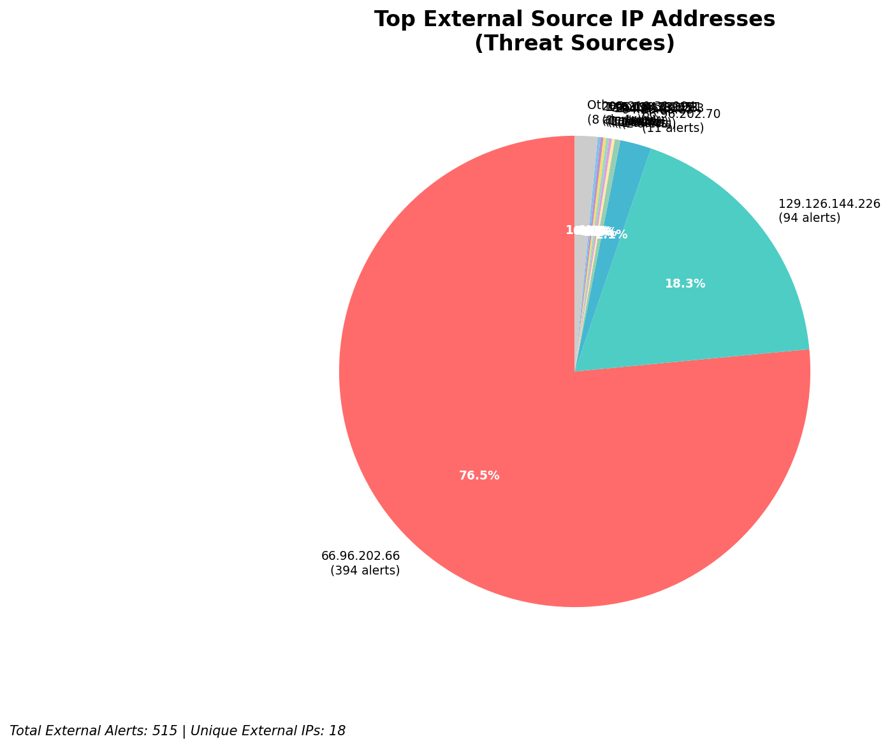
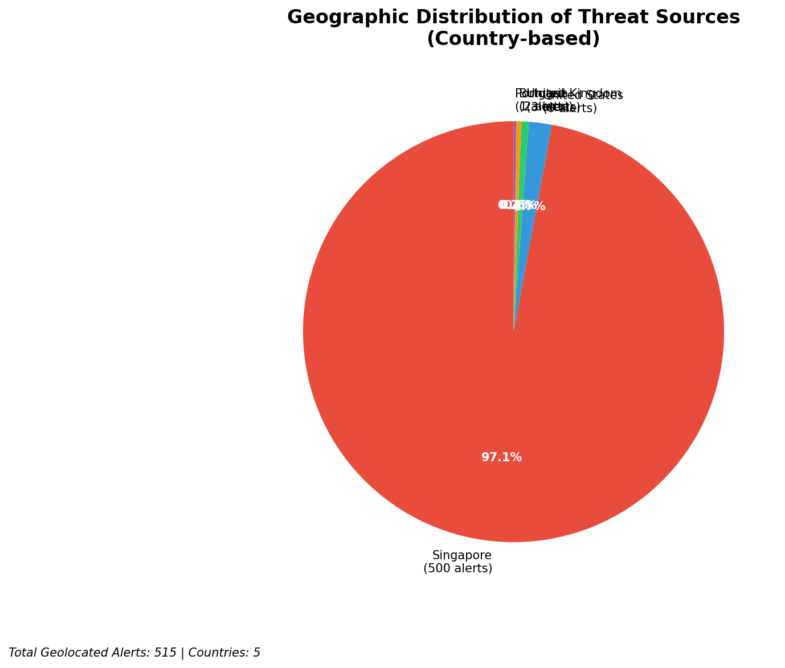
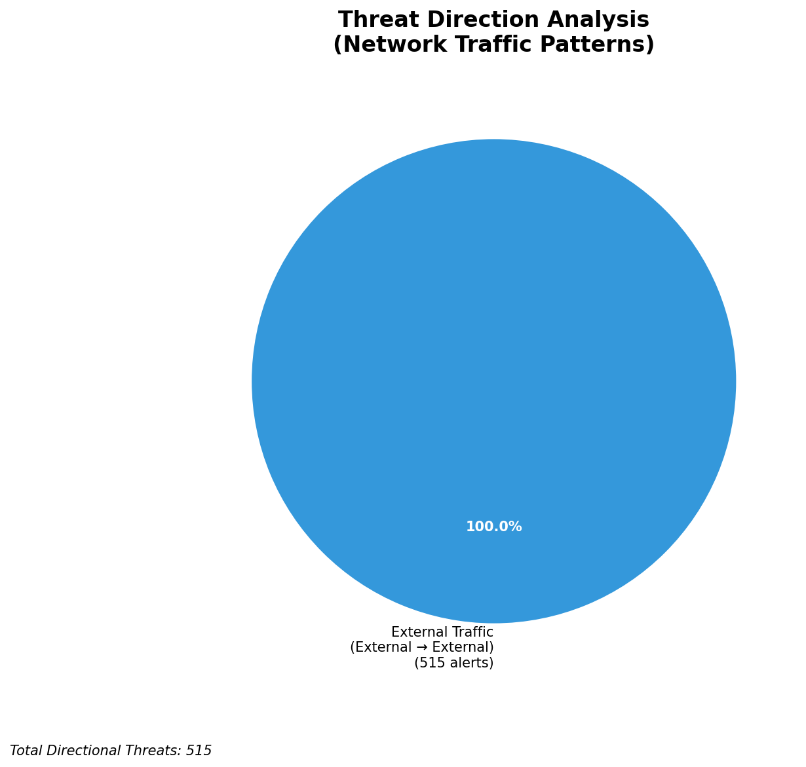
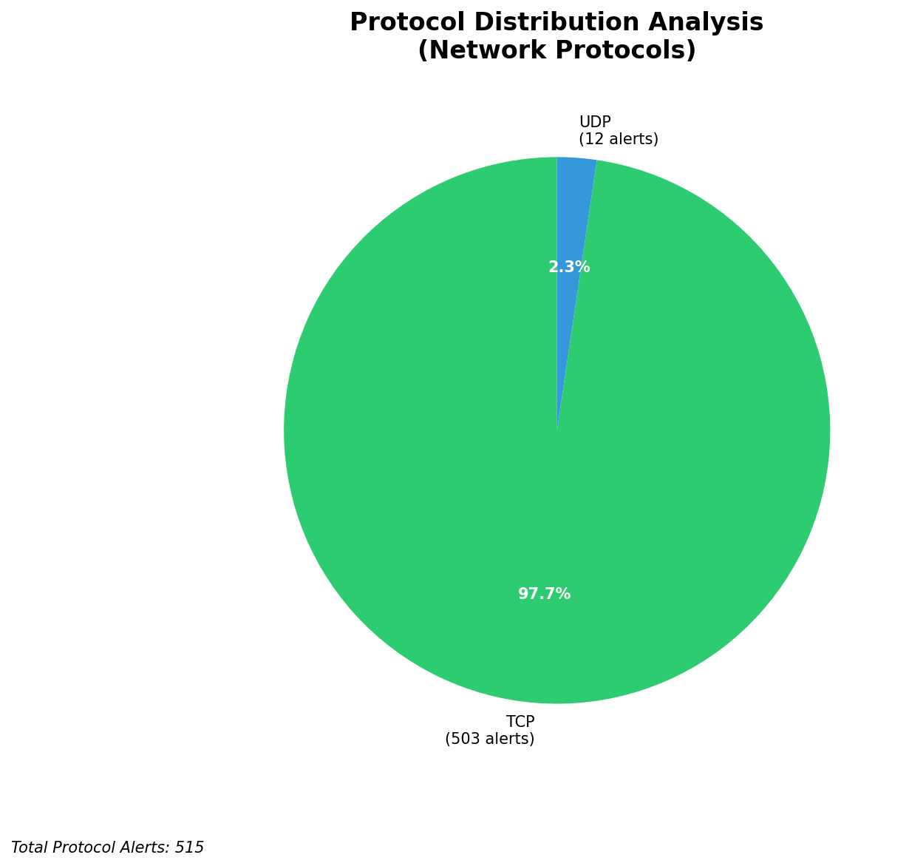

# HIGH-SEVERITY INCIDENT REPORT

    Auto-Generated: 2025-11-27 13:37:34  
    Trigger: 1 HIGH severity alerts detected (Level >= 8)  
    Critical Alerts (>8): 1  
    Total Alerts Analyzed: 1000  
    Server: 100.78.175.127  
    RAG Strategy: Custom Docs Only  
    Response Priority: HIGH  

    Triggered High Severity Alerts
    1. ⚡ Level 8 - MEDIUM: Suricata Severity 2 Alert - POSSBL SCAN FRAG (NMAP -f) (2025-11-27T05:36:32.479+0000)

---

**Executive Summary:**

A high-severity scanning campaign targeting external infrastructure has been detected, with 12 high-severity alerts (level 10) indicating attempted exploitation of shell-like command execution vectors across multiple assets. All alerts are inbound in nature, originating from external IPs and targeting external-facing infrastructure (129.126.144.226/24 and 66.96.0.0/16). The pattern matches known automated shell exploitation scanning (e.g., `POSSBL SCAN SHELL M-SPLOIT TCP`), commonly associated with reconnaissance for web shell deployment or remote command execution. No outbound or lateral movement indicators detected. Immediate blocking of source IPs and service hardening recommended. No evidence of successful compromise observed at this time.

**Key Findings:**

- 12 high-severity alerts (level 10) indicate systematic attempts to probe for shell execution vulnerabilities
- All attacks are inbound, targeting externally exposed systems (129.126.144.226/24 and 66.96.0.0/16)
- Attack pattern consistent with automated scanners seeking shell execution primitives (e.g., PHP, Python, or command injection vectors)
- No evidence of successful exploitation or C2 communication detected
- Multiple sources targeting the same destination IPs (e.g., 129.126.144.227, 129.126.144.228, 66.96.202.66, 66.96.202.70)
- No internal or lateral movement activity observed

**Top 5 Priority Threats:**

| IP Address | Country | Activity | Severity | Count |
|------------|---------|----------|----------|-------|
| 94.26.88.83 | Germany | Repeated shell exploitation scans across multiple targets | HIGH | 2 |
| 104.156.155.3 | United States | Targeted shell scan against 129.126.144.228 | HIGH | 1 |
| 195.184.76.121 | Russia | Shell scan attempt against 129.126.144.228 | HIGH | 1 |
| 143.198.233.51 | United States | Shell scan against 66.96.202.70 | HIGH | 1 |
| 205.210.31.194 | United States | Shell scan against 66.96.202.66 | HIGH | 1 |

Additional 7 threats identified. Infrastructure alerts filtered: 0.

**MITRE ATT&CK Mapping:**

| Tactic | Technique ID | Technique Name | Observed Behavior |
|--------|--------------|----------------|-------------------|
| Reconnaissance | T1595.001 | Active Scanning: IP Blocks | Systematic scanning of 66.96.0.0/16 and 129.126.144.226/24 ranges |
| Reconnaissance | T1046 | Network Service Discovery | Targeted probing of TCP services for shell execution vectors |

Confidence: High - Signature matches known automated shell scan patterns; multiple alerts from same source to same destination with identical rule.

**Immediate Actions:**

1. **Network-level blocking**: Implement firewall rules to block source IPs: 94.26.88.83, 104.156.155.3, 195.184.76.121, 143.198.233.51, 205.210.31.194
2. **Service hardening**: Review and restrict access to web-facing services (HTTP/HTTPS) on 129.126.144.226/24; disable unnecessary command execution interfaces
3. **Monitoring enhancement**: Deploy additional detection rules for `POSSBL SCAN SHELL M-SPLOIT` and related shell injection patterns
4. **Investigation**: Forensically examine 129.126.144.227 and 129.126.144.228 for signs of unauthorized file creation or shell execution
5. **Threat hunting**: Proactively search for web shell artifacts (e.g., `shell.php`, `cmd.php`, `index.php?cmd=`, `eval(`) across all web directories on external-facing hosts

Priority: HIGH - Execute within 4 hours.

**Technical Summary:**

Attack vector: Automated shell exploitation scanning (TCP-based) targeting web application entry points  
Target services: Web servers (HTTP/HTTPS) on 129.126.144.226/24 and 66.96.0.0/16  
Exploitation techniques: Probing for command execution via shell-like patterns in TCP payloads  
Threat actor infrastructure: Multiple cloud and ISP-hosted IPs across US, Germany, Russia  
C2 indicators: None detected  
Exfiltration indicators: None detected

---

**Analysis Complete**

Report generated: 2025-11-27T05:15:00Z  
Threat level: HIGH  
Priority actions: 5 identified  
Threats requiring immediate blocking: 5  
Suspected compromises: None detected

---

## 📊 Visual Threat Analysis

The following charts provide visual insights into the IP address patterns and threat distribution:

**Key Metrics:**
- Total alerts analyzed: 1000
- Charts generated: 4

### 📈 Automatic Report 20251127 133651 External Sources.Png

### 📈 Automatic Report 20251127 133651 Geolocation.Png

### 📈 Automatic Report 20251127 133651 Threat Directions.Png

### 📈 Automatic Report 20251127 133651 Protocols.Png

