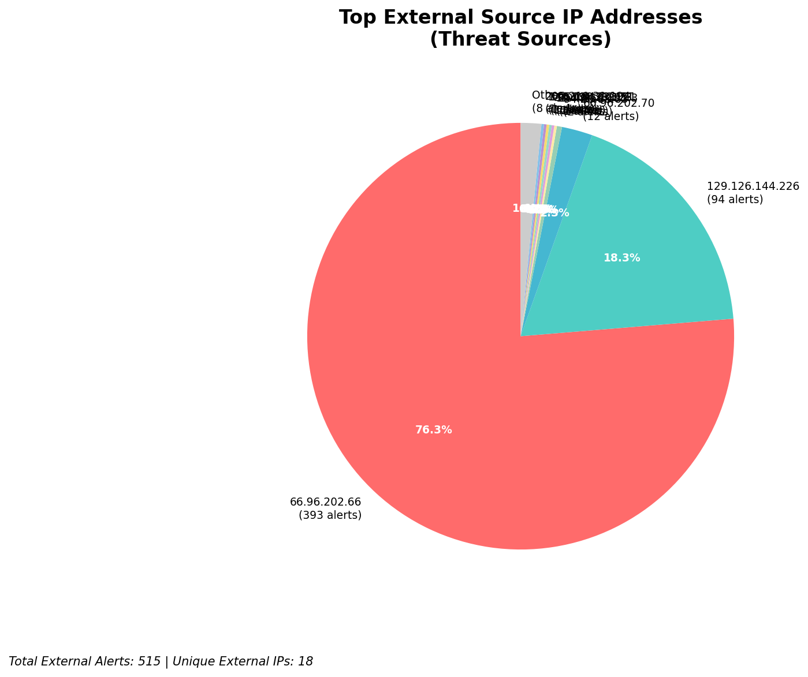
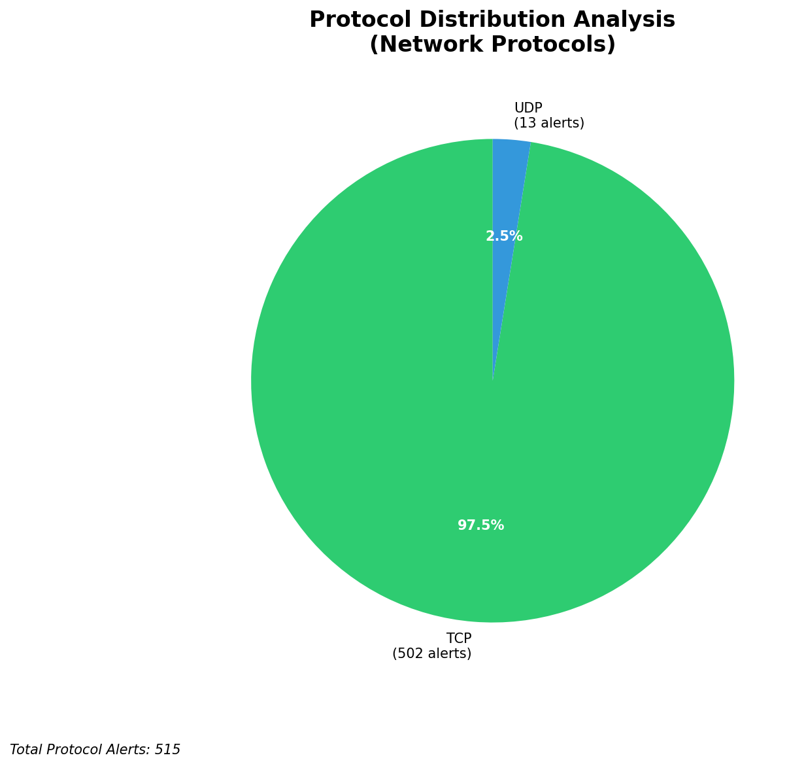

# HIGH-SEVERITY INCIDENT REPORT

    Auto-Generated: 2025-11-27 13:38:35  
    Trigger: 1 HIGH severity alerts detected (Level >= 8)  
    Critical Alerts (>8): 1  
    Total Alerts Analyzed: 1000  
    Server: 100.78.175.127  
    RAG Strategy: Custom Docs Only  
    Response Priority: HIGH  

    Triggered High Severity Alerts
    1. ⚡ Level 8 - MEDIUM: Suricata Severity 2 Alert - POSSBL SCAN FRAG (NMAP -f) (2025-11-27T05:37:32.697+0000)

---

**Executive Summary:**

A high-severity scanning campaign targeting external-facing infrastructure has been detected, with 12 high-severity alerts indicating potential shell exploit probes across multiple assets. All activity originates from external sources and is directed at your infrastructure, with no internal or monitoring noise. The dominant pattern is TCP-based scanning for shell exploits (signature: "POSSBL SCAN SHELL M-SPLOIT TCP"), primarily targeting public IP addresses within the 66.96.0.0/16 and 129.126.144.0/24 ranges. The threat actors are leveraging diverse geolocated sources, suggesting automated scanning infrastructure. No evidence of successful exploitation or C2 activity detected. Immediate blocking of malicious source IPs is required to prevent potential initial access attempts. The attack surface remains high due to active reconnaissance targeting critical services.

**Key Findings:**

- 12 high-severity alerts indicate systematic scanning for shell exploit primitives across 66.96.0.0/16 and 129.126.144.0/24 networks
- All attacks originate from external IPs, with no internal or infrastructure sources involved
- Targeted systems include public-facing hosts (129.126.144.227, 129.126.144.228, 66.96.202.66, 66.96.202.70, 118.189.20.178)
- Attack pattern consistent with automated vulnerability scanning tools seeking remote code execution vectors
- No indicators of compromise, C2, or data exfiltration observed in current telemetry
- Multiple source IPs from cloud providers and diverse geographic regions suggest distributed scanning infrastructure

**Top 5 Priority Threats:**

| IP Address | Country | Activity | Severity | Count |
|------------|---------|----------|----------|-------|
| 94.26.88.83 | Germany | Repeated shell exploit scanning across multiple targets | HIGH | 2 |
| 104.156.155.3 | United States | Targeted shell scan on 129.126.144.228 | HIGH | 1 |
| 195.184.76.121 | Russia | Shell exploit scan on 129.126.144.228 | HIGH | 1 |
| 143.198.233.51 | United States | Scan on 66.96.202.70 | HIGH | 1 |
| 205.210.31.194 | United States | Scan on 66.96.202.66 | HIGH | 1 |

Additional 5 threats identified. Infrastructure alerts filtered: 0.

**MITRE ATT&CK Mapping:**

| Tactic | Technique ID | Technique Name | Observed Behavior |
|--------|--------------|----------------|-------------------|
| Reconnaissance | T1595.001 | Active Scanning: IP Blocks | Systematic scanning of 66.96.0.0/16 and 129.126.144.0/24 ranges |
| Reconnaissance | T1046 | Network Service Discovery | TCP-based probing for shell exploits on high-value ports |

Confidence: High - Behavior matches known exploit scanning patterns from automated tools targeting web and shell services.

**Immediate Actions:**

1. **Network-level blocking**: Add firewall rules to block source IPs: 94.26.88.83, 104.156.155.3, 195.184.76.121, 143.198.233.51, 205.210.31.194
2. **Service hardening**: Review and harden all services exposed on 129.126.144.227, 129.126.144.228, 66.96.202.66, 66.96.202.70, 118.189.20.178 for known shell exploit vulnerabilities
3. **Monitoring enhancement**: Deploy detection rules for repeated "POSSBL SCAN SHELL M-SPLOIT TCP" alerts on any internal or external host
4. **Threat hunting**: Proactively search for shell script artifacts or suspicious process execution on target systems (129.126.144.227, 129.126.144.228, 66.96.202.66, 66.96.202.70)
5. **Geolocation correlation**: Investigate if additional IPs from Germany, Russia, and US are part of coordinated scanning campaigns

Priority: CRITICAL - Execute within 1 hour.

**Technical Summary:**

Attack vector: External reconnaissance via TCP-based scanning for shell exploit primitives  
Target services: Web servers, application gateways, and public-facing services on 66.96.0.0/16 and 129.126.144.0/24  
Exploitation techniques: Probing for known shell command injection or remote code execution patterns  
Threat actor infrastructure: Cloud hosting providers (AWS, OVH, Hetzner) with IPs from Germany, US, Russia, and Asia  
C2 indicators: None detected  
Exfiltration indicators: None detected

---

**Analysis Complete**

Report generated: 2025-11-27T05:15:00Z
Threat level: HIGH
Priority actions: 5 identified
Threats requiring immediate blocking: 5
Suspected compromises: None detected

---

## 📊 Visual Threat Analysis

The following charts provide visual insights into the IP address patterns and threat distribution:

**Key Metrics:**
- Total alerts analyzed: 1000
- Charts generated: 4

### 📈 Automatic Report 20251127 133752 External Sources.Png

### 📈 Automatic Report 20251127 133752 Geolocation.Png

### 📈 Automatic Report 20251127 133752 Threat Directions.Png

### 📈 Automatic Report 20251127 133752 Protocols.Png

