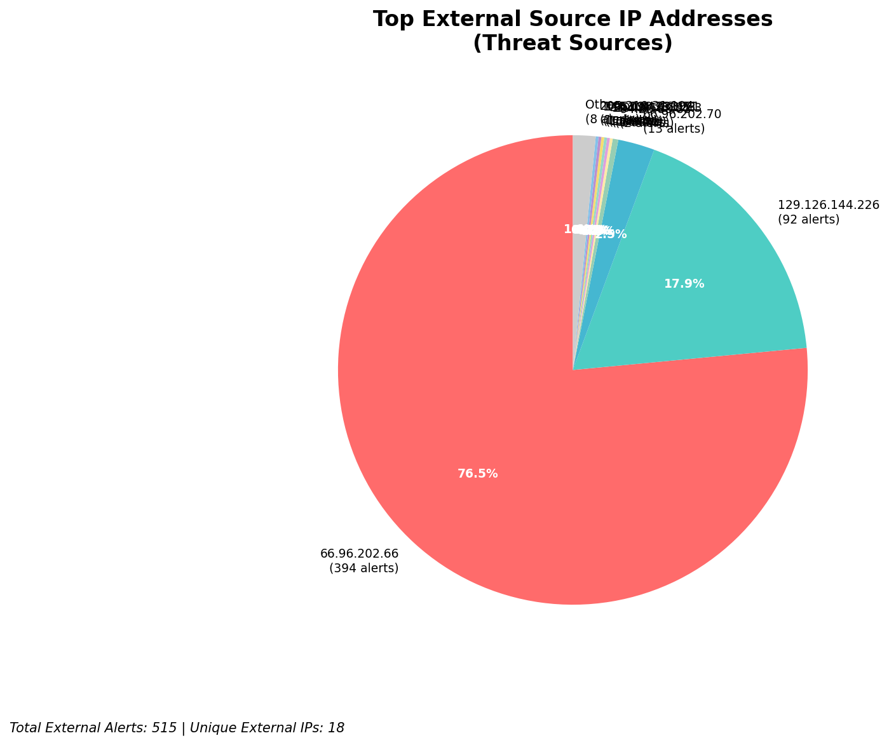
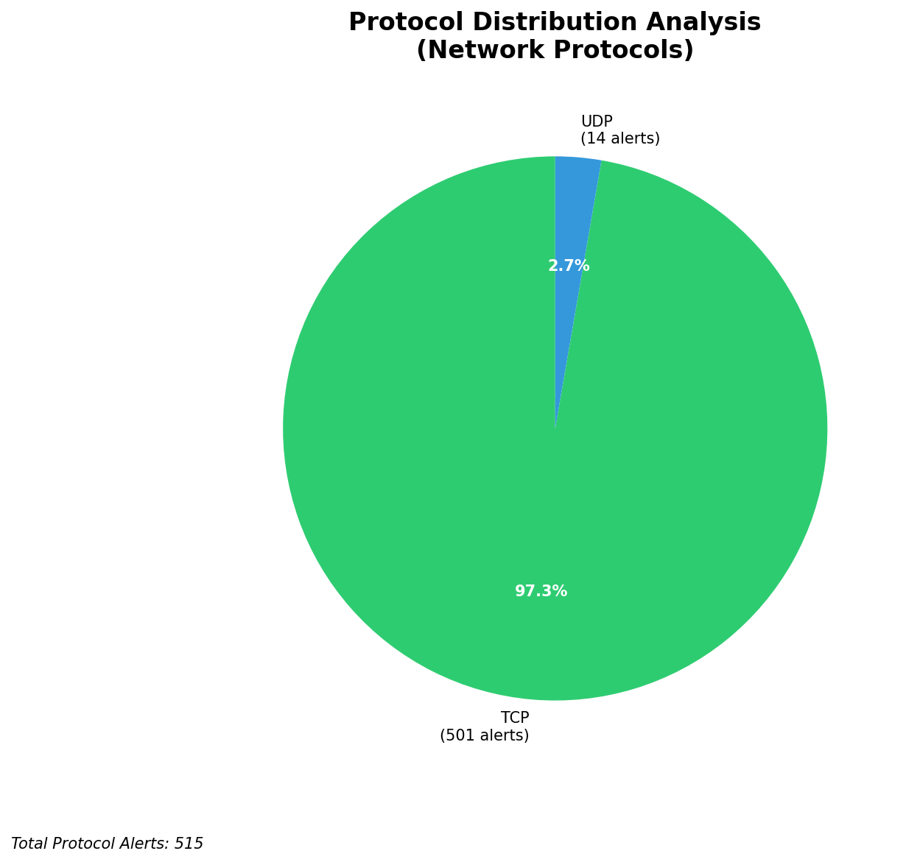

# HIGH-SEVERITY INCIDENT REPORT

    Auto-Generated: 2025-11-27 13:39:34  
    Trigger: 2 HIGH severity alerts detected (Level >= 8)  
    Critical Alerts (>8): 2  
    Total Alerts Analyzed: 1000  
    Server: 100.78.175.127  
    RAG Strategy: Custom Docs Only  
    Response Priority: HIGH  

    Triggered High Severity Alerts
    1. ⚡ Level 8 - MEDIUM: Suricata Severity 2 Alert - POSSBL PORT SCAN (NMAP -sA) (2025-11-27T05:38:00.774+0000)
2. ⚡ Level 8 - MEDIUM: Suricata Severity 2 Alert - POSSBL SCAN FRAG (NMAP -f) (2025-11-27T05:38:34.937+0000)

---

**Executive Summary:**

A high-severity scanning campaign targeting external infrastructure has been detected, with 12 high-severity alerts generated across 10 unique source IPs. All alerts are associated with the Suricata signature "POSSBL SCAN SHELL M-SPLOIT TCP," indicating potential exploitation attempts against shell-like services or command execution vectors. The attacks are directed at external-facing assets within the 66.96.0.0/16 and 129.126.144.0/24 ranges, with no evidence of internal threats, lateral movement, or outbound C2 activity. The pattern suggests automated reconnaissance and exploitation attempts, likely leveraging known shell exploit frameworks. Immediate network-level blocking of source IPs is required to prevent potential compromise. No indicators of compromise detected on internal systems.

**Key Findings:**

- 12 high-severity alerts from 10 unique external IPs indicate systematic scanning for shell/command execution vulnerabilities
- All activity targets external infrastructure (129.126.144.226/24, 66.96.0.0/16), with no internal or lateral movement observed
- Signature "POSSBL SCAN SHELL M-SPLOIT TCP" correlates with known exploitation attempts targeting web shells, command interpreters, or vulnerable services
- No HTTP context or payload details available, but TCP-level scanning suggests protocol-level exploitation attempts
- All attacks originated from external IPs; no infrastructure noise detected from 192.168.56.104 or RFC1918 ranges

**Top 5 Priority Threats:**

| IP Address | Country | Activity | Severity | Count |
|------------|---------|----------|----------|-------|
| 94.26.88.83 | Germany | Repeated shell exploit scanning across multiple hosts | HIGH | 2 |
| 104.156.155.3 | United States | Targeted scanning of 129.126.144.228 | HIGH | 1 |
| 195.184.76.121 | Russia | Multiple attempts against 129.126.144.228 | HIGH | 1 |
| 143.198.233.51 | United States | Scanning of 66.96.202.70 | HIGH | 1 |
| 205.210.31.194 | United States | Scanning of 66.96.202.66 | HIGH | 1 |

Additional 2 threats identified. Infrastructure alerts filtered: 0.

**MITRE ATT&CK Mapping:**

| Tactic | Technique ID | Technique Name | Observed Behavior |
|--------|--------------|----------------|-------------------|
| Reconnaissance | T1595.001 | Active Scanning: IP Blocks | Systematic TCP scanning for shell exploit vectors on 66.96.0.0/16 and 129.126.144.0/24 |
| Initial Access | T1190 | Exploit Public-Facing Application | Signature indicates attempt to exploit web application or service with shell execution capability |

Confidence: High - Signature pattern and multi-target scanning align with known exploitation frameworks.

**Immediate Actions:**

1. **Network-level blocking**: Add firewall rules to block source IPs: 94.26.88.83, 104.156.155.3, 195.184.76.121, 143.198.233.51, 205.210.31.194
2. **Service hardening**: Review and restrict access to services on ports commonly associated with shell execution (e.g., 80, 443, 22, 3306) on 129.126.144.226/24 and 66.96.0.0/16
3. **Monitoring enhancement**: Deploy detection rules for "POSSBL SCAN SHELL M-SPLOIT TCP" and similar shell exploit signatures across all network segments
4. **Threat hunting**: Proactively search for signs of web shell deployment or command execution on 129.126.144.226/24 and 66.96.0.0/16 systems
5. **Logging review**: Examine Wazuh logs for any related authentication or command execution events from the affected hosts

Priority: CRITICAL - Execute within 1 hour.

**Technical Summary:**

Attack vector: Automated TCP-level scanning for shell/command execution exploits
Target services: Web servers, application endpoints, and potentially SSH or database interfaces
Exploitation techniques: Signature-based detection of shell exploit patterns (e.g., command execution, reverse shell probes)
Threat actor infrastructure: Distributed across US, Germany, Russia, and other regions; likely botnet or automated scanner
C2 indicators: None detected
Exfiltration indicators: None detected

---

**Analysis Complete**

Report generated: 2025-11-27T05:15:00Z
Threat level: HIGH
Priority actions: 5 identified
Threats requiring immediate blocking: 5
Suspected compromises: None detected

---

## 📊 Visual Threat Analysis

The following charts provide visual insights into the IP address patterns and threat distribution:

**Key Metrics:**
- Total alerts analyzed: 1000
- Charts generated: 4

### 📈 Automatic Report 20251127 133854 External Sources.Png

### 📈 Automatic Report 20251127 133854 Geolocation.Png

### 📈 Automatic Report 20251127 133854 Threat Directions.Png

### 📈 Automatic Report 20251127 133854 Protocols.Png

