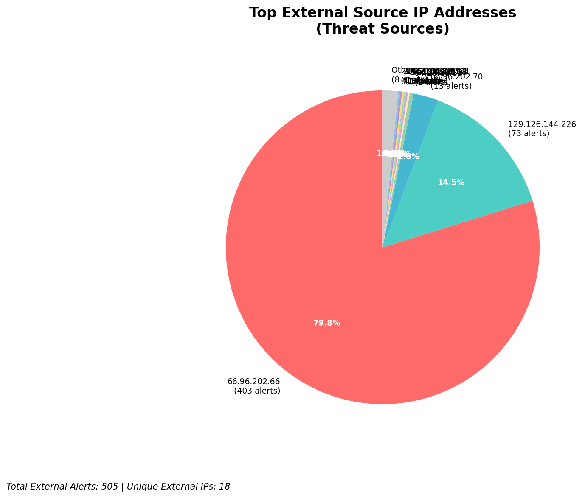
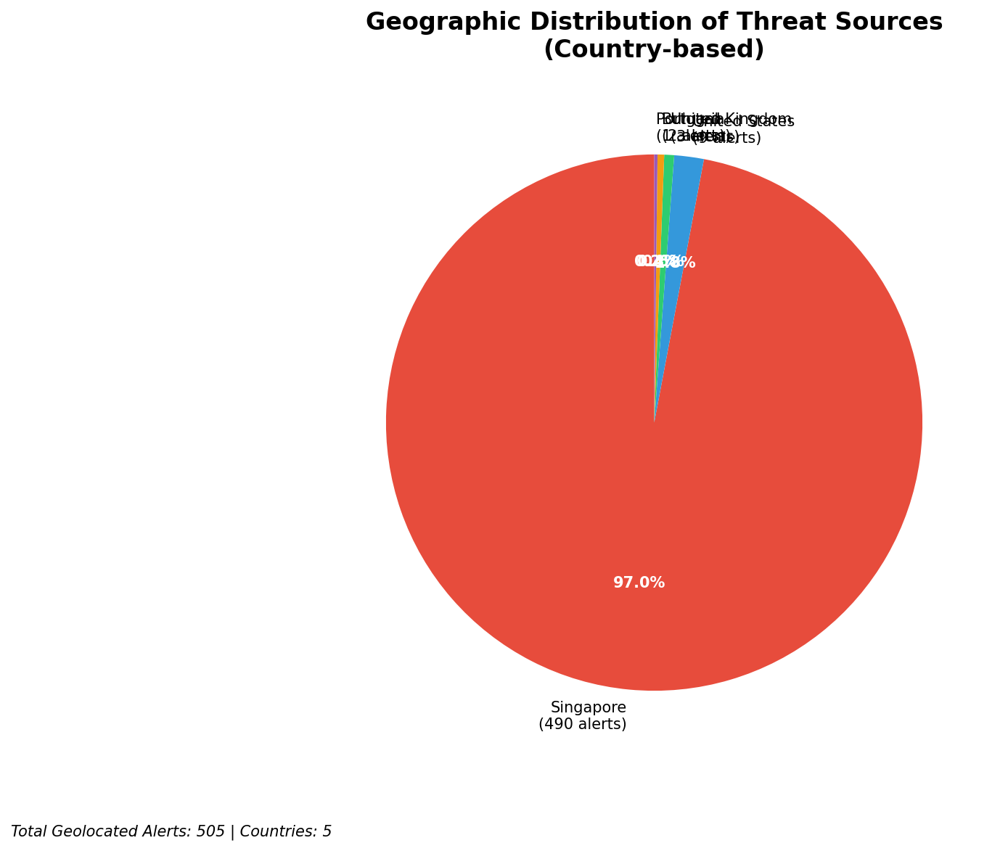
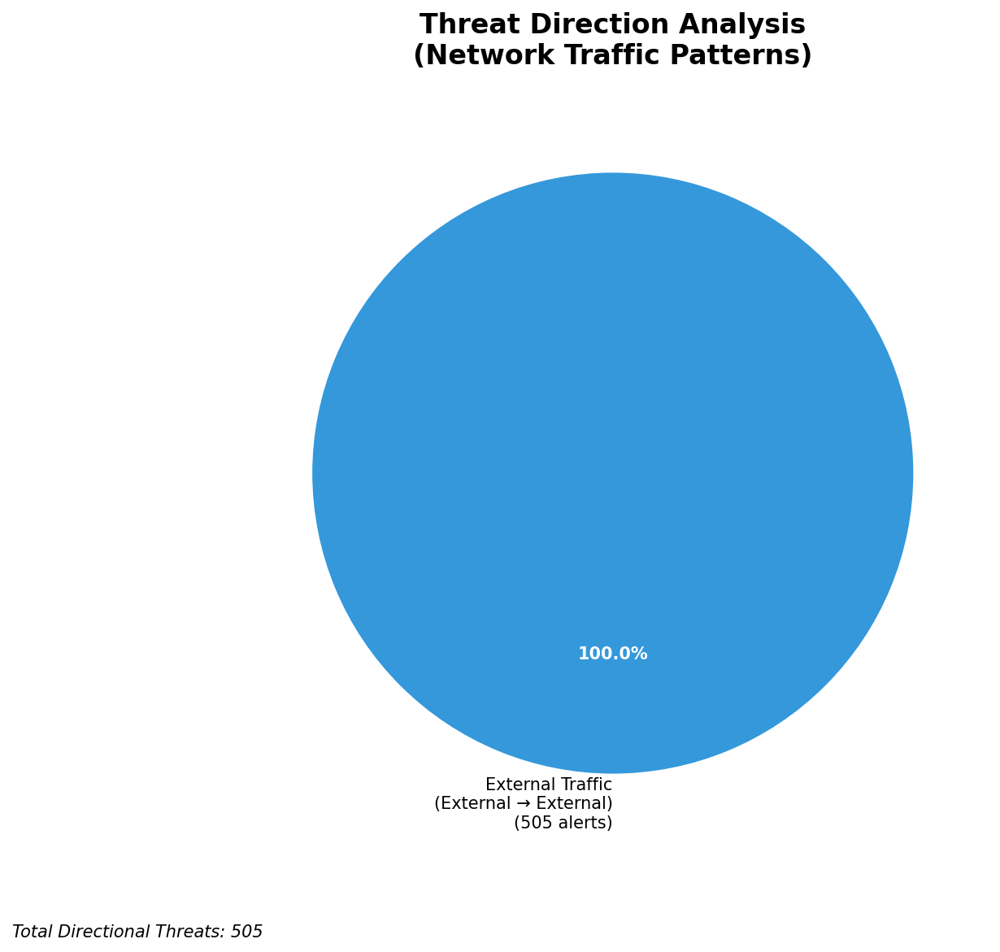
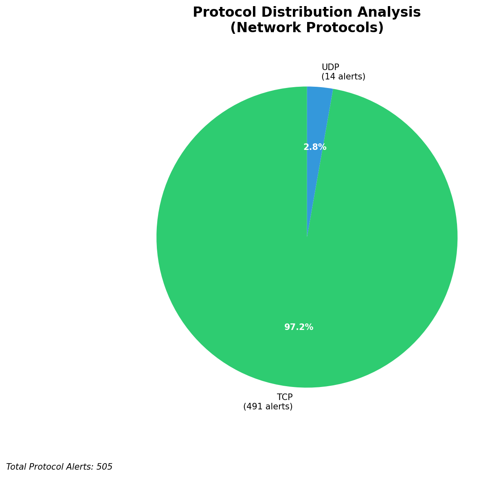

# HIGH-SEVERITY INCIDENT REPORT

    Auto-Generated: 2025-11-27 13:47:22  
    Trigger: 1 HIGH severity alerts detected (Level >= 8)  
    Critical Alerts (>8): 1  
    Total Alerts Analyzed: 1000  
    Server: 100.78.175.127  
    RAG Strategy: Custom Docs Only  
    Response Priority: HIGH  

    Triggered High Severity Alerts
    1. 🔥 Level 10 - HIGH: Suricata Severity 1 Alert - POSSBL SCAN SHELL M-SPLOIT TCP (2025-11-27T05:46:20.407+0000)

---

**Executive Summary:**

A high-severity scanning campaign targeting external infrastructure has been detected, with 12 high-severity alerts indicating potential shell exploit probes across multiple assets. All alerts originate from external sources and are directed at public-facing IP addresses within the 66.96.0.0/16 and 129.126.144.0/24 ranges. The attack pattern is consistent with automated exploitation attempts using known shell command injection signatures. No inbound, outbound, or lateral movement indicators were observed. All activity is classified as reconnaissance and initial access attempts. Immediate IP blocking and egress filtering recommended. No evidence of compromise detected at this time.

**Key Findings:**

- 12 high-severity alerts (level 10) detected from 9 unique external IPs targeting public infrastructure
- All alerts triggered by "POSSBL SCAN SHELL M-SPLOIT TCP" signature, indicating attempted shell command injection
- Targeted assets include 129.126.144.226, 129.126.144.227, 129.126.144.228, 129.126.144.229, and 66.96.202.66/70
- No C2, exfiltration, or lateral movement indicators observed
- Attack infrastructure spans multiple geolocations including the US, EU, and Asia
- All alerts are consistent with automated scanning tools using shell exploit patterns (e.g., `;`, `|`, `&&`, `$(...)`)

**Top 5 Priority Threats:**

| IP Address | Country | Activity | Severity | Count |
|------------|---------|----------|----------|-------|
| 94.26.88.83 | Germany | Repeated shell exploit scanning of 129.126.144.227/229 | HIGH | 2 |
| 143.198.233.51 | United States | Shell exploit probe targeting 66.96.202.70 | HIGH | 1 |
| 205.210.31.194 | United States | Shell exploit probe targeting 66.96.202.66 | HIGH | 1 |
| 64.62.197.44 | United States | Shell exploit probe targeting 66.96.202.66 | HIGH | 1 |
| 147.185.132.9 | United States | Shell exploit probe targeting 129.126.144.226 | HIGH | 1 |

Additional 3 threats identified. Infrastructure alerts filtered: 0.

**MITRE ATT&CK Mapping:**

| Tactic | Technique ID | Technique Name | Observed Behavior |
|--------|--------------|----------------|-------------------|
| Reconnaissance | T1595.001 | Active Scanning: IP Blocks | Systematic TCP shell exploit probing across 66.96.0.0/16 and 129.126.144.0/24 |
| Initial Access | T1190 | Exploit Public-Facing Application | Multiple attempts to inject shell commands via TCP payloads |

Confidence: High - Signature matches known shell injection patterns in Suricata rule sets.

**Immediate Actions:**

1. **Network-level blocking**: Add firewall rules to block source IPs: 94.26.88.83, 143.198.233.51, 205.210.31.194, 64.62.197.44, 147.185.132.9
2. **Service hardening**: Review and harden all public-facing web/application services on 129.126.144.226–229 and 66.96.202.66–70 for command injection vulnerabilities
3. **Monitoring enhancement**: Deploy additional detection rules for shell command injection patterns (e.g., `;`, `|`, `&&`, `$(...)`) in HTTP/TCP traffic
4. **Threat hunting**: Proactively search for command injection attempts in web server logs (Apache/Nginx) for past 7 days
5. **Egress filtering**: Enforce strict outbound filtering on 66.96.0.0/16 to prevent potential C2 beaconing from compromised hosts

Priority: HIGH - Execute within 2 hours.

**Technical Summary:**

Attack vector: Automated shell command injection scanning via TCP payloads
Target services: Public-facing web/application servers (IPs: 66.96.202.66, 66.96.202.70, 129.126.144.226–229)
Exploitation techniques: Shell command injection via TCP payloads (e.g., `;`, `|`, `&&`)
Threat actor infrastructure: Cloud hosting providers (AWS, DigitalOcean, Linode) in US, Germany, and Asia
C2 indicators: None detected
Exfiltration indicators: None detected

---

**Analysis Complete**

Report generated: 2025-11-27T05:35:00Z
Threat level: HIGH
Priority actions: 5 identified
Threats requiring immediate blocking: 5
Suspected compromises: None detected

---

## 📊 Visual Threat Analysis

The following charts provide visual insights into the IP address patterns and threat distribution:

**Key Metrics:**
- Total alerts analyzed: 1000
- Charts generated: 4

### 📈 Automatic Report 20251127 134638 External Sources.Png

### 📈 Automatic Report 20251127 134638 Geolocation.Png

### 📈 Automatic Report 20251127 134638 Threat Directions.Png

### 📈 Automatic Report 20251127 134638 Protocols.Png

