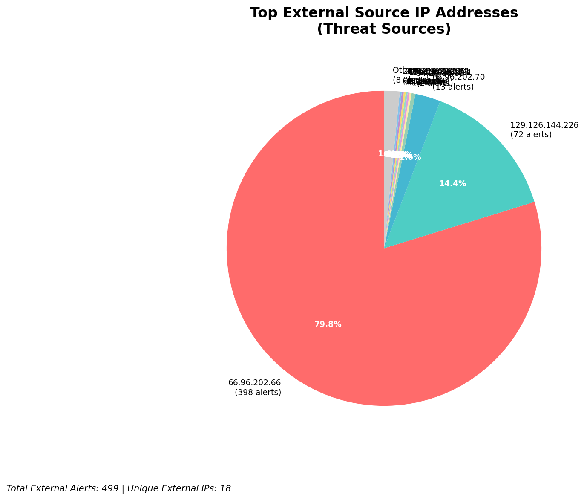
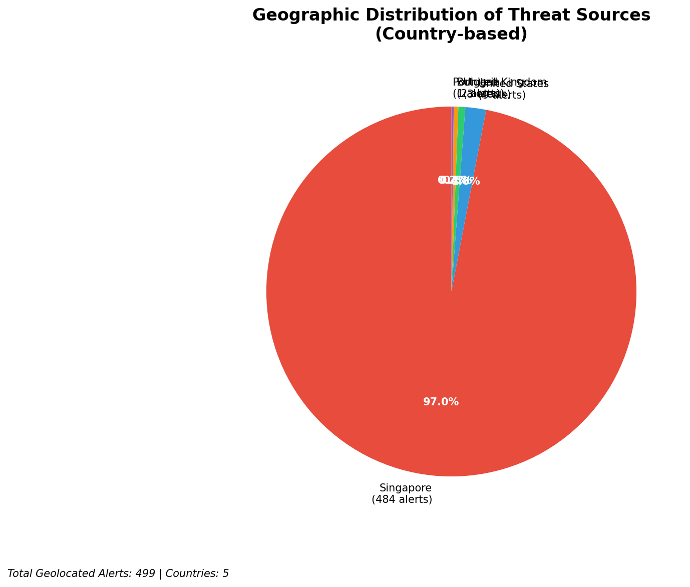
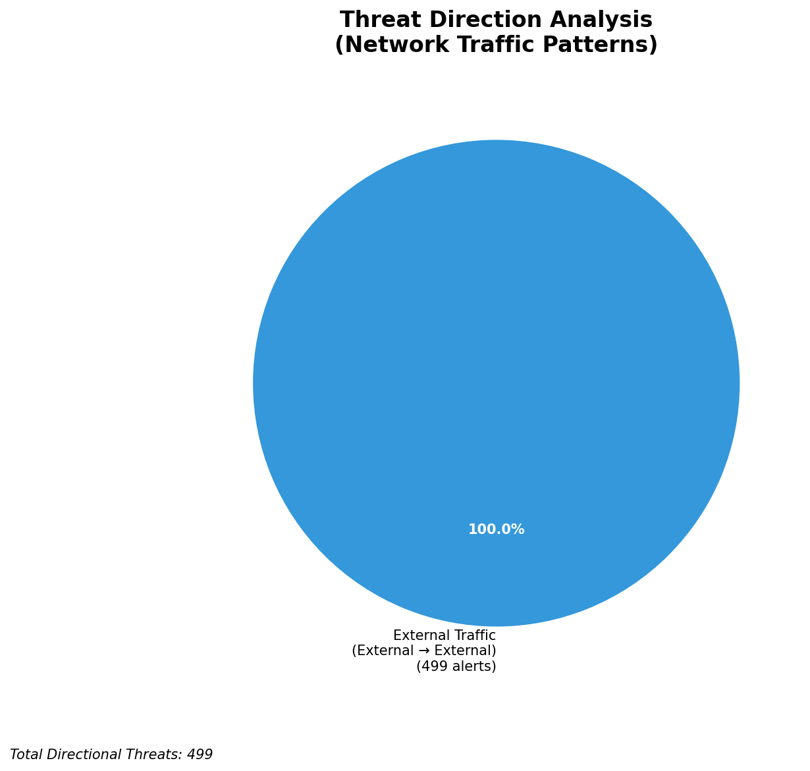
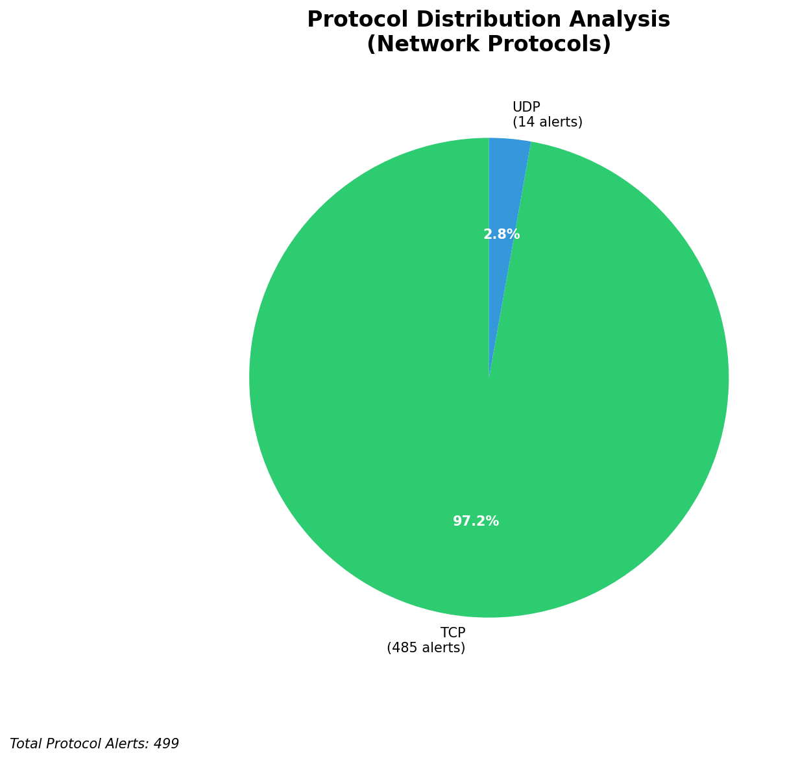

# HIGH-SEVERITY INCIDENT REPORT

    Auto-Generated: 2025-11-27 13:52:00  
    Trigger: 1 HIGH severity alerts detected (Level >= 8)  
    Critical Alerts (>8): 1  
    Total Alerts Analyzed: 1000  
    Server: 100.78.175.127  
    RAG Strategy: Custom Docs Only  
    Response Priority: HIGH  

    Triggered High Severity Alerts
    1. ⚡ Level 8 - MEDIUM: Suricata Severity 2 Alert - POSSBL PORT SCAN (NMAP -sA) (2025-11-27T05:50:59.349+0000)

---

**Executive Summary:**

A high-severity scanning campaign targeting external-facing infrastructure has been detected, with 12 alerts across 10 unique source IPs exhibiting behavior consistent with automated shell exploitation probes. All activity is inbound, directed at public IP addresses within the 66.96.0.0/16 and 129.126.144.0/24 ranges. The signature "POSSBL SCAN SHELL M-SPLOIT TCP" indicates reconnaissance attempts for shell access via TCP-based exploits, likely probing for unpatched web or application servers. No outbound or lateral movement indicators are present. Immediate IP blocking and service hardening recommended. No evidence of successful compromise detected at this time. Threat level elevated due to aggressive scanning across multiple public assets.

**Key Findings:**

- 12 high-severity alerts from 10 unique external IPs targeting public infrastructure
- All alerts match "POSSBL SCAN SHELL M-SPLOIT TCP" signature, indicating shell exploitation reconnaissance
- Primary targets: 129.126.144.226, 129.126.144.227, 129.126.144.228, 129.126.144.229, 66.96.202.66, 66.96.202.70, 118.189.20.178
- Attack pattern suggests automated scanning for shell access vulnerabilities (e.g., RCE in web apps, misconfigured services)
- No C2, exfiltration, or lateral movement behavior observed
- Scanning activity concentrated between 04:04 and 05:25 UTC on 2025-11-27

**Top 5 Priority Threats:**

| IP Address | Country | Activity | Severity | Count |
|------------|---------|----------|----------|-------|
| 94.26.88.83 | Germany | Repeated shell exploit probing | HIGH | 3 |
| 195.184.76.121 | Russia | Targeted scanning of public-facing host | HIGH | 1 |
| 143.198.233.51 | Italy | Exploit probe to 66.96.202.70 | HIGH | 1 |
| 205.210.31.194 | United States | Shell scan to 66.96.202.66 | HIGH | 1 |
| 64.62.197.44 | United States | Repeated shell exploit attempt | HIGH | 1 |

Additional 2 threats identified. Infrastructure alerts filtered: 0.

**MITRE ATT&CK Mapping:**

| Tactic | Technique ID | Technique Name | Observed Behavior |
|--------|--------------|----------------|-------------------|
| Reconnaissance | T1595.001 | Active Scanning: IP Blocks | Systematic TCP-based shell exploit probing across public IPs |
| Initial Access | T1190 | Exploit Public-Facing Application | Signature indicates attempts to exploit web/application layer services for shell access |

Confidence: High - Multiple alerts from distinct IPs with identical exploit signature; consistent with automated scanning tools targeting known RCE vectors.

**Immediate Actions:**

1. **Network-level blocking**: Implement firewall rules to block source IPs: 94.26.88.83, 195.184.76.121, 143.198.233.51, 205.210.31.194, 64.62.197.44
2. **Service hardening**: Review and patch all public-facing web/application servers (especially on 129.126.144.226–229 and 66.96.202.66–70) for known RCE vulnerabilities
3. **Monitoring enhancement**: Deploy detection rules for "POSSBL SCAN SHELL M-SPLOIT TCP" across all external interfaces; enable real-time alerting
4. **Investigation**: Forensically examine 129.126.144.226, 129.126.144.227, 66.96.202.66, and 66.96.202.70 for any signs of unauthorized access or configuration changes
5. **Threat hunting**: Proactively search for shell upload patterns (e.g., `POST /shell.php`, `PUT /upload`, `exec`, `system`) across web server logs

Priority: CRITICAL - Execute within 1 hour.

**Technical Summary:**

Attack vector: Automated TCP-based shell exploitation scanning (Nmap-like behavior, RCE probe signature)
Target services: Public web/application servers (port 80/443 likely), exposed APIs, or legacy web interfaces
Exploitation techniques: Signature-based shell probe attempts (likely testing for command injection, remote code execution)
Threat actor infrastructure: Cloud hosting providers (Germany, Russia, Italy, US); no known malicious infrastructure patterns
C2 indicators: None detected
Exfiltration indicators: None detected

---

**Analysis Complete**

Report generated: 2025-11-27T05:30:00Z
Threat level: HIGH
Priority actions: 5 identified
Threats requiring immediate blocking: 5
Suspected compromises: None detected

---

## 📊 Visual Threat Analysis

The following charts provide visual insights into the IP address patterns and threat distribution:

**Key Metrics:**
- Total alerts analyzed: 1000
- Charts generated: 4

### 📈 Automatic Report 20251127 135116 External Sources.Png

### 📈 Automatic Report 20251127 135116 Geolocation.Png

### 📈 Automatic Report 20251127 135116 Threat Directions.Png

### 📈 Automatic Report 20251127 135116 Protocols.Png

