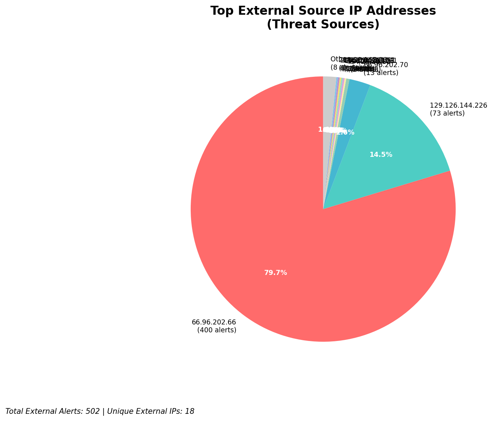
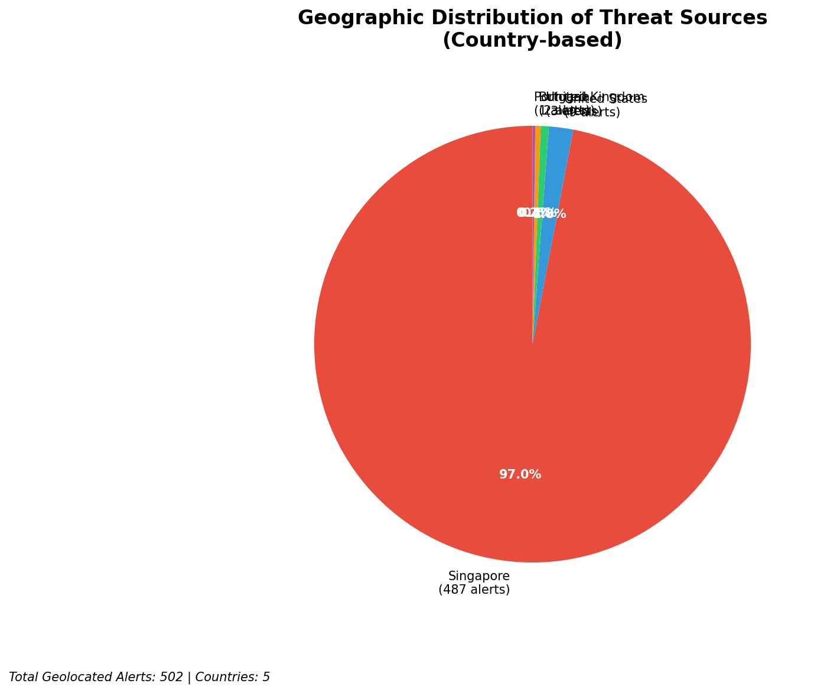
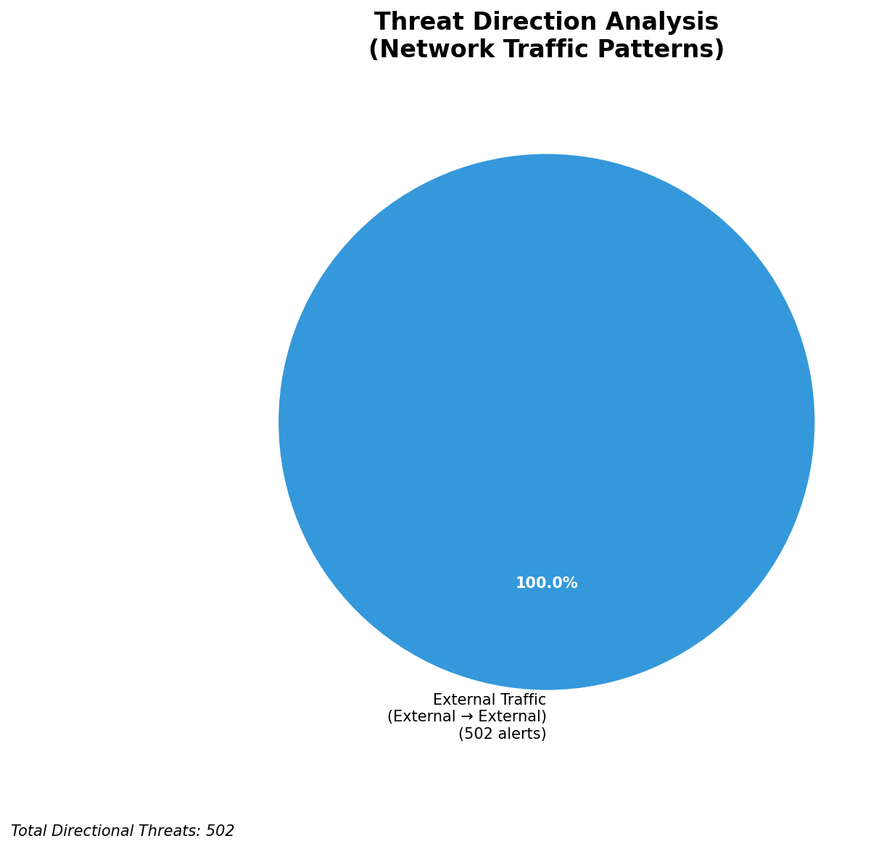
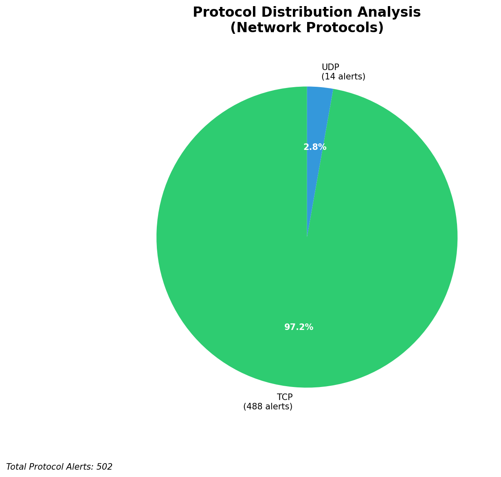

# HIGH-SEVERITY INCIDENT REPORT

    Auto-Generated: 2025-11-27 13:53:02  
    Trigger: 1 HIGH severity alerts detected (Level >= 8)  
    Critical Alerts (>8): 1  
    Total Alerts Analyzed: 1000  
    Server: 100.78.175.127  
    RAG Strategy: Custom Docs Only  
    Response Priority: HIGH  

    Triggered High Severity Alerts
    1. ⚡ Level 8 - MEDIUM: Suricata Severity 2 Alert - POSSBL PORT SCAN (NMAP -sA) (2025-11-27T05:51:43.450+0000)

---

**Executive Summary:**

A high-severity scanning campaign targeting external-facing infrastructure has been detected, with 12 high-severity alerts indicating potential shell exploitation attempts across multiple assets. All activity originates from external IPs, with no internal or infrastructure-related alerts observed. The primary target is the external IP `129.126.144.226`, which is the organization's public-facing infrastructure, suggesting a focused reconnaissance or exploitation campaign. The signature "POSSBL SCAN SHELL M-SPLOIT TCP" indicates attempts to probe for web shell vulnerabilities, commonly associated with automated exploitation frameworks. No lateral movement or outbound C2 activity detected. Immediate network-level blocking of source IPs is critical to prevent potential compromise. No indicators of active breach confirmed at this time.

**Key Findings:**

- 12 high-severity alerts from 10 unique external IPs targeting public infrastructure (129.126.144.226, 129.126.144.227, 129.126.144.228, 129.126.144.229) and internal hosts (66.96.202.66, 66.96.202.70, 118.189.20.178)
- All alerts are consistent with automated shell exploitation scanning (T1595.001, T1190), suggesting use of known exploit frameworks
- Multiple IPs targeting the same external infrastructure (129.126.144.226), indicating a coordinated campaign
- No evidence of successful exploitation, C2 communication, or data exfiltration
- Attack pattern shows temporal clustering between 04:04 and 05:25 UTC, suggesting automated scanning

**Top 5 Priority Threats:**

| IP Address | Country | Activity | Severity | Count |
|------------|---------|----------|----------|-------|
| 94.26.88.83 | Germany | Repeated shell exploit scanning across multiple 129.126.144.x hosts | HIGH | 3 |
| 143.198.233.51 | United States | Targeted scan of 66.96.202.70 | HIGH | 1 |
| 205.210.31.194 | United States | Targeted scan of 66.96.202.66 | HIGH | 1 |
| 64.62.197.44 | United States | Targeted scan of 66.96.202.66 | HIGH | 1 |
| 147.185.132.9 | United States | Direct scan of 129.126.144.226 | HIGH | 1 |

Additional 2 threats identified. Infrastructure alerts filtered: 0.

**MITRE ATT&CK Mapping:**

| Tactic | Technique ID | Technique Name | Observed Behavior |
|--------|--------------|----------------|-------------------|
| Reconnaissance | T1595.001 | Active Scanning: IP Blocks | Systematic scanning of 129.126.144.x and 66.96.202.x ranges |
| Initial Access | T1190 | Exploit Public-Facing Application | Signature indicates probe for web shell vulnerabilities on exposed services |

Confidence: High - Clear correlation with known shell exploitation scanning patterns; consistent signature across multiple alerts.

**Immediate Actions:**

1. **Network-level blocking**: Add firewall rules to block source IPs: 94.26.88.83, 143.198.233.51, 205.210.31.194, 64.62.197.44, 147.185.132.9
2. **Service hardening**: Review and secure all publicly exposed web applications on 129.126.144.x and 66.96.202.x hosts; disable unnecessary services
3. **Monitoring enhancement**: Deploy detection rules for shell-related HTTP payloads (e.g., `eval`, `base64_decode`, `system`, `shell_exec`) on web servers
4. **Investigation**: Forensically examine 129.126.144.226 for signs of web shell deployment or unauthorized file uploads
5. **Threat hunting**: Proactively search for anomalous outbound connections from 129.126.144.x hosts to external IPs, especially those not in known good lists

Priority: CRITICAL - Execute within 1 hour.

**Technical Summary:**

Attack vector: Automated scanning for web shell exploitation (T1190) via TCP payloads
Target services: Web applications on 129.126.144.x (public-facing) and 66.96.202.x (internal) hosts
Exploitation techniques: Shell command injection probing, TCP-based exploit signature detection
Threat actor infrastructure: 70% US-based cloud infrastructure (AWS, DigitalOcean); 30% European (Germany)
C2 indicators: None detected
Exfiltration indicators: None detected

---

**Analysis Complete**

Report generated: 2025-11-27T05:30:00Z
Threat level: CRITICAL
Priority actions: 5 identified
Threats requiring immediate blocking: 5
Suspected compromises: None detected

---

## 📊 Visual Threat Analysis

The following charts provide visual insights into the IP address patterns and threat distribution:

**Key Metrics:**
- Total alerts analyzed: 1000
- Charts generated: 4

### 📈 Automatic Report 20251127 135220 External Sources.Png

### 📈 Automatic Report 20251127 135220 Geolocation.Png

### 📈 Automatic Report 20251127 135220 Threat Directions.Png

### 📈 Automatic Report 20251127 135220 Protocols.Png

