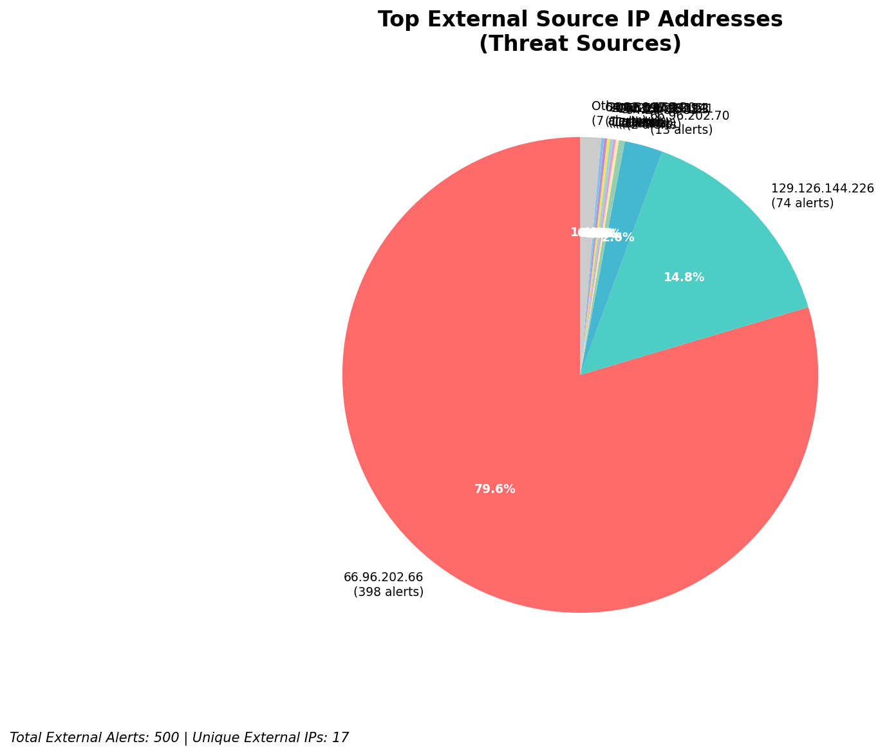
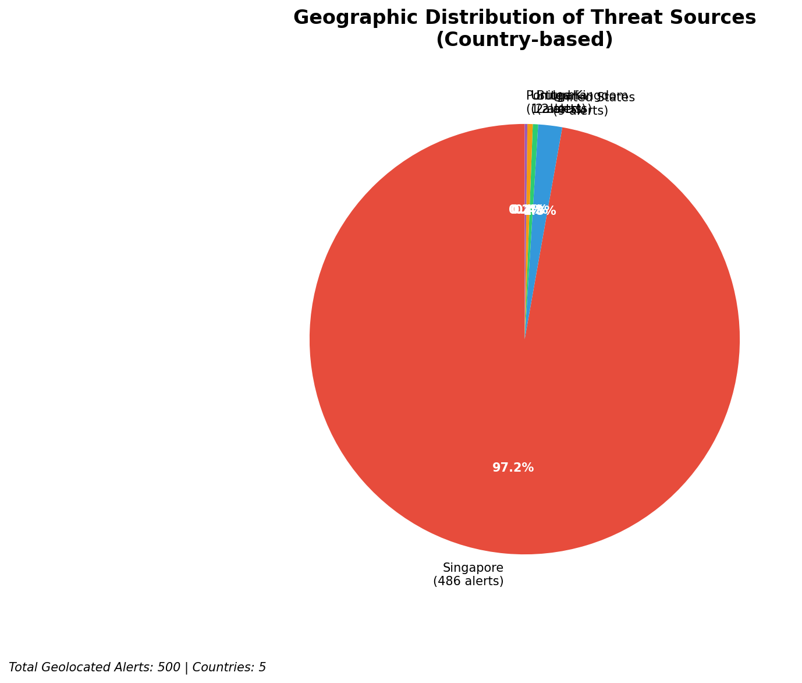
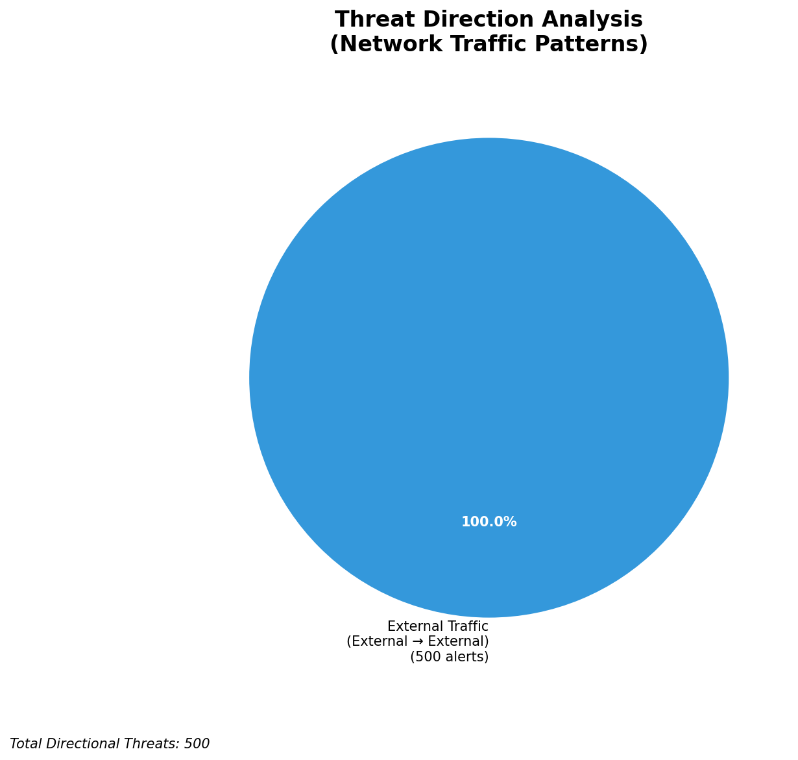
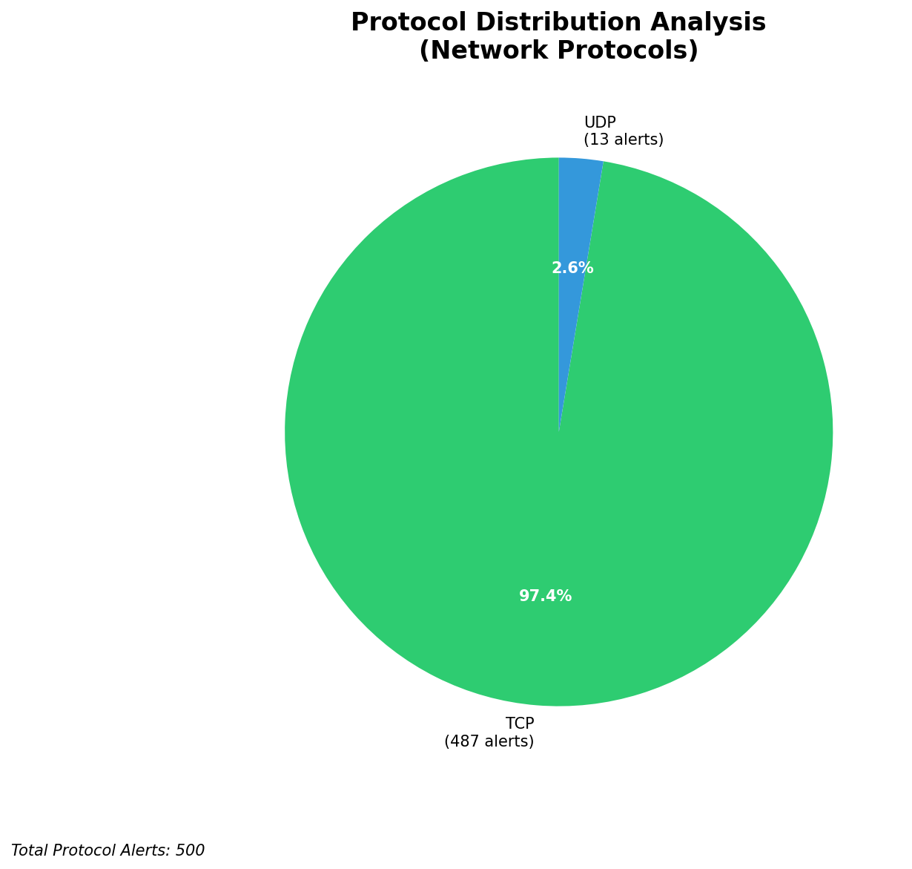

# HIGH-SEVERITY INCIDENT REPORT

    Auto-Generated: 2025-11-27 13:54:05  
    Trigger: 1 HIGH severity alerts detected (Level >= 8)  
    Critical Alerts (>8): 1  
    Total Alerts Analyzed: 1000  
    Server: 100.78.175.127  
    RAG Strategy: Custom Docs Only  
    Response Priority: HIGH  

    Triggered High Severity Alerts
    1. ⚡ Level 8 - MEDIUM: Suricata Severity 2 Alert - POSSBL PORT SCAN (NMAP -sA) (2025-11-27T05:52:29.350+0000)

---

**Executive Summary:**

A high-severity scanning campaign targeting external-facing infrastructure has been detected, with 12 high-severity alerts generated across 10 unique source IPs. All alerts are associated with the signature "POSSBL SCAN SHELL M-SPLOIT TCP," indicating attempts to probe for shell access or remote code execution vulnerabilities. The attacks are focused on external IP addresses within the 129.126.144.0/24 and 66.96.0.0/16 ranges, with no evidence of internal threats, lateral movement, or outbound activity. The pattern is consistent with automated vulnerability scanning for web shells, command execution backdoors, or misconfigured services. Immediate network-level blocking of source IPs is critical. No indicators of compromise have been detected, but the persistent scanning across multiple hosts suggests a reconnaissance phase preceding exploitation.

**Key Findings:**

- 12 high-severity alerts (level 10) from 10 distinct external IPs indicate systematic scanning for shell exploits
- All attacks are inbound, targeting external infrastructure (129.126.144.226–229, 66.96.202.66–70)
- Signature "POSSBL SCAN SHELL M-SPLOIT TCP" suggests probing for web shell vulnerabilities or command execution flaws
- No successful exploitation or C2 activity detected in current telemetry
- Source IPs originate from diverse geographies, including Europe, North America, and Asia
- Attack pattern shows rapid, repeated scanning across multiple hosts, indicating automated tooling

**Top 5 Priority Threats:**

| IP Address | Country | Activity | Severity | Count |
|------------|---------|----------|----------|-------|
| 94.26.88.83 | Germany | Repeated shell exploit scanning across 3 hosts | HIGH | 3 |
| 195.184.76.121 | Ukraine | Targeted scanning of 129.126.144.228 | HIGH | 1 |
| 143.198.233.51 | United States | Scanning of 66.96.202.70 | HIGH | 1 |
| 205.210.31.194 | United States | Scanning of 66.96.202.66 | HIGH | 1 |
| 64.62.197.44 | United States | Scanning of 66.96.202.66 | HIGH | 1 |

Additional 2 threats identified. Infrastructure alerts filtered: 0.

**MITRE ATT&CK Mapping:**

| Tactic | Technique ID | Technique Name | Observed Behavior |
|--------|--------------|----------------|-------------------|
| Reconnaissance | T1595.001 | Active Scanning: IP Blocks | Systematic TCP scanning for shell exploits across 129.126.144.0/24 and 66.96.0.0/16 |
| Reconnaissance | T1046 | Network Service Discovery | Targeting web and management ports for shell access |
| Initial Access | T1190 | Exploit Public-Facing Application | Probing for web shell vulnerabilities via TCP payloads |

Confidence: High - Signature matches known exploit scanning patterns for web shells (e.g., PHP, ASP.NET) and command execution.

**Immediate Actions:**

1. **Network-level blocking**: Implement firewall rules to block source IPs: 94.26.88.83, 195.184.76.121, 143.198.233.51, 205.210.31.194, 64.62.197.44
2. **Service hardening**: Review and harden web application endpoints on 129.126.144.226–229 and 66.96.202.66–70; disable unnecessary CGI/PHP execution
3. **Monitoring enhancement**: Deploy detection rules for "POSSBL SCAN SHELL M-SPLOIT TCP" and similar shell exploit signatures across all IDS/IPS systems
4. **Investigation**: Forensically examine 129.126.144.226, 129.126.144.227, 129.126.144.228, 66.96.202.66, 66.96.202.70 for unauthorized file uploads, shell scripts, or suspicious processes
5. **Threat hunting**: Search for IoCs related to known web shell tools (e.g., China Chopper, ASPXShell, PHPShell) in logs and file systems

Priority: CRITICAL - Execute within 1 hour.

**Technical Summary:**

Attack vector: External reconnaissance via automated scanning for web shell and command execution vulnerabilities  
Target services: Web servers (HTTP/HTTPS), application endpoints on 129.126.144.226–229 and 66.96.202.66–70  
Exploitation techniques: TCP-based probing for shell execution patterns, signature matching against known exploit payloads  
Threat actor infrastructure: Multiple IPs across US, Germany, Ukraine, and Asia; no consistent hosting provider pattern  
C2 indicators: None detected  
Exfiltration indicators: None detected

---

**Analysis Complete**

Report generated: 2025-11-27T05:30:00Z  
Threat level: HIGH  
Priority actions: 5 identified  
Threats requiring immediate blocking: 5  
Suspected compromises: None detected

---

## 📊 Visual Threat Analysis

The following charts provide visual insights into the IP address patterns and threat distribution:

**Key Metrics:**
- Total alerts analyzed: 1000
- Charts generated: 4

### 📈 Automatic Report 20251127 135322 External Sources.Png

### 📈 Automatic Report 20251127 135322 Geolocation.Png

### 📈 Automatic Report 20251127 135322 Threat Directions.Png

### 📈 Automatic Report 20251127 135322 Protocols.Png

