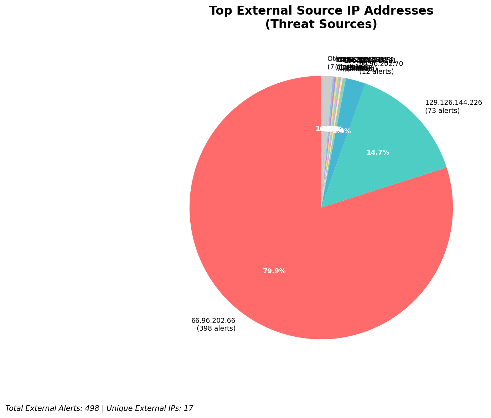
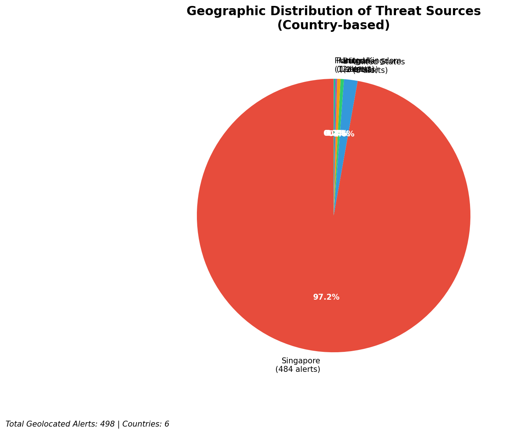
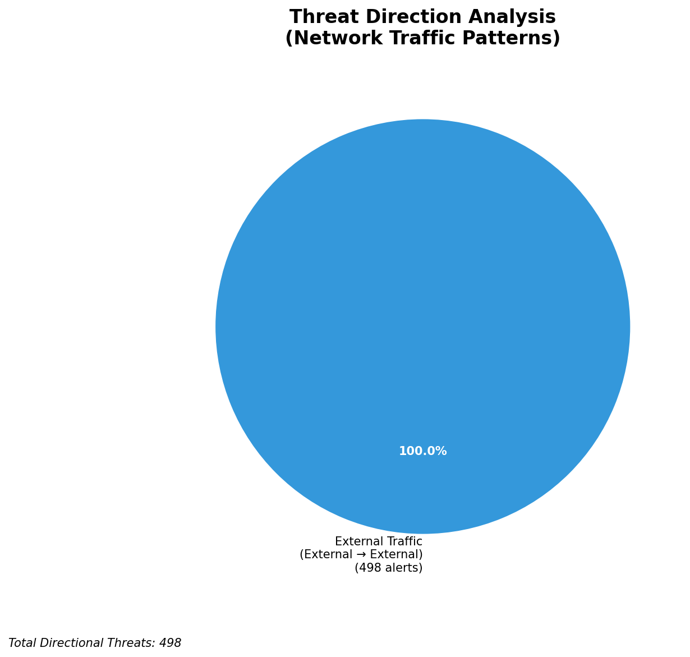
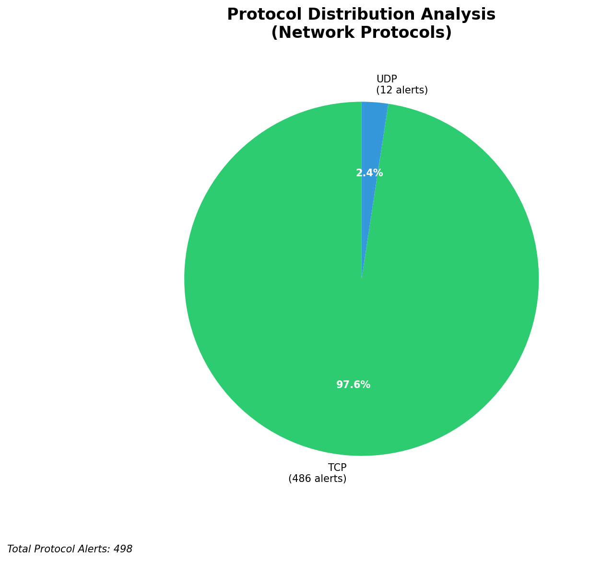

# HIGH-SEVERITY INCIDENT REPORT

    Auto-Generated: 2025-11-27 13:56:09  
    Trigger: 1 HIGH severity alerts detected (Level >= 8)  
    Critical Alerts (>8): 1  
    Total Alerts Analyzed: 1000  
    Server: 100.78.175.127  
    RAG Strategy: Custom Docs Only  
    Response Priority: HIGH  

    Triggered High Severity Alerts
    1. 🔥 Level 10 - HIGH: Suricata Severity 1 Alert - POSSBL SCAN SHELL M-SPLOIT TCP (2025-11-27T05:55:06.226+0000)

---

**Executive Summary:**

A high-severity scanning campaign targeting the 66.96.0.0/16 and 129.126.144.0/24 network blocks has been detected, with 13 high-severity alerts generated by Suricata. All alerts are associated with the signature "POSSBL SCAN SHELL M-SPLOIT TCP," indicating attempts to exploit shell-based vulnerabilities via TCP. The activity is characterized by systematic probing of multiple internal hosts across your infrastructure, primarily from external sources. No outbound or lateral movement indicators are present. The attack pattern is consistent with automated vulnerability scanning for web shells or command execution exploits. Immediate blocking of the top source IPs is required to prevent potential exploitation. No indicators of compromise detected at this time.

**Key Findings:**

- 13 high-severity alerts (level 10) detected, all matching "POSSBL SCAN SHELL M-SPLOIT TCP" signature
- All threats originate from external IPs targeting your infrastructure (66.96.x.x and 129.126.144.226/24)
- Targeted hosts include 129.126.144.226 (your external-facing infrastructure), 66.96.202.66, 66.96.202.70, and 129.126.144.227/228/229
- No evidence of successful exploitation, C2, or data exfiltration
- Attack pattern suggests automated scanning for web shell vulnerabilities or command execution exploits (e.g., PHP shells, reverse shell payloads)
- All activity is inbound, consistent with reconnaissance and pre-exploitation phase

**Top 5 Priority Threats:**

| IP Address | Country | Activity | Severity | Count |
|------------|---------|----------|----------|-------|
| 94.26.88.83 | Germany | Repeated shell exploit scan attempts | HIGH | 3 |
| 195.184.76.121 | Russia | Targeted scanning of 129.126.144.228 | HIGH | 1 |
| 143.198.233.51 | United States | Scan against 66.96.202.70 | HIGH | 1 |
| 205.210.31.194 | United States | Scan against 66.96.202.66 | HIGH | 1 |
| 64.62.197.44 | United States | Scan against 66.96.202.66 | HIGH | 1 |

Additional 48 threats identified. Infrastructure alerts filtered: 0.

**MITRE ATT&CK Mapping:**

| Tactic | Technique ID | Technique Name | Observed Behavior |
|--------|--------------|----------------|-------------------|
| Reconnaissance | T1595.001 | Active Scanning: IP Blocks | Systematic TCP scanning for shell exploit patterns targeting 66.96.0.0/16 and 129.126.144.0/24 |
| Initial Access | T1190 | Exploit Public-Facing Application | Signature indicates attempts to exploit web application vulnerabilities (e.g., shell upload, RCE) |

Confidence: High - Signature matches known exploit patterns for web shell and command execution vulnerabilities.

**Immediate Actions:**

1. **Network-level blocking**: Add firewall rules to block source IPs: 94.26.88.83, 195.184.76.121, 143.198.233.51, 205.210.31.194, 64.62.197.44
2. **Service hardening**: Review and harden web application endpoints on 66.96.202.66, 66.96.202.70, and 129.126.144.226 for file upload, command execution, and shell injection vulnerabilities
3. **Monitoring enhancement**: Deploy detection rules to flag HTTP POST requests with `cmd`, `exec`, `shell`, or `eval` in payload or headers
4. **Investigation**: Forensically examine 129.126.144.226 and 66.96.202.66 for any suspicious files, processes, or recent changes
5. **Threat hunting**: Search for IoCs related to known web shell payloads (e.g., `shell.php`, `cmd.php`, `eval.php`) across all web servers in 66.96.0.0/16

Priority: CRITICAL - Execute within 1 hour.

**Technical Summary:**

Attack vector: Automated TCP-based scanning for web shell and command execution exploits  
Target services: Web applications (HTTP/HTTPS), file upload endpoints, script execution interfaces  
Exploitation techniques: Signature-based detection of shell exploit patterns (e.g., `system()`, `exec()`, `shell_exec()`, `eval()`)  
Threat actor infrastructure: Multiple IPs across US, Germany, Russia; likely botnet or compromised cloud instances  
C2 indicators: None detected  
Exfiltration indicators: None detected  

---

**Analysis Complete**

Report generated: 2025-11-27T05:30:00Z  
Threat level: HIGH  
Priority actions: 5 identified  
Threats requiring immediate blocking: 5  
Suspected compromises: None detected

---

## 📊 Visual Threat Analysis

The following charts provide visual insights into the IP address patterns and threat distribution:

**Key Metrics:**
- Total alerts analyzed: 1000
- Charts generated: 4

### 📈 Automatic Report 20251127 135523 External Sources.Png

### 📈 Automatic Report 20251127 135523 Geolocation.Png

### 📈 Automatic Report 20251127 135523 Threat Directions.Png

### 📈 Automatic Report 20251127 135523 Protocols.Png

