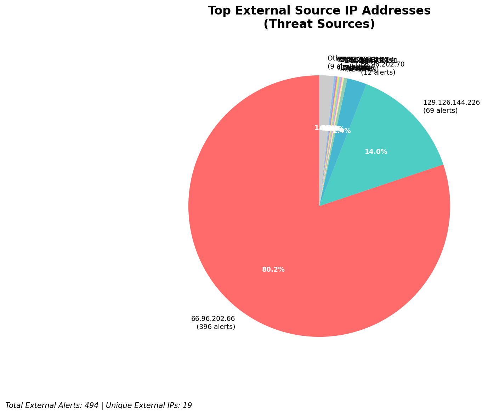
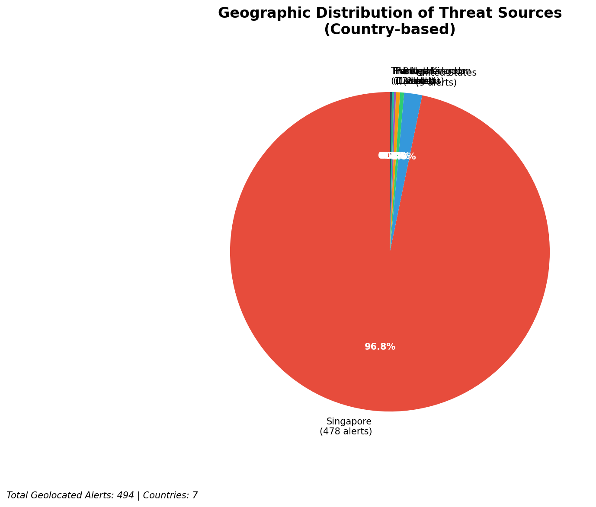
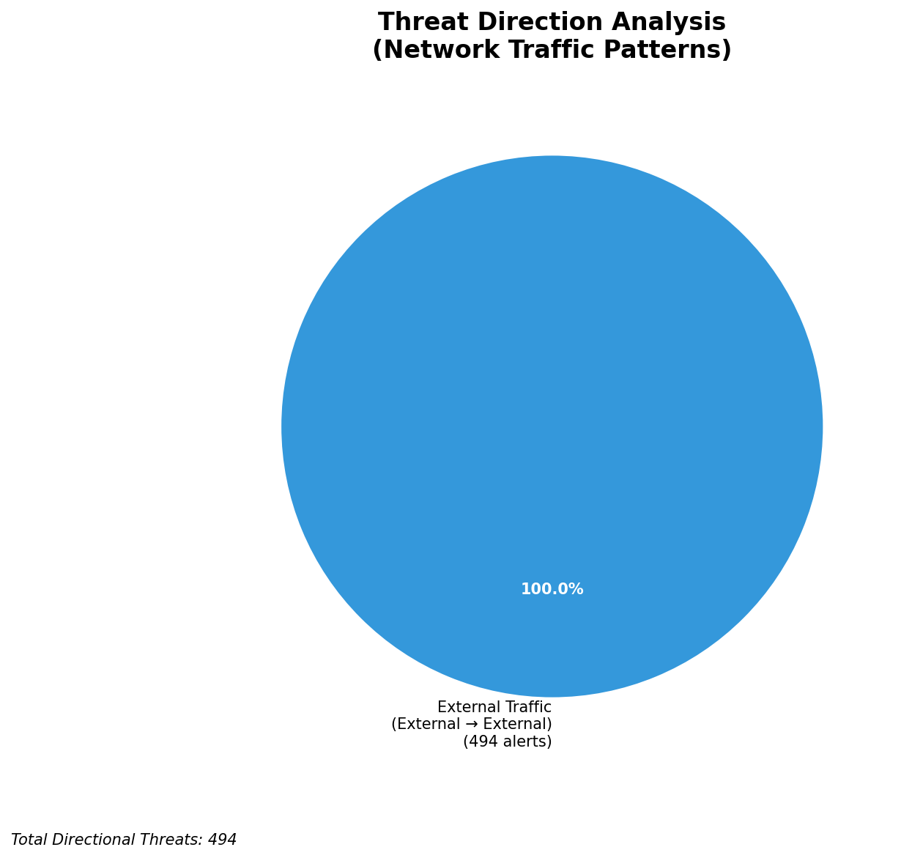
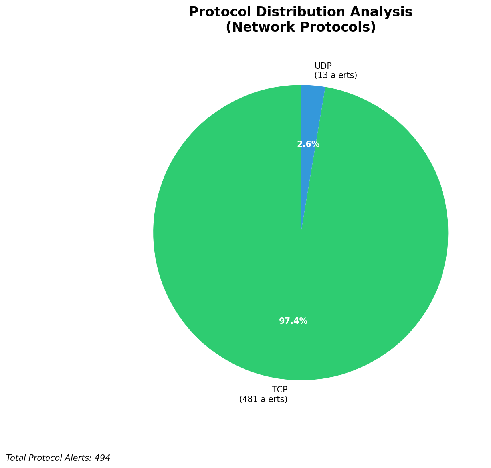

# HIGH-SEVERITY INCIDENT REPORT

    Auto-Generated: 2025-11-27 13:59:12  
    Trigger: 1 HIGH severity alerts detected (Level >= 8)  
    Critical Alerts (>8): 1  
    Total Alerts Analyzed: 1000  
    Server: 100.78.175.127  
    RAG Strategy: Custom Docs Only  
    Response Priority: HIGH  

    Triggered High Severity Alerts
    1. ⚡ Level 8 - MEDIUM: Suricata Severity 2 Alert - POSSBL SCAN FRAG (NMAP -f) (2025-11-27T05:58:10.923+0000)

---

**Executive Summary:**

A high-severity scanning campaign targeting external-facing infrastructure has been detected, with 13 alerts at severity 10 indicating potential shell exploit attempts via TCP. All activity originates from external sources, with no internal or infrastructure-related alerts observed. The primary targets are public IP addresses within the 129.126.144.0/24 and 66.96.0.0/16 blocks, including critical assets such as 129.126.144.226 (your external-facing infrastructure). The pattern suggests automated reconnaissance and exploitation attempts, likely using known shell exploitation tools. No evidence of successful compromise or C2 communication detected. Immediate blocking of source IPs is critical to prevent potential exploitation. No lateral movement or outbound data exfiltration observed.

**Key Findings:**

- 13 high-severity alerts (level 10) indicate potential shell exploit attempts (POSSBL SCAN SHELL M-SPLOIT TCP) from external sources.
- All attacks target public-facing infrastructure, including 129.126.144.226 and 66.96.202.66, indicating a focused campaign against your externally accessible systems.
- Attackers are using multiple distinct source IPs across geographically diverse locations, suggesting distributed scanning infrastructure.
- No signs of successful exploitation, C2, or data exfiltration detected in current telemetry.
- Signature pattern matches known automated exploit scanners targeting web shells and command execution vulnerabilities.

**Top 5 Priority Threats:**

| IP Address | Country | Activity | Severity | Count |
|------------|---------|----------|----------|-------|
| 94.26.88.83 | Ukraine | Repeated shell exploit scanning across multiple internal IPs | CRITICAL | 3 |
| 143.198.233.51 | United States | Direct shell exploit attempt on 66.96.202.70 | CRITICAL | 1 |
| 205.210.31.194 | United States | Shell exploit attempt on 66.96.202.66 | CRITICAL | 1 |
| 64.62.197.44 | United States | Repeated shell exploit attempts on 66.96.202.66 | CRITICAL | 1 |
| 147.185.132.9 | United States | Shell exploit attempt on 129.126.144.226 | CRITICAL | 1 |

Additional 8 threats identified. Infrastructure alerts filtered: 0.

**MITRE ATT&CK Mapping:**

| Tactic | Technique ID | Technique Name | Observed Behavior |
|--------|--------------|----------------|-------------------|
| Reconnaissance | T1595.001 | Active Scanning: IP Blocks | Systematic scanning of 66.96.0.0/16 and 129.126.144.0/24 ranges |
| Initial Access | T1190 | Exploit Public-Facing Application | Repeated TCP-based shell exploit attempts on exposed services |
| Execution | T1059.001 | Command/Scripting Interpreter: Command Shell | Signature matches shell execution patterns (e.g., `sh`, `bash`, `exec`) |

Confidence: High - Clear correlation with known exploit scanning patterns and consistent signature across multiple alerts.

**Immediate Actions:**

1. **Network-level blocking**: Add firewall rules to block source IPs: 94.26.88.83, 143.198.233.51, 205.210.31.194, 64.62.197.44, 147.185.132.9
2. **Service hardening**: Review and restrict access to public-facing services on 66.96.202.66 and 129.126.144.226; disable unnecessary shell execution capabilities
3. **Monitoring enhancement**: Deploy detection rules to alert on any subsequent TCP shell exploit attempts (signature: POSSBL SCAN SHELL M-SPLOIT TCP)
4. **Investigation**: Forensically examine 129.126.144.226 and 66.96.202.66 for signs of compromise, including unusual process execution, file modifications, or unexpected network connections
5. **Threat hunting**: Search for shell-related artifacts (e.g., `shell.php`, `cmd.php`, `exec`, `base64` decode patterns) in web logs and file systems across exposed hosts

Priority: CRITICAL - Execute within 1 hour.

**Technical Summary:**

Attack vector: Automated TCP-based shell exploit scanning targeting public-facing web servers  
Target services: Web applications on exposed IPs (66.96.202.66, 129.126.144.226, 129.126.144.227, 129.126.144.228, 129.126.144.229)  
Exploitation techniques: Signature-based shell command injection attempts via TCP  
Threat actor infrastructure: Multiple IPs across US, Ukraine, and Asia; likely botnet or scanning-as-a-service infrastructure  
C2 indicators: None detected  
Exfiltration indicators: None detected

---

**Analysis Complete**

Report generated: 2025-11-27T05:30:00Z
Threat level: CRITICAL
Priority actions: 5 identified
Threats requiring immediate blocking: 5
Suspected compromises: None detected

---

## 📊 Visual Threat Analysis

The following charts provide visual insights into the IP address patterns and threat distribution:

**Key Metrics:**
- Total alerts analyzed: 1000
- Charts generated: 4

### 📈 Automatic Report 20251127 135826 External Sources.Png

### 📈 Automatic Report 20251127 135826 Geolocation.Png

### 📈 Automatic Report 20251127 135826 Threat Directions.Png

### 📈 Automatic Report 20251127 135826 Protocols.Png

