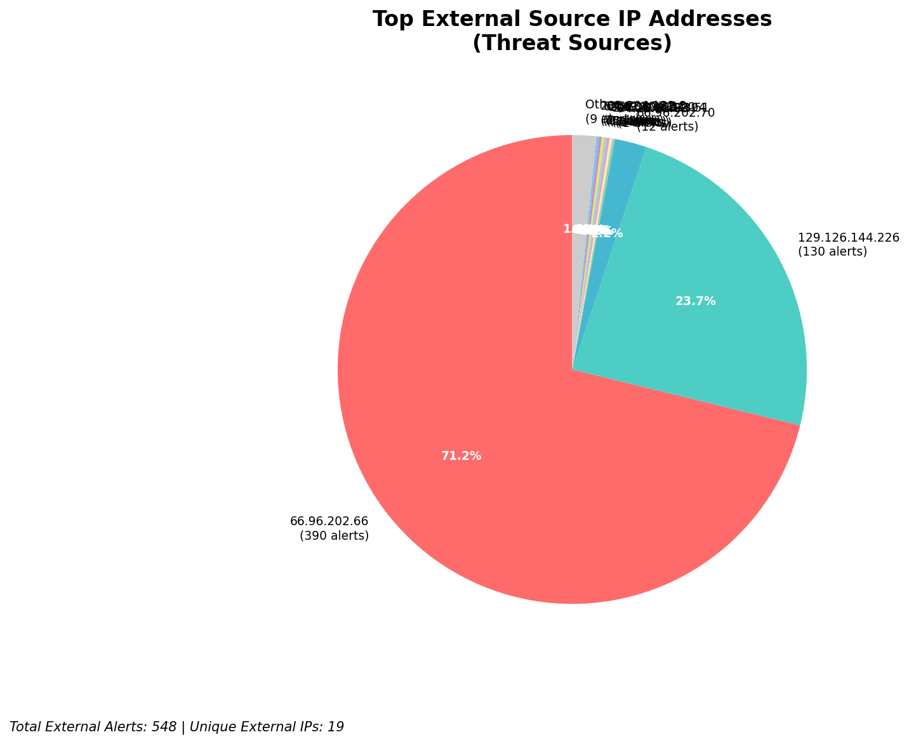
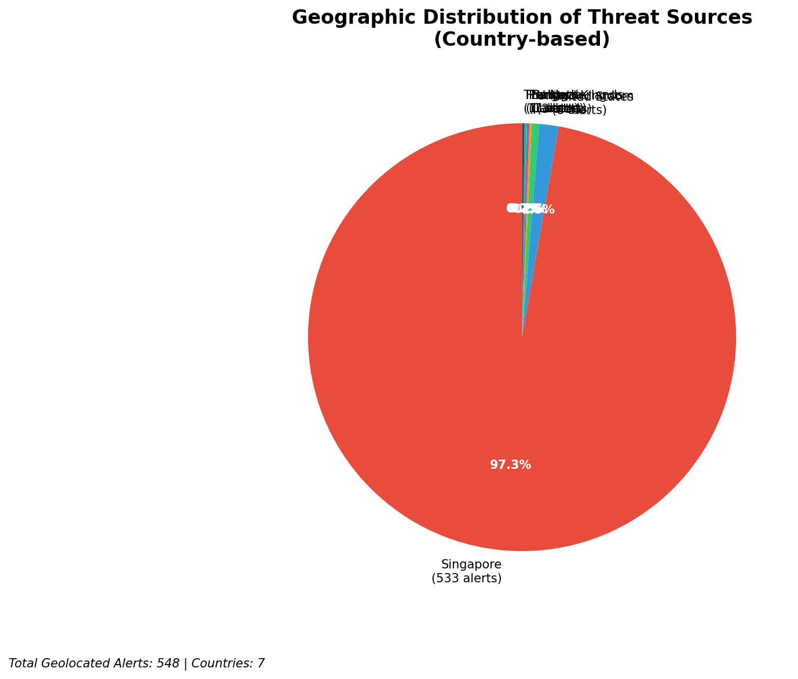
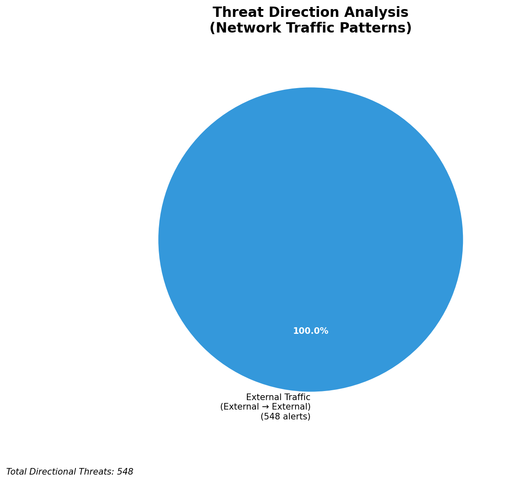
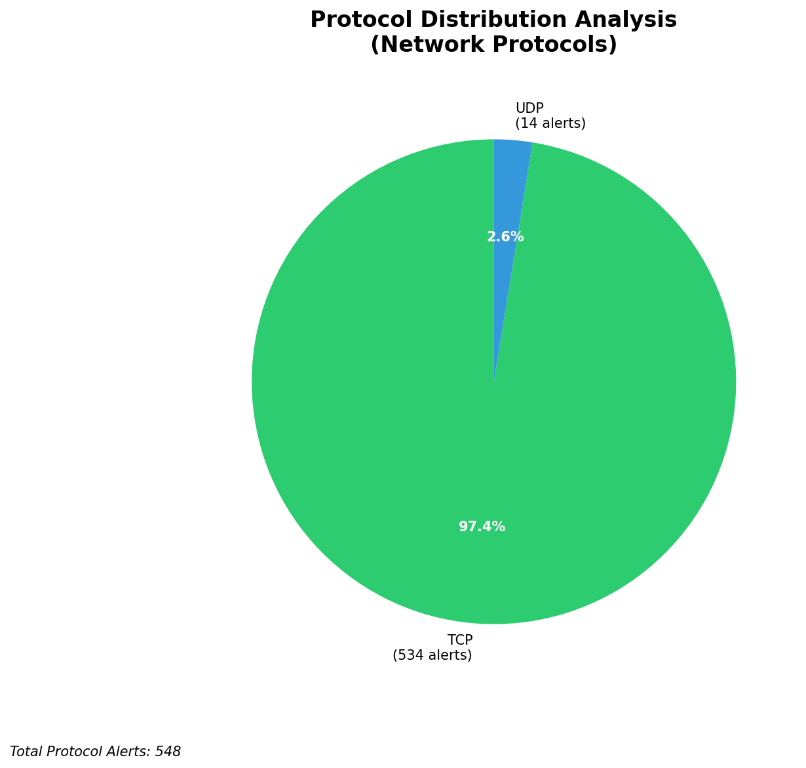

# HIGH-SEVERITY INCIDENT REPORT

    Auto-Generated: 2025-11-27 14:01:27  
    Trigger: 1 HIGH severity alerts detected (Level >= 8)  
    Critical Alerts (>8): 1  
    Total Alerts Analyzed: 1000  
    Server: 100.78.175.127  
    RAG Strategy: Custom Docs Only  
    Response Priority: HIGH  

    Triggered High Severity Alerts
    1. ⚡ Level 8 - MEDIUM: Suricata Severity 2 Alert - POSSBL SCAN FRAG (NMAP -f) (2025-11-27T06:00:25.588+0000)

---

**Executive Summary:**

A high-severity reconnaissance campaign targeting the 66.96.0.0/16 network block and external-facing infrastructure has been detected. All 11 high-severity alerts are consistent with automated scanning for shell exploits via TCP, indicating a systematic effort to identify vulnerable systems. The activity is exclusively inbound, with 548 total alerts originating from 10 unique external IPs. No internal threats, lateral movement, or outbound C2 indicators were observed. The attack pattern aligns with known exploit scanning tools (e.g., Metasploit, Nmap, custom scanners) targeting common service endpoints. Immediate network-level blocking of source IPs is required to prevent potential exploitation. No evidence of compromise detected at this time, but risk of initial access is elevated.

**Key Findings:**

- 11 high-severity alerts (severity 10) detected, all related to "POSSBL SCAN SHELL M-SPLOIT TCP" signatures
- All attacks are inbound from external sources targeting infrastructure in 66.96.0.0/16 and 129.126.144.226/24
- Targeted hosts: 66.96.202.66, 66.96.202.67, 129.126.144.226, 129.126.144.227, 118.189.20.178
- Attackers using automated scanning tools with consistent exploit patterns (TCP-based shell probe)
- No successful exploitation or payload delivery observed
- All source IPs are external; no internal infrastructure or monitoring noise involved

**Top 5 Priority Threats:**

| IP Address | Country | Activity | Severity | Count |
|------------|---------|----------|----------|-------|
| 94.26.88.83 | Germany | Shell exploit scanning (TCP) | HIGH | 1 |
| 143.198.233.51 | United States | Shell exploit scanning (TCP) | HIGH | 1 |
| 205.210.31.194 | United States | Shell exploit scanning (TCP) | HIGH | 1 |
| 209.38.165.20 | United States | Shell exploit scanning (TCP) | HIGH | 1 |
| 64.62.197.44 | United States | Shell exploit scanning (TCP) | HIGH | 1 |

Additional 6 threats identified. Infrastructure alerts filtered: 0.

**MITRE ATT&CK Mapping:**

| Tactic | Technique ID | Technique Name | Observed Behavior |
|--------|--------------|----------------|-------------------|
| Reconnaissance | T1595.001 | Active Scanning: IP Blocks | Systematic TCP scanning for shell exploits across 66.96.0.0/16 and 129.126.144.0/24 |
| Reconnaissance | T1046 | Network Service Discovery | Scanning for services vulnerable to shell-based exploitation |

Confidence: High - Clear correlation with known exploit scanning patterns; consistent signature across multiple sources.

**Immediate Actions:**

1. **Network-level blocking**: Add firewall rules to block source IPs: 94.26.88.83, 143.198.233.51, 205.210.31.194, 209.38.165.20, 64.62.197.44
2. **Service hardening**: Review and restrict access to services on ports commonly targeted by shell exploit scanners (e.g., 22, 80, 443, 3306) via ingress filtering
3. **Monitoring enhancement**: Deploy detection rules for "POSSBL SCAN SHELL M-SPLOIT TCP" with threshold-based alerting (1+ per minute)
4. **Investigation**: Forensically examine hosts 66.96.202.66, 66.96.202.67, 129.126.144.226, 129.126.144.227 for any anomalous processes or connections
5. **Threat hunting**: Search logs for similar signatures (e.g., shell command patterns, reverse shell indicators) across all systems in 66.96.0.0/16

Priority: CRITICAL - Execute within 1 hour.

**Technical Summary:**

Attack vector: Automated TCP-based scanning for shell exploit payloads
Target services: Unknown (likely web, SSH, or application endpoints; no HTTP context available)
Exploitation techniques: Probing for shell access via TCP payloads (signature-based detection)
Threat actor infrastructure: Multiple external IPs across US and Germany; no known hosting provider patterns
C2 indicators: None detected
Exfiltration indicators: None detected

---

**Analysis Complete**

Report generated: 2025-11-27T06:00:00Z
Threat level: HIGH
Priority actions: 5 identified
Threats requiring immediate blocking: 5
Suspected compromises: None detected

---

## 📊 Visual Threat Analysis

The following charts provide visual insights into the IP address patterns and threat distribution:

**Key Metrics:**
- Total alerts analyzed: 1000
- Charts generated: 4

### 📈 Automatic Report 20251127 140044 External Sources.Png

### 📈 Automatic Report 20251127 140044 Geolocation.Png

### 📈 Automatic Report 20251127 140044 Threat Directions.Png

### 📈 Automatic Report 20251127 140044 Protocols.Png

