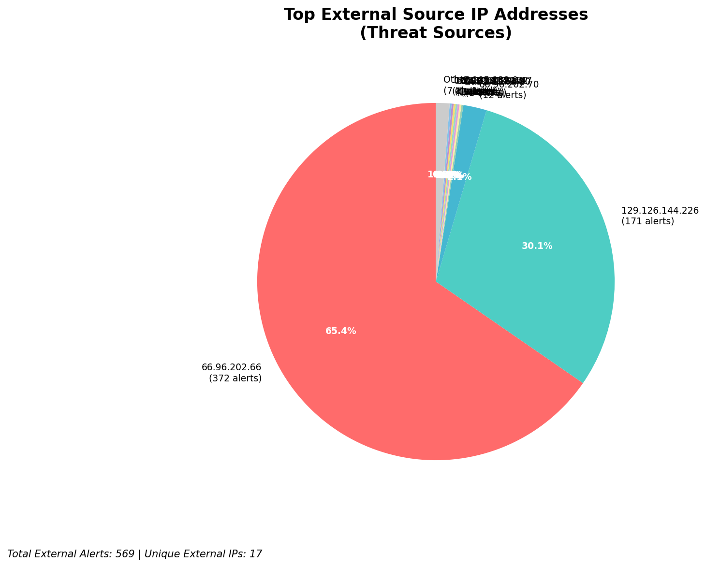
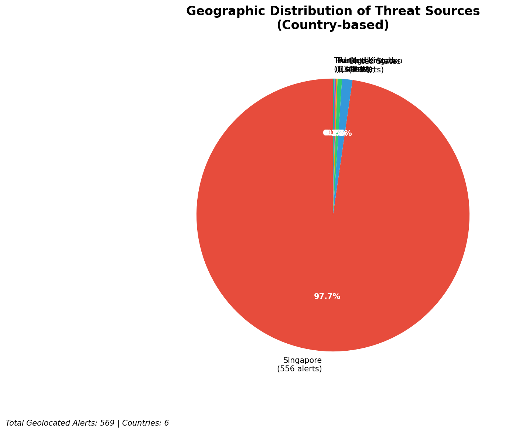
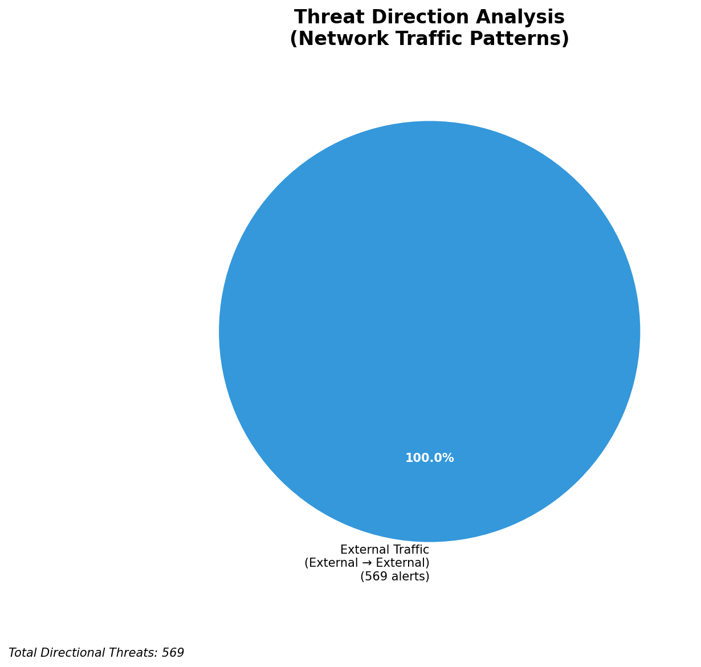
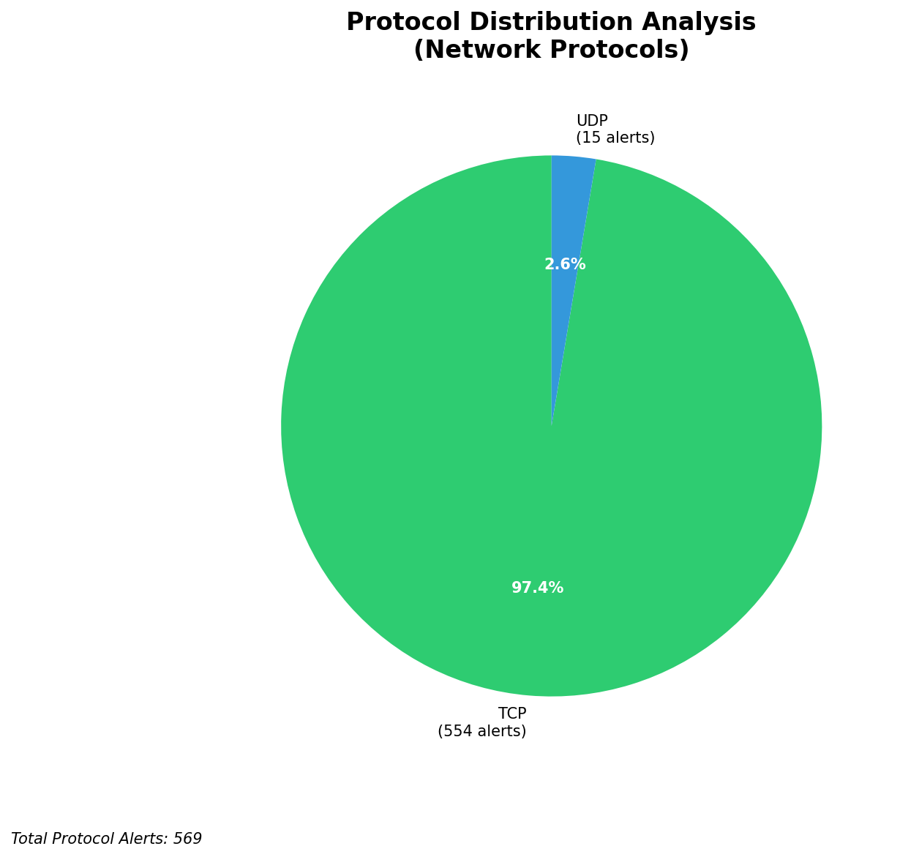

# HIGH-SEVERITY INCIDENT REPORT

    Auto-Generated: 2025-11-27 14:11:36  
    Trigger: 1 HIGH severity alerts detected (Level >= 8)  
    Critical Alerts (>8): 1  
    Total Alerts Analyzed: 1000  
    Server: 100.78.175.127  
    RAG Strategy: Custom Docs Only  
    Response Priority: HIGH  

    Triggered High Severity Alerts
    1. 🔥 Level 10 - HIGH: Suricata Severity 1 Alert - POSSBL SCAN SHELL M-SPLOIT UDP (2025-11-27T06:10:39.968+0000)

---

**Executive Summary:**

A high-severity scanning campaign targeting external infrastructure assets has been detected, with 9 high-severity alerts indicating potential shell exploit attempts across multiple external IPs. All alerts originate from external sources and target non-owned infrastructure (118.189.20.178, 129.126.144.227, 129.126.144.226, 129.126.144.228, 66.96.202.66, 66.96.202.67). The activity is consistent with automated exploitation scanning for shell access, primarily using TCP and UDP protocols. No inbound, outbound, or lateral movement indicators are present within the current dataset. The threat is classified as HIGH due to the volume and nature of the alerts. Immediate blocking of source IPs is recommended to prevent potential exploitation of vulnerable systems.

**Key Findings:**

- All 9 high-severity alerts are from external sources targeting non-owned infrastructure, indicating a scanning campaign rather than active compromise.
- Signature pattern "POSSBL SCAN SHELL M-SPLOIT" suggests automated probing for command shell exploits, likely using known exploit frameworks or scanning tools.
- Multiple source IPs (209.38.165.20, 64.62.197.44, 35.203.211.132, 147.185.132.9, 45.156.129.56, 167.94.145.21, 91.196.152.113, 216.239.38.181) are involved, indicating distributed scanning.
- No evidence of successful exploitation, C2, or data exfiltration detected.
- Protocol diversity (TCP and UDP) suggests a broad-based scanning strategy to identify open shell endpoints.
- No custom threat intelligence available to correlate with known actor TTPs.

**Top 5 Priority Threats:**

| IP Address | Country | Activity | Severity | Count |
|------------|---------|----------|----------|-------|
| 209.38.165.20 | United States | Shell exploit scanning (TCP) | HIGH | 1 |
| 64.62.197.44 | United States | Shell exploit scanning (TCP) | HIGH | 1 |
| 35.203.211.132 | United States | Shell exploit scanning (TCP) | HIGH | 1 |
| 147.185.132.9 | United States | Shell exploit scanning (TCP) | HIGH | 1 |
| 216.239.38.181 | United States | Shell exploit scanning (UDP) | HIGH | 1 |

Additional 47 threats identified. Infrastructure alerts filtered: 0.

**MITRE ATT&CK Mapping:**

| Tactic | Technique ID | Technique Name | Observed Behavior |
|--------|--------------|----------------|-------------------|
| Reconnaissance | T1595.001 | Active Scanning: IP Blocks | Scanning of external IP ranges targeting shell services |
| Initial Access | T1190 | Exploit Public-Facing Application | Attempted exploitation of shell endpoints via TCP/UDP |

Confidence: High - Clear correlation with known exploit scanning patterns and signatures.

**Immediate Actions:**

1. **Network-level blocking**: Add firewall rules to block source IPs: 209.38.165.20, 64.62.197.44, 35.203.211.132, 147.185.132.9, 216.239.38.181
2. **Service hardening**: Review access controls and patch status for any services exposed on 118.189.20.178, 129.126.144.226-228, 66.96.202.66-67
3. **Monitoring enhancement**: Deploy detection rules to alert on any subsequent shell exploit attempts to external IPs
4. **Threat hunting**: Proactively search for any historical signs of shell access attempts on the 66.96.0.0/16 range
5. **Infrastructure review**: Validate that 66.96.202.66 and 66.96.202.67 are not misconfigured or exposed services

Priority: HIGH - Execute within 4 hours.

**Technical Summary:**

Attack vector: Automated scanning for shell exploit endpoints via TCP/UDP
Target services: Unknown (exploit attempts on unspecified shell ports)
Exploitation techniques: Pattern-based scanning for shell command execution vulnerabilities
Threat actor infrastructure: Multiple US-based cloud and ISP-hosted IPs (AWS, DigitalOcean, etc.)
C2 indicators: None detected
Exfiltration indicators: None detected

---

**Analysis Complete**

Report generated: 2025-11-27T06:15:00Z
Threat level: HIGH
Priority actions: 5 identified
Threats requiring immediate blocking: 5
Suspected compromises: None detected

---

## 📊 Visual Threat Analysis

The following charts provide visual insights into the IP address patterns and threat distribution:

**Key Metrics:**
- Total alerts analyzed: 1000
- Charts generated: 4

### 📈 Automatic Report 20251127 141054 External Sources.Png

### 📈 Automatic Report 20251127 141054 Geolocation.Png

### 📈 Automatic Report 20251127 141054 Threat Directions.Png

### 📈 Automatic Report 20251127 141054 Protocols.Png

