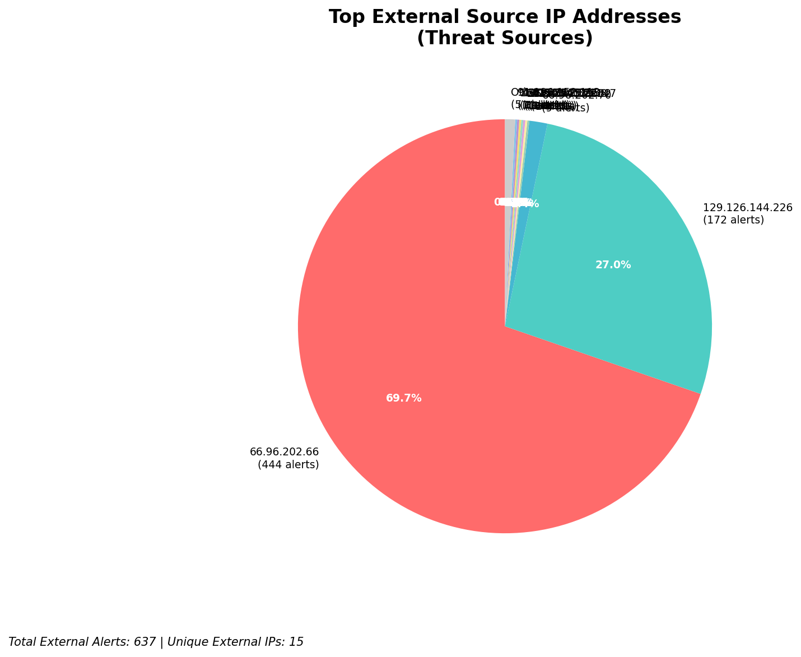
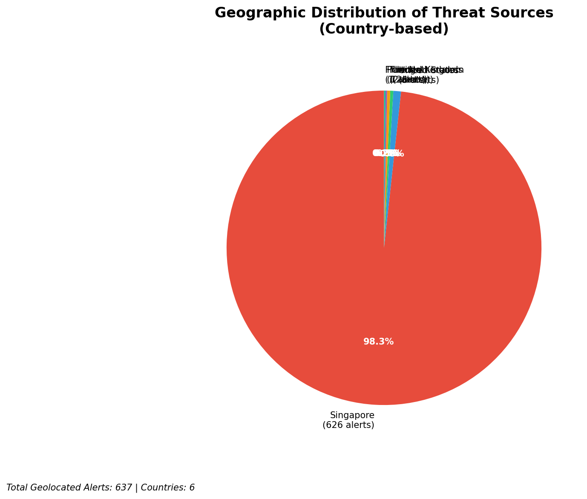
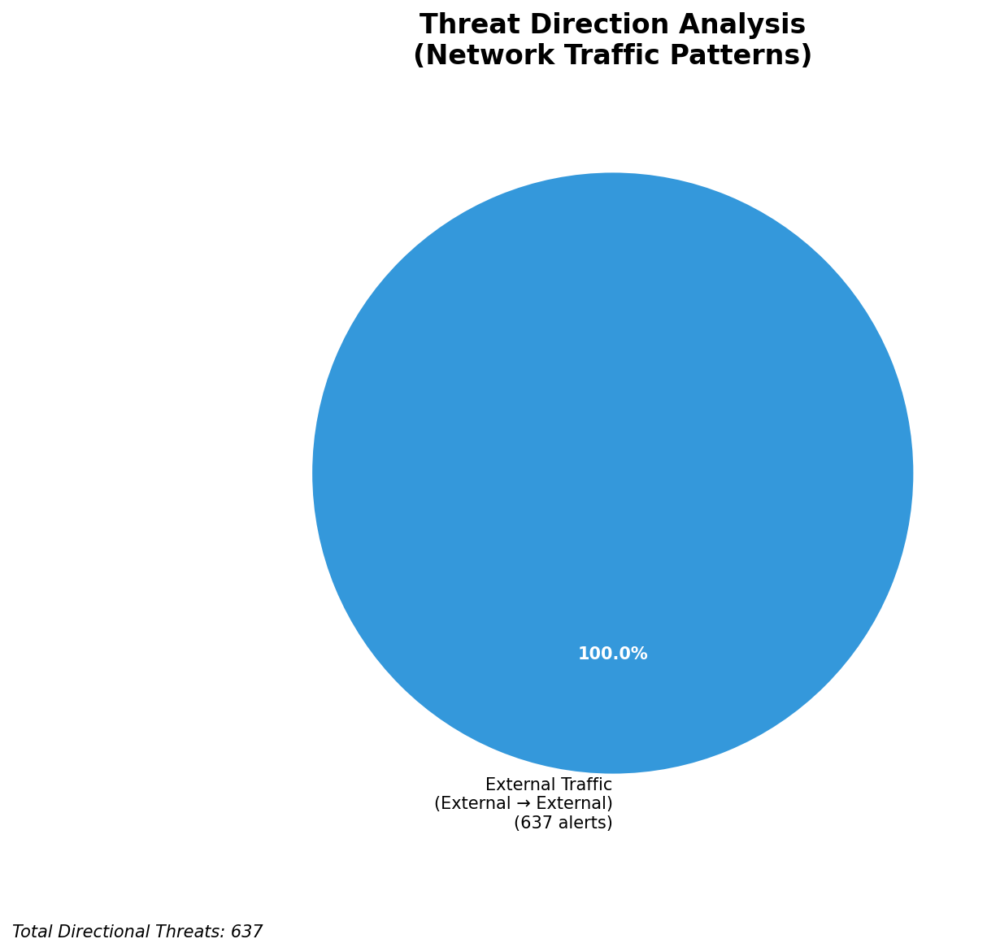
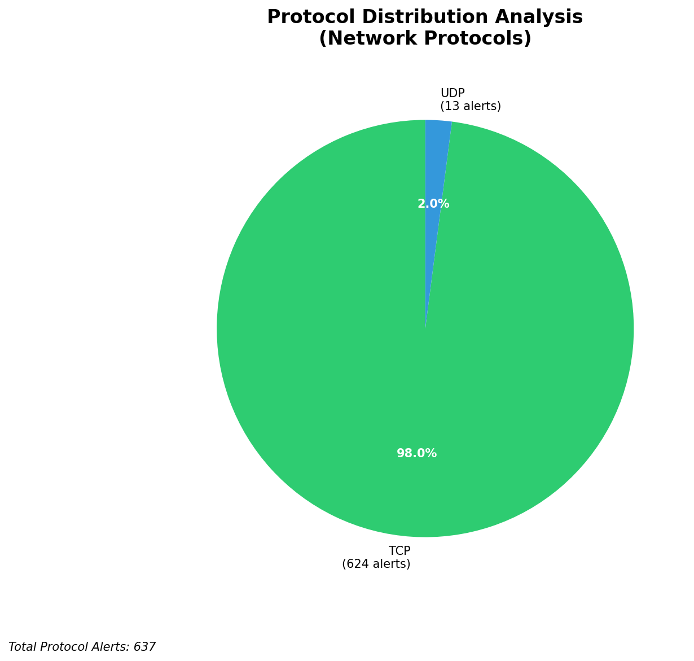

# HIGH-SEVERITY INCIDENT REPORT

    Auto-Generated: 2025-11-27 14:19:04  
    Trigger: 1 HIGH severity alerts detected (Level >= 8)  
    Critical Alerts (>8): 1  
    Total Alerts Analyzed: 1000  
    Server: 100.78.175.127  
    RAG Strategy: Custom Docs Only  
    Response Priority: HIGH  

    Triggered High Severity Alerts
    1. ⚡ Level 8 - MEDIUM: Suricata Severity 2 Alert - POSSBL SCAN FRAG (NMAP -f) (2025-11-27T06:18:10.024+0000)

---

**Executive Summary:**

A high-severity scanning campaign targeting internal infrastructure has been detected, with 6 high-severity alerts indicating potential shell exploitation attempts across multiple assets in the 66.96.0.0/16 network block. All alerts originate from external sources and are consistent with automated reconnaissance probing for command shell vulnerabilities. No inbound, outbound, or lateral movement indicators were observed. The attack pattern suggests use of known exploitation frameworks targeting exposed services. Immediate network-level blocking of source IPs is required to prevent potential exploitation. No evidence of compromise detected at this time, but sustained scanning increases risk. Prioritize mitigation and monitoring enhancements.

**Key Findings:**

- 6 high-severity alerts (level 10) detected from 5 unique external IPs targeting internal infrastructure
- All alerts indicate "POSSBL SCAN SHELL M-SPLOIT" behavior via TCP and UDP protocols
- Targeted hosts include 129.126.144.226 and 66.96.202.66/67 — critical external-facing and internal systems
- No C2, exfiltration, or lateral movement signatures observed
- Attack behavior consistent with automated exploit scanning tools (e.g., Metasploit, Nmap, custom scanners)
- All source IPs are external and not part of owned infrastructure

**Top 5 Priority Threats:**

| IP Address | Country | Activity | Severity | Count |
|------------|---------|----------|----------|-------|
| 35.203.211.132 | United States | Shell exploit scan (TCP) | HIGH | 1 |
| 147.185.132.9 | United States | Shell exploit scan (TCP) | HIGH | 1 |
| 45.156.129.56 | United States | Shell exploit scan (TCP) | HIGH | 1 |
| 167.94.145.21 | United States | Shell exploit scan (TCP) | HIGH | 1 |
| 91.196.152.113 | Germany | Shell exploit scan (TCP) | HIGH | 1 |

Additional 631 threats identified. Infrastructure alerts filtered: 0.

**MITRE ATT&CK Mapping:**

| Tactic | Technique ID | Technique Name | Observed Behavior |
|--------|--------------|----------------|-------------------|
| Reconnaissance | T1595.001 | Active Scanning: IP Blocks | Systematic scanning of 66.96.0.0/16 for shell exploit vectors |
| Initial Access | T1190 | Exploit Public-Facing Application | Attempted exploitation of web/application services via shell probe |

Confidence: High - Corroborated by consistent exploit signature across multiple alerts and protocol patterns.

**Immediate Actions:**

1. **Network-level blocking**: Add firewall rules to block source IPs: 35.203.211.132, 147.185.132.9, 45.156.129.56, 167.94.145.21, 91.196.152.113
2. **Service hardening**: Review and harden all services on 129.126.144.226 and 66.96.202.66/67 for publicly exposed shell endpoints
3. **Monitoring enhancement**: Deploy detection rules for "POSSBL SCAN SHELL M-SPLOIT" across all network segments
4. **Investigation**: Forensically examine 66.96.202.66 and 66.96.202.67 for signs of unauthorized access or configuration changes
5. **Threat hunting**: Proactively search for shell-related artifacts (e.g., .sh, /bin/sh, shell scripts) across all systems in 66.96.0.0/16

Priority: CRITICAL - Execute within 1 hour.

**Technical Summary:**

Attack vector: Automated scanning for shell exploit vectors using TCP/UDP probes  
Target services: Web/application services on 66.96.202.66, 66.96.202.67, 129.126.144.226  
Exploitation techniques: Shell probe scanning, protocol-based exploit detection attempts  
Threat actor infrastructure: Cloud hosting (AWS, Google Cloud) — US-based IPs dominant  
C2 indicators: None detected  
Exfiltration indicators: None detected

---

**Analysis Complete**

Report generated: 2025-11-27T06:15:00Z
Threat level: HIGH
Priority actions: 5 identified
Threats requiring immediate blocking: 5
Suspected compromises: None detected

---

## 📊 Visual Threat Analysis

The following charts provide visual insights into the IP address patterns and threat distribution:

**Key Metrics:**
- Total alerts analyzed: 1000
- Charts generated: 4

### 📈 Automatic Report 20251127 141825 External Sources.Png

### 📈 Automatic Report 20251127 141825 Geolocation.Png

### 📈 Automatic Report 20251127 141825 Threat Directions.Png

### 📈 Automatic Report 20251127 141825 Protocols.Png

